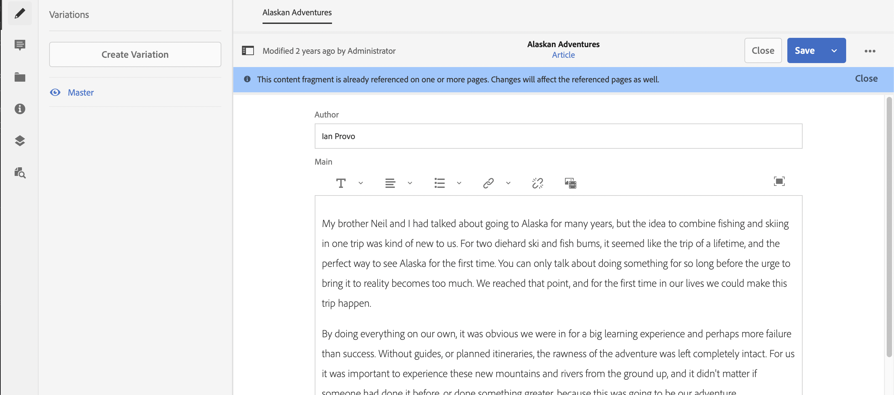

# Så här modellerar du ditt innehåll {#model-your-content}

I den här delen av [AEM Headless Developer Journey](overview.md) kan du lära dig att modellera innehållsstrukturen. Kom sedan ihåg att strukturen för Adobe Experience Manager (AEM) med Content Fragments Models och Content Fragments, för återanvändning i alla kanaler.

## Story hittills {#story-so-far}

I början täckte [Lär dig mer om CMS Headless Development](learn-about.md) rubrikfri innehållsleverans och varför den skulle användas. [Komma igång med AEM Headless](getting-started.md) beskriver AEM Headless i ditt eget projekt.

I det föregående dokumentet för den AEM resan utan rubrik, [Sökväg till din första upplevelse med AEM utan rubrik](path-to-first-experience.md), lärde du dig sedan de steg som krävs för att implementera ditt första projekt. När du har läst den bör du:

* Förstå viktiga planeringsöverväganden vid utformningen av ditt innehåll
* Förstå stegen för att implementera headless beroende på vilka krav ni har på integreringsnivån.
* Ställ in de verktyg och AEM som behövs.
* Lär dig de bästa sätten att göra den enkla resan smidig, hålla innehållsgenereringen effektiv och se till att innehållet levereras snabbt.

Den här artikeln bygger på dessa grundläggande funktioner så att du förstår hur du förbereder ett eget AEM headless-projekt.

## Syfte {#objective}

* **Målgrupp**: Nybörjare
* **Mål**: Lär dig modellera innehållsstrukturen och förverkliga sedan den strukturen med AEM Content Fragment Models och Content Fragments:
   * Lägg in koncept och terminologi för data-/innehållsmodellering.
   * Lär dig varför innehållsmodellering behövs för leverans av Headless-innehåll.
   * Lär dig hur du realiserar den här strukturen med AEM Content Fragment Models (och skapar innehåll med Content Fragments).
   * Lär dig modellera innehåll, principer med grundläggande exempel.

>[!NOTE]
>
>Datamodellering är ett stort fält, som det används vid utveckling av relationsdatabaser. Det finns många böcker och onlinekällor med information som är tillgängliga.
>
>De aspekter som är av intresse vid modellering av data för användning med AEM Headless beaktas endast.

## Innehållsmodellering {#content-modeling}

*Det är en stor, dålig värld där ute*.

Kanske, men kanske inte. Det är definitivt en överväldigande ***komplicerad*** värld där ute. Datamodellering används för att definiera en förenklad representation av ett mycket (mycket) litet underavsnitt, med hjälp av den specifika information som behövs för ett visst ändamål.

>[!NOTE]
>
>När AEM behandlar innehåll kallas datamodellering för innehållsmodellering.

Till exempel:

Det finns många skolor, men de har alla olika saker gemensamt:

* En plats
* Huvudlärare
* Många lärare
* Många icke undervisande personal
* Många elever
* Många f.d. lärare
* Många före detta elever
* Många klassrum
* Många (många) böcker
* Många (många) utrustningsdelar
* Många aktiviteter utanför kurserna
* och så vidare...

Även i ett sådant litet exempel kan listan verka oändlig. Men om du bara vill att programmet ska utföra en enkel uppgift kan du begränsa informationen till de viktigaste uppgifterna.

Exempel: annonsera specialevent för alla skolor i området:

* Skolans namn
* Skolans plats
* Huvudlärare
* Typ av händelse
* Händelsedatum
* Lärare som organiserar evenemanget

### Concepts {#concepts}

Det du vill beskriva kallas **entiteter** - i princip de&quot;saker&quot; som du vill lagra information om.

Informationen som du vill lagra om dem är **Attributes** (egenskaper), till exempel Name och Qualifications för lärarna.

Sedan finns det olika **relationer** mellan entiteterna. Till exempel har en skola bara en huvudlärare, och många lärare (och vanligtvis är huvudläraren också lärare).

Processen att analysera och definiera den här informationen, tillsammans med relationerna mellan dem, kallas **Innehållsmodellering**.

### Grunderna {#basics}

Du kan ofta börja med att skapa ett **konceptuellt schema** som beskriver entiteterna och deras relationer. Vanligtvis är detta en hög nivå (konceptuell).

När detta är stabilt kan du översätta modellerna till ett **logiskt schema** som beskriver entiteterna, tillsammans med attributen och relationerna. På den här nivån bör du noggrant granska definitionerna för att undvika duplicering och optimera designen.

>[!NOTE]
>
>Ibland sammanfogas dessa två steg, ofta beroende på hur komplicerat ditt scenario är.

Behöver du till exempel separata entiteter för `Head Teacher` och `Teacher`, eller bara ett extra attribut för modellen `Teacher`?

### Säkerställer dataintegritet {#data-integrity}

Dataintegritet krävs för att garantera innehållets exakthet och enhetlighet under hela dess livscykel. Detta innefattar att säkerställa att innehållsförfattare enkelt kan förstå vad de ska lagra var - så följande är viktiga:

* en tydlig struktur
* en struktur som är så kortfattad som möjligt (utan att offra noggrannheten)
* validering av enskilda fält
* vid behov begränsa innehållet i specifika fält till vad som är meningsfullt

### Eliminera redundans {#data-redundancy}

Dataredundans inträffar när samma information lagras två gånger i innehållsstrukturen. Detta bör undvikas eftersom det kan leda till missförstånd när innehållet skapas och fel vid frågor, för att inte tala om missbruk av lagringsutrymme.

### Optimering och prestanda {#optimization-and-performance}

Genom att optimera strukturen kan du förbättra prestandan, både när det gäller att skapa innehåll och fråga.

Allt är en balansakt, men att skapa en struktur som är för komplex, eller som har för många nivåer, kan:

* Var förvirrande för författare som skapar innehållet.

* Påverka prestandan allvarligt om frågan måste få åtkomst till flera kapslade (refererade) innehållsfragment för att hämta nödvändigt innehåll.

## Innehållsmodellering för AEM Headless {#content-modeling-for-aem-headless}

Datamodellering är en uppsättning etablerade tekniker som ofta används vid utvecklade relationsdatabaser, så vad innebär innehållsmodellering för AEM Headless?

### Varför? {#why}

För att ditt program ska kunna begära och ta emot nödvändigt innehåll från AEM på ett konsekvent och effektivt sätt måste det här innehållet struktureras.

Detta innebär att din ansökan i förväg vet vilken form av svar det är och därför hur den ska behandlas. Detta är enklare än att ta emot frihandsinnehåll, som måste analyseras för att avgöra vad det innehåller och därför hur det kan användas.

### Introduktion till Hur? {#how}

AEM använder Content Fragments för att tillhandahålla de strukturer som behövs för Headless-leverans av ditt innehåll till dina program.

Innehållsmodellens struktur är:

* som realiseras av definitionen av din Content Fragment Model,
* används som bas för de innehållsfragment som används för att generera innehåll.

>[!NOTE]
>
>Modellerna för innehållsfragment används också som bas för de AEM GraphQL-scheman som används för att hämta ditt innehåll - mer om det i en senare session.

Begäranden om ditt innehåll görs med AEM GraphQL API, en anpassad implementering av GraphQL standard-API. Med AEM GraphQL API kan du utföra (komplexa) frågor på dina innehållsfragment, där varje fråga anpassas efter en viss modelltyp.

Det returnerade innehållet kan sedan användas av dina program.

## Skapa strukturen med Content Fragment Models {#create-structure-content-fragment-models}

I Content Fragment Models finns olika mekanismer som gör att du kan definiera innehållets struktur.

En innehållsfragmentmodell beskriver en enhet.

>[!NOTE]
>Aktivera funktionen för innehållsfragment i Configuration Browser så att du kan skapa modeller.

>[!TIP]
>
>Modellen bör namnges så att innehållsförfattaren vet vilken modell som ska väljas när ett innehållsfragment skapas.

Inom en modell:

1. Med **datatyper** kan du definiera enskilda attribut.
Definiera till exempel fältet som innehåller en lärares namn som **Text** och deras tjänsteår som **Number**.
1. Med datatyperna **Innehållsreferens** och **Fragmentreferens** kan du skapa relationer till annat innehåll i AEM.
1. Datatypen **Fragmentreferens** gör att du kan realisera flera strukturnivåer genom att kapsla dina innehållsfragment (enligt modelltypen). Detta är viktigt för er innehållsmodellering.

Till exempel:

### Datatyper {#data-types}

AEM innehåller följande datatyper som du kan använda för att modellera ditt innehåll:

* Enkelradig text
* Flerradstext
* Nummer
* Boolean
* Datum och tid
* Uppräkning
* Taggar
* Innehållsreferens
* Fragmentreferens
* JSON-objekt

### Referenser och kapslat innehåll {#references-nested-content}

Två datatyper ger referenser till innehåll utanför ett visst fragment:

* **Innehållsreferens**
Detta ger en enkel referens till annat innehåll av valfri typ.
Du kan till exempel referera till en bild på en viss plats.

* **Fragmentreferens**
Detta innehåller referenser till andra innehållsfragment.
Den här typen av referens används för att skapa kapslat innehåll, vilket introducerar de relationer som behövs för att modellera innehållet.
Datatypen kan konfigureras så att fragmentförfattare kan:
   * Redigera det refererade fragmentet direkt.
   * Skapa ett innehållsfragment baserat på lämplig modell.

### Skapa modeller för innehållsfragment {#creating-content-fragment-models}

Först måste du aktivera Content Fragment Models för webbplatsen. Den här aktiveringen görs i konfigurationsläsaren, under Verktyg > Allmänt > Konfigurationsläsaren. Du kan antingen välja att konfigurera den globala posten eller skapa en konfiguration. Till exempel:

>[!NOTE]
>
>Se Ytterligare resurser - Innehållsfragment i Configuration Browser

Sedan kan du skapa modellerna för innehållsfragment och definiera strukturen. Detta kan du göra under Verktyg > Assets > Content Fragment Models. Till exempel:

>[!NOTE]
>
>Se Ytterligare resurser - modeller för innehållsfragment.

## Använda modellen för att skapa innehåll med innehållsfragment {#use-content-to-author-content}

Innehållsfragment baseras alltid på en innehållsfragmentmodell. Modellen innehåller strukturen, fragmentet innehåller innehållet.

### Välja lämplig modell {#select-model}

Det första steget till att skapa innehåll är att skapa ett innehållsfragment. Detta görs med Skapa > Innehållsfragment i den obligatoriska mappen under Assets > Filer. Guiden vägleder dig genom stegen.

Ett innehållsfragment baseras på en viss innehållsfragmentmodell som du väljer som första steg i skapandet.

### Skapa och redigera strukturerat innehåll {#create-edit-structured-content}

När fragmentet har skapats kan du öppna det i redigeraren för innehållsfragment. Här kan du göra följande:

* Redigera innehållet i normalt läge eller helskärmsläge.
* Formatera innehållet som antingen Fullständig text, Oformaterad text eller Markering.
* Skapa och hantera variationer av ditt innehåll.
* Associera innehåll.
* Redigera metadata.
* Visa trädstrukturen.
* Förhandsgranska JSON-representationen.

### Skapa innehållsfragment {#creating-content-fragments}

När du har valt lämplig modell öppnas ett innehållsfragment för redigering i redigeraren för innehållsfragment:

>[!NOTE]
>
>Se Ytterligare resurser - Arbeta med innehållsfragment.

## Komma igång med några exempel {#getting-started-examples}

<!--
tbc...
...and/or see the structures covered for the GraphQL samples...
...will those (ever) be delivered as an official sample package?
-->

En grundläggande struktur som exempel finns i Struktur för exempelinnehållsfragment.

## What&#39;s Next {#whats-next}

Nu när du har lärt dig att modellera din struktur och skapa innehåll som är beroende av den, är nästa steg att [Lär dig hur du använder GraphQL-frågor för att komma åt och hämta innehåll för innehållsfragment](access-your-content.md). Här presenteras GraphQL och vi diskuterar några exempelfrågor för att se hur det fungerar i praktiken.

## Ytterligare resurser {#additional-resources}

* [Arbeta med innehållsfragment](/help/assets/content-fragments/content-fragments.md) - Den inledande sidan för innehållsfragment.
   * [Innehållsfragment i konfigurationsläsaren](/help/assets/content-fragments/content-fragments-configuration-browser.md) - Aktivera funktionen för innehållsfragment i konfigurationsläsaren.
   * [Modeller för innehållsfragment](/help/assets/content-fragments/content-fragments-models.md) - Skapa och redigera modeller för innehållsfragment.
   * [Hantera innehållsfragment](/help/assets/content-fragments/content-fragments-managing.md) - Skapa och redigera innehållsfragment. Den här sidan leder dig till andra detaljerade avsnitt.
* [AEM GraphQL Schemas](access-your-content.md) - Hur GraphQL realiserar modeller.
* [Strukturen för exempelinnehållsfragment](/help/sites-developing/headless/graphql-api/content-fragments-graphql-samples.md#content-fragment-structure-graphql)
* [Komma igång med AEM Headless](https://experienceleague.adobe.com/docs/experience-manager-learn/getting-started-with-aem-headless/graphql/overview.html) - En kort videosjälvstudiekurs med en översikt över hur du använder AEM headless-funktioner, inklusive innehållsmodellering och GraphQL.
   * [Grundläggande om GraphQL-modellering](https://experienceleague.adobe.com/docs/experience-manager-learn/getting-started-with-aem-headless/graphql/video-series/modeling-basics.html) - Lär dig hur du definierar och använder innehållsfragment i Adobe Experience Manager (AEM) för användning med GraphQL.
