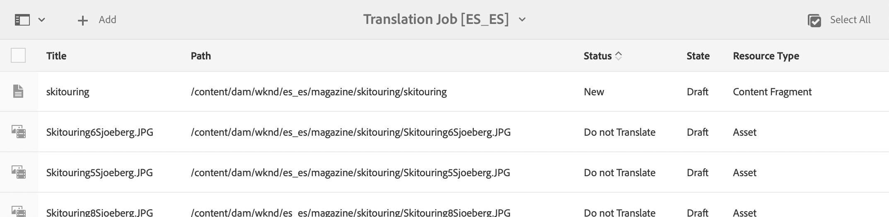
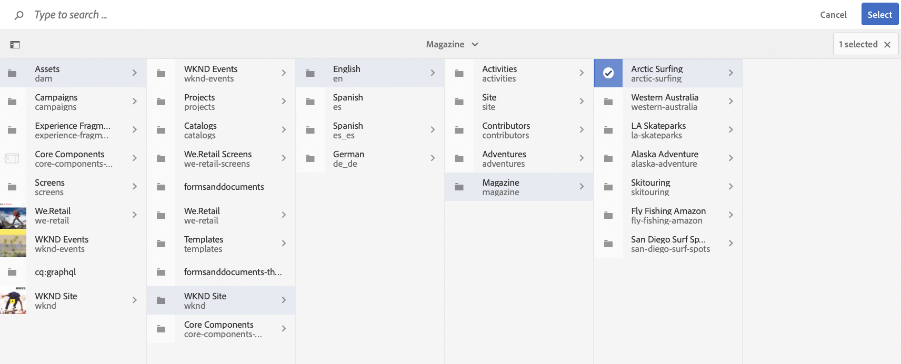
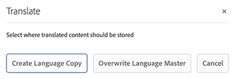

# Översätta innehåll {#translate-content}

Använd översättningsintegrering och regler för att översätta ert headless-innehåll.

## Story hittills {#story-so-far}

I det föregående dokumentet på den AEM översättningsresan [Konfigurera översättningsregler](translation-rules.md) lärde du dig att använda AEM översättningsregler för att identifiera översättningsinnehållet. Nu bör du:

* Förstå vad översättningsreglerna gör.
* Ange egna översättningsregler.

Nu när du har konfigurerat reglerna för anslutning och översättning tar den här artikeln dig igenom nästa steg när du översätter ditt headless-innehåll.

## Syfte {#objective}

Det här dokumentet hjälper dig att förstå hur du använder AEM översättningsprojekt tillsammans med kopplingen och dina översättningsregler för att översätta innehåll. När du har läst det här dokumentet bör du göra följande:

* Förstå vad ett översättningsprojekt är.
* Skapa översättningsprojekt.
* Använd översättningsprojekt för att översätta ert headless-innehåll.

## Skapa ett översättningsprojekt {#creating-translation-project}

Med översättningsprojekt kan du hantera översättning av AEM utan rubriker. I ett översättningsprojekt samlas det innehåll som ska översättas till andra språk på en och samma plats för att ge en central bild av översättningsarbetet.

När innehåll läggs till i ett översättningsprojekt skapas ett översättningsjobb för det. Jobb innehåller kommandon och statusinformation som du använder för att hantera de mänskliga översättnings- och maskinöversättningsarbetsflödena som körs på resurserna.

Översättningsprojekt kan skapas på två sätt:

1. Välj språkroten för innehållet och låt AEM automatiskt skapa översättningsprojektet baserat på innehållssökvägen.
1. Skapa ett tomt projekt och välj manuellt det innehåll som ska läggas till i översättningsprojektet

Båda är giltiga strategier som endast skiljer sig åt utifrån den person som utför översättningen:

* Översättningsprojektledaren (TPM) behöver ofta flexibiliteten att manuellt välja innehåll till översättningsprojektet.
* Om innehållsägaren också ansvarar för översättning är det ofta enklare att låta AEM automatiskt skapa projektet baserat på den valda innehållssökvägen.

Båda metoderna beskrivs i följande avsnitt.

### Skapa ett översättningsprojekt automatiskt baserat på innehållssökväg {#automatically-creating}

För rättighetsinnehavare som också ansvarar för översättning är det ofta enklare att AEM automatiskt skapa översättningsprojektet. Så här skapar AEM automatiskt ett översättningsprojekt baserat på din innehållssökväg:

1. Navigera till **Navigering** > **Assets** > **Filer**. Kom ihåg att innehåll utan rubrik i AEM lagras som resurser som kallas för innehållsfragment.
1. Välj språkroten för projektet. I det här fallet har `/content/dam/wknd/en` valts.
1. Klicka på spårväljaren och visa panelen **Referenser**.
1. Klicka på **Språkkopior**.
1. Markera kryssrutan **Språkkopior**.
1. Expandera avsnittet **Uppdatera språkkopior** längst ned på referenspanelen.
1. I listrutan **Projekt** väljer du **Skapa översättningsprojekt**.
1. Ange en lämplig titel för översättningsprojektet.
1. Klicka på **Start**.


Du får ett meddelande om att projektet har skapats.

>[!NOTE]
>
>Det antas att den nödvändiga språkstrukturen för översättningsspråken redan har skapats som en del av [-definitionen för innehållsstrukturen.](getting-started.md#content-structure) Detta bör göras i samarbete med innehållsarkitekten.
>
>Om språkmapparna inte skapas i förväg kommer du inte att kunna skapa språkkopior enligt beskrivningen i föregående steg.

### Skapa ett översättningsprojekt manuellt genom att välja ditt innehåll {#manually-creating}

För översättningsprojektledare är det ofta nödvändigt att manuellt välja specifikt innehåll som ska inkluderas i ett översättningsprojekt. Om du vill skapa ett sådant manuellt översättningsprojekt måste du börja med att skapa ett tomt projekt och sedan välja det innehåll som ska läggas till i det.

1. Navigera till **Navigering** > **Projekt**.
1. Klicka på **Skapa** > **Mapp** för att skapa en mapp för dina projekt.
   * Detta är valfritt, men användbart om du vill organisera översättningsarbetet.
1. I fönstret **Skapa mapp** lägger du till en **rubrik** för mappen och klickar sedan på **Skapa**.

   

1. Klicka på mappen för att öppna den.
1. Klicka på **Skapa** > **Projekt** i den nya projektmappen.
1. Projekten bygger på mallar. Klicka på mallen **Översättningsprojekt** för att markera den och klicka sedan på **Nästa**.

   

1. Ange ett namn för det nya projektet på fliken **Grundläggande**.

   

1. På fliken **Avancerat** använder du listrutan **Målspråk** för att välja vilka språk ditt innehåll ska översättas till. Klicka på **Skapa**.

   

1. Klicka på **Öppna** i bekräftelsedialogrutan.

   

Projektet har skapats, men innehåller inget innehåll att översätta. I nästa avsnitt beskrivs hur projektet är strukturerat och hur du lägger till innehåll.

## Använda ett översättningsprojekt {#using-translation-project}

Översättningsprojekt är utformade för att samla allt innehåll och alla uppgifter som hör till en översättningssatsning på ett och samma ställe så att översättningen blir enkel och enkel att hantera.

Så här visar du översättningsprojektet:

1. Navigera till **Navigering** > **Projekt**.
1. Klicka på det projekt som skapades i föregående avsnitt.


Projektet är uppdelat i flera kort.

* **Sammanfattning** - Det här kortet visar grundläggande huvudinformation för projektet, inklusive ägare, språk och översättningsleverantör.
* **Översättningsjobb** - Kortet eller korten visar en översikt över det faktiska översättningsjobbet inklusive status, antal resurser och så vidare. Vanligtvis finns det ett jobb per språk med ISO-2-språkkoden tillagd till jobbnamnet.
* **Team** - Det här kortet visar vilka användare som samarbetar i det här översättningsprojektet. Den här resan täcker inte det här ämnet.
* **Uppgifter** - Ytterligare uppgifter som är kopplade till översättning av innehåll, t.ex. att göra objekt eller arbetsflödesobjekt. Den här resan täcker inte det här ämnet.

Hur du använder ett översättningsprojekt beror på hur det skapades: antingen automatiskt AEM eller manuellt.

### Använda ett automatiskt skapat översättningsprojekt {#using-automatic-project}

När du automatiskt skapar översättningsprojektet utvärderar AEM innehållet utan rubrik under den sökväg du valde baserat på översättningsreglerna som du tidigare definierade. Utifrån utvärderingen extraheras det innehåll som kräver översättning till ett nytt översättningsprojekt.

Om du vill se detaljerna om det headless-innehåll som ingår i projektet:

1. Klicka på ellipsknappen längst ned på **översättningsjobbkortet**.
1. Fönstret **Översättningsjobb** visar alla objekt i jobbet.
   
1. Klicka på en rad för att se detaljerna på den raden, och tänk på att en rad kan representera flera innehållsobjekt som ska översättas.
1. Klicka på markeringsrutan för ett radobjekt om du vill se ytterligare alternativ, t.ex. alternativet att ta bort det från jobbet eller visa det i innehålls- eller Assets-konsoler.
   

Översättningsjobbets innehåll startar vanligtvis i läget **Utkast** enligt kolumnen **Läge** i fönstret **Översättningsjobb**.

Om du vill starta översättningsjobbet går du tillbaka till översättningsprojektöversikten och klickar på avfasningsknappen högst upp på kortet **Översättningsjobb** och väljer **Start**.


AEM kommunicerar nu med din översättningskonfiguration och koppling för att skicka innehållet till översättningstjänsten. Du kan visa översättningsförloppet genom att gå tillbaka till fönstret **Översättningsjobb** och visa kolumnen **Läge** för posterna.


Maskinöversättningar returneras automatiskt med tillståndet **Godkänd**. Översättning till människor möjliggör mer interaktion, men ligger utanför den här resan.

### Använda ett manuellt skapat översättningsprojekt {#using-manual-project}

När du skapar ett översättningsprojekt manuellt skapar AEM de nödvändiga jobben, men väljer inte automatiskt något innehåll som ska inkluderas. På så sätt kan översättningsprojektledaren välja och välja vilket innehåll som ska översättas.

Så här lägger du till innehåll i ett översättningsjobb:

1. Klicka på ellipsknappen längst ned på ett av **översättningsjobben** -korten.
1. Se till att jobbet inte innehåller något innehåll. Klicka på knappen **Lägg till** överst i fönstret och sedan på **Assets/Pages** i listrutan.

   

1. En sökvägsläsare öppnas där du kan välja specifikt vilket innehåll som ska läggas till. Leta upp innehållet och klicka för att välja.

   

1. Klicka på **Markera** om du vill lägga till det markerade innehållet i jobbet.
1. I dialogrutan **Översätt** anger du att du vill **skapa språkkopia**.

   

1. Innehållet ingår nu i jobbet.

   

1. Klicka på markeringsrutan för ett radobjekt om du vill se ytterligare alternativ, t.ex. alternativet att ta bort det från jobbet eller visa det i innehålls- eller Assets-konsoler.
   

1. Upprepa de här stegen för att inkludera allt nödvändigt innehåll i jobbet.

>[!TIP]
>
>Sökvägsläsaren är ett kraftfullt verktyg med vilket du kan söka efter, filtrera och navigera i innehållet. Klicka på knappen **Endast innehåll/filter** för att växla sidopanelen och visa avancerade filter som **Ändrat den** eller **Översättningsstatus**.
>
>Du kan läsa mer om sökvägsläsaren i avsnittet [ytterligare resurser.](#additional-resources)

Du kan använda de föregående stegen för att lägga till nödvändigt innehåll till alla språk (jobb) för projektet. När du har markerat allt innehåll kan du starta översättningen.

Översättningsjobbets innehåll startar vanligtvis i läget **Utkast** enligt kolumnen **Läge** i fönstret **Översättningsjobb**.

Om du vill starta översättningsjobbet går du tillbaka till översättningsprojektöversikten och klickar på avfasningsknappen högst upp på kortet **Översättningsjobb** och väljer **Start**.


AEM kommunicerar nu med din översättningskonfiguration och koppling för att skicka innehållet till översättningstjänsten. Du kan visa översättningsförloppet genom att gå tillbaka till fönstret **Översättningsjobb** och visa kolumnen **Läge** för posterna.


Maskinöversättningar returneras automatiskt med tillståndet **Godkänd**. Översättning till människor möjliggör mer interaktion, men ligger utanför den här resan.

## Granskning av översatt innehåll {#reviewing}

[Som vi tidigare sett flödar &#x200B;](#using-translation-project) maskinöversatt innehåll tillbaka till AEM med statusen **Godkänd** eftersom antagandet är att det inte krävs någon mänsklig åtgärd eftersom maskinöversättning används. Det går dock fortfarande att granska det översatta innehållet.

Gå bara till det slutförda översättningsjobbet och markera ett radobjekt genom att trycka eller klicka i kryssrutan. Ikonen **Visa i innehållsfragment** visas i verktygsfältet.


Klicka på den ikonen för att öppna det översatta innehållsfragmentet i redigeringskonsolen och visa information om det översatta innehållet.


Du kan ändra innehållsfragmentet ytterligare om det behövs, förutsatt att du har rätt behörighet, men att redigera innehållsfragment ligger utanför den här kundresan. Mer information om det här avsnittet finns i avsnittet [Ytterligare resurser](#additional-resources) i slutet av dokumentet.

Projektets syfte är att samla alla resurser som hör till en översättning på ett och samma ställe för enkel åtkomst och en tydlig översikt. Men som du kan se genom att visa detaljerna för ett översatt objekt, flödar översättningarna i sig tillbaka till resursmappen för översättningsspråket. I det här exemplet är mappen:

```text
/content/dam/wknd/es
```

Om du navigerar till den här mappen via **Navigering** > **Assets** > **Filer** visas det översatta innehållet.


AEM översättningsramverk tar emot översättningarna från översättningskopplingen och skapar sedan automatiskt innehållsstrukturen baserat på språkroten och med hjälp av översättningarna från kopplingen.

Det är viktigt att förstå att detta innehåll inte publiceras och därför inte är tillgängligt för era headless-tjänster. Du lär dig mer om den här strukturen för författarpublicering och hur du publicerar det översatta innehållet i nästa steg av översättningsresan.

## Översättning av människor {#human-translation}

Om översättningstjänsten tillhandahåller mänsklig översättning erbjuder granskningsprocessen fler alternativ. Översättningar kommer till exempel tillbaka i projektet med statusen **Utkast** och måste granskas och godkännas eller avvisas manuellt.

Översättning till människor ligger utanför den här lokaliseringsresan. Mer information om det här avsnittet finns i avsnittet [Ytterligare resurser](#additional-resources) i slutet av dokumentet. Förutom de ytterligare godkännandealternativen är arbetsflödet för mänskliga översättningar detsamma som maskinöversättningar som beskrivs under den här resan.

## What&#39;s Next {#what-is-next}

Nu när du har slutfört den här delen av den headless översättningsresan ska du kunna göra följande:

* Förstå vad ett översättningsprojekt är.
* Skapa översättningsprojekt.
* Använd översättningsprojekt för att översätta ert headless-innehåll.

Bygg vidare på den här kunskapen och fortsätt din AEM översättningsresa utan rubriker genom att gå igenom dokumentet [Publish översatt innehåll](publish-content.md) där du får lära dig hur du publicerar ditt översatta innehåll och hur du uppdaterar översättningarna när rotinnehållet för ditt språk ändras.

## Ytterligare resurser {#additional-resources}

Vi rekommenderar att du går vidare till nästa del av den headless-översättningsresan genom att granska dokumentet [Publish-översatt innehåll](publish-content.md), men följande är ytterligare, valfria resurser som gör en djupdykning i vissa koncept som nämns i det här dokumentet, men de behöver inte fortsätta på den headless-resan.

* [Hantera översättningsprojekt](/help/sites-administering/tc-manage.md) - Lär dig mer om översättningsprojekt och andra funktioner som mänskliga översättningsarbetsflöden och flerspråkiga projekt.
* [Redigeringsmiljö och redigeringsverktyg](/help/sites-authoring/author-environment-tools.md#path-selection) - AEM innehåller olika sätt att ordna och redigera ditt innehåll, inklusive en robust sökvägsläsare.
