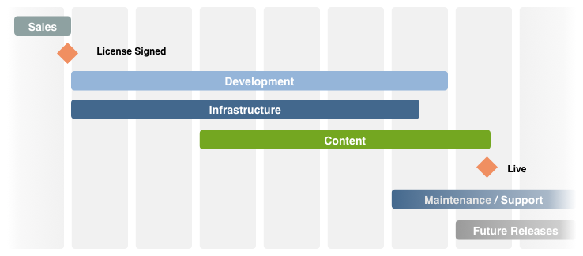

# Checklista - ytterligare referens{#the-checklist-further-reference}

På den här sidan finns mer information om hur du kan arbeta vidare med och/eller förbättra de dokument och principer som omfattas av checklistan för [hanteringsprojekt - bästa praxis](/help/managing/best-practices.md).

## AEM - Vad använder du? {#aem-what-will-you-be-using}

>[!CAUTION]
>
>Förteckningen i detta underavsnitt är inte uttömmande, utan avsedd som en introduktion.

### Funktioner i AEM {#features-within-aem}

När du implementerar AEM (särskilt för första gången) måste du granska [funktionerna och arbetsflödena i AEM](https://www.adobe.com/marketing/experience-manager.html) för att vara säker på vilka områden du vill/behöver.

Fundera på vilka funktioner i AEM du kommer att använda och vilken effekt det har på din design. till exempel:

* [Handel](/help/sites-administering/ecommerce.md)
* [Skärmar](https://docs.adobe.com/content/help/en/experience-manager-screens/user-guide/aem-screens-introduction.html)
* [Resurser](/help/assets/assets.md)
* [Taggar](/help/sites-administering/tags.md)
* [Hantering och översättning av flera webbplatser](/help/sites-administering/msm-and-translation.md)
* [Formulär](/help/forms/home.md)
* [Communities](/help/communities/deploy-communities.md)
* [Livefyre](https://answers.livefyre.com/product/livefyre-for-adobe-experience-manager-aem/livefyre-for-adobe-experience-manager/)

I [versionsinformationen](/help/release-notes/release-notes.md)för de olika versionerna av AEM kan du även se när nya funktioner har lagts till.

### Integreringar {#integrations}

AEM kan integreras med andra Adobe-produkter och/eller tredjepartstjänster. De kan öka den kraft och funktionalitet du har till ditt förfogande.

Mer information finns i [Lösningsintegrering](/help/sites-administering/integration.md) .

## Migrera eller uppgradera? {#migrate-or-upgrade}

Det är viktigt att tänka på om du vill:

* Uppgradera den befintliga installationen.
* Migrera innehållet från det aktuella systemet till en ny installation.

När du går från en tidigare version till den aktuella versionen finns det två alternativ:

* Använd [pakethanteraren](/help/sites-administering/package-manager.md) för att exportera allt innehåll och all programkod från det gamla systemet till det nya.
* [Uppgradera](/help/sites-deploying/upgrade.md) det gamla systemet på plats. Detta är det rekommenderade alternativet i de flesta fall.

## Grundregler {#basic-ground-rules}

Precis som med andra projekt är det viktigt att fastställa grundregler så snart som möjligt. Bland dessa finns:

>[!NOTE]
>
>Dessa punkter är allmänna, checklistan för [bästa praxis](/help/managing/best-practices.md) behandlar detaljer i samband med AEM.

* **Roller**

   Dessa bör vara klart definierade och göras kända för alla som är inblandade i projektet. Det är dessutom tillrådligt att understryka:

   * Beslutsfattare
   * Kontaktpunkter

* **Ansvarsområden**

   * En tydlig definition av ansvarsområdena för ditt projekt för varje roll bidrar till att undvika förvirring.

* **Deltagande**

   Genom att involvera berörda parter så snart som möjligt kan ni uppmuntra dem att bli *intressenter* i projektet och på så sätt öka deras engagemang för projektets framgång.

   * På kundsidan omfattar detta författarna - som måste arbeta med systemet dagligen.
   * I ditt eget projektteam kommer detta även att omfatta de personer som ansvarar för kvalitetssäkring. Ju mer de förstår kundens krav, desto bättre kan de planera testerna.

* **Kommunikationsvägar**

   * Även om dessa inte bör formaliseras alltför mycket bör särskilda definitioner säkerställa att de viktigaste personerna alltid är informerade och därför hålls uppdaterade. Särskild uppmärksamhet bör ägnas kommunikationen med externa parter.

* **Processer**

   Vilka processer som ska definieras beror på vilket projekt du arbetar med. Försök att behålla dessa enkla funktioner, med tanke på:

   * Definiera processer (och kommunikationsvägar) för samverkan med tredje part. t.ex. designbyråer och tredjepartsleverantörer av programvara.
   * Ofta har kunden egna rutiner och verktyg för projekthantering och rapportering.

* **Spårningsverktyg**

   Det finns många verktyg som du kan använda för att spåra information om buggar, uppgifter och andra aspekter av ditt projekt - se [Översikt över potentiella verktyg](#overview-of-potential-tools) för mer information.

   * Det viktigaste att notera här är att bara behålla en kopia av informationen och dela informationen (och därmed tillgång till det verktyg som används). Detta underlättar underhållet och hjälper till att förebygga avvikelser.

* **Omfång**

   Definiera tydligt vad som ska täckas av projektet på olika nivåer:

   * de enskilda releaserna (om en iterativ versionsprocess används och oavsett om de levereras till kunder eller till ditt interna testteam).
   * AEM-projektet.
   * Hela projektet. inklusive eventuella tredjepartsprogram, deras inverkan på testning, organisatoriska frågor och många andra.
   * För vissa aspekter kan det också vara användbart att ange vad som *inte* omfattas av projektet. Detta kan bidra till att förhindra förvirring och felaktiga antaganden, även om det bör begränsas till väsentliga frågor.

* **Rapportering**

   Definiera tydligt vilken information ni ska rapportera, i vilken form, hur ofta och till vem.

* **Terminologi**

   * Definiera de förkortningar och/eller kundspecifika termer som ska användas.

* **Antaganden**

   * Definiera eventuella antaganden.

Denna information kan definieras i en projekthandbok. en Wiki kan också bidra till att säkerställa att pågående ändringar hanteras effektivt. De viktigaste faktorerna är följande, oavsett var de definieras:

* Informationen definieras och underhålls
* Alla berörda personer informeras tydligt om informationen. Även om det är en vanlig projekthanteringspraxis kan den inte upprepas tillräckligt ofta, så att en tydlig rolldefinition och bra kommunikation kan skapa, eller bryta, ett projekt.
* Endast en version av all information som spåras behålls. till exempel felspårning, problemspårning osv.

## Viktiga resultatindikatorer och målvärden {#key-performance-indicators-and-target-metrics}

Organisationer använder nyckeltal (KPI:er) för att utvärdera hur de lyckades uppnå sina mål. Dessa indikatorer är mätbara värden som kan användas för att visa hur effektivt specifika mål uppfylls.

Dessa indikatorer kan vara

* Företag:

   * Används för att mäta viktiga affärsmål.
   * Det är viktigt att välja nyckeltal som är lämpliga för ert företag/scenario med tydliga definitioner av vad de är, hur de mäts, hur de kommer att användas och av vem.

* Prestanda:

   * Definiera hur systemets prestanda ska mätas.
   * Några exempel är sidinläsningstid, svarstid för servern och prestanda för databasfrågor.

Vissa indikatorer, men inte alla, kan baseras på målmåtten som du identifierar och definierar.

### Måttmål {#target-metrics}

Mätvärden används för att definiera kvantitativa mått för kvaliteten på din webbplats - de är i princip en definition av de prestationsmål som du vill uppnå och kan användas för att definiera [nyckeltal (nyckeltal för prestandaindikatorer)](#key-performance-indicators-and-target-metrics).

Många mätvärden kan definieras, men ofta täcker de mål som du har satt upp för prestanda och samtidighet. I synnerhet faktorer som kan vara svåra att kvantifiera och ofta är benägna att göra en *känslomässig* bedömning:

* &quot;vår webbplats är *mycket för långsam* idag&quot; - när är *långsam* kvalificerat?

* &quot;allt *hänger sig* när min kollega loggar in&quot; - hur många samtidiga användare kan systemet stödja?
* &quot;När jag söker *stannar* systemet&quot; - vilket slags sökförfrågningar påverkar systemet?
* &quot;det tar *lång tid* att hämta filen&quot; - vilka hämtningstider är tillåtna (under normala nätverksförhållanden)?

Målmått definieras i början av ett projekt till:

* ange de förväntade dimensionerna för den webbplats du kommer att erbjuda
* ange den minimikvalitet som du vill uppnå
* definiera hur dessa faktorer faktiskt ska mätas
* användas som grund för [nyckelresultatindikatorerna](#key-performance-indicators-and-target-metrics)

Som alltid måste man vara försiktig när man definierar målmåtten:

* om de är för höga kan de vara helt omöjliga att uppnå
* om inställt för låga fluktuationer inte kan markeras
* för att säkerställa att de kan mätas upprepade gånger och konsekvent
* för att skapa en balans mellan de olika faktorer som mäts
* vissa mätvärden avser en testmiljö, men vissa bör återspegla verkliga scenarier eftersom de måste vara mätbara och reproducerbara på produktionsplatsen
* prioritera mätvärdena utifrån deras betydelse för webbplatsen
* begränsa mätvärdena till en uppsättning som kan övervakas på ett realistiskt sätt

Under projektets utveckling kan de uppdateras och justeras på lämpligt sätt. När projektet har implementerats kan de användas för att hjälpa dig att styra installationen och övervaka/underhålla de servicenivåer som krävs för den pågående åtgärden.

När dessa mätvärden används på rätt sätt kan de ge ett användbart verktyg. när de används på ett oansvarigt sätt kan de vara en tidsödande störning. Som alltid måste ni förstå vad ni mäter, hur ni mäter det och varför.

>[!NOTE]
>
>Detta avsnitt kommer att behandla de grundläggande principer och frågor som ska övervägas. Alla installationer är olika, så de faktiska värden som ska mätas är olika.

### Allt hänger på din projektdesign {#everything-rests-on-your-project-design}

Alla mätvärden kommer på något sätt att påverkas av projektets utformning. Omvänt löses många problem bäst genom designändringar.

Därför bör du definiera målvärden *innan* du bestämmer dig för din design. På så sätt kan du optimera din design baserat på dessa faktorer. När projektet väl har utvecklats är det svårt att ändra de grundläggande designprinciperna.

När du skapar webbplatsens struktur följer du den rekommenderade strukturen för AEM-webbplatser. Se till att du förstår följande:

* Strukturera webbplatsinnehåll.
* Hur mallar och komponenter fungerar.
* Hur cachning fungerar.
* Effekterna av personaliserat innehåll.
* Hur sökfunktionen fungerar.
* Hur du kan använda CSS och relaterade tekniker för att skapa kompakt, icke-redundant HTML-kod.

Om du anser att din design inte följer riktlinjerna, eller om du är osäker på några av konsekvenserna, bör du klargöra dessa problem innan du börjar med antingen programmeringsfasen eller fyller i innehållet.

### Infrastruktur {#infrastructure}

För att definiera eller bedöma infrastrukturen hjälper det att definiera målvärden som:

* besökare/dag, både medel och topp
* träffar/dag, både medel och topp
* antal webbsidor som görs tillgängliga
* mängd webbinnehåll

Beroende på din situation och webbplatsens strategiska betydelse hjälper detta dig att bedöma och välja din infrastruktur:

* antal servrar
* antal AEM-instanser (författare och publicera)

### Prestanda {#performance}

Det finns flera faktorer som kan utvärderas:

* svarstider för enskilda sidor, med beaktande av

   * svarstider i en författarmiljö
   * svarstider i publiceringsmiljön

* svarstider för sökbegäranden

Det här avsnittet kan läsas tillsammans med [Prestandaoptimering](/help/sites-deploying/configuring-performance.md) som utökar de tekniska detaljerna för att mäta prestandan.

#### Svarstider för enskilda sidor {#response-times-for-individual-pages}

Ett viktigt problem är den tid det tar för er webbplats att svara på besökarnas förfrågningar.

Även om det här värdet varierar för varje begäran kan ett genomsnittligt målvärde definieras. När det här värdet har visat sig vara både genomförbart och underhållbart kan det användas för att övervaka webbplatsens prestanda och ange utvecklingen av potentiella problem

Olika mål för skribent- och publiceringsmiljöer

De svarstider du vill använda skiljer sig åt mellan skribent- och publiceringsmiljöerna, vilket återspeglar målgruppen:

* **Författarmiljö**

   Den här miljön används av författare som anger och uppdaterar innehåll, så den måste:

   * tillgodose ett litet antal användare som skapar ett stort antal förfrågningar när de uppdaterar innehållssidor och de enskilda elementen på dessa sidor
   * vara så snabb som möjligt för att maximera produktiviteten och få ut materialet på webbplatsen

* **Publiceringsmiljö**

   Den här miljön innehåller innehåll som du gör tillgängligt för användarna:

   * hastigheten är fortfarande viktig, men den är ofta långsammare än en författarmiljö
   * fler mekanismer för prestandaförbättring ofta tillämpas:

      * innehållet cachelagras
      * belastningsutjämning används

#### Ange målsvarstider {#setting-target-response-times}

Så hur kan du bestämma dig för uppnåbara (genomsnittliga) svarstider? Detta är ofta en fråga om erfarenhet:

* tidigare erfarenheter på din webbplats
* upplevelse med AEM
* känna igen komplexa sidor som har mer än de genomsnittliga svarstiderna (dessa bör optimeras individuellt om det är möjligt)

Under kontrollerade förhållanden kan dock följande riktlinjer tillämpas:

* 70 % av förfrågningarna om sidor ska svara på mindre än 100 ms.
* 25 % av förfrågningarna om sidor bör svara på mindre än 100 ms-300 ms.
* 4 % av förfrågningarna om sidor ska svara på mindre än 300 ms-500 ms.
* 1 % av förfrågningarna om sidor ska svara på mindre än 500 ms-1 000 ms.
* Inga sidor ska svara långsammare än 1 sekund.

Siffrorna ovan förutsätter följande villkor:

* mätt vid publicering (ingen redigeringsmiljö och/eller CFC-overhead)
* mätt på servern (ingen nätverksbelastning)
* inte cachelagrad (ingen AEM-utdatacache, ingen Dispatcher-cache)
* endast för komplexa objekt med många beroenden (HTML, JS, PDF, ...)
* ingen annan belastning på systemet

Det finns flera sätt att övervaka svarstiderna:

* **Övervaka svarstider med AEM request.log**

   En bra utgångspunkt för prestandaanalys är begärandeloggen. Du kan bland annat använda den här informationen för att se svarstiderna för enskilda begäranden. Mer information finns i [Prestandaoptimering](/help/sites-deploying/configuring-performance.md) .

* **Övervaka svarstider med HTML-kommentarer**

   HTML-kommentarer kan användas för att inkludera information om svarstid i källan för varje sida:

   `</body> </html>v <-- Page took 58 milliseconds to be rendered by the server --> Response times for search requests`

#### Sökbegäranden {#search-requests}

Sökförfrågningar kan ha stor effekt på din webbplats, både när det gäller:

* Svarstid för den faktiska sökningen

   * En snabb sökfunktion är ett kvalitetsmål för din webbplats

* Effekter på allmänna prestanda

   * Eftersom en sökfunktion måste skanna (potentiellt stora) avsnitt av innehållet, eller ett särskilt extraherat index, kan detta påverka hela systemets prestanda om det inte optimeras

Att ange mål för sökbegäranden är återigen en fråga om erfarenhet beroende på:

* upplevelse av AEM
* en bedömning av hur ofta sökningen kommer att användas jämfört med andra mål
* din persistence Manager
* ditt sökindex
* komplexiteten i sökfunktionen, en grundläggande sökfunktion som bara tillåter att 1 sökterm matas in snabbare än en avancerad sökning som tillåter användaren att skapa komplexa söksatser med AND/OR/NOT.

Dessa bör planeras och integreras redan från början av projektet. De övervakningsmekanismer som finns är bland annat följande:

* **Övervaka svarstider för sökningar med AEM request.log**

   Även här kan request.log användas för att övervaka svarstiderna för sökbegäranden. Mer information finns i [Prestandaoptimering](/help/sites-deploying/configuring-performance.md) .

* **Programmerade mekanismer för mätning av svarstider för sökningar**

   Om du vill anpassa den information du samlar in om sökförfrågningar och hur de fungerar rekommenderar vi att du inkluderar informationsinsamling i projektets källkod. Mer information finns i [Prestandaoptimering](/help/sites-deploying/configuring-performance.md) .

### Samtidighet {#concurrency}

Din webbplats kommer att vara tillgänglig för ett antal användare/besökare, både i skribent- och publiceringsmiljöer. Siffrorna är ofta mer än du använde när du testade, men de varierar också och är svåra att förutse. Webbplatsen måste utformas för ett genomsnittligt antal samtidiga användare/besökare utan att märka någon negativ inverkan på prestandan. Även här `request.log` kan de användas för samtidighetstester. Mer information finns i [Prestandaoptimering](/help/sites-deploying/configuring-performance.md) .

Målen för antalet samtidiga användare beror på miljötypen:

* **Författarmiljö**

   * Vanligtvis kan antalet samtidiga användare uppskattas korrekt. Du kommer att veta hur många författare du har totalt, men (förmodligen) alla kommer inte att vara aktiva samtidigt.

* **Publiceringsmiljö**

   * Detta är svårare att förutsäga, så du måste välja ett målvärde. Återigen bör detta baseras på erfarenheterna av den aktuella webbplatsen och realistiska förväntningar på den nya webbplatsen.
   * Specialhändelser (t.ex. när du publicerar nytt, mycket populärt innehåll) kan överstiga förväntningarna - eller till och med möjligheterna (som ibland rapporteras i pressen när biljetter till vissa evenemang görs tillgängliga för försäljning).

### Kapacitet och volym {#capacity-and-volume}

Innan du diskuterar relaterade mätvärden ska du göra en snabb definition av termerna:

* **Volym**

   * Den mängd utdata som bearbetas och levereras av systemet.

* **Kapacitet**

   * Systemets förmåga att leverera volymen.
   * I varje steg mäts kapacitet och volym på olika sätt, vilket framgår av tabellen nedan. För bästa prestanda bör du se till att kapaciteten matchar volymen i varje steg och att både kapacitet och volym delas i alla steg. Du kan till exempel beräkna navigeringen på klientdatorn eller placera den i cachen, i stället för att beräkna den på servern för varje begäran.

* **Kapacitet och volym**

   | Vad / Var | Kapacitet | Volym |
   |---|---|---|
   | Klient | Datorkraft i användarens dator. | Sidlayoutens komplexitet. |
   | Nätverk | Nätverksbandbredd. | Sidans storlek (kod, bilder o.s.v.). |
   | Dispatcher-cache | Webbserverns serverminne (huvudminne och hårddisk). | Webbserver (huvudminne och hårddisk). Antal och storlek för cachelagrade sidor. |
   | Utdatacache | AEM-serverns serverminne (huvudminne och hårddisk). | Antal och storlek för sidorna i utdatacachen, antalet beroenden per sida. Dispatcher-cachen sänker volymen. |
   | Webbserver | Webbserverns datorkraft. | Antal begäranden. Cachelagring sänker volymen. |
   | Mall | Webbserverns datorkraft. | Mallarnas komplexitet. |
   | Databas | Databasens prestanda. | Antal sidor som lästs in från databasen. |

### Andra mått {#other-metrics}

I de föregående avsnitten beskrivs huvudmåtten som ska definieras.

Beroende på dina specifika krav kan det vara användbart för dig att definiera ytterligare mått, antingen separat eller med hänsyn till ovanstående klassificeringar.

Men det är bättre att ha en liten uppsättning exakta, viktiga mätvärden som fungerar enkelt och tillförlitligt, i stället för att försöka mäta och definiera alla delar av webbplatsen. Webbplatsen kommer helt enkelt att förändras och utvecklas så fort den skickas vidare till användarna.

## Dokumentskydd {#security}

Säkerhet är avgörande och en ständigt ökande utmaning. Den ***måste*** övervägas och planeras från de tidigaste projektfaserna.

I [säkerhetschecklistan](/help/sites-administering/security-checklist.md) beskrivs de åtgärder du bör vidta för att se till att din AEM-installation är säker när den distribueras. Andra säkerhetsaspekter behandlas under [Säkerhet (vid utveckling)](/help/sites-developing/security.md) och [Användaradministration och Säkerhet](/help/sites-administering/security.md).

## Parallella och interaktiva uppgifter {#parallel-and-iterative-tasks}

>[!NOTE]
>
>Följande:
>
>* Erbjuder en översikt relaterad till den *första* implementeringen av ett AEM-projekt.
>* är avsedd som en abstrakt översikt, Se [Projektchecklista](/help/managing/best-practices.md) för specifika faser/milstolpar/uppgifter.
>* Alla tidsskalor är teoretiska.
>

För en ny implementering av ett standard-AEM-projekt måste du ta hänsyn till uppgifter som:

* Överleverans från försäljningsprocessen.
* Implementering av kundapplikationen (**Utveckling**).
* Installation och konfigurering av infrastrukturen (och relaterade processer) på kundplatsen (**infrastruktur**).
* Skapande (eller migrering) av innehållet (**innehåll**).
* Överföring till operationer (**underhåll/support**).
* Följ upp releaser.

För alla aspekter rekommenderas en iterativ metod:

>[!NOTE]
>
>Dela upp projektstarten i **Soft Launch** (minskad tillgänglighet, flera upprepningar) och **Hard Launch** (full tillgänglighet - Live) så att du kan justera, optimera och utbilda användare under realistiska förhållanden i produktionsmiljön.

>[!NOTE]
>
>Se [Projektchecklista](/help/managing/best-practices.md) för exempel på uppgifter som du bör utföra (eller utvärdera) under projektets livscykel.

Några punkter att notera för varje kategori är:

* **Utveckling**

   * Definiera basarkitekturen först.
   * Använd flera iterationer (stänk) för utveckling:

      * Första sprint motsvarar den första fullständiga utvecklingscykeln.
      * Första Sprint-resultatet i den första distributionen till testmiljön.
      * Varje fjäder ger ett körbart resultat.
      * Varje Sprint får en kundsignatur (minimum av strukturerat test med feedback).
   * Planera för en eventuell uppdatering av den tillgängliga AEM-versionen under projektet.
   * Planera för tester och optimering under skarvar.
   * Planera för stabiliserings- och optimeringsfaser.
   * Skapa en logg med artiklar som ska planeras för ytterligare versioner.
   * Planera för partnersamarbete och överlämnande.

* **Infrastruktur**

   * Definiera basarkitekturen först:

      * Definiera prestandakrav.
      * Definiera prestationsmål (dvs. tydligt definiera förväntningar).
      * Definiera maskinvaru- och infrastrukturarkitektur. inklusive storlek.
      * Definiera distribution.
   * Använd flera iterationer; för den första fjädringen och den första konfigurationen förbereds:

      * Utvecklingsmiljö.
      * Utvecklingsprocess.
      * Testmiljö.
      * Distributionsprocess (inklusive konfigurationshantering).
   * Planera för flera lastprovningar.
   * Planera för tester och optimering under skarvar.
   * Planera för en stabiliserings- och optimeringsfas.
   * Driftsätt i produktionsmiljön så tidigt som möjligt (låt driftsteamet installera systemet för att få en upplevelse).
   * Använd namngivna användare och definierade roller så tidigt som möjligt.
   * Planera för utbildning (t.ex. administratörsutbildning).
   * Planera för överlämning till verksamheten.

* **Innehåll**

   * Basarkitekturen:
      * Driver innehållshierarkin.
      * Hjälper till att definiera innehållskonceptet.
      * Definierar MSM-användning och -layout.
      * Definierar roller, grupper, arbetsflöden och behörigheter.
   * Fundera på om det är praktiskt att skapa offlinesidor.
   * Planera för att snabbt skapa första sidor och innehåll (för användning i tester och feedback).
   * Planera för migrering av befintligt innehåll.
   * Planera för&quot;in-sprint-migration&quot; efter omfaktorisering.
   * Planera&quot;content burndown&quot; (platskarta för publicerat innehåll).

## Beräknar tid och insats {#estimating-time-and-effort}

Beroende på vilken uppgiftslista du skapar kan du sedan göra en första uppskattning av tid och arbete för (hög nivå) uppgiftsdefinitioner. Dessa bör innehålla en indikation på vem (kund eller partner) som kommer att göra vad och när.

I följande lista visas ungefärliga uppskattningar och inbördes samband mellan ansträngningarna, och därmed kostnader:

>[!CAUTION]
>
>Dessa siffror kan endast användas för ursprungliga uppskattningar. En erfaren AEM-utvecklare måste göra en detaljerad analys.

| Fas | Insats |
|---|---|
| Utveckling | En ungefärlig uppskattning på 2-4 timmar för varje komponentnod omfattar alla utvecklingskrav. |
| Testning av utvecklare | 15 % av utvecklingsarbetet |
| Uppföljning | 10 % av utvecklingsarbetet |
| Dokumentation | 15 % av utvecklingsarbetet |
| JavaDoc-dokumentation | 10 % av utvecklingsarbetet |
| Felkorrigering | 15 % av utvecklingsarbetet |
| Projektledning | 20 % av projektkostnaderna för projektledning |

Detaljerad planering kan sedan relatera tillgängliga eller nödvändiga resurser till deadlines och kostnader.

## Referensarkitektur {#reference-architecture}

Referensarkitekturen ges för att tillhandahålla en malllösning för AEM-arkitekturen. Referensarkitekturen åtgärdar problem som ofta uppstår i företagssystem, t.ex. skalning, tillförlitlighet och säkerhet.

Följande webbplatsmått ska definieras:

| Klassificering | Definition |
|---|---|
| Antal webbplatser |  |
| Antal intranätsplatser |  |
| Antal kodbaser (t.ex. om Internet och intranätet är olika) |  |
| Antal enskilda sidor |  |
| Antal besök på plats/dag |  |
| Antal sidvisningar/dag |  |
| Volym (i GB) för dataöverföring/dag |  |
| Antal samtidiga användare (stängd användargrupp) |  |
| Antal samtidiga besökare (publicera) |  |
| Antal samtidiga författare |  |
| Antal registrerade författare |  |
| Antal sidaktiveringar/arbetsdag |  |
| Antal sidaktiveringar under distributionen |  |

## Översikt över potentiella verktyg {#overview-of-potential-tools}

Följande lista innehåller information om verktyg som kan användas. Den är avsedd som en introduktion, inte som en omfattande rekommendationslista, och ska definitivt inte hindra dig från att använda andra verktyg som du föredrar.

<table>
 <tbody>
  <tr>
   <td><strong>Produkt</strong></td>
   <td><strong>Beskrivning</strong></td>
  </tr>
  <tr>
   <td>AEM</td>
   <td>
AEM har också en rad funktioner som hjälper dig att övervaka, testa, undersöka och felsöka programmet; inklusive:

    <ul>
     <li><a href="/help/sites-developing/developer-mode.md">Utvecklarläge</a></li>
     <li>The <a href="/help/sites-developing/hobbes.md">Testing Console</a></li>
     <li><a href="/help/sites-administering/operations-dashboard.md">Instrumentpanel för åtgärder</a></li>
     <li><a href="/help/sites-authoring/content-insights.md">Content Insight</a></li>
     <li>The <a href="/help/sites-authoring/author-environment-tools.md#content-tree">Content Tree</a></li>
    </ul> </td>
  </tr>
  <tr>
   <td> </td>
   <td> </td>
  </tr>
  <tr>
   <td>Selen</td>
   <td><a href="https://docs.seleniumhq.org/">Selenium</a> är ett testverktyg med öppen källkod. Testerna körs direkt i webbläsaren och emulerar hur användarna arbetar.</td>
  </tr>
  <tr>
   <td>Microsoft Project</td>
   <td>Ett vanligt projekthanteringsverktyg.</td>
  </tr>
  <tr>
   <td>Jira</td>
   <td><a href="https://www.atlassian.com/software/jira">Jira</a> är ett verktyg med öppen källkod som du kan använda för att spåra och hantera detaljer i programvarufel. Arbetsflöden kan vid behov läggas på felinformationen.</td>
  </tr>
  <tr>
   <td>Git</td>
   <td><a href="https://git-scm.com/">Git</a> är ett revisionsprogram.</td>
  </tr>
  <tr>
   <td>Eclipse</td>
   <td>
Eclipse är en IDE med öppen källkod, som består av olika projekt. Dessa fokuserar på att bygga en öppen utvecklingsplattform som består av utbyggbara ramverk, verktyg och miljöer för att bygga, driftsätta och hantera programvara under hela livscykeln.
 
Mer information finns i <a href="/help/sites-developing/howto-projects-eclipse.md">Utveckla AEM-projekt med Eclipse</a> .
 </td>
  </tr>
  <tr>
   <td>IntelliJ</td>
   <td>
En professionell utvecklingsmiljö (som därför kan ge upphov till licenskostnader) med ett omfattande utbud av funktioner. 
 
Mer information finns i <a href="/help/sites-developing/ht-intellij.md">Utveckla AEM-projekt med IntelliJ IDEA</a> .
 </td>
  </tr>
  <tr>
   <td>Maven</td>
   <td><a href="https://maven.apache.org/">Maven</a> är ett verktyg för projektledning och -förståelse som kan hantera byggprocessen (programvara och dokumentation).</td>
  </tr>
 </tbody>
</table>

## Ytterligare läsning {#further-reading}

Dessutom är följande avsnitt av särskilt intresse:

* [Komma igång](/help/sites-deploying/deploy.md#getting-started)
* [Tekniska krav](/help/sites-deploying/technical-requirements.md)
* [Övervaka och underhålla din instans](/help/sites-deploying/monitoring-and-maintaining.md)

### Bästa praxis {#best-practices}

Adobe tillhandahåller ytterligare metodtips för alla faser och målgrupper:

* [Distribuerar](/help/sites-deploying/best-practices.md)
* [Redigering](/help/sites-authoring/best-practices.md)
* [Administratör](/help/sites-administering/administer-best-practices.md)
* [Utvecklar](/help/sites-developing/best-practices.md)
* [Projektledning](/help/managing/best-practices.md)