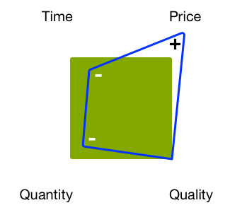

# Hantera projekt - checklista för bästa praxis{#managing-projects-best-practices-checklist}

Att hantera ett projekt för att implementera Adobe Experience Manager (AEM) kräver planering och förståelse för att du är medveten om de problem och (relaterade) beslut som du måste fatta (både före och under implementeringen av projektet).

De bästa sätten är att

* En [interaktiv checklista](/help/managing/best-practices-checklist.md) som gör att du kan följa upp och övervaka dina framsteg med dessa bästa metoder.

   * Definierar indata och slutprodukter utifrån fas, milstolpe och personlighet.
   * Ger automatiska översikter (kvalitet, hälsa och fullständighet) som visar på framsteg och projekthälsa.

* Dokumentation som baseras direkt på [checklistan](/help/managing/best-practices-checklist.md)och som innehåller följande:

   * [Projektpulsslaganalys](#projectheartbeat) .
   * [Status efter roll](#status-by-role) - översikt.
   * [Faser och milstolpar](#phases-and-milestones).
   * [Nyckelpersonal](#persona) och deras medverkan i varje (relevant) skede.
   * En [ordlista](/help/managing/best-practices-glossary.md) med [obligatoriska dokument och slutprodukter](#required-documents-and-deliverables).

* [Ytterligare referensmaterial](/help/managing/best-practices-further-reference.md) för att ge mer information om specifika områden.

## Kontrollpanel för projektpulsslag {#project-heartbeat-dashboard}

Kalkylbladet **Projektpulsslag** ger en grafisk översikt över kritiska mätvärden för ditt projekt:

* **Faskvalitet**

   * Anger kvaliteten på [dokument och slutprodukter](#required-documents-and-deliverables) som krävs i projektet.

* **Phase Health**

   * En högnivåstatusindikator för ditt projekt; är användbart för att framhäva områden som kan vara i riskzonen.

* **Slutförandefas**

   * När som helst under projektet visar detta hur mycket som redan har slutförts för varje fas i projektet.

## Status efter roll {#status-by-role}

Kalkylbladet **Status efter roll** visar en detaljerad beskrivning av [**hälsa **,** kvalitet **och** fullständighet **](#projectheartbeat)efter**[ fas](#phases-and-milestones)** ****och¥Persona¥.

## Faser och milstolpar {#phases-and-milestones}

Projektplanen är uppdelad i olika faser (på hög nivå).

Varje fas innehåller sina egna milstolpar. För varje [person](#persona) (eller roll) listas de relevanta milstolparna tillsammans med de dokument som krävs för att producera de definierade slutprodukterna.

>[!NOTE]
>
>Det finns ingen direkt 1:1-relation mellan de enskilda dokumenten och slutprodukterna.

### Förberedelse {#preparation}

Förberedelser av ditt projekt utgör grunden för hela projektet. Ni måste definiera viktiga krav tillsammans med tydliga mål och förväntningar för:

* **Affärsargument**

   * De grundläggande skälen och motiveringen till att projektet genomförs.

* **Tillämpningsområde och schema**

   * Ett grundläggande tillämpningsområde och grovschema bör göras tillgängligt för att definiera vad som krävs och inom vilken tidsram. Om det hjälper till att klargöra situationen kan du också definiera vad som ligger utanför omfånget.

Hur du förbereder, planerar och kör ditt projekt och implementerar din lösning påverkas av de begränsningar du har för din verksamhet, till exempel fast budget, fast tidslinje, innehållskvantitet, kvalitet som krävs.

Som alltid kommer justeringen av någon av faktorerna att påverka de andra. Om du till exempel minskar tiden, men behöver samma kvalitetsnivå, kommer priset förmodligen att öka samtidigt som du minskar mängden innehåll som du kan hantera. Budgeten är ofta en nyckelfaktor, så sådana relationer kan inte glömmas bort.

De fyra faktorerna:

#### Milstolpar {#milestones}

* **Validering**

   I den här fasen måste du validera och bekräfta målen för projektet; till exempel:

   * Vad vill du uppnå/tillhandahålla?
   * Vem tjänar på det?
   * Vad är omfattningen?

      * Om det gör det lättare att klargöra situationen kan du också definiera vad som ligger utanför omfånget.
   * Hur definierar man framgången?
   * Hur ska du mäta framgång?
   * Vilka är kraven, affärsvillkoren och de tekniska kraven?
   * Finns det äldre system som ska ersättas och, om så är fallet, finns det data som ska migreras?
   * Vem kommer att bli inblandad?
   * Hur mäter du framstegen?
   * Hur ofta granskar du hur projektet fortskrider?

* **Budget**

   Innan du påbörjar ett projekt behöver du en tillförlitlig och realistisk uppskattning av vad det kommer att kosta att implementera:

   * Använd information från valideringsmilstolpen som grund för uppskattningarna.
   * Var realistiska i era uppskattningar.
   * Fundera på och ta hänsyn till eventuella riktlinjer, processer eller begränsningar som kunden kan vara föremål för.
   * Tänk på beredskaps- och granskningsprocesser om en granskning eller finjustering av budgeten krävs i ett senare skede.
   * Kom ihåg att kostnader kan tillskrivas många olika former. inköp, användning av resurser och avgifter bland annat.

### Planering {#planning}

När du planerar projektet konsolideras förberedelsen. Här måste ni börja konvertera målen och förväntningarna till en väldefinierad färdplan som består av konkreta uppgifter, som är bundna av tydlig kommunikation, med strikta granskningar för att mäta framstegen.

#### Milstolpar {#milestones-1}

* **Handtag**

   En ren överlämning säkerställer att rätt person/grupper är medvetna om sitt ansvar i projektet.

   Fullständiga uppgifter bör tillhandahållas/genereras för att säkerställa att de har fullständig förståelse för alla relevanta aspekter, inklusive färdplanen, omfattningen, målen, kraven och nyckeltalen.

* **Riskbedömning**

   För att undvika obehagliga överraskningar bör man använda riskbedömningar för att identifiera och kvantifiera eventuella risker tillsammans med deras konsekvenser och sannolikhet.

   Detta bör göras tidigt under projektets livscykel för att säkerställa att eventuella sårbarheter identifieras och utvärderas. Baserat på resultaten kan ni rapportera till era intressenter om huruvida de fullständiga kraven kan genomföras och, om det behövs, om det är möjligt att planera för lämpliga åtgärder som ska vidtas och spåras.

* **Kommunikation**

   Kommunikation är alltid avgörande för att ett projekt ska lyckas. Ni måste kommunicera tydligt och effektivt för att säkerställa att alla är

   * Att arbeta mot samma grundläggande mål
   * Från samma informationsbas
   * Med samma kanaler

* **Sparka av**

   Mötet med avaktivering används för att öka medvetenheten om att projektet har startat. Det är en bra möjlighet att

   * Bjud in alla berörda parter (eller åtminstone grupprepresentanter).
   * Presentera viktiga fakta om projektet.
   * Svara på frågor.
   * Se till att alla har samma kunskapsbas.
   * Engagemang från alla som kommer att vara inblandade - det här måste du tjäna på.

      * Genom att involvera huvudaktörer (inklusive potentiella författare) i början av projektet ökar ni chanserna att få dem engagerade i projektet.

### Utvecklingsförberedelser {#development-preparation}

Att planera utvecklingsarbetet är avgörande för att säkerställa att projektet byggs på en stabil design av ett team som har den kunskap som krävs.

#### Milstolpar {#milestones-2}

* **Utvecklingsteamet har personal och utbildning**

   Innan du börjar med ett projekt bör du se till att ditt utvecklingsteam har lämplig personal och att alla teammedlemmar har utbildning för den aktuella uppgiften.

* **Innehållsarkitektur**

   Innehållsarkitekturen definierar och beskriver innehållets framtida arkitektur. inklusive:

   * Innehållsträdet. inklusive tillgångar
   * Grundläggande strukturer. inklusive kampanjer, etc.
   * Strukturer för flera webbplatser och språk (MSM, översättning osv.)
   * Innehåll som stöds (inklusive taggar och taggar)
   * Strategier för cachning och återanvändning av innehåll

* **Systemarkitektur**

   Systemarkitekturen definierar den konceptuella vyn för ditt system. inklusive (bland annat information):

   * [Systemstruktur](/help/sites-deploying/recommended-deploys.md#deployment-scenarios) för alla obligatoriska miljöer
   * Delsystem
   * Tredjepartssystem
   * gränssnitt, maskinvara, programvara och mänsklig interaktion
   * Servrar för varje miljö. se [Tekniska krav](/help/sites-deploying/technical-requirements.md) och riktlinjer för [maskinvarans storlek](/help/managing/hardware-sizing-guidelines.md)

   * Processer för varje miljö. t.ex. krav på driftsättning och underhåll
   * Underhållsaktiviteter (GC för datastore, optimering av TPM osv.)
   * [Dispatcher](https://helpx.adobe.com/experience-manager/dispatcher/user-guide.html) -cachning
   * [Klustring](/help/sites-deploying/recommended-deploys.md#deployment-scenarios) Publish/Authorshare
   * Prestanda för klientsidan (JS minify, concat, css sprites, total number of http requests, and others)

* **Programarkitektur**

   Programarkitekturen definierar och beskriver de föreslagna programmens beteende.

   Den fokuserar på:

   * Hur de interagerar med varandra och med användarna.
   * De data som ska användas och produceras av program, i stället för deras interna struktur.
   Definitionerna bör omfatta följande:

   * Grundläggande kodstruktur för projektet
   * Kodartefakter (paket, paket osv.)
   * Uppdelning av mallar/komponenter och deras relationer
   * Detaljerad information om nödvändiga anpassningar (specifika överlägg kommer senare)
   * Utformning av de arbetsflöden som lösningen kräver (t.ex. skapande av innehåll, godkännande, publicering, omvandlingar, import, export osv.)
   * Särskild hänsyn till komplexa moduler som MSM, Commerce och integrering med tredje part

* **Systemintegrering**

   Systemintegrering kräver att du planerar (och sedan implementerar):

   * Hur alla delsystem och [lösningar](/help/sites-administering/integration.md) ska sammanföras för att fungera som ett sammanhängande system
   * Hur eventuella tredjepartssystem kommer att integreras. tillsammans med eventuella specialöverväganden, som offline/online, hantering på klientsidan/webbläsarsidan eller hantering av reservsidan när ett system från tredje part är offline/online

* **Testkoncept**

   Innan du börjar utveckla bör du skapa en ingående och heltäckande beskrivning av alla [testningskrav](/help/sites-developing/planning.md) för projektet.

   Detta bör bland annat omfatta följande:

   * Uppgifter om alla tester som ska utföras
   * Förberedelse av allt innehåll som krävs för dessa tester
   * Information om eventuella testverktyg som ska användas
   * Uppgifter på hög nivå om vilka som kommer att delta i testningen. särskilt grupper utanför kvalitetsteamet
   * Detaljer om automatisering av tester. med till exempel Selenium eller AEM Developer Mode

* **Experience Design**

   Experience Design (XD) innebär att utforma användarupplevelsen för din lösning.

   Användarupplevelsen bör analyseras och utvecklas för både författarna och slutanvändarna av webbplatsen.

* **Support**

   Innan alla supportprocesser som krävs för driftsättning, lansering, testning och rapportering tas fram bör fastställas.

   Se även [Adobes supportportal](https://helpx.adobe.com/marketing-cloud/contact-support.html).

### Planering och drift {#operations-planning-and-operations}

På liknande sätt måste åtgärderna planeras på rätt sätt för att säkerställa att du har de miljöer du behöver - för alla faser av projektets livscykel. Ni behöver också rätt processer för att underhålla dem.

#### Milstolpar {#milestones-3}

* **Behörigheter**

   Du måste planera och sedan implementera ett rolls- och rättighetskoncept för alla användare/grupper som ska använda lösningen.

   Exempel:

   * En lista över roller (dvs. grupper) med `read`/ `write` åtkomstdefinitioner för varje

   * Fastställande av användningen av befogenheter som påverkar publiceringsmiljön.
till exempel `replicate`
   * För användare med minimal behörighet bör arbetsflöden definieras
   * Användare i `editor` gruppen bör inte ha `admin` rättigheter eller vara en del av `administrators` gruppen
   Mer information finns i [Användaradministration och -säkerhet](/help/sites-administering/security.md).

* **Övervakning och underhåll**

   Övervakning och underhåll är viktiga aspekter av att säkerställa att lösningen fungerar smidigt när den är klar. Därför måste du definiera:

   * Vad behöver övervakas
   * Underhållsuppgifter. både vanliga och speciella fall
   Se även [Övervakning och underhåll](/help/sites-deploying/monitoring-and-maintaining.md) för mer information.

* **Migrering**

   Allt innehåll från det äldre systemet bör granskas och valideras för migrering.

* **Återställningsplan**

   Kontrollera att du har en återställningsplan. I en krissituation måste detta finnas tillgängligt för att säkerställa produktionsanvändningen av AEM. Detta bör omfatta situationer som säkerhetskopiering, återställning, återställning och reservlösningar.

### Utveckling {#development}

Utveckling är en avgörande fas som kräver mer än bara kodning.

#### Milstolpar {#milestones-4}

* **Utvecklingsmiljö**

   Planera och dokumentera utvecklingsmiljön, inklusive:

   * Arkitektur
   * [Utvecklingsverktyg](/help/sites-developing/dev-tools.md)

      * En typisk miljö består av:

         * ett system för uppföljning av problem, som Jira
         * en IDE, som Eclipse
         * ett bygghanteringsverktyg, som Maven
         * ett verktyg för kontinuerlig integrering, som Jenkins
         * ett verktyg för versionskontroll, som GIT/SVN
         * en databashanterare för byggarfelaktigheter, som Archiva/Nexus
   * Programintegrering/beroenden från tredje part
   * [Integrering/beroenden av lösningar](/help/sites-administering/integration.md)
   * Distributionsplats

* **Testsystem**

   Planera och dokumentera testmiljön, inklusive:

   * Arkitektur
   * beroenden av utvecklingsbyggen, inklusive nattbyggen
   * Möjligheterna eller begränsningarna med att testa integrering/beroenden av tredjepartsprogram
   * Testverktyg
   * Automatiserad testningsstrategi

* **Produktionssystem**

   Planera och dokumentera produktionsmiljön, inklusive:

   * Arkitektur
   * Distributionsplats
   * Programintegrering/beroenden från tredje part
   * Säkerhetsinställningar
   * Baslinjeprestanda verifierat genom att köra [Tough Day-tester](/help/sites-developing/tough-day.md) på produktionsinställningarna
   * Krav för prestandatester. se [Bästa metoder för kvalitetssäkring](/help/sites-deploying/configuring-performance.md#best-practices-for-quality-assurance)

* **Integrering**

   Planera, dokumentera och testa alla aspekter av system- och [lösningsintegreringen](/help/sites-administering/integration.md), inklusive:

   * En automatiserad testningsstrategi
   * Automatiserade processer för att [flytta applikationer från utveckling till test och sedan produktion](/help/managing/enterprise-devops.md#code-movement)
   * Automatiserade processer för att [flytta innehåll från produktion till testning och utveckling](/help/managing/enterprise-devops.md#content-movement)

* **Migrering**

   Planera, dokumentera och testa alla aspekter av innehållsmigreringen. inklusive:

   * Innehållsarkitektur
   * Migreringsstrategi

* **Kommunikation**

   Se till att alla teammedlemmar och projektmedlemmar hålls uppdaterade vid behov.

* **Dokumentation**

   Dokumentera lösningen fullt ut. inklusive:

   * Drifthandbok
   * Anpassningar som kan påverka uppgraderingar
   * Versionsinformation

### Prestanda och testning {#performance-and-testing}

När det nya programmet är tillgängligt måste det genomgå strikta tester, både för funktionalitet och [prestanda](/help/sites-deploying/configuring-performance.md).

>[!NOTE]
>
>Alla testteam bör tillåtas förbli neutrala och leverera testresultaten.
>
>Det är projektledarens ansvar att bedöma eventuella konsekvenser av resultaten och besluta om lämpliga åtgärder.

#### Milstolpar {#milestones-5}

* **Test av godkännande av slutanvändare**

   [UAT (User accept testing](/help/sites-developing/acceptance-signoff.md) ) är avgörande för att säkerställa att

   * Lösningen uppfyller användar-/kundkraven
   * Kunden/användarna accepterar lösningen (funktion, design och prestanda)
   Det bör finnas en formaliserad checklista för överlämnande av kunder. helst automatiseras och körs på nightly mot en ögonblicksbild. Resultatet ska skickas till projektledaren och utvecklingsteamet

* **Prestanda- och belastningstester**

   Prestanda- och belastningstester används för att säkerställa att lösningen uppfyller de nödvändiga prestandanivåerna vid medelbelastning och toppbelastning.

   Mer information om prestandatestning finns i:

   * [Prestandatestning](/help/sites-deploying/configuring-performance.md)
   * [Planera och köra testning](/help/sites-developing/planning.md)

   * [Riktlinjer för grundläggande prestanda](/help/sites-deploying/configuring-performance.md#basic-performance-guidelines)
   >[!NOTE]
   >
   >Denna process måste fortsätta under normal användning av AEM, men dessa inledande steg är de viktigaste.

### Utrullning {#rollout}

För att lansera ditt nya program krävs noggrann planering för att säkerställa en smidig Go Live. Detta innefattar att bekräfta en hög säkerhetsnivå, utbilda alla potentiella användare och göra flera torrperioder för att bekräfta att alla frågor har behandlats.

#### Milstolpar {#milestones-6}

* **Förberedelse**

   Förberedelser och planering kommer att bidra till en smidig utrullning.

* **Utbildning**

   se till att all berörd personal har utbildats.

   Se [Adobe Experience Manager](https://training.adobe.com/training/courses.html#solution=adobeExperienceManager) i kurskatalogen.

* **Administratörer utbildade**

   Se till att era lösningsadministratörer har:

   * Har tränats
   * erhållit lämpligt utbildningsmaterial
   * Lämplig dokumentation har tagits emot

* **Användare utbildade**

   Kontrollera att författarna har:

   * Har tränats
   * erhållit lämpligt utbildningsmaterial
   * har mottagit lämplig dokumentation, till exempel användarhandboken

* **Genomstrykningstester**

   Penetrationstester simulerar en attack på ett datorsystem för att identifiera potentiella säkerhetsbrister.

* **Genomstrykning/säkerhetstester**

   För att försäkra dig om att din lösning är säker ska du utföra specifika penetrationstester tillsammans med ett större antal säkerhetstester.

   Mer information finns i [checklistan](/help/sites-administering/security-checklist.md) .

### Go Live {#go-live}

Du vill att ditt Go Live ska vara så smidigt som möjligt. Återigen behöver de sista stegen planera för ren körning.

#### Milstolpar {#milestones-7}

* **Förberedelse**

   Förberedelser och planering säkerställer smidiga Go Live.

* **Dokumentskydd**

   Bekräfta säkerheten för lösningen för både interna och externa användare och deras innehåll.

* **Reserv**

   Se till att alla system, procedurer och mekanismer som krävs för reservlösningar finns på plats innan du publicerar.

* **Stöd**

   Se till att supporttjänsterna finns på plats och är klara.

* **Övergång**

   Planera och genomför övergången till produktionsmiljön och användarna.

* **Rulla ut**

   Förbered och genomför röktesterna.

## Persona {#persona}

Checklistorna har utformats av en person. Detta är de roller som är mycket involverade i projektets livscykel.

Det finns också [andra personer](#other-persona) som arbetar med specifika uppgifter.

### Projektsponsorer {#project-sponsor}

Projektsponsorn är:

* Ansvarig för att tillhandahålla/presentera affärsärendet för projektet.
* Nyckeln till att forma och definiera projektets omfattning. inklusive:

   * definition av och kriterier för framgång
   * huvudnyckeltal

* Ange huvudmilstolparna baserat på kundens färdplan.

### Projektledare {#project-manager}

Projektledaren är:

* Ansvarig för den övergripande leveransen av projektet utifrån de krav (t.ex. omfattning, nyckeltal, kriterier för framgång och definition) som projektsponsorn ställt.
* Ansvarig för att definiera budgeten och tilldela resurser till projektet baserat på den budgeten.
* Huvudpunkten för kommunikation för alla personer som deltar i projektet.

### Arkitekt {#architect}

Lösningsarkitekten:

* Ansvarar för lösningens och systemets konstruktion på hög nivå.
* Hjälper till att definiera implementeringsstrategin för AEM. Exempel: om en klustrad installation ska implementeras, om ett kallt vänteläge eller när ett leveransnätverk (CDN) krävs.
* Definiera också arkitekturen för AEM-lösningar utifrån kundernas behov. Detta kan omfatta konceptet för användarroller (med relaterade behörigheter), relationen mellan mallar och komponenter eller när flera platser ska användas.

### Affärsanalytiker {#business-analyst}

Affärsanalytiker:

* Ansvarar främst för att samla in och analysera kraven på hög nivå och sedan omvandla dessa till specifikationer:

   * för projektledaren som ska användas vid planering av utvecklingen
   * så att utvecklingsteamet kan arbeta från design och utveckling.

* Fungerar nära tillsammans med kunden för att analysera kraven. De matchar de här mot:

   * Definitionen av framgång.
   * Kriterierna för framgång.
   * KPI:er (både affärs- och prestandabaserade).

### Utvecklingsansvarig {#development-lead}

Utvecklingsledd:

* Ansvarar för det tekniska genomförandet av projektet.
* Ansvarar för att välja en utvecklingsmetod som är kompatibel med kundens krav.
* Utarbeta en utvecklingsstrategi:

   * säkerställa att den är anpassad efter nyckeltal för verksamhet och prestanda
   * med beaktande av kriterier för framgång och definition,

* Fungerar nära ihop med arkitekten (särskilt när du utarbetar utvecklingsstrategin för AEM) för att definiera aspekter som förhållandet mellan mallar och komponenter, integreringsstrategin för tredjepartsprogram och eventuella specialfunktioner.

### Kvalitetslead {#quality-lead}

Kvalitetsledd:

* ansvarar för leveranskvaliteten, säkerställa att den uppfyller kriterierna för framgång och alla nyckeltal som definierats av kunden.
* Definierar kvalitetsstatistik, anpassar sig till alla intressenter, utarbetar testningsplaner och ser till att de genomförs.
* Skapar och levererar rapporter till projektintressenter.

### Systemtekniker {#system-engineer}

Systemteknikern:

* Ansvarar för att övervaka projektinfrastrukturen.
* Ansvarar för:

   * konfiguration av interna utvecklings- och testmiljöer
   * för att matcha dessa system med klientsystemen

* Tillhandahåller maskinvarurekommendationer, övervakar de olika implementeringarna och tillhandahåller driftstöd både före och efter körning.

### Säkerhetsansvarig {#security-lead}

Säkerhetsledaren:

* Ansvarar för lösningens övergripande säkerhetskoncept och ser till att det är i linje med alla krav och policyer från kunden.
* levererar ett säkerhetskoncept, säkerhetsfunktioner och rekommendationer för alla maskinvarubaserade säkerhetsbegrepp, som zoner och brandväggar.

### Annan person {#other-persona}

* intressenter

   * Personer (ofta från företaget) som är intresserade av att projektet lyckas. De bidrar ofta till budgeten.

* Juridik

   * Juridisk rådgivning krävs vid förhandlingar om kontrakt.

* Utbildare

   * Beroende på projektets omfattning och karaktär kan specialiserade utbildare användas för att utveckla och presentera utbildningstillfällen för de relevanta grupperna.

* Teknikskribenter

   * Beroende på projektets omfattning och karaktär kan specialiserade tekniska skribenter användas för att skriva riktlinjer och handböcker för särskilda grupper. t.ex. en underhållshandbok för systemadministratörer eller en användarhandbok för författarna.

* Systemadministratörer

   * Ansvarig för den pågående driften av systemet.

* Författare och slutanvändare

   * De personer som ska använda systemet för att skapa och underhålla webbplatsinnehållet.

## Begärda dokument och slutprodukter {#required-documents-and-deliverables}

Checklistorna täcker **obligatoriska dokument** och **slutprodukter** för varje milstolpe.

* Det finns ingen 1:1-relation mellan dessa; En grupp av obligatoriska dokument kan till exempel resultera i en enda slutprodukt.
* En slutprodukt från en person kan vara ett obligatoriskt dokument för en annan person under samma milstolpe.

### Obligatoriska dokument {#required-documents}

De **dokument** som krävs behövs behövs av rätt person när de producerar sina produkter.

För varje **dokument** som krävs ska följande anges:

* **J/N**: om den har tagits emot.
* **1-3**: En uppgift om kvaliteten på det mottagna dokumentet.

### Leveranser {#deliverables}

För varje milstolpe ansvarar rätt person för att leverera specifika dokument och därmed ta sitt ansvar för en viss milstolpe.

För varje **slutprodukt** måste man ange

* **J/N**: om den är slutförd.

Slutprodukter används ofta som **obligatoriska dokument** för antingen den aktuella eller en senare milstolpe.

## Relaterad bästa praxis {#related-best-practices}

De bästa sätten att distribuera, administrera, utveckla eller skapa finns i följande:

* Övriga bästa metoder och riktlinjer för att hantera ett AEM-projekt:
   * [Riktlinjer för maskinvarans storlek](/help/managing/hardware-sizing-guidelines.md)
   * [Enterprise DevOps](/help/managing/enterprise-devops.md)
   * [Bästa praxis för hantering av SEO och URL](/help/managing/seo-and-url-management.md)
   * [AEM och riktlinjerna för webbtillgänglighet](/help/managing/web-accessibility.md)
   * [Allmänna dataskyddsförordningen](/help/managing/data-protection-and-privacy.md)* [Distribuera och underhålla bästa praxis](/help/sites-deploying/best-practices.md)
* [Administrera metodtips](/help/sites-administering/administer-best-practices.md)
* [Utveckla bästa praxis](/help/sites-developing/best-practices.md)
* [Bästa tillvägagångssätt](/help/sites-authoring/best-practices.md)

## Viktiga dokumentationsområden {#key-documentation-areas}

* AEM DocumentationDessutom är följande avsnitt i AEM-dokumentationen av särskilt intresse (listan är dock inte uttömmande):

   * [Dokumentskydd](/help/sites-developing/security.md)
   * [Rekommenderade distributioner](/help/sites-deploying/recommended-deploys.md)
   * [Enterprise DevOps](/help/managing/enterprise-devops.md)
   * [Maskinvarustorlek](/help/managing/hardware-sizing-guidelines.md)
   * AEM-koncept:

      * [Utveckla - grunderna](/help/sites-developing/the-basics.md)
      * [MSM-koncept](/help/sites-administering/msm.md)
      * [HTML-mallspråk (HTL)](https://docs.adobe.com/content/help/en/experience-manager-htl/using/overview.html)

* Relaterad dokumentation

   * Adobe Experience Cloud - [Planera för Adobe Experience Cloud](https://helpx.adobe.com/marketing-cloud/how-to/planning.html)

