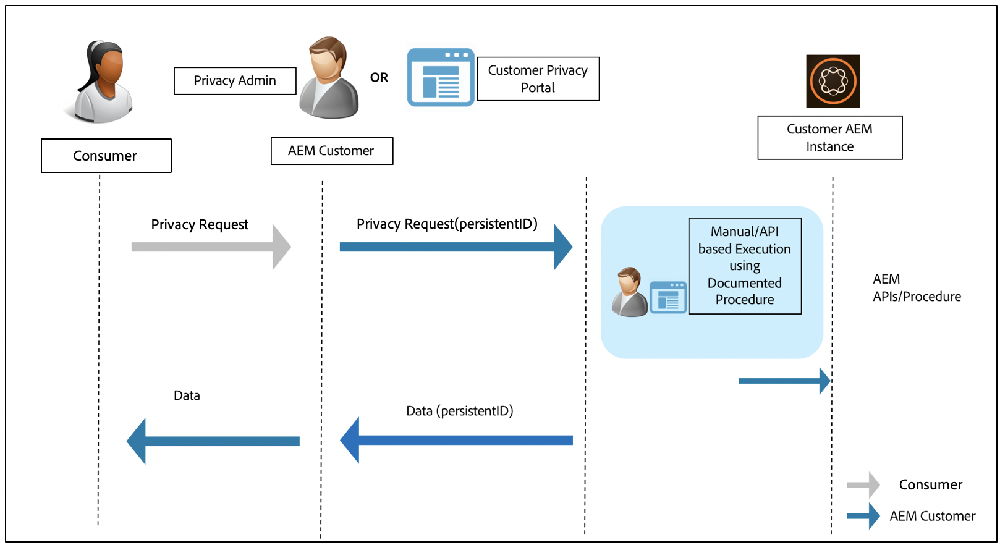

# Adobe Experience Manager beredskap för dataskydd och dataintegritet {#aem-readiness-for-data-protection-and-data-privacy-regulations}

>[!WARNING]
>
>Innehållet i detta dokument utgör inte juridisk rådgivning och är inte avsett som ersättning för juridisk rådgivning.
>
>Kontakta företagets juridiska avdelning för råd angående dataskydd och dataintegritet.

>[!NOTE]
>
>Mer information om Adobe svar på sekretessfrågor och vad detta innebär för dig som Adobe-kund finns i [Adobe Privacy Center](https://www.adobe.com/privacy.html).

Adobe tillhandahåller dokumentation och procedurer (med API:er när sådana finns) för kundsekretessadministratören eller AEM administratör för att hantera förfrågningar om dataskydd och dataintegritet och hjälpa våra kunder att följa dessa regler. De dokumenterade procedurerna gör det möjligt för kunderna att utföra förfrågningar manuellt eller genom att anropa API:er, om sådana finns, från en extern portal eller tjänst.

>[!CAUTION]
>
>Informationen som beskrivs här är begränsad till Adobe Experience Manager.
>
>Data från en annan Adobe On-demand-tjänst, tillsammans med eventuella relaterade sekretessförfrågningar, kommer att kräva åtgärder för den tjänsten.
>
>Mer information finns i [Adobe Sekretesscenter](https://www.adobe.com/privacy.html).

## Introduktion {#introduction}

Instanser av Adobe Experience Manager, och de program som körs på dem, ägs och hanteras av våra kunder.

Följaktligen är dataskyddsbestämmelser, som GDPR, CCPA med flera, i huvudsak kundernas ansvar.

Som en mycket kort introduktion innehåller reglerna för datasekretess och skydd nya regler som ska följas av rollerna för:

* Affärsenheter (CCPA) och/eller datakontroller (GDPR)

* Tjänsteleverantörer (CCPA) och/eller dataprocessorer (GDPR)

De viktigaste bestämmelserna i sådana förordningar är

1. Utökad definition av personuppgifter som ska omfatta alla unika ID:n. som direkt och indirekt identifierbara data.

2. Förbättrade krav på samtycke.

3. Ökat fokus på raderingsrättigheter (dataradering).

4. Avanmäl dig från försäljning av data.

För Adobe Experience Manager:

* Förekomsterna och tillämpningarna som körs på dem ägs och hanteras av kunden.

   * Detta innebär att kunden i praktiken hanterar de reglerande rollerna, bland annat affärsenheter och tjänsteleverantör, datakontroller och dataprocessor.

   * Adobe Experience Platform Privacy Service kommer inte att ingå i arbetsflödet för AEM, vilket visas i diagrammet nedan.

* AEM innehåller dokumentation och förfaranden för att kundens integritetsadministratör och/eller AEM ska kunna genomföra förfrågningar om integritetsreglering. antingen manuellt eller via API:er, om sådana finns.

* Ingen ny tjänst eller gränssnitt har lagts till.

   * Istället dokumenteras procedurer och API:er för användning av kundgränssnitt/portaler som hanterar förfrågningar om sekretessbestämmelser.

* AEM kommer inte att innehålla några färdiga verktyg som stöder arbetsflödet för sekretessförfrågningar.

   * Adobe ska tillhandahålla dokumentation och procedurer för kundens integritetsadministratör och/eller AEM, så att de manuellt kan utföra förfrågningar som rör sekretessbestämmelser.

Adobe tillhandahåller rutiner för hantering av sekretessförfrågningar som rör åtkomst, borttagning och avanmälan för Adobe Experience Manager. I vissa fall finns det API:er som kan anropas från en kundutvecklad portal eller skript som kan hjälpa till med automatisering.

Följande diagram visar hur ett arbetsflöde för sekretesspolicy kan se ut (illustreras med Adobe Experience Manager 6.5):

## Adobe Experience Manager och beredskap för regelefterlevnad {#aem-and-regulatory-readiness}

Se avsnitten nedan för dokumentation av AEM.

## AEM {#aem-foundation}

Se [Hantera förfrågningar om dataskydd och sekretess för AEM Foundation](/help/sites-administering/handling-gdpr-requests-for-aem-platform.md).

## AEM väljer att slå samman användningsstatistiksamling {#aem-opting-into-aggregate-usage-statistics-collection}

Se Samling med statistik om [aggregerad användning](/help/sites-deploying/opt-in-aggregated-usage-statistics.md).

## AEM Sites {#aem-sites}

Se [AEM Sites - Dataskydd och integritet](/help/sites-administering/gdpr-compliance-sites.md)

## AEM {#aem-commerce}

Se [AEM Commerce - Data Protection and Privacy Readiness](/help/sites-administering/gdpr-compliance-commerce.md).

## AEM Mobile {#aem-mobile}

Se [AEM Mobile - Dataskydd och beredskap](/help/mobile/aem-mobile-gdpr-compliance.md)för integritetsskydd.

## AEM integrering med Adobe Target och Adobe Analytics {#aem-integration-with-adobe-target-adobe-analytics}

Dessa Adobe Experience Manager-integreringar är anpassade för dataskydd och sekretess (till exempel GDPR eller CCPA). Inga personuppgifter från Adobe Target eller Adobe Analytics lagras i AEM för integreringarna.
Mer information finns i:

* [Adobe Target - sekretessöversikt](https://docs.adobe.com/content/help/en/target/using/implement-target/before-implement/privacy/privacy.html)

* [Adobe Analytics arbetsflöde för datasekretess](https://docs.adobe.com/content/help/en/analytics/admin/data-governance/an-gdpr-workflow.html)

## AEM Communities {#aem-communities}

AEM Communities uppskattar de registrerade rätt till deras dataportabilitet, rätt till åtkomst och rätt att bli bortglömda med hjälp av API:er som är [färdiga](/help/communities/user-ugc-management-service.md). Dessa API:er möjliggör massborttagning och bulkexport av användargenererat innehåll och inaktiverar användarkonton som identifieras med deras auktoriserbara ID:n. Det går dock att permanent ta bort användarkontot genom att ta bort användarnoden i CRXDE Lite, vilket tar bort behovet av enkel avanmälan från systemet.

Dessutom erbjuder AEM Communities sekretess genom design tack vare sin konsol för massmoderering, som tillåter behöriga medlemmar att hitta och ta bort bidrag och information om användarna. Hanteringskonsolen för medlemmar gör det möjligt att begränsa till att förbjuda en medverkande. Dessutom ger det de registrerade rätt att ta bort de bidrag som de har skapat.

## AEM Forms {#aem-forms}

AEM Forms innehåller komponenter och arbetsflöden som samlar in, bearbetar och lagrar data för att samordna affärsprocesser och slutföra digitala transaktioner. Olika komponenter använder olika datalager och tillåter även integrering med anpassade datalager. I följande dokumentation förklaras procedurer och riktlinjer för att komma åt och hantera användardata för att stödja arbetsflöden för dataskydd och sekretess (till exempel GDPR eller CCPA) för en komponent.

* [Forms Portal](/help/forms/using/forms-portal-handling-user-data.md)
* [Korrespondenshantering](/help/forms/using/correspondence-management-handling-user-data.md)
* [Integrering med Adobe Sign](/help/forms/using/integration-adobe-sign-handling-user-data.md)
* [Forms-centrerade arbetsflöden på OSGi](/help/forms/using/forms-workflow-osgi-handling-user-data.md)
* [Forms JEE-arbetsflöden](/help/forms/using/forms-workflow-jee-handling-user-data.md) (endast AEM Forms JEE)
* [Dokumentsäkerhet](/help/forms/using/document-security-handling-user-data.md) (endast AEM Forms JEE)
* [Användarhantering](/help/forms/using/user-management-handling-user-data.md) (endast AEM Forms JEE)
