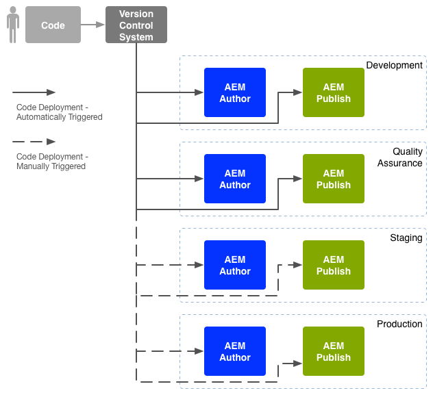

# Enterprise DevOps{#enterprise-devops}

DevOps omfattar processer, metoder och kommunikation som krävs för att

* Underlätta driftsättningen av programvaran i olika miljöer.
* Förenkla samarbetet mellan utvecklings-, testnings- och driftsättningsteamen.

DevOps vill undvika problem som:

* Manuella fel.
* Glömda element: till exempel filer och konfigurationsinformation.
* Avvikelser: till exempel mellan en utvecklares lokala miljö och andra miljöer.

## Miljö {#environments}

En Adobe Experience Manager-driftsättning (AEM) består vanligtvis av flera miljöer som används för olika syften på olika nivåer:

* [Utveckling](#development)
* [Kvalitetssäkring](#quality-assurance)
* [Mellanlagring](#staging)
* [Produktion](#production-author-and-publish)

>[!NOTE]
>
>Produktionsmiljön måste ha minst en författar- och en publiceringsmiljö.
>
>Vi rekommenderar att alla andra miljöer också består av en författar- och en publiceringsmiljö som speglar produktionsmiljön och möjliggör tidig testning.

### Utveckling {#development}

Utvecklarna ansvarar för att utveckla och anpassa det föreslagna projektet (oavsett om det är en webbplats, mobilappar, DAM-implementering och så vidare) med alla funktioner som krävs. De ska:

* utveckla och anpassa de nödvändiga delarna, till exempel mallar, komponenter, arbetsflöden och program
* förverkliga designen
* utveckla de tjänster och skript som krävs för att implementera de funktioner som krävs

Konfigurationen av [utvecklingsmiljön](/help/sites-developing/best-practices.md) kan vara beroende av olika faktorer, även om den består av:

* Ett integrerat utvecklingssystem med versionskontroll som ger en integrerad kodbas. Detta används för att sammanfoga och konsolidera kod från de enskilda utvecklingsmiljöer som används av varje utvecklare.
* En personlig miljö för varje utvecklare, vilken vanligtvis finns på hens lokala dator. Med lämpliga intervall synkroniseras koden med versionskontrollsystemet

Beroende på hur omfattande ditt system är kan utvecklingsmiljön ha både författar- och publiceringsinstanser.

### Kvalitetssäkring {#quality-assurance}

Den här miljön används av kvalitetssäkringsteamet för att [testa](/help/sites-developing/test-plan.md) ditt nya system på ett heltäckande sätt, både design och funktion. Den bör ha både författar- och publiceringsmiljöer med lämpligt innehåll och tillhandahålla alla tjänster som behövs för att möjliggöra en komplett serie tester.

### Mellanlagring {#staging}

Mellanlagringsmiljön bör vara en spegling av produktionsmiljön - konfiguration, kod och innehåll:

* Den används för att testa de skript som används för att implementera den faktiska driftsättningen.
* Den kan användas för sluttester (design, funktionalitet och gränssnitt) innan den distribueras till produktionsmiljöerna.
* Även om det inte alltid är möjligt att ha samma mellanlagringsmiljö som produktionsmiljön bör den vara så lik som möjligt för att möjliggöra prestanda- och lasttestning.

### Production - Author and Publish {#production-author-and-publish}

Produktionsmiljön består av de miljöer som behövs för att [författa och publicera](/help/sites-authoring/author.md#concept-of-authoring-and-publishing) implementeringen.

En produktionsmiljö består av minst en författarinstans och en publiceringsinstans:

* En [författarinstans](#author) för inmatning av innehåll.
* En [publiceringsinstans](#publish) för innehåll som är tillgängligt för besökare/användare.

Beroende på projektets skala består den ofta av flera författarinstanser, flera publiceringsinstanser eller både och. På en lägre nivå kan databasen även grupperas i flera instanser.

#### Författare {#author}

Författarinstanser ligger vanligtvis bakom den interna brandväggen. I den här miljön kommer du, och dina kolleger, att utföra författaruppgifter som att:

* administrera hela systemet
* mata in innehåll
* konfigurera layout och design för innehållet
* aktivera innehållet i Publish-miljön

Innehåll som aktiverats paketeras och placeras i författarmiljöns replikeringskö. Replikeringsprocessen överför sedan innehållet till publiceringsmiljön.

Om du vill återreplikera data som genererats i en publiceringsmiljö till författarmiljön avsöker en replikeringslyssnare i redigeringsmiljön publiceringsmiljön och hämtar sådant innehåll från publiceringsmiljöns utkorg för omvänd replikering.

#### Publish {#publish}

En publiceringsmiljö finns i DMZ (Demilitarized Zone). Detta är den miljö där besökare får tillgång till ditt innehåll (till exempel via en webbplats eller i form av en mobilapp) och interagerar med det, oavsett om det är offentligt eller i intranätet. En publiceringsmiljö:

* innehåller innehåll som replikerats från författarmiljön
* gör innehållet tillgängligt för besökare
* lagrar användardata som genererats av besökarna, t.ex. kommentarer eller andra inskickade formulär
* kan konfigureras för att lägga till sådana användardata i en utkorg, för återreplikering tillbaka till författarmiljön

I publiceringsmiljön genereras ditt innehåll dynamiskt i realtid och innehållet kan anpassas för varje enskild användare.

## Kodförflyttning {#code-movement}

Föreslå alltid kod nedifrån och upp:

* koden utvecklas först lokalt och sedan i integrerade utvecklingsmiljöer
* följt av grundlig testning av QA-miljöer
* testas sedan på nytt i mellanlagringsmiljöer
* endast därefter får koden driftsättas till produktionsmiljöerna

Koden (till exempel anpassade webbprogramfunktioner och designmallar) överförs genom att paket exporteras och importeras mellan olika innehållsdatabaser. Om det behövs kan den här replikeringen konfigureras som en automatisk process.

AEM utlöser ofta koddistribution:

* Automatiskt: för överföring till utvecklings- och QA-miljöer.
* Manuellt: distributioner till staging- och produktionsmiljöerna görs på ett mer kontrollerat sätt, ofta manuellt, men det går att automatisera vid behov.

## Innehållsförflyttning {#content-movement}

Innehåll som skapas för produktion ska **alltid** författas inom författarinstansen.

Innehåll bör inte följa kod från lägre miljöer till högre, eftersom det inte är bra att låta författare skapa innehåll på lokala datorer eller lägre miljöer, och att sedan flytta innehållet till produktionsmiljön, vilket troligen kan orsaka fel och inkonsekvenser.

Produktionsinnehållet bör flyttas från produktionsmiljön till mellanlagringsmiljön för att säkerställa att mellanlagringsmiljön är effektiv och korrekt.

>[!NOTE]
>
>Detta innebär inte att mellanlagringsinnehållet måste synkroniseras kontinuerligt med produktionen, att det räcker med regelbundna uppdateringar, men framför allt innan du testar en ny kodupprepning. Innehåll i kvalitetssäkring och utvecklingsmiljöer behöver inte uppdateras lika ofta, utan bör vara en bra representation av produktionsinnehållet.

Innehåll kan överföras:

* Mellan olika miljöer – genom exporter och importer av paket.
* Mellan olika instanser - genom direkt replikering ([AEM replikering](/help/sites-deploying/replication.md)), innehållet (med HTTP- eller HTTPS-anslutning).

