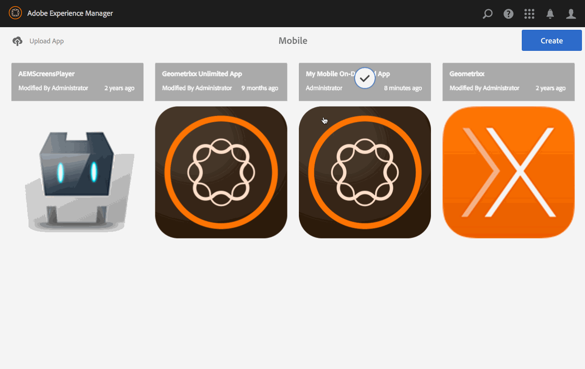

# Förhandsgranska med Preflight {#previewing-with-preflight}

Den här sidan förklarar Förhandsvisa med Preflight-appen.

>[!NOTE]
>
>Adobe rekommenderar att du använder SPA Editor för projekt som kräver ramverksbaserad klientåtergivning för en sida (t.ex. Reagera). [Läs mer](/help/sites-developing/spa-overview.md).

Följande åtgärder utförs i programmet som helhet.

Med preflight-appen Mobile On Demand kan du visa alla projekt som du har tillgång till. När du har valt ett projekt kan du sedan förhandsgranska programinnehållet, inklusive bläddra bland sidor och artiklar för att få en uppfattning om hur programmet ser ut och fungerar på olika enheter.

>[!NOTE]
>
>Preflight-appen liknar till sin natur PhoneGap Enterprise-visningsprogrammet.

## Förhandsgranska med Preflight {#previewing-with-preflight-1}

1. Välj mobilappen i katalogen i Mobile On-Demand.
1. Klicka på ellipsen (..) på menyn **Hantera artiklar** (eller Banners/Collections).
1. Välj **Preflight** i åtgärdsfältet.
1. Klicka **Aktivera preflight** i dialogrutan.
1. Du kan nu förhandsgranska ditt program i preflight-appen Mobile On-Demand.

>[!NOTE]
>
>AEM Preflight-appen används för att förhandsgranska innehåll och bläddra bland sidor. Om du vill veta mer om Preflight-appen klickar du [här](https://helpx.adobe.com/digital-publishing-solution/help/aem-mobile-end-of-life-faq.html).

### Komma framåt {#getting-ahead}

Om du fortfarande behöver mer information om hur du skapar innehåll kan du läsa följande resurser för att skapa och hantera innehåll i ett AEM Mobile-program:

* [AEM Mobile Application Dashboard](/help/mobile/mobile-apps-ondemand-application-dashboard.md)
* [Hantera innehåll](/help/mobile/mobile-apps-ondemand-manage-content-ondemand.md)

## Ytterligare resurser {#additional-resources}

Mer information om de två andra rollerna och ansvarsområdena för att skapa en AEM Mobile On-demand Services-app finns i följande resurser:

* [Utveckla AEM för AEM Mobile On-demand Services](/help/mobile/aem-mobile-on-demand.md)
* [AEM innehåll för AEM Mobile On-demand Services App](/help/mobile/mobile-apps-ondemand.md)
