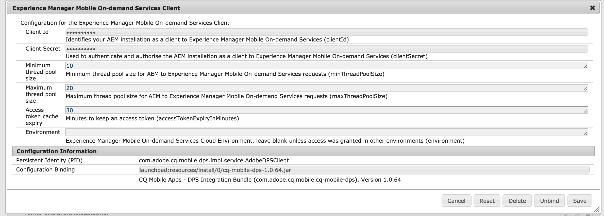

# Konfigurera AEM Mobile{#aem-mobile-setup}

>[!NOTE]
>
>Adobe rekommenderar att du använder SPA Editor för projekt som kräver ramverksbaserad klientåtergivning för en sida (t.ex. Reagera). [Läs mer](/help/sites-developing/spa-overview.md).

>[!CAUTION]
>
>Befintliga AEM-mobilappskunder som migrerar från AEM 6.2 eller 6.3 till AEM 6.5 kan fortsätta att använda AEM-mobilappar genom att hämta ett [paket från PackageShare](https://www.adobeaemcloud.com/content/marketplace/marketplaceProxy.html?packagePath=/content/companies/public/adobe/packages/cq640/compatpack/aem-mobile-package). Nya installationer av AEM 6.5 har dock inte stöd för AEM-mobilappsfunktioner.

För att kunna använda AEM för att producera innehåll för AEM-mobilappar måste du integrera AEM-instansen med det molnbaserade AEM Mobile On-Demand Services-kontot och -projekten.

Följ de här stegen för att konfigurera AEM Mobile och på så sätt låta användaren skapa och hantera innehållet i AEM.

## AEM Mobile Provisioning {#aem-mobile-provisioning}

För att komma igång med AEM Mobile-installationen måste du:

* **Begär en API-nyckel**: Om du vill få åtkomst till API:t för On-Demand Services måste du begära en API-nyckel. Om du vill begära API-nyckeln fyller du i [PDF-formuläret](https://helpx.adobe.com/digital-publishing-solution/help/integrating-dps.html). Skicka det ifyllda formuläret till Adobe Developer Support: [wwds@adobe.com](mailto:wwds@adobe.com)

* **Generera enhets-ID och enhetstoken**: När du har fått din API-nyckel kan du generera enhets-ID och enhetstoken. Gå till [https://aex.aemmobile.adobe.com](https://aex.aemmobile.adobe.com/) och gör följande:

   * Ange API-nyckeln
   * Logga in med ett Adobe-id som du har lagt till i ett AEM Mobile-projekt med följande behörigheter (se stegen nedan för att skapa projektet)

      * Administration > Hantera projekt och användare
      * Innehåll > Lägg till och redigera innehåll, ta bort innehåll, visa innehåll, publicera innehåll

Om alla villkor uppfylls genereras ett enhets-ID och en enhetstoken.

>[!NOTE]
>
>Det Adobe-ID som krävs ska beviljas åtkomst till ett AEM Mobile-projekt. Se [Kontoadministration för AEM Mobile](https://helpx.adobe.com/digital-publishing-solution/help/account-admin-dps.html) i onlinehjälpen.

## Skapa projekt för AEM Mobile {#creating-projects-for-aem-mobile}

När du skapar ett projekt anger du inställningar för de plattformar du har som mål: iOS, Android, Windows och Desktop Web Viewer. Många av de projektinställningar du anger påverkar programmets beteende.

Om du vill skapa ett projekt måste du logga in på On-Demand Services-portalen med ett Adobe ID som har rollen Master Admin. Om du vill redigera ett projekt måste du ha antingen en huvudadministratörsroll eller en användarroll med behörigheten **Hantera projekt och användare** .

>[!NOTE]
>
>Om du vill veta mer om hur du skapar projekt i AEM Mobile klickar du [här](https://helpx.adobe.com/digital-publishing-solution/help/creating-projects.html).

## Konfigurera en AEM Mobile Connector {#configuring-an-aem-mobile-connector}

AEM-konfigurationen omfattar följande steg för anslutningskonfiguration. När konfigurationen av AEM Mobile-anslutningen är klar kan användaren konfigurera användargrupper och behörigheter.

AEM Mobile On-Demand-kontakten används för att binda AEM Mobile-hanterat innehåll till On-Demand-tjänsterna i Adobe Experience Manager Mobile. Detta gör att innehållsförfattare kan skapa och hantera material för mobilapplikationer med AEM:s verktyg samtidigt som de använder AEM Mobiles On-Demand-tjänster för enkel distribution av mobilmaterial.

>[!NOTE]
>
>Detta är ett steg för att konfigurera AEM-instansen.

### Konfigurera AEM Mobile On Demand Services Client {#configuring-aem-mobile-on-demand-services-client}

Du måste slutföra konfigurationsstegen för att AEM Mobile-integreringarna ska fungera korrekt.

1. Gå till konfiguration av OSGI-tjänster

   1. AEM > Verktyg > Åtgärder > Webbkonsol
   1. Bläddra eller sök efter ***Experience Manager Mobile On demand Services Client (var Adobe Digital Publishing Solution Client)***

1. Redigera klient för ***Experience Manager Mobile On demand-tjänster***

   1. **(Obligatoriskt)** Ange obligatoriska fält:

      1. Klient-ID.
      1. Klienthemlighet.
   1. **(Valfritt)** Redigera befintliga värden.

1. Spara ändringarna.
1. Här är ett exempel på konfiguration:

### Konfigurera AEM Mobile On Demand Services CloudService {#configuring-aem-mobile-on-demand-services-cloudservice}

1. Gå till molntjänster

   1. AEM > Verktyg > Distribution > [CloudServices](http://localhost:4502/libs/cq/core/content/tools/cloudservices.html). Bläddra eller sök efter ***Adobe Experience Manager Mobile On-demand-tjänster***

1. Välj ***Konfigurera nu*** eller ***Visa konfigurationer*** och välj ikonen Lägg till ny konfiguration

1. Skapa en ny konfiguration

   1. Ange en titel och ett namn
   1. Ange enhets-ID
   1. Ange enhetstoken
   1. Välj ***Testa enhetskonfiguration*** för att validera angivna värden
   1. Välj OK

## Lägga till AEM Mobile-användarroller och tilldela behörigheter {#adding-aem-mobile-user-roles-and-assigning-permissions}

När du har skapat ett projekt bör du skapa roller och ge användarna åtkomst. Endast malladministratörer kan skapa och redigera roller. När du skapar en roll aktiverar du funktioner (eller behörigheter) för de användare som tilldelas dessa behörigheter. Du kan t.ex. skapa en roll som innehåller behörigheter för appskapande och en annan roll som innehåller behörigheter för att skapa och publicera innehåll.

Under utvecklingen av AEM-mobilappar finns tre olika roller:

* Administratör
* Utvecklare
* Författare

Mer information om hur du skapar roller med olika behörigheter, t.ex. för att skapa och publicera innehåll, får du om du klickar på [Skapa användarroller och Bevilja åtkomst](https://helpx.adobe.com/digital-publishing-solution/help/account-admin-dps.html) i hjälpen för AEM Mobile.

>[!NOTE]
>
>Att hantera appinnehåll kräver en gemensam insats från utvecklare, innehållsförfattare och administratörer. Författare hanterar sidor, som i sin tur bygger på mallar och komponenter som genereras av apputvecklare. Slutligen publicerar administratörer det uppdaterade programinnehållet strategiskt. När du konfigurerar AEM-grupper och behörigheter definieras deras roller i appens kontrollpanel eller kontrollcenter.
>
>Mer information om AEM Mobile Dashboard finns [här](/help/mobile/mobile-apps-ondemand-application-dashboard.md).

När du är klar med att skapa roller med olika behörigheter, t.ex. för att bygga appar eller för att skapa och publicera innehåll, ska du läsa [**Konfigurera användar- och användargrupper **](/help/mobile/aem-mobile-configure-users.md)för att konfigurera användare och grupper så att de kan hantera redigering och hantering av dina mobilappar.

### Additional Resources {#additional-resources}

Mer information om de två andra rollerna och ansvarsområdena för att skapa en AEM Mobile On-Demand Services-app finns i följande resurser:

* [Utveckla AEM-innehåll för AEM Mobile On Demand-tjänster](/help/mobile/aem-mobile-on-demand.md)
* [Skapa AEM-innehåll för AEM Mobile On Demand Services-app](/help/mobile/mobile-apps-ondemand.md)

>[!NOTE]
>
>Mer information om hur du förhandsgranskar appinnehållet, inklusive bläddrar bland sidor och artiklar, finns i [Förhandsgranska med preflight](/help/mobile/aem-mobile-manage-ondemand-services.md).
