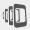
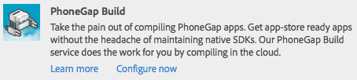

# Bygger mobilprogram{#building-mobile-applications}

{{ue-over-mobile}}

Bygg applikationen för installation på en enhet eller simulator för testning eller publicering i appbutiker. Du kan skapa program lokalt med PhoneGap Command Line Interface eller i molnet med PhoneGap Build.

En komplett, stegvis artikel om hur du skapar ett mobilprogram med kod som är tillgänglig från GitHub finns [här](https://helpx.adobe.com/experience-manager/using/aem62_mobile.html).

## Flytta programmet till Publish-instansen {#moving-the-application-to-the-publish-instance}

Flytta programfiler till publiceringsinstansen så att du kan tillhandahålla innehållsuppdateringar till de installerade instanserna av mobilprogrammet och skapa programmet med det publicerade innehållet. Programmen består av två nodgrenar i databasen:

* `/content/phonegap/apps/<application name>`: Webbsidorna som författare skapar och aktiverar.
* `/content/phonegap/content/<application name>`: Programkonfigurationsfiler och konfigurationer för innehållssynkronisering.

>[!NOTE]
>
>Om du inte flyttar programfilerna till publiceringsinstansen kan innehållsförfattarna inte uppdatera cachen för innehållssynkronisering.

Du behöver bara flytta filerna i grenen `/content/phonegap/content/<application name>` till publiceringsinstansen. Filerna i grenen `/content/phonegap/apps/<application name>` flyttas när författaren aktiverar sidorna.

I AEM finns två metoder för att flytta massinnehåll till publiceringsinstansen:

* [Använd kommandot Aktivera träd](/help/sites-authoring/publishing-pages.md) på replikeringskonsolen.
* [Skapa ett paket](/help/sites-administering/package-manager.md) som innehåller innehållet och replikera paketet.

Ett mobilprogram med namnet phonegapapp skapas till exempel. Följande nod måste flyttas till publiceringsinstansen: /content/phonegap/content/phonegapapp.

**Tips!** Om du vill flytta ett paket från författarinstansen till publiceringsinstansen använder du kommandot Replikera i paketet.


## Bygga med kommandoradsgränssnittet PhoneGap {#building-using-the-phonegap-command-line-interface}

Kompilera PhoneGap-programmet på datorn med PhoneGap Command-line Interface (CLI). Om du vill inkludera AEM innehåll i ditt program skapar AEM en ZIP-fil som innehåller innehållet i ditt mobilprogram, konfigurationer för innehållssynkronisering och andra nödvändiga resurser. Hämta ZIP-filen och inkludera den i bygget.

### Förbereder din byggmiljö {#preparing-your-build-environment}

Om du vill bygga med PhoneGap CLI måste du installera Node.js och PhoneGap-klientverktyget. Du måste ha en internetanslutning för att kunna utföra följande procedur.

1. Hämta och installera [Node.js](https://nodejs.org/en).
1. Öppna en terminal eller kommandotolk och ange följande nodkommando för att installera PhoneGap-verktyget:

   ```shell
   npm install -g phonegap
   ```

   På ett UNIX®- eller Linux®-system kan du behöva prefix till kommandot med `sudo`.

   Terminalen visar resultatet av en serie HTTP GET-kommandon. När installationen är klar visar terminalen var biblioteken är installerade, som i följande exempel:

   ```xml
   /usr/local/bin/phonegap -> /usr/local/lib/node_modules/phonegap/bin/phonegap.js
   phonegap@3.3.0-0.19.6 /usr/local/lib/node_modules/phonegap
   ├── pluralize@0.0.4
   ├── colors@0.6.0-1
   ├── semver@1.1.0
   ├── qrcode-terminal@0.9.4
   ├── shelljs@0.1.4
   ├── optimist@0.6.0 (...)
   ├── prompt@0.2.11 (...)
   ├── phonegap-build@0.8.4 (...)
   ├── connect-phonegap@0.8.1 (...)
   └── cordova@3.3.0-0.1.1 (...)
   ```

1. (Valfritt) Skaffa SDK för mobilplattformen som ni riktar er mot:

   * Installera den senaste versionen av [Xcode](https://developer.apple.com/xcode/) om du vill skapa appar för iOS-plattformen.
   * Installera [Android™ SDK](https://developer.android.com/) om du vill skapa Android™-appar.

### Laddar ned innehålls-ZIP-filen {#downloading-the-content-zip-file}

Flytta innehållet i mobilprogrammet till filsystemet.

1. Välj ditt program på sidan Mobilprogram.
1. (Valfritt) Klicka på ikonen Rensa cache i verktygsfältet för att skapa programmet för fullständiga installationer.

   

   >[!NOTE]
   >
   >Cachen innehåller innehållsuppdateringar för installerade program. Om du rensar cachen försvinner alla cachelagrade uppdateringar.

1. Klicka på ikonen Hämta CLI Assets i verktygsfältet.

   

1. När du har sparat ZIP-filen klickar du på Stäng i dialogrutan Slutfört.
1. Extrahera innehållet i ZIP-filen.

### Använda PhoneGap CLI för att bygga {#using-the-phonegap-cli-to-build}

Använd PhoneGap CLI för att kompilera och installera programmet. Mer information om hur du använder PhoneGap CLI finns i dokumentationen för PhoneGap-kommandoradsgränssnittet (`https://docs.phonegap.com/en/3.0.0/guide_cli_index.md.html`).

1. Öppna en terminal eller kommandotolk och ändra den aktuella katalogen till den hämtade ZIP-programfilen. Följande ändrar till exempel katalogen till filen ng-app-cli.1392137825303.zip:

   ```shell
   cd ~/Downloads/ng-app-cli.1392137825303
   ```

1. Ange kommandot phonegap för plattformen som du riktar dig mot. Följande kommando skapar till exempel programmet för Android™:

   ```shell
   phonegap build android
   ```

## Bygger med PhoneGap Build {#building-using-phonegap-build}

Använd PhoneGap-molntjänsten för att bygga din app. För att kunna utföra den här proceduren måste du först skapa en PhoneGap Build-konfiguration.

### Ansluter till PhoneGap Build {#connecting-to-phonegap-build}

Skapa en PhoneGap Build-konfiguration så att du kan använda PhoneGap Build-tjänsterna inifrån AEM. Ange användarnamn och lösenord för det PhoneGap Build-konto som du ska använda för att skapa dina mobilprogram.

1. Öppna sidan Verktyg. ([http://localhost:4502/tools.html](http://localhost:4502/tools.html)).
1. Klicka på Cloud Service i området CQ-åtgärder.
1. Klicka på länken Konfigurera nu för PhoneGap Build.

   

1. I dialogrutan Skapa konfiguration anger du ett värde för egenskapen Titel. Som standard hämtas värdet för egenskapen Namn från titeln, men du kan ange ett namn. Klicka på Skapa.
1. I dialogrutan PhoneGap Build Configuration skriver du ditt användarnamn och lösenord för PhoneGap Build och klickar sedan på OK.

### Använda PhoneGap Build {#using-phonegap-build}

Skicka programresurserna till PhoneGap Build för kompilering för olika mobilplattformar.

1. Öppna ditt mobilprogram på sidan Mobilprogram. ([http://localhost:4502/mobile.html/content/phonegap](http://localhost:4502/mobile.html/content/phonegap))
1. (Valfritt) Om du vill skapa programmet för fullständiga installationer markerar du programmet och klickar på ikonen Rensa cache.

   

   >[!NOTE]
   >
   >Cachen innehåller innehållsuppdateringar för installerade program. Om du rensar cachen försvinner alla cachelagrade uppdateringar.

1. Markera välkomstsidan och klicka sedan på ikonen Skapa fjärrmapp.

   

   **Obs!** Beta-versionen av AEM Beta skapar inte ett inkorgsmeddelande när bygget har slutförts.

1. Öppna Adobe PhoneGap Build-sidan på `https://build.phonegap.com/apps` genom att klicka på PhoneGap Build i dialogrutan Slutfört. Om du väntar på att din app ska visas kan du kontrollera PhoneGapet Build-status på `https://status.build.phonegap.com/`.

   Mer information om hur du installerar bygget finns i [PhoneGap Build Documentation](https://github.com/phonegap/phonegap-docs/tree/master/docs/4-phonegap-build).

   >[!NOTE]
   >
   >Kostnadsfria PhoneGap Build-konton kan användas med ett privat program. PhoneGap-byggen misslyckas om du skapar ytterligare ett privat program.

### Nästa steg {#the-next-steps}

Nästa steg efter byggprocessen är att lära sig om [strukturen för ett program](/help/mobile/phonegap-structure-an-app.md).
