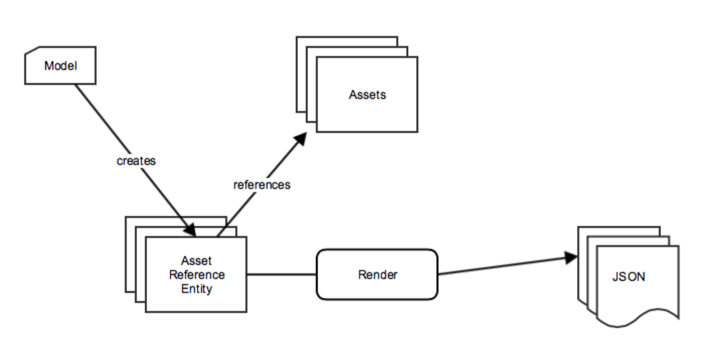

# Innehållsleverans{#content-delivery}

>[!NOTE]
>
>Adobe rekommenderar att du använder SPA Editor för projekt som kräver ramverksbaserad klientåtergivning för en sida (t.ex. Reagera). [Läs mer](/help/sites-developing/spa-overview.md).

Mobilappar bör kunna använda allt innehåll i AEM efter behov för att leverera den riktade appupplevelsen.

Detta inkluderar användning av resurser, webbplatsinnehåll, CAAS-innehåll (over-the-air) och anpassat innehåll som kan ha en egen struktur.

>[!NOTE]
>
>**Innehåll** som ligger över AIR kan komma från något av ovanstående via ContentSync-hanterare. Den kan användas för att batchpaketera och leverera via zip-enheter samt för att underhålla uppdateringar för dessa paket.

Det finns tre huvudtyper av material som Content Services levererar:

1. **Resurser**
1. **Paketerat HTML-innehåll (HTML/CSS/JS)**
1. **Kanaloberoende innehåll**

## Resurser {#assets}

Resurssamlingar är AEM-konstruktioner som innehåller referenser till andra samlingar.

En resurssamling kan visas via innehållstjänster. När en resurssamling anropas i en begäran returneras ett objekt som är en lista över resurserna, inklusive deras URL:er. Resurser nås via en URL. URL:en anges i ett objekt. Exempel:

* En sidenhet returnerar JSON (sidobjekt) som innehåller en bildreferens. Bildreferensen är en URL som används för att hämta resursens binärfil för bilden.
* En begäran om en lista med resurser i en mapp returnerar JSON med information om alla enheter i den mappen. Listan är ett objekt. JSON har URL-referenser som används för att hämta resursens binärfil för varje resurs i den mappen.

### Optimering av tillgångar {#asset-optimization}

Ett viktigt värde för Content Services är möjligheten att returnera resurser som är optimerade för enheten. Detta minskar behovet av lagring på lokala enheter och förbättrar appprestanda.

Tillgångsoptimering är en funktion på serversidan som baseras på information som anges i API-begäran. Där det är möjligt bör resursåtergivningarna cachelagras så att liknande förfrågningar inte kräver en ny generering av resursåtergivningen.

### Arbetsflöde för resurser {#assets-workflow}

Resursarbetsflödet är följande:

1. Resursreferens finns i körklart AEM
1. Skapa resursreferensenhet utifrån dess modell
1. Redigera entitet

   1. Välj tillgång eller resursinsamling
   1. Anpassa JSON-återgivning

I följande diagram visas **resursreferensarbetsflödet**:

### Hantera resurser {#managing-assets}

Content Services ger åtkomst till AEM-hanterade resurser som inte kan refereras via annat AEM-innehåll.

#### Befintliga hanterade tillgångar {#existing-managed-assets}

En befintlig AEM Sites and Assets-användare använder AEM Assets för att hantera allt digitalt material för alla kanaler. De utvecklar en intern mobilapp och behöver använda flera resurser som hanteras av AEM Assets. Till exempel logotyper, bakgrundsbilder, knappikoner osv.

För närvarande är dessa spridda runt resurskatalogen. De filer som programmet behöver referera till finns i:

* /content/dam/geometrixx-outdoors/brand/logo_light.png
* /content/dam/geometrixx-outdoors/brand/logo_dark.png
* /content/dam/geometrixx-outdoors/styles/backgrounds/gray_blue.jpg
* /content/dam/geometrixx-outdoors/brand/icons/app/cart.png
* /content/dam/geometrixx-outdoors/brand/icons/app/home.png

#### Åtkomst till CS-resursenheter {#accessing-cs-asset-entities}

Låt oss bortse från stegen i hur sidan görs tillgänglig via API:t för tillfället (den täcks av beskrivningen av AEM-gränssnittet) och anta att den har gjorts. Resursenheter har skapats och lagts till i utrymmet&quot;appImages&quot;. Ytterligare mappar skapades under utrymmet för organisationssyften. Resursenheterna lagras i AEM JCR som:

* /content/entities/appImages/logos/logo_light
* /content/entities/appImages/logos/logo_dark
* /content/entities/appImages/bkgnd/gray_blue
* /content/entities/appImages/icons/cart
* /content/entities/appImages/icons/home

#### Hämta en lista med tillgängliga resursenheter {#getting-a-list-of-available-asset-entities}

En apputvecklare kan få en lista över vilka resurser som är tillgängliga genom att hämta resursenheter. Slutpunkten för Content Services space kan tillhandahålla den informationen via webbtjänstens API SDK.

Resultatet blir ett objekt i JSON-format som ger en lista över resurserna i mappen&quot;icons&quot;.

#### Hämta en bild {#getting-an-image}

JSON tillhandahåller en URL för varje bild som genereras av Content Services till bilden.

Klientbiblioteket används en gång till för att hämta binärfilen för kundvagnsbilden.

## Paketerat HTML-innehåll {#packaged-html-content}

HTML-innehåll behövs för kunder som behöver ha innehållets layout. Detta är användbart för inbyggda program som använder en webbbehållare, till exempel en Cordova-webbvy, för att visa innehållet.

AEM Content Services kommer att kunna tillhandahålla HTML-innehåll till mobilappen via API:t. Kunder som vill visa AEM-innehåll som HTML skapar en HTML-sidenhet som pekar på AEM-innehållskällan.

Följande alternativ beaktas:

* **** Zip-fil: För att få den bästa möjligheten att visas korrekt på enheten har du tillgång till allt material som refereras till på sidan - css, JavaScript, resurser osv. - kommer att inkluderas i en enda komprimerad fil med svaret. Referenserna på HTML-sidan justeras till att använda en relativ sökväg till dessa filer.
* **** Direktuppspelning: Hämta ett manifest med de filer som krävs från AEM. Använd sedan det manifestet för att begära alla filer (HTML, CSS, JS, osv.) med efterföljande förfrågningar.

## Kanaloberoende innehåll {#channel-independent-content}

Kanaloberoende innehåll är ett sätt att exponera AEM-innehållskonstruktioner - t.ex. sidor - utan att behöva bekymra sig om layout, komponenter eller annan kanalspecifik information.

Dessa innehållsenheter genereras med en innehållsmodell för att översätta AEM-strukturerna till ett JSON-format. Resultatet av JSON-data innehåller information om innehållets data, som är åtskild från AEM-databasen. Detta innefattar att returnera metadata och AEM-referenslänkar till resurser samt relationer mellan innehållsstrukturer - inklusive entitetshierarkin.

### Hantera kanaloberoende innehåll {#managing-channel-independent-content}

Innehåll kan komma åt appen på flera sätt.

1. HÄMTA ZIPS via AEM Over-the-Air

   * Hanterare för innehållssynkronisering kan uppdatera zip-paketet direkt eller genom att anropa befintliga innehållsrenderare

      * Plattformshanterare
      * AEMM-hanterare
      * Anpassade hanterare

1. Hämta material direkt via innehållsåtergivning

   * Körklara standardåtergivningsprogram
   * Innehållsrenderare för AEM Mobile/Content Services
   * Anpassade återgivningar

