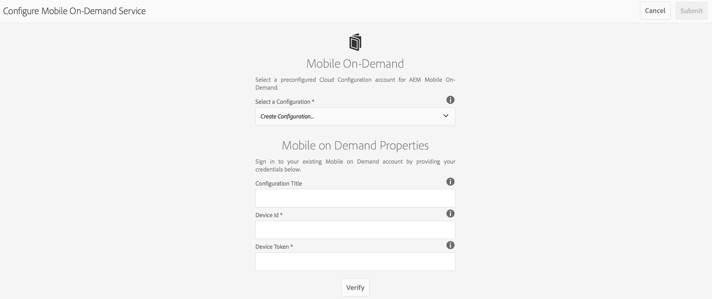

# Molnkonfiguration{#cloud-configuration}

>[!NOTE]
>
>Adobe rekommenderar att du använder SPA Editor för projekt som kräver ramverksbaserad klientåtergivning för en sida (t.ex. Reagera). [Läs mer](/help/sites-developing/spa-overview.md).

Genom att koppla en On-Demand-app till en molnkonfiguration kan Adobe Experience Manager (AEM) kommunicera direkt med ett Mobile On-Demand-värdbaserat projekt genom att skapa en dubbelriktad länk. Genom att länka din app till ett Mobile On-Demand-projekt kan du skapa innehåll, till exempel artiklar, banners och samlingar i AEM, men även skicka det till Mobile On-Demand.

Därifrån blir det möjligt att publicera, förhandsgranska och hantera innehåll. Du kan också importera befintligt mobilt On-Demand-innehåll till AEM och redigera innehåll.

## Konfigurera molnkonfiguration {#setting-up-cloud-configuration}

>[!CAUTION]
>
>Innan du börjar konfigurera molnkonfigurationen för din On-Demand-app måste du känna till AEM Mobile Provisioning och Configuring AEM Mobile On-Demand Services Client.
>
>Mer information finns i [Konfigurera AEM Mobile On-Demand Services](/help/mobile/aem-mobile-setup.md) i avsnittet Administrera.

Om du vill konfigurera molntjänster för mobiler på begäran klickar du på den övre kugghjulet i det högra hörnet av panelen **Hantera anslutning** på appinstrumentpanelen.

Du bör känna till appkontrollpanelen och tillgängliga paneler. Mer information finns i [AEM Mobile Application Dashboard](/help/mobile/mobile-apps-ondemand-application-dashboard.md) .

### Konfigurera länk till molnkonfiguration {#setting-up-link-to-cloud-configuration}

>[!CAUTION]
>
>Kontrollera att du har en befintlig On-Demand-klient och molnkonfiguration.
>
>Mer information finns i [Konfigurera AEM Mobile On-Demand Services](/help/mobile/aem-mobile-setup.md) i avsnittet Administrera.

I följande steg beskrivs hur du konfigurerar länken till molnkonfigurationen:

1. Från **Mobile** väljer du **Appar** och sedan appen Mobile On-Demand i katalogen.
1. Klicka på kugghjulsikonen på panelen **Hantera anslutning** .

   

1. Ange den befintliga konfigurationen eller skapa en ny genom att ange **konfigurationstiteln**, **enhets-ID** och **enhetstoken**.

   

1. När ditt **enhets-ID** och **enhetstoken** har verifierats väljer du ditt On-Demand-projekt i listan.

   Klicka på **Skicka**.

   

   I rutan **Hantera anslutning** visas din molnkonfiguration.

   

   >[!CAUTION]
   >
   >Om du försöker ändra vilket projekt som den här appen är kopplad till och byter projekt på kontrollpanelen får du en varning om innehållsintegritetsproblem enligt bilden nedan:

   

### Nästa steg {#the-next-steps}

När du har konfigurerat molnkonfigurationen för din app kan du läsa följande resurser för att hantera innehåll:

* [Hantera artiklar](/help/mobile/mobile-on-demand-managing-articles.md)
* [Hantera banners](/help/mobile/mobile-on-demand-managing-banners.md)
* [Hantera samlingar](/help/mobile/mobile-on-demand-managing-collections.md)
* [Överför delade resurser](/help/mobile/mobile-on-demand-shared-resources.md)
* [Publicera/avpublicera innehållet](/help/mobile/mobile-on-demand-publishing-unpublishing.md)
* [Förhandsgranska med Preflight](/help/mobile/aem-mobile-manage-ondemand-services.md)
