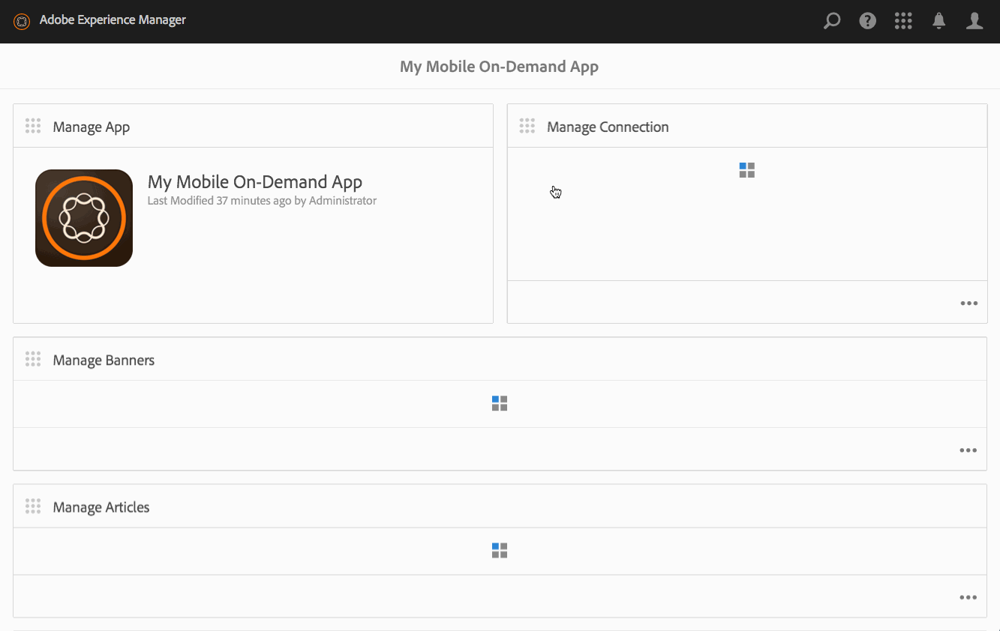

# Hantera artiklar{#managing-articles}

{{ue-over-mobile}}

Innehållshanteringsåtgärder är byggstenar som används för att skapa och hantera artiklar i ett program. Följande åtgärder utförs på artiklar i programmet.

## Artiklar - översikt {#articles-overview}

Artiklar representerar den text som är baserad tillsammans med grafik för att förmedla information.

>[!NOTE]
>
>Läs följande resurser i onlinehjälpen om du vill veta mer om följande ämnen i AEM Mobile-program:
>
>* [Designöverväganden](https://helpx.adobe.com/se/digital-publishing-solution/help/design-app.html)
>
>* [Hantera artiklar](https://helpx.adobe.com/se/digital-publishing-solution/help/creating-articles.html)
>

## Skapa en artikel {#creating-an-article}

Det allmänna arbetsflödet för att skapa en artikel är följande:

1. Välj **Mobil** från sidospåret.
1. Välj mobilappen i katalogen i Mobile On-Demand.
1. Klicka på nedpilen i det övre högra hörnet av rutan **Hantera artiklar**.
1. Välj en artikelmall och klicka på **Nästa**.
1. Gå igenom varje steg i guiden för att fortsätta skapa din nya artikel.
1. Klicka på **Skapa** när du är klar.
1. Den nya artikeln visas i rutan **Hantera artiklar**.

## Importera en ny artikel {#importing-a-new-article}

Befintligt mobilt on demand-innehåll kan hämtas (importeras) från Mobile On-Demand till AEM. På så sätt kan du redigera och visa lokalt innehåll.

>[!NOTE]
>
>Importen inkluderar inte bilder.

Arbetsflödet för att importera en ny artikel

1. Välj mobilapp i katalogen i Mobile On-Demand-appen.
1. Klicka på nedpilen i det övre högra hörnet av rutan **Hantera artiklar** och välj Importera artiklar.
1. Klicka på **Importera artiklar** i dialogrutan och sedan på Stäng.
1. Dina artiklar för mobil på begäran visas nu i rutan **Hantera artiklar**.

>[!CAUTION]
>
>Koppla en mobil On Demand-anslutning först.

## Redigera en artikel {#editing-an-article}

Använd den inbyggda AEM dra och släpp-redigeraren för att lägga till eller ändra en artikel. Komponenter som text och bilder kan läggas till/tas bort. Bilder från DAM Assets kan infogas.

>[!CAUTION]
>
>Endast artiklar som skapats i AEM kan öppnas i redigeraren.

Arbetsflödet för att redigera en artikel:

1. Välj mobilappen i katalogen i Mobile On-Demand.
1. Välj en AEM källartikel i rutan **Hantera artiklar**.
1. Klicka på den markerade artikeln i listvyn för att öppna den i innehållsredigeraren.
1. Använd innehållsredigeraren för att dra artikelinnehåll (manuskript, bilder, text och så vidare).

### Visa och redigera metadata i en artikel {#viewing-and-editing-the-metadata-within-an-article}

Innehåll som artiklar, banners och så vidare har flera egenskaper som titlar, beskrivningar och bilder. Den här åtgärden används för att visa och ändra sådana egenskaper. Dessa ändringar kan även överföras till Mobile On-Demand när de sparas.

Det allmänna arbetsflödet för att visa/redigera en artikel:

1. Välj mobilappen i katalogen i Mobile On-Demand.
1. Välj en artikel i rutan **Hantera artiklar**.

1. Välj **Visa egenskaper** i åtgärdsfältet.
1. Visa alla tillgängliga metadata för artikeln.
1. Redigera metadata vid behov och klicka på **Spara** när du är klar.
1. Du kan också ladda upp ändringarna direkt till Mobile On-Demand.

## Överföra en artikel {#uploading-an-article}

Överföringsåtgärden kopierar det markerade innehållet och lägger till det i ett Mobile On-Demand-projekt. Redan befintligt Mobile On-Demand-innehåll ersätts av den nya versionen.

Det allmänna arbetsflödet för att överföra en artikel:

1. Från **Mobile** väljer du appen Mobile On-Demand i katalogen.
1. I rutan **Hantera artiklar** väljer du en artikel för överföring till Mobile On-Demand.
1. Lägg till fler artiklar om det behövs från listvyn.
1. Välj **Överför** i åtgärdsfältet och klicka sedan på Överför i dialogrutan.
1. Dina artiklar har nu överförts till Mobile On-Demand.

## Ta bort en artikel {#deleting-an-article}

Den här åtgärden tar bort det markerade innehållet från Mobile On-Demand och eventuellt från den lokala AEM.

Det allmänna arbetsflödet för att ta bort en artikel:

1. Välj mobilappen i katalogen i Mobile On-Demand.
1. Markera artikeln som ska tas bort i rutan **Hantera artiklar**.
1. Se till att det är markerat i listan och markera andra att ta bort efter behov.
1. Klicka på **Ta bort** i åtgärdsfältet.
1. Kontrollera om du vill ta bort från AEM och Mobile On-Demand.
1. Klicka på **Ta bort**.
1. Artikeln har nu tagits bort från listan.

### Nästa steg {#the-next-steps}

När du har lärt dig mer om hur du hanterar artiklar, se

* [Hantera banners](/help/mobile/mobile-on-demand-managing-banners.md)
* [Hantera samlingar](/help/mobile/mobile-on-demand-managing-collections.md)
* [Överför delade resurser](/help/mobile/mobile-on-demand-shared-resources.md)
* [Publicera/avpublicera innehållet](/help/mobile/mobile-on-demand-publishing-unpublishing.md)
* [Förhandsgranska med Preflight](/help/mobile/aem-mobile-manage-ondemand-services.md)
