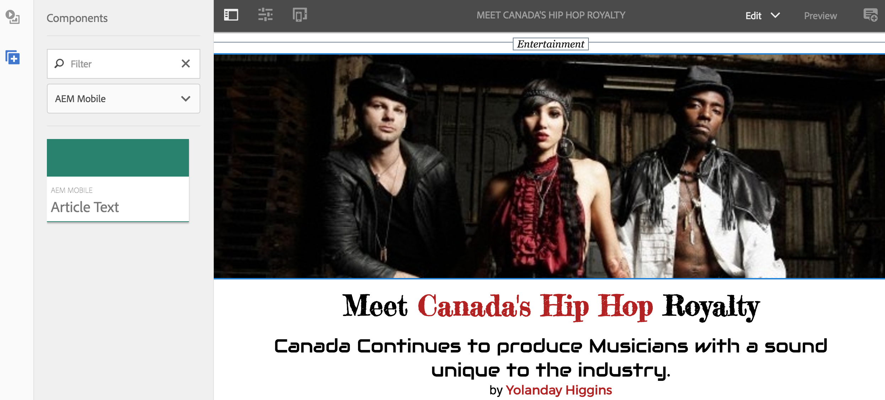

# Skapa och lägga till mallar och komponenter {#creating-and-adding-templates-and-components}

>[!NOTE]
>
>Adobe rekommenderar att du använder SPA Editor för projekt som kräver ramverksbaserad klientåtergivning för en sida (till exempel React). [Läs mer](/help/sites-developing/spa-overview.md).

AEM Mobile On-Demand tillhandahåller en fullständigt konfigurerad programmall, en artikelmall och artikelkomponenter.

We.Unlimited App är en exempelmall som representerar gränssnittet i en fullt konfigurerbar och hanterbar AEM Mobile On-Demand-applikation.

Om du väljer den här exempelmallen när du skapar en app får du en funktionsrik instrumentpanel i AEM Mobile.

>[!NOTE]
>
>Information om hur du hanterar program- och mobilappsinnehåll från AEM Mobile Apps Control Center finns i [AEM Mobile Application Dashboard](/help/mobile/mobile-apps-ondemand-application-dashboard.md).

## Skapa appmallar {#creating-app-templates}

En appmall används för att skapa ett program och fungerar som en samling sidmallar och komponenter som representerar en baslinje eller grund för ett program. Mallen stämplar ut vissa grundläggande egenskaper så att de leder programmet på rätt sätt. I allmänhet skulle en kund inte skapa för många appar.

Appmallar är ett enkelt sätt att använda befintliga designer som skapats av utvecklare och som används för att skapa nya appar i AEM.

När du skapar ett program baserat på en mall för ett annat program får du ett program som har en startpunkt som representerar det program som det skapades från.

Steg för att skapa ett program baserat på en appmall:

1. Gå till AEM Mobile programkatalog: *&lt;server-url>/aem/apps.html/content/mobile/apps*
1. Välj **Skapa** —> **App** som visas nedan

När du har skapat ett program med den här mallen kan du lägga till artiklar, banners och samlingar i programmet. Mer information om hur du återbesöker, skapar artiklar, banners och samlingar finns i [Innehållshanteringsåtgärder](/help/mobile/mobile-apps-ondemand-manage-content-ondemand.md).

>[!NOTE]
>
>Du kan också välja en exempelprogrammall, till exempel **We.Unlimited** app, som är tillgänglig för dig av en AEM. Om du använder den här exempelmallen för din app får du några exempelartiklar och samlingar att arbeta med. Du kan använda exempelmallarna och -komponenterna, anpassa befintliga mallar eller skapa nya för programmet.

>[!CAUTION]
>
>Inställning ***redirectTarget*** property
>
>När du använder en av appmallarna definierar utvecklaren innehållet i programmet. Utvecklaren måste dock vara medveten om var programmet skapas i jcr och värdet för ***redirectTarget*** -egenskap.
>
>The ***redirectTarget*** beräknas som en del av åtgärden skapa app och försöker matcha en sökväg, om det finns en redirectTarget-egenskap som är tillgänglig som en del av programmallen, och värdet för redirectTarget definieras som relative. När skapandeappprocessen hittar ett relativt värde för redirectTarget i appmallen läggs värdet till på den lösta platsen där appen skapades.
>
>Om en programmall till exempel definierar en ***redirectTarget*** med värdet &quot;*language-masters/en*&quot; och appen skapades i &quot;*/content/mobileapps/fooApp*&quot; kommer det slutliga värdet för redirectTarget efter att appen har skapats att vara &quot;*/content/mobileapps/fooApp/language-masters/en*&quot;.
>

## Skapa innehållsmallar {#creating-content-templates}

Varje entitetstyp har två färdiga mallar. Dessa är:

* **Standardmallar:** används för att skapa innehåll med tillämpliga standardegenskaper/standardstruktur
* **Importerade mallar:** används för att importera innehåll från AEM Mobile med tillämpliga standardegenskaper/standardstruktur

### Artikelmallar {#article-templates}

Obegränsad artikel är en exempelmall som representerar en typisk AEM Mobile On-Demand-artikellayout.

1. I **Hantera artiklar**, markera **+**  för att skapa en artikel. Du kan välja ett **Obegränsad artikel** eller en **RTF-artikel**. Bilden nedan visar det alternativ som gör att du kan välja mellan någon av dessa två artikelmallar.

1. Klicka **Nästa** om du vill definiera artikelmetadata som artikelnamn/titel, beskrivning, författare, abstrakt, avdelning, miniatyrbild, artikelåtkomst och så vidare.
1. Klicka **Nästa** för att fylla i Advertisement Properties.
1. Klicka **Nästa** för att ange artikelbild eller bild för sociala medier
1. Klicka **Nästa** om du vill välja en samlingslänk den här nya artikeln till.
1. Klicka **Nästa** om du vill ange information för delning via sociala medier.
1. Klicka **Skapa** för att slutföra processen med att skapa en artikel med exemplet. Du kan antingen klicka **Klar** eller **Redigera artikel** om du vill redigera egenskaperna för den här artikeln.

### Lägga till komponenter i artikel {#adding-components-to-article}

När en författare har skapat en artikel kan han eller hon redigera dess innehåll genom att lägga till komponenter som text och bilder. Artiklar är ett tillägg till AEM sidmallar.

Markera en artikel som du vill redigera och klicka på **Redigera** för att lägga till komponenter i artikeln.

 

Välj &#39;**+**&#39; på den vänstra panelen för att lägga till komponenter i artikeln.

### Skapa färdiga mallar {#creating-out-of-the-box-templates}

Det finns inga färdiga artikelmallar, men det finns en standardmall som anpassade mallar ska utöka, se Geometrixx Unlimited-appens [Exempel på artikelmall](http://localhost:4502/crx/de/index.jsp#/apps/geometrixx-unlimited-app/templates/article).

De viktigaste egenskaperna utöver de normala AEM som krävs är bland annat

***dps-resourceType=&quot;dps:Article&quot;***

Den här egenskapen ser till att AEM kan identifieras som en artikelmålsida från AEM Mobile.

Som AEM mallar kan du lägga till alla standardegenskaper eller underordnade noder i mallens ***jcr:innehåll***.

### Mallar för banner och samling {#banner-and-collection-templates}

>[!CAUTION]
>
>Banderoller och samlingar har inget innehåll, så det går inte att skapa dem med anpassade mallar.

## Skapa och lägga till komponenter {#creating-and-adding-components}

Komponenterna använder och tillåter åtkomst till widgetar, och de används för att återge innehållet.

En enkel komponent ingår i koddatabasen, vars källa finns i AEM. Därefter kan den också öppnas lokalt i CRXDE Lite.

>[!NOTE]
>
>Det finns för närvarande inga färdiga komponenter för AEM Mobile.
>

Du kan lägga till komponenter på sidan. Alla komponenter kan användas i en AEM Mobile-app, men de kanske inte återges korrekt när de används.

Anpassade komponenter kanske inte exporteras och överförs korrekt till AEM Mobile On-demand Services utan en anpassad Content Sync-hanterare för export som återges i AEM.

När komponenten redan har inkluderats på en AEM sida, tillsammans med några andra byggblockskomponenter, kan du lägga till ytterligare en komponent på sidan eller redigera en befintlig.

**Så här lägger du till en annan komponent på sidan:**

1. Välj den sidan och kontrollera att du är i redigeringsläge, via listrutan längst upp till höger i redigerarens sidhuvud
1. Växla sidopanelen med ikonen längst till vänster i redigerarens sidhuvud
1. Välj **Komponenter** tab
1. Dra och släpp en av de tillgängliga komponenterna på sidan

**Redigera en befintlig komponent:**

1. Välj den sidan och kontrollera att du är **Redigera** och markera komponenten
1. Tryck på skiftnyckelsikonen för att konfigurera komponenten

>[!NOTE]
>
>Du kan skapa en komponent i AEM och anpassa den med [Utveckla med CRXDE Lite](/help/sites-developing/developing-with-crxde-lite.md). När du har anpassat den befintliga komponenten som du vill kan du lägga till den på sidan med **Redigera** option under **Hantera artiklar** som visas i figuren ovan.

>[!NOTE]
>
>Se [Bästa praxis för utveckling av mallar och komponenter](/help/mobile/best-practices-aem-mobile.md) i AEM Mobile.

### Nästa steg {#the-next-steps}

* [Exportera innehåll med hjälp av innehållsegenskaper](/help/mobile/on-demand-content-properties-exporting.md)
* [Mobil med innehållssynkronisering](/help/mobile/mobile-ondemand-contentsync.md)
