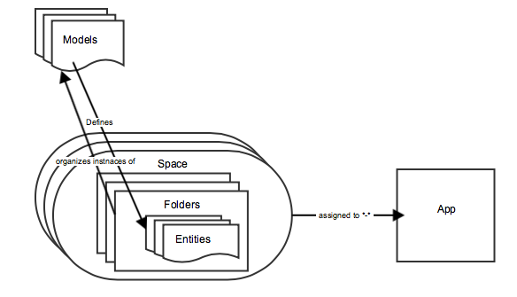

# Modeller - översikt{#models-overview}

{{ue-over-mobile}}

Modellhantering innefattar att skapa och hantera modeller för att associera med slutliga dataobjekt. Varje modell innehåller alla egenskaper och fältdefinitioner som behövs för att det ska bli enklare att skapa och återge objekt.

Modellhantering innebär att **modeller**, **entiteter** och **blanksteg** skapas. I följande diagram visas förhållandet mellan AEM och modellerna.

## Innehållsmodellen {#the-content-model}

En modell beskriver innehållstypen och vilken information som är tillgänglig för det ursprungliga programmet. Det är en beskrivning av vad som utgör en bit innehåll. En innehållsmodell är reglerna för hur du skapar en del av innehållet. Innehållsmodellen innehåller vilka data som är tillgängliga, vilka resurser som kan användas, relationen mellan resurser och data, relationen till andra innehållsmodeller och tillgängliga metadata.

Modeller fungerar också som ett sätt att omvandla befintligt AEM till objekt som enkelt kan användas av inbyggda mobilappar.

Content Services innehåller några färdiga modeller för vanliga objekt som resurser, resurssamlingar, HTML-sidor, appkonfigurationer och kanaloberoende sidor. Dessa är konfigurerbara så att de kan uppfylla specifika kundbehov utan att behöva AEM utvecklingsinsatser.

Användare kan skapa egna modeller. Detta gör att nya innehållstyper som inte redan hanteras av AEM kan skapas. Modellskapandet görs via ett användargränssnitt med befintliga primitiva typer.

I följande diagram visas innehållsmodellen för AEM Mobile-appar och hur entiteter, mappar och blanksteg tilldelas till ett program.

### Modeller {#the-models}

Modeller används för att avgöra hur enheter skapas. De definierar vad som är tillgängligt i en enhet och hur data genereras från AEM. Innan du börjar arbeta med Spaces, Folders och Entities bör du känna till hur du skapar och hanterar modeller.

>[!NOTE]
>
>Det finns en modell utanför en app eftersom mer än en app kan använda den.
>

Mer information om hur du skapar och hanterar modeller på kontrollpanelen och i databasen finns i **[Modeller](/help/mobile/administer-mobile-apps.md)**.

### Enheter i innehållsmodell {#entities-in-content-model}

En entitet är en instans av en innehållsmodell. En enhet exponeras via innehållstjänstens API för klientbiblioteket och ger ett sätt för en intern app att få åtkomst till innehåll på ett kanaloberoende sätt.

Om det finns befintligt AEM genereras en entitet med en modell och AEM innehållskällan. En sidenhet är till exempel ett kanal- och layoutoberoende objekt som genereras från en AEM och sidmodellen.

Ändringar av det refererade innehållet i en entitet resulterar i en ändring av entiteten. Om till exempel en *cq:page* uppdateras, uppdateras även entiteter som är baserade på den sidan.

Mer information om hur du skapar anpassade entiteter från modeller finns i **[Arbeta med entiteter](/help/mobile/spaces-and-entities.md)**.

>[!NOTE]
>
>Om modellen inte motsvarar ett befintligt AEM, t.ex. om kunden har skapat en modell, finns det ett användargränssnitt så att kunden kan skapa en enhet.
>

### Blanksteg i innehållsmodellen {#spaces-in-content-model}

Ett blanksteg används för att ordna enheter så att de blir lätta att komma åt. Ett blanksteg kan innehålla en eller flera enhetstyper och kan innehålla undermappar.

På AEM sida är ett space ett bekvämt sätt att hantera enheter som är relaterade. Den kan också användas för att tilldela behörigheter. Behörighet kan göras till ett utrymme som skyddar de enheter som finns i det utrymmet.

*Till exempel*,

En användare har tre allmänna klassificeringar av enheter. Den ena är enbart avsedd för internt bruk, den andra är godkänd för allmänt bruk och den andra är för vanliga enheter som används av många appar. För att göra det enkelt att hantera skapar användaren tre blanksteg: *internal*, *public* (med både engelskt och franskt innehåll) och *common* för hantering av de enheter som anges nedan:

* /content/entities/internal
* /content/entities/public/en
* /content/entities/public/fr
* /content/entities/common

En tjänstslutpunkt anges för utrymmet så att det inbyggda klientbiblioteket kan begära en lista över innehållet i ett utrymme. Denna &quot;lista&quot; returneras som ett JSON-objekt.

Se **[Blanksteg och entiteter](/help/mobile/spaces-and-entities.md)** för att skapa och publicera blanksteg.

>[!NOTE]
>
>Ett mellanslag kan användas av många appar och ett program kan använda många mellanslag.

### Mappar i innehållsmodellen {#folders-in-content-model}

Med mappar kan användarna ordna enheter efter behov och underlätta finare ACL-kontroll. Blanksteg kan innehålla mappar som hjälper dig att ytterligare ordna innehållet och resurserna i rymden. En användare kan skapa sin egen hierarki under ett space.

Mer information om hur du skapar och hanterar mappar inom ett space finns i **[Arbeta med mappar i ett space](/help/mobile/spaces-and-entities.md)**.
