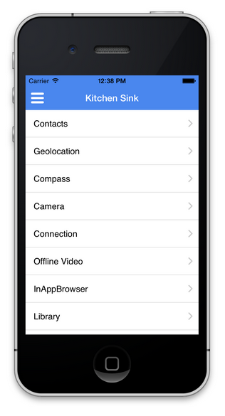

# Åtkomst till enhetsfunktioner{#access-device-features}

>[!NOTE]
>
>Adobe rekommenderar att du använder SPA Editor för projekt som kräver ramverksbaserad klientåtergivning för en sida (t.ex. Reagera). [Läs mer](/help/sites-developing/spa-overview.md).

## Bygga AEM-komponenter som har åtkomst till enhetsfunktioner {#building-aem-components-that-access-device-features}

I [AEM PhoneGap Kitchen Sink](https://github.com/blefebvre/aem-phonegap-kitchen-sink) Github-databasen finns en funktionell AEM-app som illustrerar användningen av ett antal centrala Cordova-API:er. När appen körs på iOS eller Android via PhoneGap CLI öppnas den på följande sida, som innehåller en länk till varje enhets-API som visas:

Källkoden för var och en av dessa enhets-API-komponenter är [tillgänglig på Github](https://github.com/blefebvre/aem-phonegap-kitchen-sink/tree/master/content/src/main/content/jcr_root/apps/brucelefebvre/kitchen-sink/components).

Mer information om hur varje API används finns i dokumentationen till plugin-programmet [Cordova](https://docs.phonegap.com/en/4.0.0/cordova_plugins_pluginapis.md.html).

## Nästa steg {#the-next-steps}

Se [Spåra appprestanda med Adobe Mobile Analytics](/help/mobile/phonegap-intro-to-app-analytics.md).
