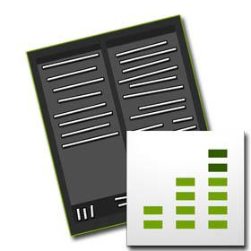

# Lägg till Adobe Analytics i er mobilapplikation{#add-adobe-analytics-to-your-mobile-application}

>[!NOTE]
>
>Adobe rekommenderar att du använder SPA Editor för projekt som kräver ramverksbaserad klientåtergivning för en sida (t.ex. Reagera). [Läs mer](/help/sites-developing/spa-overview.md).

Vill du skapa engagerande och relevanta upplevelser för mobilanvändare? Om du inte använder Adobe Mobile Services SDK för att övervaka och mäta programmets livscykel och användning, vad baserar du dina beslut på? Var är era mest lojala kunder? Hur kan ni garantera att ni är relevanta och optimerar konverteringarna?

Kommer användarna åt allt innehåll? Överger de appen, och i så fall, var? Hur ofta stannar de i appen och hur ofta de kommer tillbaka för att använda appen? Vilka förändringar kan ni införa och sedan mäta den ökade lojaliteten? Vad gäller för kraschfrekvenser, kraschar din app för dina användare?

Dra nytta av [mobilappsanalys](https://www.adobe.com/ca/solutions/digital-analytics/mobile-web-apps-analytics.html) i dina AEM-appar genom att integrera med [Adobes mobiltjänster](https://www.adobe.com/marketing-cloud/mobile-marketing.html).

Instrumentera era AEM-appar för att spåra, rapportera och förstå hur användarna interagerar med mobilappen och -innehållet och för att mäta nyckeltal under livscykeln, som starter, apptid och kraschfrekvens.

I det här avsnittet beskrivs hur AEM- *utvecklare* kan:

* Integrera mobilanalys i mobilapplikationer
* Testa er analysspårning med Bloodhound

## Förinställningar {#prerequisties}

AEM Mobile kräver ett Adobe Analytics-konto för att samla in och rapportera spårningsdata i appen. Som en del av konfigurationen måste AEM- *administratören* först:

* Konfigurera ett Adobe Analytics-konto och skapa en rapportserie för ditt program i Mobile Services.
* Konfigurera en AMS Cloud-tjänst i Adobe Experience Manager (AEM).

## För utvecklare - Integrera mobilanalys i appen {#for-developers-integrate-mobile-analytics-into-your-app}

### Konfigurera ContentSync för att hämta konfigurationsfilen {#configure-contentsync-to-pull-in-configuration-file}

När Analytics-kontot har konfigurerats måste du skapa en konfiguration för innehållssynkronisering för att hämta in innehållet i ditt mobilprogram.

Mer information finns i Konfigurera innehåll för innehållssynkronisering. Konfigurationen måste instruera Content Sync att lägga ADBMobleConfig i katalogen /www. I till exempel Geometrixx Outdoor App finns konfigurationen för innehållssynkronisering på: */content/phonegap/geometrixx-outdoor/shell/jcr:content/page-app/app-config/ams-ADBMobleConfig*. Det finns även en konfiguration för utveckling. Den är dock identisk med den icke-utvecklingsrelaterade konfigurationen när det gäller utvändiga Geometrixer.

Mer information om hur du hämtar ADBMomobileConfig från kontrollpanelen för AEM-program för mobilprogram finns i Analytics - Mobile Services - Adobe Mobile Services SDK Config-filen.

```xml
<jcr:root xmlns:jcr="https://www.jcp.org/jcr/1.0" xmlns:nt="https://www.jcp.org/jcr/nt/1.0"
    jcr:primaryType="nt:unstructured"
    extension="json"
    path="../../../.."
    selector="ADBMobileConfig"
    targetRootDirectory="www"
    type="mobileADBMobileConfigJSON"/>
```

För varje plattform krävs att ADBMomobileConfig kopieras till en viss plats.

Om du bygger med PhoneGap CLI kan du göra detta med ett cordova-byggkrokskript. Detta kan du se i Geometrixx Outdoor App på:*content/phonegap/geometrixx-outdoors/shell/_jcr_content/pge-app/app-content/phonegap/scripts/restore_plugins.js.*

För iOS måste filen kopieras till XCode-projektets **resurskatalog** (t.ex. &quot;platforms/ios/Geometrixx/Resources/ADBMobileConfig.json&quot;). Om appen har Android som mål är sökvägen till den platforms/android/assets/ADBMobileConfig.json. Mer information om hur du använder krokar under PhoneGap CLI-bygget finns i [Tre kopplingar som ditt Cordova-/PhoneGap-projekt behöver](https://devgirl.org/2013/11/12/three-hooks-your-cordovaphonegap-project-needs/).

```xml
///////////////////////////
//          iOS
///////////////////////////
    ios : [
        {
            "www/ADBMobileConfig.json": "platforms/ios/<YOUR_APP_NAME>/Resources/ADBMobileConfig.json"
        }
    ],
///////////////////////////
//          ANDROID
///////////////////////////
    android: [
        {
            "www/ADBMobileConfig.json": "platforms/android/assets/ADBMobileConfig.json"
        }
    ]
```

### Lägg till plugin-programmet AMS i appen {#add-the-ams-plugin-in-the-app}

För att appen ska kunna samla in data måste plugin-programmet för Adobe Mobile Services (AMS) ingå i appen. Genom att ta med plugin-programmet som en funktion i programmets config.xml kan en annan Cordova-krok användas för att automatiskt lägga till plugin-programmet under PhoneGap-byggprocessen.

```xml
<feature name="ADBMobile">
    <param name="id" value="https://github.com/Adobe-Marketing-Cloud/mobile-services#0482f9cedf90c98a8d4b07219ece1933b2e46a60"/>
</feature>
```

Geometrixx Outdoor App config.xml finns på */content/phonegap/geometrixx-outdoor/shell/jcr:content/pge-app/app-content/phonegap/www/config.xml*. I exemplet ovan efterfrågas en specifik version av plugin-programmet som ska användas genom att ett &#39;#&#39; läggs till och sedan ett taggvärde efter plugin-URL:en. Detta är en bra metod att följa för att säkerställa att oväntade problem inte uppstår på grund av att otestade plugin-program läggs till under en programversion.

När du har utfört dessa steg aktiveras appen för att rapportera alla livscykelvärden som tillhandahålls av Adobe Analytics. Detta inkluderar data som starter, krascher och installationer. Om det är den enda informationen du bryr dig om så är du klar. Om du vill samla in anpassade data måste du mäta koden.

### Instrumentera koden för fullständig appspårning {#instrument-your-code-for-full-app-tracking}

Det finns flera API:er för spårning i API:t för [AMS PhoneGap Plugin.](https://marketing.adobe.com/resources/help/en_US/mobile/ios/phonegap_methods.html)

På så sätt kan du spåra lägen och åtgärder, t.ex. var sidor användarna navigerar till i appen, vilka kontroller som används mest. Det enklaste sättet att mäta vilket instrument ni använder för spårning är att använda de API:er för analys som tillhandahålls av plugin-programmet för AMS.

* ADB.trackState()
* ADB.trackAction()

Som referens kan du titta på koden i appen Geometrixx Outdoor. I programmet Geometrixx Outdoor spåras alla sidnavigeringar med metoden ADB.trackState(). Mer information finns i källkoden för /libs/mobileapps/components/angular/ng-page/clientlibs/app-navigation.js

Genom att instrumentera källkoden med dessa metodanrop kan du samla in fullständiga mätvärden mot programmet.

### Testa Analytics-spårning med Bloodhound {#testing-analytics-tracking-with-bloodhound}



Innan du distribuerar till produktion kan du använda Adobe-verktyget [Bloodhound](https://marketing.adobe.com/developer/gallery/bloodhound-app-measurement-qa-tool-1) för att testa analyskonfigurationen. Om du vill testa analyskonfigurationen måste du redigera filen ADBMobilConfig.json så att den pekar på servern där Bloodhound körs i stället för på den faktiska Analytics-servern. Om du vill göra den här ändringen ändrar du följande post i ADBMobilConfig.json.

```xml
...
"analytics": {
    "rsids": "YOUR_RSID",
    "server": "YOUR_TRACKING_SERVER:YOUR_TRACKING_PORT",
...
```

Ändra så att den matchar den här posten:

```xml
...
"analytics": {
    "rsids": "YOUR_RSID",
    "server": "localhost:50000",
...
```

Detta dirigerar om alla data som samlas in av AMS-pluginen till Bloodhound så att du kan se resultatet.

#### Egenskaper för anslutning till AMS {#properties-for-connecting-to-ams}

*com.adobe.cq.moMobile.mobileservices.impl.service.* MobileServicesHttpClientImpl visar följande egenskaper för anslutning till AMS:

| **Etikett** | **Beskrivning** | **Standard** |
|---|---|---|
| API-slutpunkt | Bas-URL:en för Adobe Mobile Services HTTP API:er | https://api.omniture.com |
| Konfigurationsslutpunkt | Den URL som används för att hämta ADB Mobile Config för det angivna rapportsvitens-ID:t | /ams/1.0/app/config/ |
| Appar för mobiltjänster | Få en lista över appar i användarföretaget | /ams/1.0/apps |

