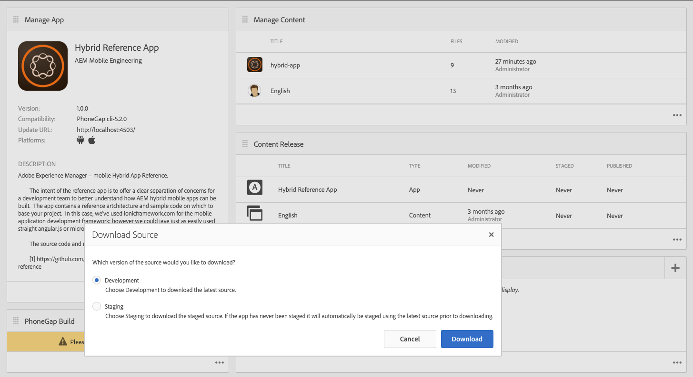

# Är din hybridapp redo för AEM Mobile?{#is-your-hybrid-app-ready-for-aem-mobile}

>[!NOTE]
>
>Adobe rekommenderar att du använder SPA Editor för projekt som kräver ramverksbaserad klientåtergivning för en sida (t.ex. Reagera). [Läs mer](/help/sites-developing/spa-overview.md).

Så du har importerat din Hybrid PhoneGap- eller Cordova-app till AEM, nu då? Du kanske vill lägga till innehåll som är redigerbart i appen. För att kunna utföra den här uppgiften behöver du en allmän förståelse för strukturen i en AEM-app. En app i AEM delas vanligtvis in i två delar. Gränssnittet och innehållet. &quot;Skal&quot; består av de statiska delarna av appen; som konfigurationsfilerna för PhoneGap, appramverket och navigeringskontrollerna. Innehållet i det importerade arkivet lagras som en del av skalet. I det här dokumentet är gränssnittet det icke-AEM-redigerade innehållet i din Hybrid PhoneGap-app som skapats av apputvecklaren.

Innehåll avser de komponenter, mallar och redigerade sidor som skapas i AEM som skapats av AEM Developer. Innehåll kategoriseras antingen som utvecklarinnehåll eller som redigerat innehåll. Komponenter, designer och sidmallar betraktas som designinnehåll eftersom de har skapats av en utvecklare. författarinnehåll är sidor som har byggts med hjälp av komponenter och mallar. Dessa utförs vanligtvis av en designer eller en marknadsförare.

Om du vill lägga till skapade AEM-sidor i din Hybrid-app måste det finnas en samordning mellan apputvecklaren och AEM-utvecklaren. Var som helst i appen där du vill lägga till redigerat innehåll måste apputvecklaren ordna dessa sidor i en struktur som kan överlappas i AEM. Apputvecklaren måste kunna förse AEM-utvecklaren med sökvägen till den plats där AEM-innehållet skapades och sedan tillhandahålla en platshållarsida i Hybrid-appen som ska ersättas efter att AEM-utvecklaren har skapat sidinnehållet.

För att göra förklaringen enklare att följa använder vi AEM Marketing Cloud: AEM Mobile Hybrid Reference för att förklara koncepten. Hybrid Reference-programmet består av en välkomstsida med en sidomeny.

I det här exemplet ska vi skapa programmets välkomstsida. Ta en titt på källan [https://github.com/Adobe-Marketing-Cloud-Apps/aem-mobile-hybrid-reference/blob/master/hybrid-app/www/js/app.js#L75](https://github.com/Adobe-Marketing-Cloud-Apps/aem-mobile-hybrid-reference/blob/master/hybrid-app/www/js/app.js#L75). Vi ser att apputvecklaren har definierat en välkomstsida och tillhandahållit en mall för sidan som återges av appen. Det är här apputvecklaren och AEM-utvecklaren måste samordna. Sökvägen till välkomstsidmallen i Hybrid Reference App definieras som &#39;&#39;content/mobileapps/hybrid-reference-app/en/welcome.template.html&#39;&#39;. Den här sökvägen är mycket viktig eftersom AEM-utvecklaren skapar sin välkomstsida i AEM-databasen med samma sökväg.

Det är viktigt att hybridappen och det AEM-skapade innehållet använder samma sökväg eftersom vi förlitar oss på möjligheten att täcka över innehåll med hjälp av Innehållssynkronisering för att lägga till nya sidor i Hybrid-appen. När Hybrid-appen importeras till AEM som en del av importprocessen konfigureras innehållssynkronisering.

När du &#39;laddar ned källa&#39; från appkontrollpanelen körs dessa ContentSync-skript för att samla ihop ett arkiv av din Hybrid-app.

ContentSync hämtar först&quot;skal&quot; för appen, där allt apputvecklat innehåll från Hybrid-appen lagras och sedan hämtas det i appens&quot;innehåll&quot;. Om det nu finns sidor i gränssnittet som har samma sökväg som i content kommer sidorna under shell att ersättas med sidorna under content. Det innebär att om vi skapar en sida i AEM som har samma sökväg som content/mobileapps/hybrid-reference-app/en/welcome.template.html när ContentSync körs i Hybrid Reference App-exemplet, kommer den att täcka över sidan som ingick i Hybrid Reference-appen med det som finns i AEM på den platsen. Övertäckningen hanteras av ContentSync så att uppdateringarna av appen med AEM-redigerat innehåll ser sömlösa ut för alla som använder appen och inte kräver att appen byggs om. När du kör programmet visas välkomstsidan som följer:

