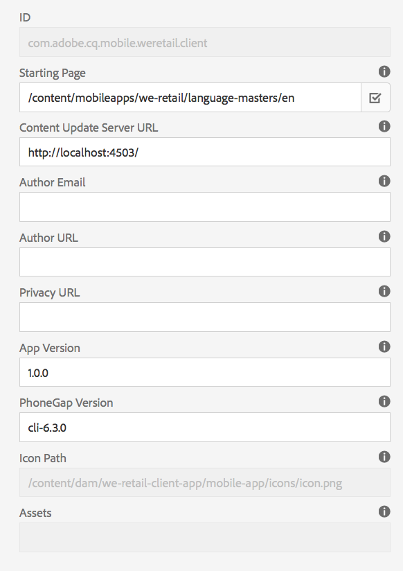

# Hantera apppanel{#manage-app-tile}

{{ue-over-mobile}}

På panelen **`Manage App`** på appkontrollpanelen kan du redigera information om programmet. Om du vill öppna informationssidan klickar du på informationslänken för **`Manage App`**. På sidan **`Manage App`** kan du redigera inställningarna för PhoneGap Application Configuration (config.xml) och förbereda programmet för att skickas till de olika programbutikerna.


## Om `Manage App`-panelen {#understanding-the-manage-app-tile}

Du kan detaljgranska varje ruta i **`Manage App`**-rutan om du vill visa eller redigera detaljer genom att klicka på ... i det nedre högra hörnet.

### Fliken Grundläggande {#the-basic-tab}

Du kan redigera **Namn**, **Författare**, **Kort beskrivning** och **Beskrivning** för programmet på den här fliken.


### Avancerat {#the-advanced-tab}

Varje plattform för mobilapplikationer beskriver vilka data som samlas in, och riktar sig specifikt till varje applikationsbutik.

De plattformar som visas styrs av innehållet config.xml i PhoneGap:

```xml
<widget>
<gap:platform name="ios"/>
<gap:platform name="android"/>
</widget>
```

Alla leverantörsapplikationsbutiker - till exempel Apple App Store eller Google Play Store - kräver en eller flera skärmdumpar av mobilappen för att visa din applikationsinformation för kunderna. Skärmbilderna kan ha strikta krav när det gäller dimensioner och innehåll (de måste egentligen representera programmet). AEM Apps har stöd för att välja och hantera skärmbilderna för de plattformar som stöds och visa portdimensioner som krävs för varje leverantörs programbutik.

>[!NOTE]
>
>Med appen AEM Verifiera kan du skicka skärmbilder direkt till din appinformation i AEM.
>
>Mer information finns i [Mobile Quickstart för AEM Verify](/help/mobile/phonegap-mobile-quickstart.md).


### Metadata {#metadata}

>[!NOTE]
>
>När du är bekant med **`Manage App`**-panelen läser du [Redigera appmetadata](/help/mobile/phonegap-editmetadata.md) för att visa och redigera metadata.

#### Vanliga metadata {#common-metadata}

Alla program bör ha associerade metadata som hjälper dig att konfigurera olika aspekter av programmet. Sidan Hantera program är indelad i två olika områden som är relaterade till metadatainsamling. Plattformsspecifika metadata och vanliga metadata.

Det finns en gemensam konfiguration och metadata för alla plattformar.

I det här avsnittet definierar du URL:en för innehållsuppdateringsservern, landningssidan för mobilprogrammet, PhoneGap-versionen för kompilering, programversion, namn, beskrivning med mera.

**Programversion** är den fungerande versionen av ditt program. Ett vanligt tillvägagångssätt är att använda en 3-decimalkomma och börja under 1.0.0 före den första versionen.

**PhoneGap version** är den version i vilken du vill kompilera programmet med PhoneGap. Det bästa sättet är att hålla jämna steg med den aktuella versionen för att säkerställa att du får de senaste och bästa funktionerna och felkorrigeringarna.

**URL:en för innehållsuppdateringsservern** är den URL som programmet använder för att anropa ContentSync-uppdateringar. Den måste anges till din Dispatcher URL eller, om inte en Dispatcher används, till någon av dina publiceringsinstanser som används för ContentSync-uppdateringar av programmet.



>[!NOTE]
>
>Det här avsnittet kan vara tomt om det inte finns data som fyller i fälten.
>
>Överst i detaljvyn finns programversion, PhoneGap-version och URL-adress för uppdatering. Dessa värden kan anges i avsnittet Vanliga metadata. Program-ID kan dock inte redigeras.

#### Plattformsmetadata {#platform-metadata}

Alla plattformar som definieras i PhoneGap config.xml kan innehålla anpassade plattformsegenskaper. En AEM måste bidra med innehållsstrukturen för att kunna hämta dessa egenskaper. Ett exempel på plattformsspecifika egenskaper finns för iOS.

Metadata för alla konfigurerade plattformar visas nu samtidigt på fliken Avancerat i rutan `Manage App`.

>[!NOTE]
>
>Plattformens metadataavsnitt används inte av PhoneGap under en CLI eller när Remote PhoneGap byggs. AEM försöker i stället hämta metadata för plattformar så att de kan användas senare när de skickas till målleverantörens programbutik.

För plattformar som inte kan förstås av AEM är det fortfarande möjligt för en AEM att utöka användargränssnittet för att hämta dessa metadata som senare kan exporteras och användas under programinlämningsprocessen.

#### iOS-metadata {#ios-metadata}

Apple AppStore kräver extra metadata för att skicka in ditt program för distribution. IOS metadataavsnitt försöker samla in den information som Apple iTMSTTransporter-verktyg kan använda för att publicera metadata på det associerade Apple-utvecklarkontot.

Om du vill hämta Apple-specifika metadata skapar du programmet på [https://itunesconnect.apple.com](https://itunesconnect.apple.com/). När du skapar programmet genererar Apple metadata, vilket krävs i metadataavsnittet för iOS om du vill använda Apple iTMSTTransporter-verktyget för att validera och överföra metadata till itunesconnect.apple.com. Om du vill ha de metadata du behöver för att samla in behöver du inte fylla i de iOS-specifika metadata. Du kan fortfarande exportera metadata som sammanfogar iOS-metadata och gemensamma metadata och samla alla skärmbilder i en zip-fil som kan laddas ned när som helst.

Den hämtade zip-filen innehåller en itmsp-fil som kan inspekteras för metadata.xml. ActionScript-filen innehåller exporterade metadata (i filen metadata.xml), tillsammans med alla associerade skärmbilder.

Exportfunktionen används för att underlätta insamling av skärmbilder och metadata som kan skickas till programutgivaren för indata i den leverantörsspecifika programbutiken.


#### Android™-metadata {#android-metadata}

När du väljer Android™-plattform finns det inga anpassade metadata som kan ställas in. När du klickar på nedladdningsknappen skapas en ZIP-fil med en egenskapsfil som innehåller alla metadata och associerade skärmbilder.

Exportfunktionen används för att underlätta insamling av skärmbilder och metadata som kan skickas till programutgivaren för indata i den leverantörsspecifika programbutiken.


### URL för Content Update Server {#content-update-server-url}

En av de viktigaste funktionerna i AEM är möjligheten att låta ett mobilprogram begära nytt innehåll via ContentSync, där innehållet kan vara HTML-resurser, sidor, video, bilder, text och mycket annat. När en innehållsförfattare har uppdaterat innehållet och sedan publicerat det gör servern innehållsuppdateringen tillgänglig så att mobilprogrammet kan hämtas.

Egenskapen URL för innehållsuppdateringsservern är den URL som måste peka på en publiceringsinstans, antingen direkt eller via Dispatcher eller CDN. Formatet på URL:en är helt enkelt:

`https://[hostname]:[port]`

>[!NOTE]
>
>Om din Author-serverinstans replikerar till många publiceringsserverinstanser (vanlig arkitektur för AEM) har varje publiceringsserver samma uppdateringsinnehåll. Orsaken är att uppdateringen bygger på författaren och replikeras till alla publiceringsinstanser. I princip stöds belastningsutjämning och failover fullt ut.

### Fliken Plugins {#the-plugins-tab}

Fliken **Plugins** beskriver de plugin-program som är associerade med din app. Den här informationen används för att hämta lämpligt plugin-program under en programutveckling.


### Fliken Skärmbilder {#the-screenshots-tab}

På fliken **Skärmbilder** visas skärmbildupplösningar som stöds på olika plattformar.


>[!NOTE]
>
>Mer information om hur du lägger till och tar bort skärmbilder finns i [Redigera appmetadata](/help/mobile/phonegap-editmetadata.md).

### Fliken Autentisering {#the-authentication-tab}

På fliken **Autentisering** kan du välja en OAuth-klient att associera med ditt program och aktivera en utvecklare att använda Adobe Experience Manager OAuth-autentisering.


### Nästa steg {#the-next-steps}

När du har lärt dig mer om hur du hanterar apppaneler i programkontrollpanelen kan du läsa följande resurser för andra redigeringsroller:

* [Redigera appmetadata](/help/mobile/phonegap-editmetadata.md)
* [Programdefinitioner](/help/mobile/phonegap-app-definitions.md)
* [Skapa ett nytt program med guiden Skapa app](/help/mobile/phonegap-create-new-app.md)
* [Importera en befintlig hybridapp](/help/mobile/phonegap-adding-content-to-imported-app.md)
* [Innehållstjänster](/help/mobile/develop-content-as-a-service.md)

### Andra resurser {#additional-resources}

Mer information om roller och ansvar för en administratör och utvecklare finns i resurserna nedan:

* [Utveckla för Adobe PhoneGap Enterprise med AEM](/help/mobile/developing-in-phonegap.md)
* [Administrera innehåll för Adobe PhoneGap Enterprise med AEM](/help/mobile/administer-phonegap.md)
