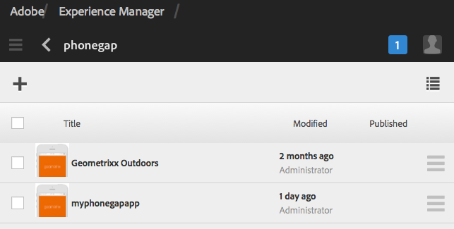

# Skapa och redigera appar med Apps-konsolen{#creating-and-editing-apps-using-the-apps-console}

>[!NOTE]
>
>Adobe rekommenderar att du använder SPA Editor för projekt som kräver ramverksbaserad klientåtergivning för en sida (t.ex. Reagera). [Läs mer](/help/sites-developing/spa-overview.md).

I utvecklingsprocessen för AEM-mobilapplikationer är man medveten om att användare med olika sakkunskap bidrar till utvecklingen av mobilapplikationer. Följande processkarta visar den allmänna ordningen i vilken innehållsförfattare och programutvecklare utför uppgifter.

Information om hur du utför marknadsföringsåtgärder visas på den här sidan. Mer information om utvecklaråtgärder finns i Skapa PhoneGap-program.

## Strukturen för mobilprogram {#the-structure-of-mobile-applications}

AEM Mobile innehåller en plan för PhoneGap-appen för att skapa mobilappar. Planen definierar strukturen för de program du skapar. Ansökningarna består av följande:

* Rotsidan.
* Programmets språkvarianter.
* Hemsidan för språkvarianten.

### Roten för en PhoneGap-app {#the-root-of-a-phonegap-app}

Rotsidan för de mobilprogram du skapar i AEM visas i Apps-konsolen.

Rotsidan lagras under egenskapen Målsökväg i programmet som angavs när programmet skapades (standardsökvägen är /content/phonegap/apps). Sidnamnet är egenskapen Name för programmet. Till exempel är standardwebbadressen för rotsidan för webbplatsen med namnet `myphonegapapp` `http://localhost:4502/content/phonegap/apps/myphonegapapp.html`.

### Språkvariationen för en PhoneGap-app {#the-language-variation-of-a-phonegap-app}

De första underordnade sidorna på rotsidan är språkvariationerna för programmet. Namnet på varje sida är det språk som programmet skapas för. Engelska är till exempel namnet på den engelska varianten av programmet.

**** Obs! Standardprogrammet för PhoneGap skapar bara ett engelskt program. Utvecklaren kan ändra planen så att den kan skapa fler språkvarianter.

Språksidan har två syften:

* Sidinnehållet är den utfällbara sidan för språkvarianten i programmet.
* Sidegenskaperna styr flera designaspekter av programmet, t.ex. den URL som ska användas för att begära innehållsuppdateringar och information om hur du ansluter till molnbygget och Adobe Analytics Services-integrering.

### Hemsidan {#the-home-page}

Startsidan, eller index.html-sidan för en språkvariant av ett program, visas när programmet öppnas. Hemsidan innehåller en meny med länkar till olika sidor i programmet. Med styckesystemet kan du lägga till komponenter på sidan för att skapa innehåll.

## Skapa ett mobilprogram {#creating-a-mobile-application}

Mobilprogram bygger på en plan som definierar en sidstruktur och egenskaper. Du kan konfigurera följande programegenskaper:

* **** Titel: Programtitel.
* **** Målsökväg: Platsen i databasen där programmet lagras. Låt standardinställningen vara om du vill skapa en sökväg baserat på programnamnet.

* **** Namn: Standardvärdet är värdet för egenskapen Title med blankstegstecken borttagna. Namnet används i CQ för att referera till programmet, till exempel för databasnoden som representerar programmet.
* **** Beskrivning: En beskrivning av programmet.
* **** Server-URL: Den URL som innehåller OTA-innehåll (Over-the-Air) uppdateras i programmet. Standardvärdet är publiceringsserverns URL-adress för instansen som används för att skapa ett program (hämtas från externaliseringstjänsten). Observera att detta måste vara en publiceringsserverinstans i stället för en författare, vilket kräver autentisering.

Du kan också tillhandahålla en bildfil som du kan använda som programminiatyr, välja den PhoneGap Build-konfiguration som du vill använda och välja den mobilappsanalyskonfiguration som ska användas. Den här bilden används bara som miniatyrbild för att representera ditt mobilprogram i konsolen för mobilappar i Experience Manager.

Det finns ytterligare flikar (och valfria) för att bygga molntjänster och integrera Adobe Mobile Services SDK-pluginen i appen.

* Bygg: Klicka på Hantera konfigurationer och konfigurera bygg.phonegap.com här. I listrutan kan du sedan välja den nya molntjänsten PhoneGap build.
* Analyser: Klicka på Hantera konfigurationer och konfigurera molntjänsten [Adobe Mobile Services SDK](https://marketing.adobe.com/developer/en_US/get-started/mobile/c-measuring-mobile-applications) . I listrutan kan du sedan välja den nya mobiltjänsten som ska integreras i din mobilapp.

>[!NOTE]
>
>Utvecklare kan använda AEM PhoneGap Starter Kit för att skapa appar och lägga till dem i konsolen.

Följande procedur använder Touch-gränssnittet för att skapa ett mobilprogram.

1. Klicka på Appar på listen.
1. Klicka på eller tryck på ikonen Skapa.

   

1. (Valfritt) Ange en beskrivning för programmet på fliken Avancerat och ändra serverns URL om det behövs.
1. (Valfritt) Om du använder PhoneGap Build för att kompilera programmet väljer du den konfiguration som ska användas på fliken Skapa.

   Om du vill skapa en konfiguration för PhoneGap-bygget klickar du på Hantera konfigurationer.

1. (Valfritt) Om du använder SiteCatalyst för att spåra programaktivitet väljer du den konfiguration som ska användas på fliken Analytics.

   Om du vill skapa en konfiguration för mobilappar klickar du på Hantera konfigurationer.

1. (Valfritt) Om du vill ange en programikon klickar du på knappen Bläddra, markerar bildfilen i filsystemet och klickar på Öppna.
1. Klicka på Skapa.

### Ändra egenskaperna för ett mobilprogram {#changing-the-properties-of-a-mobile-application}

När du har skapat ett mobilprogram kan du ändra egenskaperna.

#### Ändra titel, beskrivning och ikon {#change-the-title-description-and-icon}

1. Klicka på eller tryck på Appar på listen.
1. Välj det program som ska konfigureras och klicka på ikonen Visa sidegenskaper.

   

1. Om du vill ändra egenskapsvärden klickar eller trycker du på ikonen Redigera.

   

1. Konfigurera de grundläggande och avancerade egenskaperna och klicka eller tryck sedan på ikonen Klar.

   

#### Konfigurera en språkvariant för programmet {#configure-a-language-variation-of-the-application}

1. Klicka på eller tryck på Appar på listen.
1. Klicka för att gå närmare in i det mobilprogram du vill redigera i Admin Console för appar. Välj den språkversion av programmet som ska konfigureras och klicka på ikonen Visa programegenskaper.

   

1. Om du vill ändra egenskapsvärden klickar eller trycker du på ikonen Redigera.

   

1. Konfigurera egenskaperna på flikarna Grundläggande, Avancerat, Version och Analytics och klicka eller tryck sedan på ikonen Done (Klar).

   

### Skapa innehåll för ett mobilprogram {#authoring-the-content-of-a-mobile-application}

När du har skapat mobilprogrammet lägger du till innehåll som används som programgränssnitt.

1. Klicka på eller tryck på Appar på listen.
1. Klicka eller tryck på programmet och sedan på engelska.
1. Redigera hemsidan eller lägg till underordnade sidor efter behov.

### Flytta innehåll till mobilprogram {#moving-content-to-mobile-applications}

Cachen för innehållssynkronisering i AEM-publiceringsinstansen används som en databas för innehåll för mobilprogram:

* Innehåll i cachen för innehållssynkronisering inkluderas i programmet när utvecklare kompilerar programmet.
* Innehåll i cachen är tillgängligt för installerade mobilprogram för uppdatering av programinnehållet.

Mobilprogram innehåller ett uppdateringskommando som hämtar och installerar uppdaterat programinnehåll. När en programinstans skickar en uppdateringsbegäran avgör Innehållssynkronisering vilket innehåll som har ändrats sedan programmet senast uppdaterades eller installerades och tillhandahåller det nya innehållet.

Om du vill göra uppdaterat innehåll tillgängligt för program uppdaterar du cachen för innehållssynkronisering. Första gången du uppdaterar cachen läggs allt publicerat innehåll till. Efterföljande uppdateringar lägger bara till det publicerade innehåll som har ändrats sedan den föregående uppdateringen.

Innehållssynkronisering spårar även när uppdateringarna utförs. Med den här informationen kan Innehållssynkronisering avgöra vilken cacheuppdatering som ska skickas till ett mobilprogram.

Utför följande procedur på instansen där du vill uppdatera cachen. Om ditt program till exempel begär uppdateringar från publiceringsinstansen utför du proceduren på publiceringsinstansen.

1. Klicka eller tryck på Appar på listen och sedan på eller på ditt program.
1. Markera välkomstsidan och klicka eller tryck sedan på ikonen Uppdatera cache.

   

### Använda appmallar {#using-app-templates}

Det här är en funktion som är tillgänglig med Apps 6.1 Feature Pack 2 och som gör det enkelt att utnyttja befintliga appmallar för att skapa nya appar i AEM.

Vad är en appmall? Se det som en samling sidmallar och komponenter som utgör en grund eller grund för ett program.
När du skapar ett nytt program baserat på en mall för ett annat program får du ett program som har en startpunkt som representerar det program som det skapades från.

Du måste ha en befintlig mobilappsmall (eller en app som har en appmall) för att kunna använda den här funktionen.

Det senaste exempelpaketet för AEM-appar 6.1 innehåller en uppdaterad version av Geometrixx-appen med en appmall. Du kan också installera StarterKit, som även innehåller en mall.

Steg för att skapa ett nytt program baserat på en appmall:

1. Kontrollera att du har det senaste funktionspaketet för AEM-appar 6.1 och referensexempelpaketen installerade
1. Klicka på Appar i den vänstra listen.

1. Klicka på knappen + Skapa överst och välj Skapa app.
1. När du har fått listan över appmallar väljer du en:

1. Klicka på Nästa.
1. Ange ett program-ID och en titel, men du kan också inkludera ett namn och en beskrivning.

   1. Dessutom kan du ange en PNG-fil (PhoneGap-ikonformat som stöds) som en ikon genom att bläddra bland AEM-resurser.
   1. Kom ihåg att du kan redigera alla dessa fält efter att appen har skapats i panelen Hantera app. Med undantag för app-ID:t kan du inte ändra det när program-ID:t har angetts.

1. Klicka på knappen Skapa så visas 2 alternativ, antingen Klart (gå tillbaka till katalogvyn Appar) eller Hantera program (öppnar appkontrollpanelen).
1. När du har skapat programmet bör du se den nya appen i katalogen App:

1. Klicka på appen för att öppna den. Du har skapat en ny app som är baserad på mallen för ett befintligt program.

>[!NOTE]
>
>Om du avinstallerar referenspaketet Geometrixx Outdoor från AEM och har en app som skapats baserat på dess mall, kommer den appen inte längre att fungera. Appen Geometrixx Outdoor kan tas bort, men appmallen måste finnas kvar om den används av andra mobilprogram.

## Utforska exempelgeometrixx-appen utomhus {#exploring-the-sample-geometrixx-outdoors-app}

Geometrixx Outdoor App är ett exempel på PhoneGap-program som demonstrerar funktionerna i standardappen för PhoneGap och de mobila komponenterna i exemplet.

Öppna programmet genom att klicka på Mobila program på listen och sedan välja Geometrixx Outdoor App.

### Funktioner för vanliga sidor - mobilappen Geometrixx {#common-page-features-geometrixx-mobile-app}

Varje sida i mobilappen innehåller följande funktioner:

* En bakåtknapp för att gå tillbaka till den överordnade sidan. Observera att bakåtknappen inte visas på hemsidan.
* En expanderbar räl som erbjuder en meny med kommandon och länkar:

   * Öppna sidan Platser.
   * Öppna kundvagnen.
   * Logga in.
   * Uppdatera programmet.

* Styckesystemet för att lägga till komponenter och skapa innehåll.

### Hemsidan - Geometrixx-mobilapp {#the-home-page-geometrixx-mobile-app}

Innehållet på hemsidan består av följande navigeringsverktyg:

* En menylistekomponent som innehåller länkar till de underordnade sidorna Kugghjulet, Recensioner, Nyheter och Om oss.
* En Swipe Carousel-komponent som visar de underordnade sidorna.

### The Gear Page - Geometrixx Mobile App {#the-gear-page-geometrixx-mobile-app}

På sidan Kugghjulet får användarna tillgång till produktsidor. En menylistekomponent ger åtkomst till de underordnade sidorna på sidan Kugghjul. De underordnade sidorna är produktkategorier som webbplatsen har.

* Säsong
* Kläder
* Kön
* Aktivitet

Varje kategorisida har samma innehållsstruktur som sidan Kugghjul. Carousel ger åtkomst till underordnade sidor som är underkategorier av produkter. Underkategorisidorna innehåller produktlistor med länkar till produktsidor.

### The Products page - Geometrixx Mobile App {#the-products-page-geometrixx-mobile-app}

Sidan Produkter och dess hierarki av underordnade sidor implementerar ett klassificeringssystem för produktsidor. De lägsta sidorna i varje gren av hierarkin är en produktsida som innehåller en ng-produktkomponent.

Sidan Produkter är inte tillgänglig för programanvändare. På sidan Kugghjul finns alla produktsidor.

### Sidan Recensioner - mobilappen Geometrixx {#the-reviews-page-geometrixx-mobile-app}

Innehåller en bakåtknapp. Med styckesystemet kan du lägga till komponenter.

När du använder programmet är sidan Recensioner tillgänglig från karusellen på den engelska sidan.

### News Page - Geometrixx Mobile App {#the-news-page-geometrixx-mobile-app}

Innehåller en bakåtknapp. Med styckesystemet kan du lägga till komponenter.

När du använder programmet är News page tillgängligt från karusellen på den engelska sidan.

### Sidan Om oss - mobilappen Geometrixx {#the-about-us-page-geometrixx-mobile-app}

Sidan Om oss innehåller serverkomponenter med två spalter. Varje kolumn innehåller antingen en bild- eller en textkomponent. Komponenterna kan redigeras och styckesystemet gör att du kan lägga till komponenter.

När du använder programmet är sidan Om oss tillgänglig från karusellen på den engelska sidan.

### The Locations Page - Geometrixx Mobile App {#the-locations-page-geometrixx-mobile-app}

Sidan Platser innehåller en Locations-komponent.

När du använder programmet är sidan Platser tillgänglig från menylistan på den engelska sidan.

## Exempel på mobila komponenter {#sample-mobile-components}

Flera komponenter är omedelbart tillgängliga i Sidekick när du redigerar sidorna i ett mobilprogram. Komponenterna tillhör PhoneGap-komponentgruppen.

### Svep Carousel {#swipe-carousel}

Komponenten Swipe Carousel är ett verktyg för att visa och navigera på webbplatssidor. Komponenten innehåller en karusell som bläddrar igenom bilder för sidorna ovanför en lista med sidlänkar. Redigera komponenten för att ange vilka sidor som ska visas och hur karusellen fungerar.

Observera att bilder visas i karusellen för sidor som är kopplade till en bild på ett visst sätt. När sidor inte är kopplade till bilder visas bara länklistan.

**Fliken Carousel-egenskaper**

Konfigurera karusellens beteende:

* Uppspelningshastighet: Tiden i millisekunder som varje bild visas innan nästa bild visas.
* Övergångstid: Animeringens längd i millisekunder för bildövergångar.
* Kontrollformat: Den typ av kontroller som finns för att flytta mellan bilder.

**Fliken Listegenskaper**

Ange hur sidlistan ska genereras:

* Skapa lista med: Den metod som ska användas för att ange vilka sidor som ska inkluderas i karusellen. Se Skapa sidlistan.
* Ordna efter: Välj en sidegenskap som ska användas för att sortera sidlistan. Välj t.ex. jcr:title om du vill sortera sidor i bokstavsordning efter rubrik.
* Gräns: Det maximala antalet sidor som ska inkluderas. Den här egenskapen är lämplig för sökbaserade metoder för att skapa sidlistan.

#### Bygga sidlistan {#building-the-page-list}

Komponenten Swipe Carousel innehåller följande värden för egenskapen Build List Using. Redigeringsdialogrutan ändras beroende på vilket värde du väljer:

**Underordnade sidor**

Komponenten visar alla underordnade sidor för en viss sida. När du har valt det här värdet markerar du sidan på fliken Underordnade sidor, eller anger inget värde för att visa den aktuella sidans underordnade sidor.

**Fast lista**

Ange en lista med sidor som ska inkluderas. När du har valt det här värdet konfigurerar du listan på fliken Fast lista som visas när du väljer Fast lista:

* Om du vill lägga till en sida klickar du på Lägg till objekt och bläddrar sedan till sidan.
* Använd upp- och nedpilarna för att flytta sidan i listan.
* Klicka på knappen Ta bort för att ta bort en sida från listan.

Egenskapen Ordna efter påverkar inte ordningen för fasta listor.

**Sök**

Fyll i listan med resultatet av en nyckelordssökning. Sökningen utförs på de underordnade sidorna för en sida som du anger:

1. Om du vill ange sökningens rotsida använder du egenskapen Starta i för att välja sidsökvägen. Ange ingen sökväg att söka efter under den aktuella sidan.
1. Ange söknyckelorden i egenskapen Sökfråga.

**Avancerad sökning**

Fyll i listan med en [Querybuilder](/help/sites-developing/querybuilder-api.md) -fråga.

### Bild {#image}

Lägg till en bild i programinnehållet.

### Text {#text}

Lägg till formaterad text i programinnehållet.

### Lagringsplatser {#store-locations}

Komponenten Store Locations ger användarna verktyg för att hitta affärsplatser:

* Sök
* Listor över platser som ligger nära eller långt från enhetens GPS-koordinater.

Komponenten kräver att databasen innehåller platsinformation för varje butik. Exempelplatser installeras på noden /etc/commerce/locations/adobe. 

### Två kolumner, rad {#two-column-row}

Gör att du kan lägga till komponenter sida vid sida på en sida.

