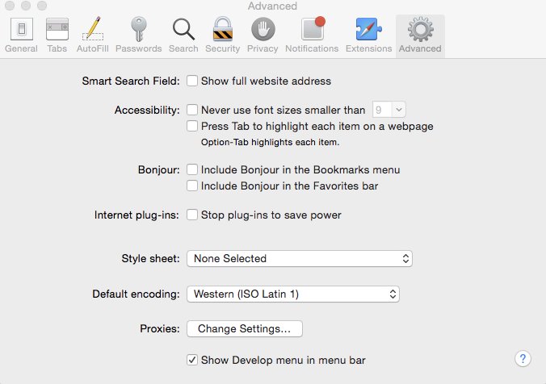

# Utveckla appar med PhoneGap CLI{#developing-apps-with-phonegap-cli}

>[!NOTE]
>
>Adobe rekommenderar att du använder SPA Editor för projekt som kräver ramverksbaserad klientåtergivning för en sida (t.ex. Reagera). [Läs mer](/help/sites-developing/spa-overview.md).

Som utvecklare kan du när som helst köra programmet på en enhet eller i en emulator, förutsatt att du har konfigurerat utvecklingsmiljön.

För att kunna köra följande exempel behöver du ett system som kör OSx (Mac) med Xcode, eller ett Mac/Win/Linux-system med Android SDK installerat.

## Bootstrap din utvecklingsmiljö {#bootstrap-your-development-environment}

[Konfigurera PhoneGap CLI](https://docs.phonegap.com/en/4.0.0/guide_cli_index.md.html#The%20Command-Line%20Interface)

För iOS: Om du vill utveckla för iPhone och iPad behöver du Apples Xcode IDE.

* Ladda ned kostnadsfritt [här](https://developer.apple.com/xcode/downloads/).
* [Plattformshandbok för PhoneGap iOS](https://docs.phonegap.com/en/4.0.0/guide_platforms_ios_index.md.html#iOS%20Platform%20Guide)

För Android: Om du vill utveckla för iPhone och iPad behöver du Googles Android Studio IDE.

* Ladda ned kostnadsfritt [här](https://developer.android.com/sdk/index.html).
* [Plattformshandbok för PhoneGap Android](https://docs.phonegap.com/en/4.0.0/guide_platforms_android_index.md.html#Android%20Platform%20Guide)

## Hämta källan {#download-the-source}

När du har startat om utvecklingsmiljön kan du hämta källan från AEM App Build Tile:

* Klicka på den nedrullningsbara menyn PhoneGap Build.


* Klicka på Hämta källa.
* Välj önskad källa från modalen Hämtningskälla.


>[!NOTE]
>
>Utvecklingskällan innehåller det senaste läget för din app, med ändringar som inte har mellanlagrats. Använd mellanlagringskällan för att skapa releaseförslag för att skicka till appbutiksleverantörer.
>
>Om du aldrig mellanlagring av programmet aktiveras mellanlagringsarbetsflödet när du väljer Förproduktion (tips: detta visas som en mellanlagrad app i PhoneGap Enterprise Viewer App som finns i AppStore och Google PlayStore).

* Klicka på Hämta och spara ZIP-filen på datorn.
* Extrahera den hämtade ZIP-filen till arbetsytan.

## Skapa och läsa in appen (från källa) {#build-and-load-the-app-from-source}

PhoneGap CLI kan skapa ett plattformsprojekt, kompilera källan och distribuera appen med ett enda kommando.

>[!NOTE]
>
>Du kan göra allt detta separat, se [PhoneGap CLI-dokument](https://phonegap.com/blog/2014/11/13/phonegap-cli-3-6-3/).

1. Kontrollera att du har installerat PhoneGap CLI, se ovan.
1. I ett konsolfönster (eller terminalfönster) går du till rotkatalogen för den extraherade källan.
1. Ange följande kommando:

```xml
phonegap run android

// -- or -- //

phonegap run ios
```

>[!NOTE]
>
>Om du har problem kan du gå tillbaka till grunderna för felsökning -
>
>1. Skapa en ny mapp (mkdir test)
>1. Navigera till den nya mappen (cd test)
>1. Kör &#39;phonegap create helloWorld&#39;
>1. Navigera till helloWorld (cd helloWorld)
>1. Kör &#39;phonegap run android (eller ersätt android med ios som ovan).
>1. Emulatorn kommer att öppna och köra din nya PhoneGap-app och säga &#39;Device Ready&#39; om JavaScript-bryggan till native fungerar.
>
>
Detta verifierar att PhoneGap CLI-utvecklingsmiljön fungerar som den ska.

## Felsöka Javascript med felsökning av Safari och IOS {#debug-javascripts-with-safari-and-ios-debug}

Du kan felsöka appens JavaScript-skript med hjälp av utvecklarverktygen i Safari, på samma sätt som med ett webbprogram.

## Aktivera Safari Developer Tools {#enable-safari-developer-tools}

Så här aktiverar du utvecklarverktygen:

* Öppna Safaris inställningar

   * Klicka på Safari i menyraden
   * Klicka på Inställningar

* Klicka på Avancerat i inställningsfönstret



* Markera &quot;Visa menyn Framkalla i menyraden&quot;
* Stäng inställningsfönstret

## Ansluta Safari till iOS {#connect-safari-to-ios}

Du kan ansluta Safari till en iOS-enhet eller emulator.

* Navigera till rotkatalogen för den extraherade källan i ett konsolfönster.
* Ange följande kommando för att starta programmet på enheten eller emulatorn.

```xml
phonegap run <platform> --device

// -- or -- //

phonegap run <platform> --emulator
```

* Öppna Safari
* Klicka på Utveckla på menyraden
* Välj undermenyn iOS-simulator
* Klicka på home.html


## Felsöka JavaScript med Safaris webbinspektör {#debug-javascript-with-safari-s-web-inspector}

Du kan ange brytpunkter var som helst i källan. När du interagerar med emulatorn eller enheten stoppas körningen av appen vid dessa brytpunkter. Du kan stega dig igenom körningen och kontrollera värdena i variabler.

* Klicka på Resurser i webbinspektören
* Navigera i källträdet och klicka på den önskade källfilen
* Klicka på radnumret bredvid för att lägga till en brytpunkt
* Interagera med enhet eller emulator


* Använd kontrollknapparna för att fortsätta köra, stega över, stega in i och ta bort metoder:


>[!NOTE]
>
>Håll musen om du vill se variabelvärdena i den aktuella metoden.

## Nästa steg {#the-next-steps}

När du har lärt dig mer om hur du utvecklar appar med PhoneGap CLI läser du [Åtkomst till enhetsfunktioner](/help/mobile/phonegap-access-device-features.md).
