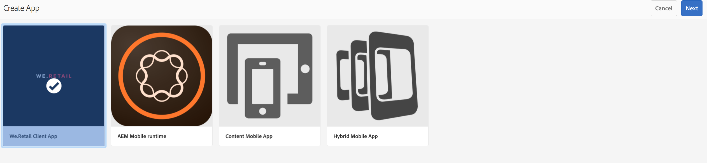
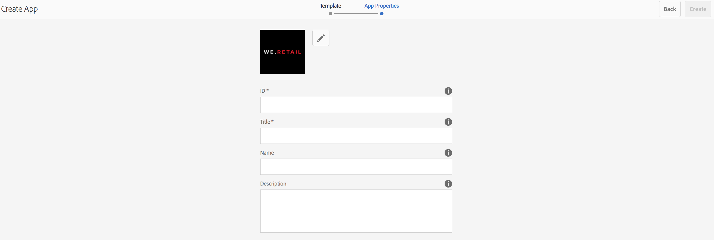

# Skapa en ny AEM Mobile-app med guiden Skapa{#creating-a-new-aem-mobile-app-using-create-wizard}

>[!NOTE]
>
>Adobe rekommenderar att du använder SPA Editor för projekt som kräver ramverksbaserad klientåtergivning för en sida (t.ex. Reagera). [Läs mer](/help/sites-developing/spa-overview.md).

AEM Mobile-programmen bygger på en plan som definierar en sidstruktur och egenskaper. Du kan konfigurera följande programegenskaper:

* **Title:** The application title.
* **Målsökväg:** Den plats i databasen där programmet lagras. Låt standardinställningen vara om du vill skapa en sökväg baserat på programnamnet.

* **Namn:** Standardvärdet är värdet för egenskapen Title där blankstegstecken tas bort. Namnet används i AEM för att referera till programmet, till exempel för databasnoden som representerar programmet.
* **Beskrivning:** En beskrivning av programmet.
* **Server-URL:** Den URL som innehåller OTA-innehållsuppdateringar (Over-the-Air) för programmet. Standardvärdet är publiceringsserverns URL-adress för instansen som används för att skapa ett program (hämtas från externaliseringstjänsten). Observera att detta måste vara en publiceringsserverinstans i stället för en författare, vilket kräver autentisering.

Du kan också tillhandahålla en bildfil som du kan använda som programminiatyrbild, välja vilken PhoneGap Build som ska användas och välja vilken mobilappsanalyskonfiguration som ska användas. Den här bilden används bara som miniatyrbild för att representera ditt mobilprogram i mobilappskonsolen i Experience Manager.

Det finns ytterligare (och valfria) flikar för att bygga molntjänster och integrera plugin-programmet Adobe Mobile Services SDK i appen.

* Bygg: Klicka på Hantera konfigurationer och konfigurera bygg.phonegap.com här. I listrutan kan du sedan välja den nya molntjänsten PhoneGap build.
* Analyser: Klicka på Hantera konfigurationer och konfigurera molntjänsten [Adobe Mobile Services SDK](https://docs.adobe.com/content/help/en/mobile-services/using/home.html). I listrutan kan du sedan välja den nya mobiltjänsten som ska integreras i din mobilapp.

## Använda appmallar {#using-app-templates}

Appmallar är ett enkelt sätt att utnyttja befintliga designer som skapats av utvecklare och som används för att skapa nya appar i AEM.

Vad är en appmall? Se det som en samling sidmallar och komponenter som utgör en grund eller grund för ett program.
När du skapar ett nytt program baserat på en mall för ett annat program får du ett program som har en startpunkt som representerar det program som det skapades från.

Du måste ha en befintlig mobilappsmall (eller en app som har en appmall) för att kunna använda den här funktionen.

Det senaste exempelpaketet AEM program innehåller en uppdaterad version av Geometrixx-appen med en programmall. Du kan också installera [StarterKit](https://github.com/Adobe-Marketing-Cloud-Apps/aem-phonegap-starter-kit) som även innehåller en mall.

Steg för att skapa ett nytt program baserat på en appmall:

1. Gå till AEM Mobile programkatalog: &lt;*server-url*>aem/apps.html/content/mobileapps
1. Välj **Skapa** och välj sedan **App** enligt nedan

Välj en appmall som har gjorts tillgänglig för dig av en AEM. Se [Struktur för en AEM Mobile-app](/help/mobile/phonegap-structure-an-app.md) om du behöver hjälp med utvecklare.

Fyll i information om det nya programmet efter behov, inklusive möjlighet att ändra dess miniatyrbild. Dessa värden kan redigeras senare från **Hantera app**-panelen.

## Nästa steg {#the-next-steps}

Läs mer om andra författarroller i följande resurser:

* [Hantera programpanel](/help/mobile/phonegap-app-details-tile.md)
* [Redigera appmetadata](/help/mobile/phonegap-editmetadata.md)
* [Programdefinitioner](/help/mobile/phonegap-app-definitions.md)
* [Importera en befintlig hybridapp](/help/mobile/phonegap-adding-content-to-imported-app.md)
* [Innehållstjänster](/help/mobile/develop-content-as-a-service.md)

## Ytterligare resurser {#additional-resources}

Mer information om roller och ansvar för en administratör och utvecklare finns i resurserna nedan:

* [Utveckla för Adobe PhoneGap Enterprise med AEM](/help/mobile/developing-in-phonegap.md)
* [Administrera innehåll för Adobe PhoneGap Enterprise med AEM](/help/mobile/administer-phonegap.md)
