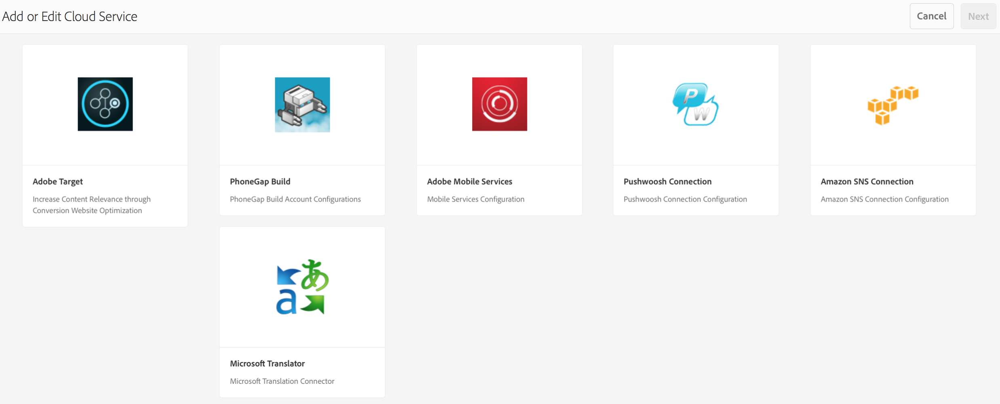

# Push-meddelanden{#push-notifications}

>[!NOTE]
>
>Adobe rekommenderar att du använder SPA Editor för projekt som kräver ramverksbaserad klientåtergivning för en sida (t.ex. Reagera). [Läs mer](/help/sites-developing/spa-overview.md).

Att omedelbart kunna informera användare av AEM-mobilappar om viktiga meddelanden är avgörande för värdet av en mobilapp och dess marknadsföringskampanjer. Här beskrivs de steg som måste vidtas för att din app ska kunna ta emot push-meddelanden och hur du konfigurerar och skickar push-meddelanden från AEM Mobile till appen som är installerad på telefonen. I det här avsnittet beskrivs dessutom hur du konfigurerar funktionen [Djuplänkning](#deeplinking) till dina push-meddelanden.

>[!NOTE]
>
>*Push-meddelanden garanteras inte. de är mer som meddelanden. Det bästa görs att se till att alla får dem, men de är inte en garanterad leveransmekanism. Tiden för att skicka en push-funktion kan variera från mindre än en sekund till upp till en halvtimme.*

Användningen av push-meddelanden med AEM kräver några olika tekniker. Först måste en leverantör av push-meddelandetjänster användas för att hantera meddelanden och enheter (AEM gör inte detta ännu). Två leverantörer är färdiga konfigurationer med AEM: Amazon [Simple Notification Service](https://aws.amazon.com/sns/) (eller SNS) och [Pushwoosh](https://www.pushwoosh.com/). För det andra måste push-tekniken för det angivna mobiloperativsystemet gå via lämplig tjänst - Apples Push Notification Service (eller APNS) för iOS-enheter. och Google Cloud Messaging (eller GCM) för Android-enheter. Även om AEM inte kommunicerar direkt med dessa plattformsspecifika tjänster måste viss relaterad konfigurationsinformation tillhandahållas av AEM tillsammans med aviseringarna för att dessa tjänster ska kunna utföra push-åtgärden.

Så här fungerar den när den har installerats och konfigurerats (se nedan):

1. Ett push-meddelande skapas i AEM och skickas till tjänstleverantören (Amazon SNS eller Pushwoosh).
1. Tjänsteleverantören tar emot den och skickar den till huvudleverantören (APNS eller GCM).
1. Kärnleverantören skickar meddelandet till alla enheter som registrerats för den push-åtgärden. För varje enhet används mobildatanätverket eller WiFi, beroende på vilket som är tillgängligt på enheten.
1. Meddelandet visas på enheten om appen som det är registrerat för inte körs. En användare som trycker på meddelandet startar programmet och visar meddelandet i programmet. Om programmet redan körs visas bara meddelandet i appen.

Den här versionen av AEM har stöd för iOS- och Android-mobilenheter.

## Översikt och procedur {#overview-and-procedure}

Om du vill använda push-meddelanden i en AEM-mobilapp måste du vidta följande åtgärder på hög nivå.

Vanligtvis gör en AEM-utvecklare följande:

1. Registrera dig hos Apple och Google Messaging Services
1. Registrera dig hos en push-meddelandetjänst och konfigurera den
1. Lägg till push-stöd i appen
1. Förbered en telefon för testning

En AEM-administratör kommer att:

1. Konfigurera push-teknik för AEM-appar
1. Bygg och distribuera appen
1. Skicka ett push-meddelande
1. Konfigurera djuplänkning *(valfritt)*

### Steg 1: Registrera dig hos Apple och Google Messaging Services {#step-register-with-apple-and-google-messaging-services}

#### Använda Apple Push Notification Service (APNS) {#using-the-apple-push-notification-service-apns}

Gå till Apple-sidan [här](https://developer.apple.com/library/ios/documentation/NetworkingInternet/Conceptual/RemoteNotificationsPG/Chapters/ApplePushService.html) för att bekanta dig med Apple Push Notification Service.

Om du vill använda APNS måste du ha en **certifikatfil** (en .cer-fil), en push- **privat nyckel** (en .p12-fil) och ett **privat nyckellösenord** från Apple. Instruktioner om hur du gör det finns [här](https://developer.apple.com/library/ios/documentation/NetworkingInternet/Conceptual/RemoteNotificationsPG/Chapters/ProvisioningDevelopment.html).

#### Använda tjänsten Google Cloud Messaging (GCM) {#using-the-google-cloud-messaging-gcm-service}

>[!NOTE]
>
>Google ersätter GCM med en liknande tjänst som kallas Firebase Cloud Messaging (FCM). Mer information om FCM finns [här](https://developers.google.com/cloud-messaging/faq).

Gå till Google-sidan [här](https://developer.android.com/google/gcm/index.html) för att bekanta dig med Google Cloud Messaging för Android.

Du måste följa stegen [här](https://developer.android.com/google/gcm/gs.html) för att **skapa ett Google API-projekt**, **aktivera GCM-tjänsten** och **hämta en API-nyckel**. Du behöver **API-nyckeln** för att skicka push-meddelanden till Android-enheter. Registrera också ditt **projektnummer**, som ibland även kallas **GCM-avsändar-ID**.

I följande steg visas ett annat sätt att skapa GCM API-nycklar:

1. Logga in på Google och gå till [Googles Developer-sida](https://developers.google.com/mobile/add?platform=android&cntapi=gcm).
1. Välj din app i listan (eller skapa en ny).
1. Ange ditt program-ID under Android-paketnamn, dvs. `com.adobe.cq.mobile.weretail.outdoorsapp`. (Om det inte fungerar kan du försöka igen med &quot;test.test&quot;.)
1. Klicka på **Fortsätt för att välja och konfigurera tjänster**
1. Välj Cloud Messaging och klicka sedan på **Aktivera Google Cloud Messaging**.
1. Den nya API-nyckeln för servern och (ny eller befintlig) avsändar-ID visas.

>[!NOTE]
>
>Spela in Server-API-nyckeln. Detta värde anges på din push-leverantörs webbplats.

### Steg 2: Registrera och konfigurera en push-meddelandetjänst {#step-register-and-configure-a-push-messaging-service}

AEM är konfigurerat att använda en av tre tjänster för push-meddelanden:

* Amazon SNS
* Pushwoosh
* Adobe Mobile Services

*Med konfigurationerna Amazon SNS* och *Pushwoosh* kan du skicka push-meddelanden från AEM-skärmar.

*Med konfigurationen för Adobe Mobile Services* kan du konfigurera och skicka push-meddelanden från Adobe Mobile Services med ett Adobe Analytics-konto (men appen måste skapas med den här konfigurationsuppsättningen för att AMS-push-meddelanden ska kunna aktiveras).

#### Använda Amazon SNS meddelandetjänst {#using-the-amazon-sns-messaging-service}

>[!NOTE]
>
>*Information om Amazon SNS och en länk för att skapa ett nytt AWS-konto finns[här](https://aws.amazon.com/sns/). Du kan få ett kostnadsfritt konto i ett år.*

Om du inte vill använda Amazon SNS kan du hoppa över dessa steg.

Följ de här stegen för att konfigurera Amazon SNS för push-meddelanden:

1. **Registrera dig hos Amazon SNS**

   1. Registrera ditt konto-ID. Formatet ska vara tolv siffror utan blanksteg eller streck, dvs. &quot;123456789012&quot;.
   1. Se till att du befinner dig i regionen&quot;us-East&quot; eller&quot;eu&quot;, vilket kräver ett av dessa steg i ett senare steg (Skapa identitetspool).
   1. När du har registrerat dig loggar du in på hanteringskonsolen och väljer [SNS](https://console.aws.amazon.com/sns/) (Push Notification Service). Klicka på&quot;Kom igång&quot; om det visas.

1. **Skapa åtkomstnyckel och ID**

   1. Klicka på ditt inloggningsnamn i skärmens övre högra hörn och välj Säkerhetsuppgifter på menyn.
   1. Klicka på Åtkomsttangenter och klicka på **Skapa ny åtkomstnyckel** i utrymmet nedan.
   1. Klicka på **Visa åtkomstnyckel** och kopiera och spara ID:t för åtkomstnyckel och hemlig åtkomstnyckel som visas. Om du väljer att hämta nycklarna får du en CSV-fil som innehåller samma värden.
   1. Andra säkerhetsrelaterade certifikat, och andra, kan hanteras på den här sidan.
   >[!NOTE]
   >
   >En åtkomstnyckel kan användas för flera appar.

   För organisationer som använder ett&quot;AWS Sandbox&quot;-konto är stegen mycket lika och beskrivs här:

   1. Klicka på ditt inloggningsnamn längst upp till höger på skärmen och välj Mina inloggningsuppgifter på menyn.
   1. Klicka på Användare i den vänstra listan med åtgärder och välj ditt användarnamn.
   1. Klicka på fliken Säkerhetsuppgifter.
   1. Här ser du dina nycklar och skapar nya nycklar. Spara knapparna för senare bruk.

1. **Skapa ett ämne**

   1. Klicka på **Skapa ämne** och välj ett ämnesnamn. Spela in alla fält, t.ex. Ämnesnamn, Ämnesägare, Region och Visningsnamn.
   1. Klicka på **Andra ämnesåtgärder** > **Redigera ämnesprofil**. Under **Tillåt dessa användare att prenumerera på det här avsnittet** väljer du **Alla.**
   1. Klicka på **Uppdatera princip**.
   >[!NOTE]
   >
   >Du kan skapa flera ämnen för olika scenarier, t.ex. dev, test, demo och så vidare. Resten av SNS-konfigurationen kan vara densamma. Bygg appen med olika ämnen; push-meddelanden som skickas till det ämnet tas endast emot av appen som skapats med det ämnet.

1. **Skapa plattformsprogram**

   1. Klicka på Program och sedan på Skapa plattformsprogram. Välj ett namn och välj en plattform (APNS för iOS, GCM för Android). Beroende på vilken plattform som används måste andra fält fyllas i:

      1. För APNS måste en P12-fil, ett lösenord, ett certifikat och en privat nyckel anges. Dessa borde ha hämtats i steget *med Apple Push Notification Service (APNS)* ovan.
      1. För GCM måste en API-nyckel anges. Detta borde ha gjorts i steget *Använda tjänsten* Google Cloud Messaging ovan.
   1. Upprepa ovanstående steg en gång för varje plattform som du kommer att stödja. Om du vill kunna skicka till både iOS och Android måste du skapa två plattformsprogram.

1. **Skapa en identitetspool**

   1. Använd [Cognito](https://console.aws.amazon.com/cognito) för att skapa en identitetspool som lagrar grundläggande data för oautentiserade användare. Observera att endast regionerna&quot;us-east&quot; och&quot;eu&quot; för närvarande stöds av Amazon Cognito.
   1. Ge den ett namn och markera kryssrutan &quot;Aktivera åtkomst till oautentiserade identiteter&quot;.
   1. På nästa sida (&quot;*Dina Cognito-identiteter kräver åtkomst till dina resurser*&quot;) klickar du på Tillåt.
   1. Klicka på länken *Redigera identitetspool längst upp till höger på sidan*. Identitetspoolens ID visas. Spara den här texten till senare.
   1. På samma sida väljer du listrutan bredvid Oautentiserad roll och ser till att rollen Cognito_&lt;poolnamn>UnauthRole är vald. Spara ändringarna.

1. **Konfigurera åtkomst**

   1. Logga in på [IAM (Identity and Access Management](https://console.aws.amazon.com/iam/home) )
   1. Välj roller
   1. Klicka på den roll som skapades i föregående steg, med namnet Cognito_&lt;yourIdentityPoolName>Unauth_Role. Spela in&quot;Roll-ARN&quot; som visas.
   1. Öppna Inline Policies om det inte redan är öppet. Du bör se en princip där med ett namn som oneClick_Cognito_&lt;yourIdentityPoolName>Unauth_Role_1234567890123.
   1. Klicka på Redigera profil. Ersätt innehållet i policydokumentet med det här JSON-fragmentet:
   <table>
    <tbody>
     <tr>
     <td>
 
 
{
 
 "Version": "2012-10-17",
 
 "Programsats": [
 
 {
 
 "Åtgärd": [
 
 "mobileanalytics:PutEvents",
 
 "cognito-sync:*",
 
 "SNS:CreatePlatformEndpoint",
 
 "SNS:Subscribe"
 
 ],
 
 "Effekt": "Tillåt",
 
 "Resurs": [
 
 "*"
 
 ]
 
 }
 
 ]
 
}
 
 
 </td>
     </tr>
    </tbody>
    </table>

   1. Klicka på **Använd profil**

#### Använda meddelandetjänsten Pushwoosh {#using-the-pushwoosh-messaging-service}

Om du inte vill använda Pushwoosh kan du hoppa över det här steget.

Så här använder du Pushwoosh:

1. **Registrera dig hos Pushwoosh**

   1. Gå till pushwoosh.com och skapa ett nytt konto.

1. **Skapa en API-åtkomsttoken**

   1. På Pushwoosh-webbplatsen går du till menyalternativet API Access för att generera en API Access-token. Du måste registrera detta säkert.

1. **Skapa en ny app**

   1. För Android-stöd måste du ange GCM API-nyckeln.
   1. När du konfigurerar programmet väljer du Cordova som ramverk.
   1. För iOS-stöd måste du ange certifikatfilen (.cer), push-certifikatet (.p12) och lösenordet för den privata nyckeln. dessa borde ha hämtats från Apples APNS- sajt. Välj Cordova under Framework.
   1. Pushwoosh genererar ett app-ID för den appen, i formatet&quot;XXXXX-XXXXX&quot;, där varje X är ett hexadecimalt värde (0 till F).

>[!NOTE]
>
>*Om en andra app har konfigurerats i AEM med samma program-ID (och andra relaterade värden: API Access-token och GCM-ID), kommer push-meddelanden som skickas via den andra appen på AEM att skickas till andra appar med det app-ID:t.*

### Steg 3: Lägg till push-stöd i appen {#step-add-push-support-to-the-app}

#### Lägg till ContentSync-konfiguration {#add-contentsync-configuration}

Skapa två innehållsnoder (en i app-config och en i app-config-dev) som kallas notificationConfig:

* /content/`<your app>`shell/jcr:content/page-app/app-config-dev/notificationsConfig
* /content/`<your app>`shell/jcr:content/page-app/app-config/notificationsConfig

Med dessa egenskaper (.content.xml-filer):
&lt;jcr:root xmlns:jcr=&quot; [https://www.jcp.org/jcr/1.0](https://www.jcp.org/jcr/1.0)&quot; xmlns:nt=&quot; [https://www.jcp.org/jcr/nt/1.0](https://www.jcp.org/jcr/nt/1.0)&quot;jcr:primaryType=&quot;nt:unStruced&quot;excludeProperties=&quot;[appAPIAccessToken]&quot;path=&quot;../../../...&quot;
targetRootDirectory=&quot;www&quot;type=&quot;notificationsconfig&quot;/>

>[!NOTE]
>
>Hanteraren för innehållssynkronisering söker efter dessa noder, och om de inte finns där skrivs inte filen page-notifications-config.json ut.

#### Lägg till klientbibliotek {#add-client-libraries}

Klientbiblioteken för push-meddelanden måste läggas till i programmet genom att följa dessa steg:

I CRXDE Lite:

1. Navigera till */etc/designs/phonegap//clientlibsall.*
1. Dubbelklicka på inbäddningsavsnittet i egenskapsrutan.
1. I dialogrutan som visas lägger du till ett nytt klientlib genom att klicka på plusknappen (+).
1. Lägg till&quot;cq.mobile.push&quot; i det nya textfältet och klicka på OK.
1. Lägg till ytterligare en så kallad cq.mobile.push.amazon och klicka på OK.
1. Spara ändringarna.

>[!NOTE]
>
>Om push-meddelanden tas bort, eller inte används, av utrymmesskäl i appen och för att undvika konsolfelmeddelanden, tar du bort dessa klientlibs från appen.

### Steg 4: Förbered en telefon för testning {#step-prepare-a-phone-for-testing}

>[!NOTE]
>
>*För push-meddelanden måste du testa på en faktisk enhet eftersom emulatorer inte kan ta emot push-meddelanden.*

#### IOS {#ios}

För iOS måste du använda en Mac OS-dator och du måste gå med i [iOS Developer Program](https://developer.apple.com/programs/ios/). Vissa företag har företagslicenser som kan vara tillgängliga för alla utvecklare.

I XCode 8.1 måste du gå till fliken Funktioner i projektet innan du använder push-meddelanden och växla mellan att aktivera push-meddelanden.

#### Android {#android}

Så här installerar du appen på en Android-telefon med CLI (se nedan: **Steg 6 - Bygg och distribuera appen**) måste du först placera telefonen i&quot;utvecklarläge&quot;. Mer information om hur du gör detta finns i [Aktivera alternativ](https://developer.android.com/tools/device.html#developer-device-options) för utvecklare på enheter.

### Steg 5: Konfigurera push-teknik för AEM-appar {#step-configure-push-on-aem-apps}

Innan du skapar och distribuerar till din konfigurerade mobila enhet måste du konfigurera meddelandeinställningarna för den meddelandetjänst som du valde att använda.

1. Skapa lämpliga auktoriseringsgrupper för push-meddelanden.
1. Logga in på AEM som lämplig användare och klicka på fliken Appar.
1. Klicka på appen.
1. Leta reda på panelen Hantera molntjänster och klicka på pennan för att ändra dina molnkonfigurationer.
1. Välj Amazon SNS Connection, Pushwoosh Connection eller Adobe Mobile Services som meddelandekonfiguration.
1. Ange leverantörsegenskaperna och klicka på Skicka för att spara dem och Klar. De kontrolleras inte på fjärrbasis i detta skede, utom när det gäller AMS.
1. Du bör nu se konfigurationen som du just angav på panelen Hantera molntjänster.

### Steg 6: Bygg och distribuera appen {#step-build-and-deploy-the-app}

**** Obs! Se även instruktionerna [här](/help/mobile/building-app-mobile-phonegap.md) om hur du skapar PhoneGap-program.

Det finns två sätt att skapa och distribuera din app med PhoneGap.

**** Obs! För testning av push-meddelanden räcker det inte med emulatorer eftersom push-meddelanden använder ett distinkt protokoll mellan push-providern (Apple eller Google) och enheten. Aktuell Mac/PC-maskinvara och emulatorer stöder inte detta.

1. *PhoneGap Build* är en tjänst som erbjuds av PhoneGap som skapar din app åt dig på deras servrar och gör att du kan hämta den direkt till din enhet. Läs [PhoneGap Build-dokumentationen](https://build.phonegap.com/) om du vill veta mer om hur du konfigurerar och använder PhoneGap Build.

1. *Med PhoneGap Command Line Interface* (CLI) kan du använda en mängd PhoneGap-kommandon på kommandoraden för att skapa, felsöka och distribuera programmet. Läs [PhoneGap-utvecklardokumentationen](https://docs.phonegap.com/en/edge/guide_cli_index.md.html#The%20Command-Line%20Interface) om du vill veta mer om hur du konfigurerar och använder PhoneGap CLI.

### Steg 7: Skicka ett push-meddelande {#step-send-a-push-notification}

Följ de här stegen för att skapa ett nytt meddelande och skicka det.

1. Skapa ett nytt meddelande

   * På din AEM Mobile-apps kontrollpanel hittar du panelen Push Notifications (Push-meddelanden).
   * Välj &quot;Skapa&quot; på menyn uppe till höger. Observera att den här knappen inte är tillgänglig förrän molnkonfigurationen har ställts in.
   * I guiden Skapa meddelande anger du en titel och ett meddelande och klickar sedan på knappen&quot;Skapa&quot;. Meddelandet är nu klart att skickas omedelbart eller senare. Den kan redigeras och du kan ändra och spara meddelandet och/eller titeln.

1. Skicka meddelandet

   * Leta reda på panelen Push Notifications (Push-meddelanden) på panelen Apps.
   * Markera meddelandet eller klicka på informationsknappen längst ned till höger (. . .) för att visa listan med meddelanden. Den här listan anger också om ett meddelande är klart att skickas, om det redan har skickats eller om ett fel uppstod när meddelandet skickades.
   * Markera kryssrutan för ett meddelande (endast) och klicka på knappen&quot;Skicka meddelande&quot; ovanför listan. Du kan välja att&quot;avbryta&quot; eller&quot;skicka&quot; meddelandet i den dialogruta som visas.

1. Hantera resultaten

   * Om tjänsten för push-meddelanden (Amazon SNS eller Pushwoosh) tar emot sändningsbegäran, bekräftar att den är giltig och skickar den till ANE-leverantörer (APNS och GCM) stängs dialogrutan Skicka utan meddelande. Statusen för det meddelandet visas som Skickat i meddelandelistan.
   * Om push-sändningen misslyckas visas ett meddelande som anger problemet. I meddelandelistan anges meddelandets status som Fel, men om problemet åtgärdas kan meddelandet skickas igen. Om ett fel uppstår bör ytterligare felinformation finnas i serverfelloggen.
   * Observera att det finns vissa plattformsskillnader mellan push-meddelanden för iOS och Android. Bland dem:

      * När appen har distribuerats på Android kommer den att startas med CLI. I iOS måste du starta det manuellt. Eftersom push-registreringssteget inträffar vid start kan Android-appar få push-meddelanden direkt (eftersom det har startats och registrerats), vilket iOS-appar inte kommer att göra.
      * I Android är texten för knappen OK i versaler (och i alla andra knappar som läggs till i meddelandet i appen), men inte i iOS.

För AMS-push-meddelanden måste meddelanden skapas och skickas från AMS-servern. AMS har ytterligare funktioner för push-meddelanden utöver de som AEM skickar till AWS och Pushwoosh.

>[!NOTE]
>
>*Push-meddelanden garanteras inte. de är mer som meddelanden. Det bästa görs att se till att alla hör det, men de är inte en garanterad leveransmekanism. Tiden för att skicka en push-funktion kan variera från mindre än en sekund till upp till en halvtimme.*

### Konfigurera djup länkning med push-meddelanden {#configuring-deep-linking-with-push-notifications}

Vad är Djuplänkning? I samband med ett push-meddelande är det ett sätt att tillåta att en app öppnas eller dirigeras (om den är öppen) till en viss plats i programmet.

Hur fungerar det? Författaren av ett push-meddelande kan lägga till en knappetikett (d.v.s. &quot;Visa mig!&quot;) till meddelandet och väljer den sida som de vill länka i meddelandet via en visuell sökvägsläsare. När det skickas utförs push-åtgärden som vanligt förutom att knappen OK ersätts av knappen&quot;Stäng&quot; i meddelandet i appen och den nya knappen anges (&quot;Visa mig!&quot;) visas också. Om du klickar på den nya knappen kommer programmet att gå till den angivna sidan i programmet. Om du klickar på Stäng stängs meddelandet.

Om appen inte är öppen visas skuggan som vanligt. Om du utför en åtgärd på meddelandet i skuggningen öppnas appen och användaren får sedan tillgång till knapparna för djup länk baserat på vad som konfigurerats i push-meddelandet.

Skapa meddelandet, lägg till knapptext och länksökväg för den valfria länken:

>[!CAUTION]
>
>.Följ stegen nedan om du vill öppna panelen Push Notification (Push-meddelanden) på instrumentpanelen.

1. Klicka på redigeringen i det övre högra hörnet av rutan **Hantera molntjänster** .

   

1. Välj **Pushwoosh Connection**. Click **Next**.

   

1. Ange information om egenskaperna och klicka på **Skicka**.

   

   När du har skickat konfigurationen visas rutan **Push Notifications (Push-meddelanden** ) på kontrollpanelen.

   

### Guiden Skapa meddelande {#create-notification-wizard}

När panelen **Push Notifications (Push-meddelanden** ) visas på kontrollpanelen använder du guiden create notification för att lägga till innehållet:

1. Klicka på symbolen Lägg till i det övre högra hörnet av rutan **Push Notifications (Push-meddelanden** ) för att öppna guiden **** Create Notification.

   

1. Om du klickar på bläddringsikonen i länksökvägen visas programmets innehållsstruktur för användaren.

   Klicka på bockikonen när du har valt sökvägen.

   

   >[!NOTE]
   >
   >Länkknappstexten får innehålla högst 20 tecken.
   >
   >Om slutanvändaren inte har den senaste versionen av programmet och den länkade sökvägen inte är tillgänglig kommer användaren att hamna på programmets huvudsida om åtgärden för den djupa länken bekräftas.

1. Ange **textinformationen** i guiden **** Skapa meddelande och klicka på **Skapa**.

   

   Öppna informationen genom att klicka på det push-meddelande som du skapade i rutan **Push Notifications (Push-meddelanden** ).

   Du kan redigera egenskaper, skicka meddelanden eller ta bort meddelandet.

   

>[!NOTE]
>
>**Ytterligare information**:
>
>Pushwoosh och Amazon SNS stöds inte efter version 6.4 och kommer att vara tillgängliga som tillägg från paketresursen.

### Nästa steg {#the-next-steps}

När du har fått mer information om push-meddelanden för din app kan du läsa [AEM Mobile Content Personalization](/help/mobile/phonegap-aem-mobile-content-personalization.md).

