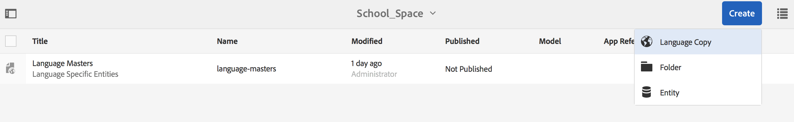
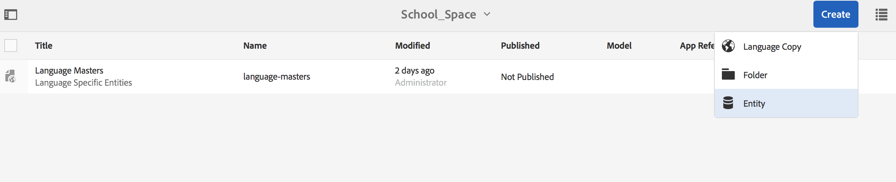
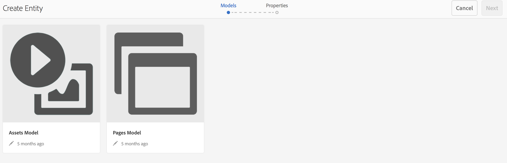

# Blanksteg och entiteter{#spaces-and-entities}

>[!NOTE]
>
>Adobe rekommenderar att du använder SPA Editor för projekt som kräver ramverksbaserad klientåtergivning för en sida (t.ex. Reagera). [Läs mer](/help/sites-developing/spa-overview.md).

Ett space är en praktisk plats där du kan lagra enheter som exponeras via Content Services REST API. Detta är särskilt användbart eftersom ett program (eller en kanal) kan associeras med många enheter. Tvinga entiteter att vara inom ett space att gruppera en apps krav på bästa sätt. Du kan även associera en app i AEM med ett litet antal mellanslag.

>[!NOTE]
>
>För att göra något tillgängligt för alla kanaler från Content Services måste det finnas under ett mellanslag.

## Skapa ett blanksteg {#creating-a-space}

Om användaren vill visa en massa innehåll och resurser för en mobilapp skapar användaren utrymmet med AEM Mobile-kontrollpanelen.

För första gången, som inte har konfigurerat innehållstjänster för att arbeta med blanksteg, visas endast appar på AEM Mobile-kontrollpanelen när du har valt **Innehållstjänster**.

>[!CAUTION]
>
>**Krav för att lägga till ett blanksteg**
>
>Markera **Aktivera AEM Content Services** för att arbeta med Spaces och aktivera det på din AEM Mobile-kontrollpanel.
>
>Mer information finns i [Administrera innehållstjänster](/help/mobile/developing-content-services.md) .

När du har konfigurerat Spaces på kontrollpanelen gör du så här för att skapa Spaces:

1. Välj **Blanksteg** från innehållstjänster.

   

1. Välj **Skapa** om du vill skapa ett utrymme. Ange **Rubrik**, **Namn** och **Beskrivning** för utrymmet.

   Klicka på **Skapa**.

   

## Hantera blanksteg {#managing-a-space}

När du har skapat ett blanksteg klickar du till vänster för att hantera det i listan.

Du kan visa egenskaper för utrymmet, ta bort utrymmet eller publicera utrymmet och innehållet i det till en AEM-publiceringsinstans.

**Visa och redigera egenskaper för ett blanksteg**

1. Markera utrymmet i listan
1. Välj **Egenskaper** i verktygsfältet
1. Klicka på **Stäng** när du är klar

**Publicera ett space** När ett space publiceras publiceras även alla mappar och enheter i det utrymmet.

1. Markera utrymmet genom att klicka på dess ikon i listan Space Console
1. Välj **publiceringsträd**

>[!NOTE]
>
>Du kan **avpublicera** ett space, vilket tar bort utrymmet från publiceringsinstansen.
>
>Följande bild visar vilka åtgärder som kan utföras när du har publicerat utrymmet.

## Arbeta med mappar i ett space {#working-with-folders-in-a-space}

Blanksteg kan innehålla mappar för att ytterligare ordna utrymmets innehåll och resurser. Användare kan skapa en egen hierarki under ett space.

### Skapa en mapp {#creating-a-folder}

1. Klicka på utrymmet i listan i utrymmeskonsolen och klicka på **Skapa mapp**

   

1. Ange **mappens namn**, **** namn och **beskrivning**

   

1. Klicka på **Skapa** för att skapa mappen i ett space

## Språkkopia {#language-copy}

>[!CAUTION]
>
>Språkkopian fungerar inte fullt ut i den här versionen. Den ställer bara in strukturen.

Med funktionen **Språkkopia** kan författare kopiera sin huvudspråkkopia och sedan skapa ett projekt och ett arbetsflöde för att automatiskt översätta innehållet. Med Language Copy skapas rätt struktur. När du har lagt till en mapp på ett space kan du lägga till språkkopia på ditt space.

>[!NOTE]
>
>Vi rekommenderar att allt innehåll som kan översättas placeras under noden Språkkopia.

### Lägga till språkkopia {#adding-language-copy}

1. När du har skapat utrymme klickar du på det utrymmet för att skapa en språkkopia.

   Klicka på **Skapa** och välj **Språkkopia**.

   

   >[!NOTE]
   >
   >Språkkopieringsnoder kan bara finnas som direkt underordnad till Space.

1. **** Välj **innehållspaketets språk&amp;stämpel;senast; och ange** titel&amp;stämpel;ast; i dialogrutan **Skapa språkkopia** .

   Klicka på **Skapa**.

   

1. När du har skapat en språkkopia visas den på ditt space i **Språkmallsidor**.

   

   >[!NOTE]
   >
   >Välj **Språkmallsidor** om du vill visa mapparna för språkkopiering.

### Ta bort en mapp från utrymmet {#removing-a-folder-from-the-space}

1. Markera mappen i listan med utrymmesinnehåll
1. Klicka på **Ta bort** i verktygsfältet

   >[!NOTE]
   >
   >Om du vill navigera till en mapp och visa dess innehåll eller lägga till en undermapp eller enhet klickar du på mappens namn i utrymmets innehållslista.

## Arbeta med entiteter i ett blanksteg {#working-with-entities-in-a-space}

Enheter representerar innehåll som visas via webbtjänstens slutpunkt. Enheterna lagras i utrymmen så att de enkelt kan hittas och lagras oberoende av AEM-databasstrukturen som innehåller deras relaterade innehåll.

Du kanske vill gruppera enheter tillsammans i en logisk samling. Det gör du genom att skapa valfritt antal mappar.

Om underordnade entiteter, som är andra entiteter, samlas in för datamodellering, kan utvecklaranvändaren skapa specifika gruppmodeller från modelltypen&quot;Enhetsgrupp&quot;, som finns i kartongen.

>[!NOTE]
>
>Enheter är alltid kopplade till ett utrymme, så de flesta entitetsanvändargränssnittet nås via utrymmeskonsolen.

### Skapa en enhet {#creating-an-entity}

1. Öppna Space-konsolen och klicka på utrymmets rubrik.

   Du kan även navigera till mappen genom att klicka på mappens namn i listan.

   

1. Välj modell för entiteten. Det här är den typ av enhet som du vill skapa. Klicka på Nästa.

   

   >[!NOTE]
   >
   >Du kan välja **Resursmodell**, **Sidmodell** eller en modell av en enhetstyp som du skapade tidigare.
   >
   >Se [Skapa en modell](/help/mobile/administer-mobile-apps.md)för att skapa en anpassad enhet.

1. Ange **titel**, **namn**, **beskrivning** och **taggar** för entiteten. Klicka på **Skapa**.

   

   När du är klar visas enheten i ditt space med underordnade.

### Redigera en enhet {#editing-an-entity}

1. När du har skapat en enhet går du till din mapp eller ditt space och väljer din enhet från Space-konsolen för att redigera.

   

1. Markera en enhet för redigering och klicka på **Redigera**.

   

   >[!CAUTION]
   >
   >Beroende på vilken mall du väljer för att skapa din enhet, kommer användargränssnittet att vara annorlunda för båda, för att redigera och visa egenskaper för din enhet. Se stegen nedan för mer information.

   ***Om du väljer en mall för att skapa enheten som Resursmodeller*** kan du lägga till resurser enligt bilden nedan genom att klicka på **Redigera** :

   

   Du kan också klicka på **Förhandsgranska** för att visa json-länken.

   

   ***Om du väljer en mall för att skapa enheten som Sidmodeller*** kan du lägga till resurser enligt bilden nedan genom att klicka på **Redigera** :

   

   Klicka på ikonen i **banan** för att lägga till en resurs

   

   >[!NOTE]
   >
   >När du har lagt till en entitet måste den sparas för att länken Förhandsgranska ska fungera. Om du vill visa förhandsgranskningen klickar du på **Spara**. När du klickar på **Förhandsgranska** visas den tillagda resursens json, vilket visas i figuren nedan:

   

   >[!NOTE]
   >
   >När du är klar med att lägga till resurser till din enhet kan du antingen välja **Spara** för att spara ändringarna eller välja **Spara och stäng** för att spara och omdirigera till den Space-konsollista där enheterna definieras.

   Dessutom väljer du en enhet i utrymmeskonsollistan och klickar på **Egenskaper** för att visa och redigera egenskaperna för en definierad enhet.

   

   Du kan redigera titeln, beskrivningen, taggarna och lägga till resurserna i enheten.

   

### Tar bort en entitet {#removing-an-entity}

1. Välj enheten i listan med utrymmesinnehåll

   

1. Klicka på **Ta bort** i verktygsfältet för att ta bort den specifika enheten från utrymmet

### Publicera en enhet {#publishing-an-entity}

Du kan välja **Publiceringsträd** eller **Snabbpublicering** för att publicera din entitet.

1. Välj en entitet från utrymmeskonsollistan och klicka på **Publiceringsträd **för att publicera entiteten och dess underordnade objekt.

   

   **Eller**,

   Klicka på **Snabbpublicering** för att publicera den specifika entiteten.
