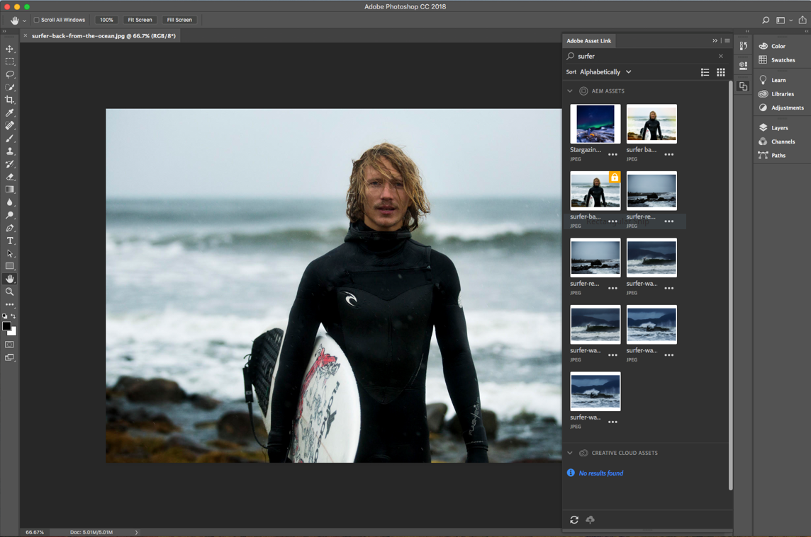
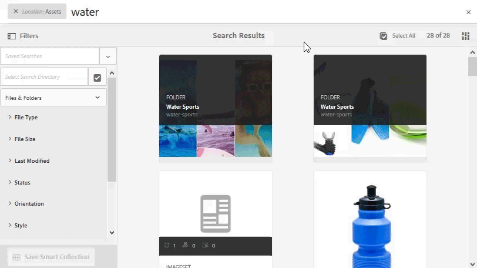

# Versionsinformation om AEM Resurser{#aem-assets-release-notes}

Här är de viktigaste funktionerna och nyheterna i AEM 6.5 Assets-versionen.

## Integrering med Adobe Creative Cloud och kreativa arbetsflöden {#integration-with-adobe-creative-cloud-and-creative-workflows}

AEM erbjuder olika sätt att integrera med Adobe Creative Cloud och dela resurser för användning i arbetsflöden där kreatörerna och marknadsförarna eller affärsteamen samarbetar nära. AEM 6.5 fortsätter att förbättra integreringen och effektivisera den ytterligare för att ge fler möjligheter och effektivisera befintliga metoder.

Läs vidare för att lära dig mer om de specifika funktioner och integreringar i AEM 6.5 som ni kan använda för att få bästa möjliga stöd för era användningsfall inom snabbhet.

### Adobe Asset Link {#aal}

Adobe Asset Link stärker samarbetet mellan kreatörer och marknadsförare när det gäller att skapa innehåll. Kreatörer kan komma åt innehåll som lagras i Adobe Experience Manager Assets (AEM Assets) utan att lämna de program de är mest bekanta med. Med hjälp av panelen i appen i Photoshop-, Illustrator- och InDesign-programmen kan du enkelt söka efter, checka ut och checka in resurser.

Adobe Asset Link ingår i [Creative Cloud for enterprise](https://www.adobe.com/creativecloud/business/enterprise.html) -erbjudandet. Mer information om den, inklusive nödvändig konfiguration av din AEM-distribution, finns i [Adobe Asset Link](https://helpx.adobe.com/enterprise/using/adobe-asset-link.html).

### Integrering med Adobe Stock {#stock}

Din organisation kan använda sin Adobe Stock Enterprise-plan i AEM Resurser för att se till att licensierade mediefiler finns tillgängliga för dina kreativa projekt och marknadsföringsprojekt. Du kan snabbt hitta, förhandsgranska och licensiera Adobe Stock-mediefiler som har sparats i AEM med de kraftfulla DAM-funktionerna i AEM.

Adobe Stock ger designers och företag tillgång till miljontals utvalda och royaltyfria foton, vektorer, illustrationer, videor, mallar och 3D-resurser av hög kvalitet för alla kreativa projekt.

Mer information finns i [Använda Adobe Stock-resurser i AEM-resurser](/help/assets/aem-assets-adobe-stock.md).

Förhandsgranska Adobe Stock-bild och licens inifrån AEM Assets

Söka efter och filtrera licensierade Adobe Stock-bilder i AEM

### Dynamiska referenser i Adobe InDesign {#dynamic-references-in-indesign}

De AEM Resurser som används i Adobe InDesign-filer är dynamiska. Referenserna uppdateras automatiskt om de refererade resurserna flyttas i JCR-hierarkin. Mer information finns i [Hantera sammansatta resurser](/help/assets/managing-linked-subassets.md).

## Funktioner för varumärkesportalen {#brand-portal-capabilities}

AEM Assets Brand Portal hjälper er att enkelt skaffa, effektivt kontrollera och säkert distribuera godkända resurser till externa leverantörer/myndigheter och interna företagsanvändare på olika enheter. Det bidrar till att effektivisera tillgångsdelningen, snabbar upp time-to-market för tillgångar och eliminerar risken för otillåten användning och obehörig åtkomst.

Mer information finns i [Nyheter i varumärkesportalen](https://helpx.adobe.com/experience-manager/brand-portal/using/whats-new.html).

## Anslutna resurser {#connectedassets}

I stora företag kan den infrastruktur som krävs för att skapa webbplatser distribueras. Ibland finns funktionerna för att skapa webbplatser och de digitala resurser som behövs i olika vattentäta skott.

AEM Sites erbjuder funktioner för att skapa webbsidor och AEM Assets är det DAM-system (Digital Asset Management) som tillhandahåller de resurser som krävs för webbplatser. AEM stöder nu ovanstående användningsexempel genom att integrera AEM Sites och AEM Assets.

Mer information finns i [Använda resurser från en ansluten resurs](/help/assets/use-assets-across-connected-assets-instances.md).

Dra och släpp DAM-resurser från en AEM-instans på sidan Platser i en annan AEM-instans

## Dynamiska medier {#dynamic-media}

Med Dynamic Media får du förbättrade funktioner för framtagning och leverans av multimedia i AEM Assets för att skapa engagerande och personaliserade upplevelser. Genom att överföra en enda högkvalitativ masterresurs och använda vår avancerade molnrendering och våra visningsprogram kan ni leverera vilken kombination av renderingar som helst direkt för att stödja er organisations mediestrategi.

Mer information om de nya funktionerna för dynamiska media finns i [Dynamic Media Release Notes](https://marketing.adobe.com/resources/help/en_US/s7/release_notes/).

### Stöd för 360-video {#video-support}

Hantera dina 360-videofiler direkt i AEM med Dynamic Medias vassa visningsprogram och leverera VR-upplevelser till datorer, mobiler och VR-headset. Mer information finns i [Använda 360-video](/help/assets/360-video.md).

### Egna videominiatyrer {#custom-video-thumbnails}

Nu kan du anpassa miniatyrbilderna för videomaterialet med hjälp av bildrutor från själva videon eller annat innehåll som lagras i DAM. Mer information finns i [Om videominiatyrer](/help/assets/video.md#about-video-thumbnails-in-dynamic-media-scene-mode).

### Förbättringar av hjälpmedel {#accessibility-enhancements}

Dynamic Media-visningsprogram har nu stöd för förbättrade tillgänglighetsfunktioner som Aria-support, skärmläsare och Alt-text. Mer information finns i [Versionsinformation](https://marketing.adobe.com/resources/help/en_US/s7/viewers_ref/index.html)för Dynamic Media Viewer.

## Förbättrad sökupplevelse {#search-experience-enhancement}

Från och med AEM 6.5 kan marknadsförarna hitta de önskade resurserna snabbare från sökresultatsidan. Sökmetoderna uppdateras med antalet resurser även innan sökfiltret används. Genom att se det förväntade antalet mot filtret kan användarna navigera effektivt genom sökresultaten. Mer information finns i [Söka efter resurser i AEM](../assets/search-assets.md).

Se antalet resurser utan att filtrera sökresultaten i sökfaktorer.

## Förbättrad användbarhet {#usability-enhancement}

Du kan nu välja alla resurser i en mapp eller från ett sökresultat på en gång. Det hjälper dig att hantera flera resurser snabbt. Kryssrutan markerar alla resurser som passar scenariot, till exempel ett sökresultat och inte bara de resurser som är synliga i AEM-gränssnittet.

Använd alternativet Markera alla om du vill markera alla resurser med ett klick.

## Förbättringar av metadata {#metadata-enhancements}

Med Resurser kan du skapa metadatascheman för resursmappar, som definierar layouten och metadata som visas på mappegenskapssidor. Du kan nu tilldela ett mappmetadatchema till en befintlig mapp eller när du skapar en ny mapp. Mer information finns i Schema för [mappmetadata](/help/assets/folder-metadata-schema.md).

När du anger överlappande metadata kan alternativen läsas in från en JSON-fil vid körningen, till exempel i stället för att du skriver manuellt i formuläret. Mer information finns i [Överlappande metadata](/help/assets/cascading-metadata.md).

## Rapportförbättringar {#reporting-enhancements}

Innehållsfragment och länkdelningar ingår nu i rapporten över hämtade resurser. Mer information finns i [Resursrapporter](/help/assets/asset-reports.md).
