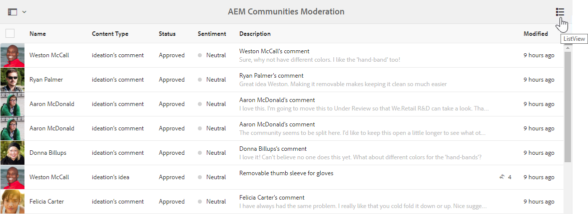

# Versionsinformation om AEM Communities{#aem-communities-release-notes}

Läs vidare om du vill se förbättringarna av AEM Communities sedan version 6.4. Mer information om de nya funktionerna finns i Användarhandbok [för](https://helpx.adobe.com/experience-manager/6-4/communities/user-guide.html)AEM 6.5 Communities.

Den senaste versionen finns i avsnittet [Distribuera communityer](https://helpx.adobe.com/in/experience-manager/6-4/help/communities/deploy-communities.html#LatestReleases) i dokumentationen.

## Stora förbättringar {#major-enhancements}

### Förbättringar av communityns engagemang {#enhancements-to-community-engagement}

**@Mentions stöder** AEM Communities tillåter nu registrerade användare att tagga (nämna) andra registrerade medlemmar för att få sin uppmärksamhet i användargenererat innehåll. Taggade (nämnda) medlemmar meddelas sedan, med en djup länk till motsvarande användargenererat innehåll. Användarna kan dock välja att inaktivera/aktivera webb- och e-postmeddelanden.

Community-användare behöver inte söka efter sina förnamn, efternamn eller användarnamn för att se om någon har kommit fram till dem eller behöver deras uppmärksamhet. Dessutom kan UGC-författare söka svar från specifika registrerade användare som bäst kan åtgärda problemet och lägga till indata.

Community-administratörerna måste **Enable Mention **on community components för att tillåta registrerade användare att använda funktionerna i dessa komponenter.

**Gruppmeddelanden**

Registrerade communitymedlemmar kan nu skicka direktmeddelanden i grupp till grupper via en enda e-postkomposition, i stället för att skicka samma meddelande till gruppmedlemmarna separat. Om du vill tillåta [gruppmeddelanden](/help/communities/configure-messaging.md)aktiverar du båda instanserna av tjänsten Meddelandeåtgärder.

### Förbättringar av massmoderering {#enhancements-to-bulk-moderation}

Egna filter i Massmoderering

[Anpassade filter](/help/communities/moderation.md#custom-filters) kan nu utvecklas och läggas till i gränssnittet för massmoderering.

Ett [exempelprojekt](https://github.com/Adobe-Marketing-Cloud/aem-communities-extensions/tree/master/aem-communities-moderation-filter) som visar filtrering med hjälp av taggar finns i [Github](https://github.com/Adobe-Marketing-Cloud/aem-communities-extensions/tree/master/aem-communities-moderation-filter). Det här projektet kan användas som bas för att utveckla analoga anpassade filter.

**Listvy i Massmoderering**

Ny listvy med förbättrat användargränssnitt har tillhandahållits i bulkmoderering för att visa användargenererade innehållsposter.

### Förbättringar av plats- och grupphantering {#enhancements-to-site-and-group-management}

**Författare av webbplats- och gruppadministratörer**

Communities, AEM 6.5 och senare, möjliggör decentraliserad administration (och förvaltning) av olika communitysajter och grupper/ kapslade grupper. Organisationer som har flera communitysajter och kapslade grupper kan nu välja medlemmar för administratörsroller på författarsidan när webbplatsen (och gruppen) skapas.

Webbplatsadministratörer kan skapa en grupp på vilken hierarkinivå som helst och bli standardadministratörer. Dessa administratörer kan senare tas bort av andra gruppadministratörer. Gruppadministratörer kan hantera sin grupp G1 och skapa en undergrupp som är kapslad under G1.

### Förbättringar av aktivering {#enhancements-to-enablement}

**Stöd för SCORM 2017.1**

Aktiveringsfunktionen i AEM 6.5 Communities stöder motorn SCORM [(Shareable Content Object Reference Model) 2017.1](https://rusticisoftware.com/blog/scorm-engine-2017-released/) .

**Tangentbordsnavigering i aktiveringskomponenter**Aktivera komponenter (t.ex. Katalog- och kursuppspelning, Uppdrag, Filbibliotek) i AEM Communities stöder tangentbordsnavigering för förbättrad tillgänglighet.

### Andra förbättringar {#other-enhancements}

* **Stöd för Solr 7**AEM 6.5 Communities stöder Apache Solr 7.0-versionen av sökplattformen när MSRP och DSRP konfigureras.
