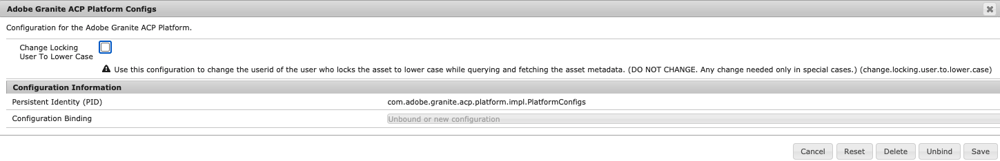

# Nyheter i [!DNL Adobe Experience Manager] 6.5 Service Pack 9 {#aem-whats-new-service-pack}

[!DNL Adobe Experience Manager] 6.5 Service Packs innehåller nya funktioner, förbättringar som kunderna efterfrågat samt prestanda-, stabilitets- och säkerhetsförbättringar med kvartalsvisa intervall. Den kvartalsvisa tillgängligheten gör det enkelt att komma åt och anta nya funktioner och innovationer.

I den här artikeln beskrivs de funktioner som ingår i det senaste Service Pack, [nyckelfunktioner som ingår i det föregående 6.5 Service Pack](#key-features-previous-service-packs) och [nyckelversionerna sedan den senaste Service Pack](#key-releases-since-last-sp)-versionen.

>[!NOTE]
>
>Från och med AEM Service Pack 9 kan [!DNL Experience Manager]-kunder utveckla och använda sina [!DNL Experience Manager]-program med distributioner av [!DNL Azul Zulu]-byggen av OpenJDK, som följer Java SE-standarden.
>Adobe stöder också [!DNL Azul Zulu] JDK:er till [!DNL Experience Manager]-kunder.
>Du kan hämta relevanta versioner av [!DNL Azul Zulu JDKs] från [Adobe Software Distribution](https://experience.adobe.com/#/downloads/content/software-distribution/en/aem.html).
>Användarrättigheterna för Oraclet Java-tekniken, som distribuerats av Adobe, upphör att gälla i slutet av december 2022. [!DNL Experience Manager] Vi rekommenderar att man planerar och implementerar användning för  [!DNL Azul Zulu] JDK senast detta datum. Mer information om användningen av [!DNL Oracle Java]-tekniken och [!DNL Azul Zulu]-tekniken finns i [Frågor och svar](https://experienceleague.adobe.com/docs/experience-manager-65/assets/adobe-azul-openjdk-license-agreement.pdf?lang=en).

## [!DNL Adobe Experience Manager Sites] {#aem-sites}

### Möjlighet att återställa borttagna sidor och träd {#ability-to-restore-pages-tree}

Du kan nu återställa de borttagna sidorna och hela trädvyn på en [!DNL Experience Manager Sites]-sida.

## [!DNL Adobe Experience Manager Assets] {#aem-assets}

* Uppdaterade namngivningen av kinesiska språk och regioner med anknytning till Hong Kong, Macau och Taiwan för att få dem att överensstämma med kinesiska sociala och politiska åsikter.

* En valfri konfiguration introduceras för att skapa gemener i e-post-ID:n i AVS API-svar från [!DNL Adobe Experience Manager].

   

* Kontrasten (med bakgrund) för text och ikoner på olika ställen förbättras enligt WCAG-standarden så att den blir tillgänglig för användare med begränsad syn och uppfattning om färg. Mer information finns i [Tillgänglighetsförbättringar i Resurser](sp-release-notes.md#assets-accessibility-6590).

### Dynamic Media {#assets-dynamic-media}

* [Dynamiska medier är mer ](sp-release-notes.md#assets-accessibility-6590) tillgängliga när det gäller

   * användarvänlighet med tangentbordstangenter.
   * kontrast (med bakgrund) för text, platshållartext och kontroller i olika redigerare.
   * hjälpmedel och berättarröst för skärmläsare.

* Smart Imaging DPR (Device Pixel Ratio) och optimering av nätverksbandbredd gör att du kan leverera bilder av högsta kvalitet effektivt. på enheter med högupplösta skärmar och begränsad nätverksbandbredd. Mer information finns i [Vanliga frågor om smart bildbehandling](/help/assets/imaging-faq.md).

   >[!NOTE]
   >
   >Tidslinjen för lanseringen av förbättringar av smarta bilder är:
   >
   >* Nordamerika 24 maj 2021 i NA,
      >
      >
   * Europa, Mellanöstern och Afrika 25 juni 2021,
      >
      >
   * Asien-Stillahavsområdet 19 juli 2021.

* Introducerat stöd för nästa generationens AVIF-bildformat i Dynamic Media-leverans (fmt URL-modifierare). Mer information finns i [bildvisning och återgivning av api fmt](https://experienceleague.adobe.com/docs/dynamic-media-developer-resources/image-serving-api/image-serving-api/http-protocol-reference/command-reference/r-is-http-fmt.html).

   >[!NOTE]
   >
   >Tidslinjen för releasen för AVIF-stöd är:
   >
   >* Nordamerika 10 maj 2021,
      >
      >
   * Europa, Mellanöstern och Afrika 24 maj 2021,
      >
      >
   * Asien-Stillahavsområdet 24 juni 2021.

## [!DNL Adobe Experience Manager Forms] {#aem-forms}

>[!NOTE]
>
>Tilläggspaketet [!DNL Experience Manager Forms] är tillgängligt en vecka efter den schemalagda versionen av [!DNL Experience Manager] Service Pack.

### Stöd för [!DNL Azul Zulu OpenJDK] {#support-azul-zulu}

Du kan nu utveckla och använda program med [!DNL Azul Zulu]-versioner av [!DNL OpenJDK] för [!DNL Experience Manager Forms] på OSGi-distributioner. Mer information finns i [Versionsinformation för Experience Manager 6.5 Service Pack 9](sp-release-notes.md) och [Tekniska krav](../sites-deploying/technical-requirements.md).

### Möjlighet att skicka ett e-postmeddelande till en grupp med [!UICONTROL Assign Task] {#group-notification-email}

Du kan nu skicka ett e-postmeddelande till en grupp-e-postadress med hjälp av arbetsflödessteget Tilldela uppgift.

### Möjlighet att hämta ett interaktivt kommunikationsutkast efter att källan för interaktiv kommunikation har ändrats {#retrieve-draft-after-source-modifications}

Du kan nu hämta en interaktiv kommunikation som har sparats som ett utkast när du har gjort ändringar i källan för interaktiv kommunikation.

### Ange ett anpassat domännamn för inläsning, återgivning och validering av reCAPTCHA-tjänsten {#set-custom-domain-name-recaptcha}

reCAPTCHA-tjänsten använder `https://www.recaptcha.net/` som standarddomän. Du kan nu ändra inställningarna för att ställa in `https://www.google.com/` eller valfritt anpassat domännamn för att läsa in, återge och validera tjänsten reCAPTCHA.

### Förbättrade indata för [!UICONTROL Invoke Form Data Model Service]-arbetsflödessteg {#input-data-enhancements-fdm}

När du väljer en formulärdatamodell och en tjänst i [!UICONTROL Invoke Form Data Model Service]-arbetsflödessteget anger du tjänstargument för indata.

Om du väljer alternativet [!UICONTROL Relative to Payload] för att bifoga en fil som ett tjänstargument kan du nu ange den mappsökväg som innehåller filen i stället för det faktiska filnamnet. Om du definierar mappnamnet i stället för namnet på den bifogade filen kan du återanvända arbetsflödesmodeller. Du begränsar inte arbetsflödesmodellen till ett namn på en bifogad fil.

### Möjlighet att använda flera överordnad sidor i en dokumentmall {#use-multiple-master-pages-dor-template}

Nu kan du använda flera överordnad sidor i en dokumentmall. Därför kan du nu ha olika sidhuvuden, sidfötter, teckensnitt, logotypinformation på titelsidan och andra sidor i mallen.

### Stödsidbrytningar i postdokument {#support-page-breaks-dor}

Nu kan du lägga till sidbrytningar i ett postdokument. Om en panel bryts på sidor kan du därför lägga till en sidbrytning för att flytta panelen till en ny sida i ett postdokument.

## Viktiga funktioner i tidigare [!DNL Experience Manager] 6.5 Service Packs {#key-features-previous-service-packs}

### [!DNL Experience Manager Sites] {#aem-sites-previous-service-packs}

#### Sortera de Live Copy-sidor som är tillgängliga för utrullning (6.5.8.0) {#sort-livecopy-pages}

Nu kan du sortera de Live Copy-sidor som är tillgängliga för utrullning med hjälp av egenskaperna [!UICONTROL Name], [!UICONTROL Last modified date] och [!UICONTROL Last rollout date]. [!UICONTROL Last rollout date] för en sida är en ny egenskap som introducerades i den här versionen.

#### Tillgänglighet för sidförflyttning och MSM-rollouter som asynkrona åtgärder (6.5.7.0) {#page-moves-msm-asynchronous}

Nu kan du utföra sidflyttningar och MSM-rollouter som asynkrona åtgärder för att minska deras påverkan på körningsprestanda. Du kan schemalägga åtgärderna för omedelbar eller senare körning. Statusen för associerade jobb och processsteg visas i en konsol, vilket är användbart för övervakning av storskaliga MSM-utrullningar.

#### Tillgänglighet för åtgärden Sidflyttning i asynkront läge (6.5.6.0) {#page-move-asynchronous}

Åtgärden Flytta sida är nu tillgänglig i asynkront läge. Förutom omedelbar körning kan du schemalägga åtgärden Sidflyttning för senare körning.

#### Förbättringar av hjälpmedel (6.5.5.0) {#accessibility-sites}

* Förbättrad felrapportering genom att lägga till textinformation.

* Förbättrat fokus på användargränssnittet vid tangentbordsnavigering.

* Förbättrat kontrastförhållande för olika element i användargränssnittet.

* Förbättrad konsekvens för alt-attribut för sidbilder.

* Förbättrad enhetlighet i ARIA-etiketter (Accessible Rich Internet Applications).

* Förbättrade NVDA-funktioner (Non-Visual Desktop Access).

* Förbättrat stöd för skärmläsare.

#### Andra viktiga förbättringar (6.5.5.0) {#other-enhancements-sites}

* Anonym åtkomst till CRXDE Lite är inte tillåten för att öka säkerheten. I stället dirigeras användarna till inloggningsskärmen. Se [Utveckla med CRXDE Lite](/help/sites-developing/developing-with-crxde-lite.md).

* När du kopierar eller klistrar in ett sidträd kan du nu välja att antingen klistra in rotsidan eller klistra in rotsidan med undersidorna i trädet.

* [!DNL Adobe Experience Manager Experience Fragments] som exporteras till  [!DNL Adobe Target] arbetsytor visas nu som unika erbjudandetyper och erbjudandekällor i  [!DNL Target].

* Multi Site Manager - Publiceringsutlösaren tar nu bort en komponent från den publicerade sidan om en komponent tas bort från källsidan.

* Multi Site Manager - När namnet på en lokal komponent i en [!UICONTROL Live Copy] är identiskt med namnet på en komponent i planen och komponenten rullas ut från utkast, läggs termen `_msm_moved` nu till i namnet på den lokala komponenten.

#### Förbättringar av formatsystemet (6.5.4.0) {#style-system-enhancements}

Nu kan du välja format i komponentdialogrutan med det förbättrade formatsystemet.

#### Prestandaförbättringar i olika områden (6.5.4.0) {#performance-improvements}

* Minskad tid för inläsning och initiering av ContextHub inom en plats (`contexthub.kernel.js`). Det ger snabbare sidinläsning under ett webbplatsbesök.

* Förkorta tiden för uppdatering av en sida efter att du dragit [!DNL Experience Fragments] till [!DNL Sites] sidredigeraren.

* Förkorta inläsningstiden för poster på en [!DNL Sites]-sida med fler än 200 aktiva kopior i **[!UICONTROL Live Copy Overview]**.

* Förbättrad hantering av ofullständiga eller ogiltiga URL:er. Sådana URL-adresser kan göra mallredigeraren långsam.

### [!DNL Adobe Experience Manager Assets] {#aem-assets-previous-service-packs}

* När du använder [funktionen Anslutna resurser](/help/assets/use-assets-across-connected-assets-instances.md) kan du nu visa en lista över alla [!DNL Sites] sidor som använder resursen. Dessa referenser till en resurs är tillgängliga på en resurses [!UICONTROL Properties]-sida. På så sätt kan administratörer, marknadsförare och bibliotekarier få en komplett bild av medieanvändningen, vilket ger bättre spårning, hantering och varumärkestrohet (6.5.8.0).

* När du tar bort en resurs som refereras på en webbsida visas en varning i [!DNL Experience Manager]. Du kan framtvinga borttagning av en refererad resurs eller kontrollera och ändra referenserna som visas på sidan [!DNL Properties] för resursen. När du klickar på referenserna öppnas de lokala sidorna och fjärrsidorna [!DNL Sites] (6.5.8.0).

* [!DNL Assets] och  [!DNL Dynamic Media] erbjuder flera tillgänglighetsförbättringar. Förbättringarna är relaterade till tangentbordsnavigering, användning av skärmläsare och liknande förbättringar som möjliggör användning av hjälpmedelstekniker (AT). Se [[!DNL Assets] förbättringar](/help/release-notes/sp-release-notes.md#assets-6570) och [[!DNL Dynamic Media] förbättringar](/help/release-notes/sp-release-notes.md#dynamic-media-6570) (6.5.7.0)

* Användare kan sortera digitala resurser i kort- och kolumnvyerna (6.5.7.0).

#### Tillgänglighetsförbättringar (6.5.6.0) {#accessibility-assets-6560}

* **Förbättrat fokus på användargränssnittet vid tangentbordsnavigering**, till exempel med fokus på:

   * `x` i  [!UICONTROL Version Preview] dialogrutan för en resurs i  [!UICONTROL Timeline].

   * Alternativ för användargränssnitt som kan användas.

   * E-postfält i dialogrutan [!UICONTROL Share Link] och fält för att lägga till stängd användargrupp på fliken [!UICONTROL Permission] i mappen [!UICONTROL Properties].

* **Förbättrade funktioner med tangentbordstangenter**

   Användare kan använda tangentbordstangenter för att dra kontroller i Formulärredigeraren för metadata i bläddringsläge för skärmläsare.

* **Förbättrad användbarhet för skärmläsaranvändare** på grund av följande:

   * Skärmläsare berättar syftet med video- och ljudspelare.

   * Skärmläsare meddelar syftet med alternativen i användargränssnittet att ta bort de taggar som har valts med [!UICONTROL Tags selection dialog] på resursen [!UICONTROL Properties].

   * Skärmläsare meddelar radrubrikerna och radobjekten i tabeller så att användarna vet vilka poster som tillhör samma rad.

   * Beskrivande och meningsfull sidrubrik för söksidan.

   * Skärmläsare meddelar alternativen på sökfilterpanelen som expanderbara dragspelspaneler.

#### Andra förbättringar i [!DNL Assets] (6.5.6.0) {#other-enhancements-assets-6560}

* Användargrupper som är associerade med mappar (privata och icke-privata) tas nu bort från databasen den [borttagningen av dessa mappar](/help/assets/private-folder.md#delete-private-folder). De befintliga överflödiga, överblivna, oanvända och automatiskt genererade användargrupperna kan tas bort från databasen med JMX.

#### Tillgänglighetsförbättringar i [!DNL Assets] (6.5.5.0) {#assets-accessibility}

[!DNL Experience Manager Assets] är nu mer tillgängligt i enlighet med Web Content Accessibility Guidelines (WCAG). Tillgängligheten har förbättrats på grund av följande förbättringar:

* Många gränssnittselement, kontroller, sidor och dialogrutor är anpassade för skärmläsare.

* Många gränssnittselement, kontroller och inmatningsfält är tillgängliga via tangentbordet.

* Färgen och kontrasten i vissa element i användargränssnittet uppdateras så att användare med begränsad syn eller användare utan att uppfatta färger kan särskilja dessa element i användargränssnittet. Färgen på stjärngraderingsikoner (t.ex. i [!UICONTROL Rating]-avsnittet på fliken [!UICONTROL Advanced] i resursen [!UICONTROL Properties] eller i kortvyn) ändras till exempel för lämplig kontrast.

   

#### Förbättrad undantagshantering (6.5.5.0) {#exception-handling}

[!DNL Assets] användargränssnittets flöde har bättre undantagshantering. Om en resurs inte har någon typ för sin dimension registreras det observerade undantaget i loggfilerna.

#### Stöd för 3D-resurser i [!DNL Dynamic Media] (6.5.5.0) {#support-for-3d}

Stöd för 3D-bilder i [!DNL Dynamic Media] gör det möjligt för kunder att publicera och lägga till 3D-innehåll på webbsidor och i tillämpningar. Supporten omfattar:

* Publicera vanliga 3D-resursformat och generera en resurs-URL som kan användas på webbsidor och andra program.

* Ett 3D Web Viewer från [!DNL Adobe Dimension] som interaktivt visar de publicerade 3D-resurserna.

* Publicera och visa vanliga 3D-resurser på [!DNL Experience Manager Sites]-sidor med WCM-komponenten [!DNL Sites].

#### Konfigurera [!DNL Experience Manager Assets] med [!DNL Brand Portal] (6.5.4.0) {#configure-assets-bp}

Auktoriseringskanalen mellan [!DNL Experience Manager Assets] och [!DNL Brand Portal] har ändrats. Tidigare konfigurerades [!DNL Brand Portal] i Classic UI via äldre OAuth Gateway, som använder JWT-tokenutbyte för att erhålla en IMS Access-token för auktorisering. [!DNL Experience Manager Assets] har nu konfigurerats med  [!DNL Brand Portal] via  [!DNL Adobe I/O], som anskaffar en IMS-token för auktorisering av din  [!DNL Brand Portal] klientorganisation.

Stegen för att konfigurera [!DNL Experience Manager Assets] med [!DNL Brand Portal] skiljer sig åt beroende på din [!DNL Experience Manager]-version och om du konfigurerar för första gången eller uppgraderar befintliga konfigurationer. Mer information finns i [Konfigurera Experience Manager Assets med Brand Portal](https://docs.adobe.com/content/help/en/experience-manager-brand-portal/using/publish/configure-aem-assets-with-brand-portal.html).

#### Tillgänglighetsförbättringar (6.5.4.0) {#accessibility-enhancements-6540}

[!DNL Experience Manager Assets] innehåller följande tillgänglighetsförbättringar:

* Piltangenter på tangentbordet kan användas för att flytta och panorera områden i zoomade bilder. Mer information finns i [förhandsgranska resurser endast med tangentbordstangenter](../assets/manage-assets.md#previewing-assets).

* Kryssrutorna för blandat läge (där kryssrutorna på första nivån inte markeras och genomstrykas) på panelen Filter kan läsas av skärmläsare om du inte markerar alla kapslade alternativ.

* Begränsningar för datum- och tidsformat finns i fältetiketter för datumfält, så att användarna kan ange datumet i korrekt format med tangentbordet.
Till exempel, `On Time (MM-DD-YYYY HH:mm)`. Här är MM månad i tvåsiffrigt format, YYYY är år, DD är dag i tvåsiffrigt format, HH är timme i 24-timmars militärt format och mm är minut.

* Skärmläsare meddelar att de kan ta bort markerade taggar (`X` symbol) och antalet markerade taggar.

#### Sorterbar kolumn för Skapat datum för resurser i listvyn (6.5.3.0) {#sortable-date-created-column}

En ny sorterbar kolumn för skapat datum för resurser läggs till i DAM-listvyn och i resurssökningsresultat i listvyn.

#### Visuell sökning efter [!DNL Adobe Experience Manager Assets] (6.5.2.0) {#visual-search}

[!DNL Assets] -användare kan söka visuellt liknande bilder. Experience Manager visar de smarta taggade bilder från DAM-databasen som liknar den bild som användaren har valt. Se [Visuell sökning](../assets/search-assets.md).

### Dynamic Media {#dynamic-media-previous-service-packs}

#### Invalidera CDN-cachelagrat innehåll (6.5.6.0) {#invalidate-cdn-cached-content}

Du kan nu använda användargränssnittet [!DNL Dynamic Media] för att ogiltigförklara det cachelagrade innehållet i CDN (Content Delivery Network). Därför är de uppdaterade resurserna tillgängliga direkt i stället för att vänta på att cachen ska upphöra att gälla. Du kan göra CDN ogiltig genom att:

* Skapa en CDN-invalideringsmall: Välja resurser och formulärassocierade mallbaserade URL:er

* Välja resurser och tillhörande förinställningar med resursväljaren

* Lägga till fullständiga resurs-URL:er

#### Selektiv publicering av resurser till [!DNL Experience Manager] och [!DNL Dynamic Media] (6.5.6.0) {#selective-publishing}

Du kan nu välja att selektivt publicera eller avpublicera resurser till antingen [!DNL Experience Manager] eller [!DNL Dynamic Media] med hjälp av guiden [!UICONTROL Quick Publish] eller [!UICONTROL Manage Publication]. Du kan också ange `Publish`- eller `Unpublish`-läget på mappnivå.

#### Smart Imaging för Dynamic Media {#smart-imaging}

Smart bildbehandling använder varje användares unika visningsegenskaper för att automatiskt leverera rätt bilder som är optimerade för sin upplevelse, vilket ger bättre prestanda och engagemang. Smart bildbehandling fungerar med befintliga bildförinställningar och använder intelligens under de sista millisekunderna i leveransen för att ytterligare minska bildfilens storlek baserat på webbläsarens eller nätverkets anslutningshastighet. Se [Smart bildbehandling](../assets/imaging-faq.md).

#### Smart beskärning i videoprofiler för Dynamic Media (6.5.3.0) {#smart-crop-video}

Smart beskärning för video - en valfri funktion i videoprofiler - är ett verktyg som använder kraften i artificiell intelligens i Adobe Sensei för att automatiskt upptäcka och beskära fokalpunkten i adaptiv video eller progressiv video som du har överfört, oavsett storlek. Se [Använda smart beskärning i videoprofiler](../assets/video-profiles.md).

### Experience Manager Forms {#aem-forms-previous-service-packs}

#### Visa eller dölj CAPTCHA-komponenten i ett anpassat formulär baserat på regler (6.5.8.0) {#show-hide-captcha}

Du kan nu validera CAPTCHA antingen när du skickar in formulär med adaptiv form eller när användaren gör något. Du kan också lägga till villkor för att validera CAPTCHA på en användaråtgärd och visa eller dölja CAPTCHA-komponenten i ett anpassat formulär baserat på regler.

#### Lägg till anpassade CAPTCHA-tjänster (6.5.8.0) {#add-custom-captcha-services}

[!DNL Experience Manager Forms] ger direkt stöd för att använda Google reCAPTCHA (en separat licens av Google reCAPTCHA API:er krävs) som en CAPTCHA-valideringstjänst. Du kan också använda en anpassad CAPTCHA-tjänst för att validera CAPTCHA.

#### Andra förbättringar (6.5.8.0) {#other-enhancements-forms-6580}

* Förbättrad tillgänglighet för datumväljarkomponenten [!DNL Experience Manager Forms].

* Stöd har lagts till för att generera en interaktiv kommunikation i PCL-format med hjälp av API:t PrintChannel.

* När du utför en PDFG-konvertering kan du nu aktivera eller inaktivera registerändringarna [!DNL Experience Manager Forms] för generering av anpassade bokmärken.

#### Prestandaförbättringar (6.5.7.0) {#performance-improvements-forms}

[!DNL Experience Manager] 6.5 Service Pack 7 Forms förbättrar prestandan för:

* Validerar fältvärdena på servern när du skickar ett anpassat formulär.

* Konvertera ett PDF-formulär till ett anpassat formulär med [!DNL Automated Forms Conversion service].

#### Stöd för tillgänglighetsgrupper med Alltid på i Microsoft SQL Server 2016 för hög tillgänglighet (6.5.7.0) {#always-on-availability-groups}

[!DNL Experience Manager Forms] har nu stöd för tillgänglighetsgrupper för  [!DNL Microsoft] SQL Server 2016 Always On för OSGi-distributioner.

#### HTTP-klientkonfiguration för formulärdatamodell för optimering av prestanda (6.5.7.0) {#fdm-http-client-config}

[!DNL Experience Manager Forms] när du integrerar med RESTful-webbtjänster som datakälla inkluderar nu HTTP-klientkonfigurationer för prestandaoptimering. Se [Konfigurera datakällor](../../help/forms/using/configure-data-sources.md#fdm-http-client-configuration).

#### Tillgänglighet för alternativet Återställ för varje komponent i layoutläget (6.5.7.0) {#reset-option-layout-mode}

Du kan nu använda återställningsalternativet för varje komponent i layoutläget i ett anpassat formulär. När du definierar en layout med flera kolumner för en panel kan du använda den här funktionen för att återställa enskilda komponenter på panelen. Se [Använda layoutläge för att ändra storlek på komponenter](../../help/forms/using/resize-using-layout-mode.md#resize-components).

#### Fyll i ett anpassat formulär i förväg på klienten (6.5.6.0) {#prefill-merge-data-at-client}

När du fyller i ett adaptivt formulär i förväg sammanfogar [!DNL Experience Manager Forms]-servern data med ett adaptivt formulär och skickar det ifyllda formuläret till dig. Som standard utförs datasammanfogningsåtgärden på servern.
Nu kan du konfigurera [!DNL Experience Manager Forms]-servern till [att utföra datasammanfogningsåtgärden på klienten](../../help/forms/using/prepopulate-adaptive-form-fields.md) i stället för på servern. Det minskar avsevärt den tid som krävs för att förifylla och återge anpassningsbara formulär.

#### Integrering av formulärdatamodell med RESTful API:er på en server med tvåvägs SSL-implementering (6.5.6.0) {#fdm-integration-rest-apis-two-way-ssl}

[!DNL Experience Manager Forms] formulärdatamodellen kan nu  [integreras med RESTful-API:er på en server som har en tvåvägs SSL implementerad på den](../../help/forms/using/configure-data-sources.md).

#### Stöd för [!DNL Adobe Sign]-texttaggar i tjänsten Automated forms conversion (6.5.6.0) {#sign-integration-acroform-afcs} har lagts till

Om ett AcroForm innehåller [!DNL Adobe Sign]-texttaggar känns dessa fält nu igen och representeras som [!DNL Adobe Sign]-fält i det adaptiva formuläret som har konverterats med [!DNL Automated Forms Conversion service]. En signerare kan fylla i sådana fält medan han/hon signerar det anpassade formuläret.

#### Stöd för konvertering av färgat PDF forms till adaptiva formulär (6.5.6.0) {#colored-PDF-forms}

Du kan använda [!DNL Automated Forms Conversion service] för att konvertera färgad PDF forms till adaptiva formulär.

#### Stöd för SMB 2- och SMB 3-protokoll (6.5.6.0) {#smb-support}

[!DNL Experience Manager Forms] har nu stöd för SMB 2- och SMB 3-protokoll.

#### Förbättrad cachning för översatta adaptiva formulärsidor (6.5.6.0) {#enhanced-caching-translated-adaptive-forms}

Du kan nu ange [språkområde som en väljare i URL:en för anpassningsbara formulär i stället för ett argument i anpassat formulär-URL](../../help/forms/using/supporting-new-language-localization.md). Det hjälper till att cachelagra översatta adaptiva formulär på [!DNL Experience Manager Dispatcher]. Det gick inte att cachelagra översatt adaptiv form i tidigare versioner. Mer information om hur du konfigurerar cachning för att använda språkområdet som väljare i URL:en för anpassningsbara formulär finns i [Konfigurera cacheminne för anpassningsbara formulär vid dispatcher](../../help/forms/using/configure-adaptive-forms-cache.md).

#### Spara utdata från formulärdatamodelltjänst till en variabel (6.5.6.0) {#save-fdm-service-to-variable}

Med formulärdatamodellen kan du spara utdata från en formulärdatamodelltjänst till en variabel. [!DNL Experience Manager Forms] mappar nu automatiskt typen av formulärdatamodelltjänst till variabeltypen.

#### Bifoga flera filer för komponenten Bifogad fil (6.5.6.0) {#attach-multiple-files}

Du kan nu [bifoga flera filer](../../help/forms/using/introduction-forms-authoring.md) till [!UICONTROL File Attachment]-komponenten i adaptiva formulär.

#### Anpassa Adobe Experience Manager Inbox-kolumnerna (6.5.5.0) {#customize-aem-inbox-columns}

Du kan anpassa en [!DNL Experience Manager]-inkorg om du vill ändra en kolumns standardtitel, ändra ordning på en kolumns position och visa ytterligare kolumner baserat på data i ett arbetsflöde. Medlemmar i `administrators`- eller `workflow-administrators`-gruppen kan anpassa kolumnerna. Mer information finns i [Administratörskontroll](../sites-authoring/inbox.md#inbox-admin-control).

#### Spara interaktiv kommunikation som ett utkast (6.5.5.0) {#save-as-draft}

Du kan använda agentgränssnittet för att spara ett eller flera utkast för varje interaktiv kommunikation och hämta utkastet senare för att fortsätta arbeta med det. Du kan ange olika namn för varje utkast för att identifiera det. Mer information finns i [Spara interaktiv kommunikation som ett utkast](../forms/using/prepare-send-interactive-communication.md#save-as-draft).

#### [!DNL Oracle WebLogic] stöd för programservrar (6.5.5.0)  {#weblogic-support}

Adobe Experience Manager Forms har lagt till stöd för [!DNL Oracle WebLogic 12] för Adobe Experience Manager Forms på JEE. Du kan uppgradera från en tidigare version eller konfigurera en ny Experience Manager 6.5 Forms på JEE-servern på [!DNL Oracle WebLogic] 12.2.1.4 och senare. Senare motsvarar de mindre versionsändringarna, där x i 12.2.1.x ersätts med ett versionsnummer.

#### Förbättringar av hjälpmedel (6.5.5.0) {#accessibility-improvements}

Adobe Experience Manager Forms innehåller följande tillgänglighetsförbättringar:

* När en användare förhandsgranskar ett anpassat formulär som ett HTML-formulär behåller fältet [!UICONTROL Scribble Signature] tabbfokus.

* Felmeddelandena som visas när du skickar ett adaptivt formulär innehåller nu attributet `aria-describedBy`. Attributet är kopplat till fälten som refereras i felmeddelandet. Attributet `aria-describedby` anger ID:n för elementen som beskriver objektet. Det hjälper till att skapa en relation mellan widgetar eller grupper och text som beskriver dem.

* Om ett adaptivt formulär har obligatoriska fält anges det obligatoriska attributet till `True` för sådana fält i ARIA-hjälpmedelsschemat.

#### X-509 certifikatbaserad autentisering för SOAP-baserade webbtjänster i formulärdatamodell (6.5.5.0) {#x509-based-authentication-soap}

Formulärdatamodellen har nu stöd för X-509-certifikatbaserad autentisering när SOAP-webbtjänster används som datakälla. Mer information finns i [Konfigurera SOAP-webbtjänster](../forms/using/configure-data-sources.md#configure-soap-web-services).

#### Andra viktiga förbättringar (6.5.5.0) {#other-improvements}

* Experience Manager 6.5 Forms on JEE Document Security är nu baserat på [!DNL Apache Struts 2].

* Stöd för [!DNL Oracle Real Applications Cluster (RAC) 19c] har lagts till.

#### Generera utskrifter i Experience Manager Forms-arbetsflöden (6.5.4.0) {#generate-printable-output}

Med arbetsflödessteget Generera utskrift kan du integrera en källmallsfil med en datafil. Tack vare den här integreringen kan du skriva ut eller spara olika kopior av mallfilen. Steget genererar PCL-, PostScript-, ZPL-, IPL-, TPCL- eller DPL-utdata. Mer information om den här funktionen finns i [Forms-centrerat arbetsflöde i OSGi - Step Reference](../forms/using/aem-forms-workflow-step-reference.md).

#### Stöd för flera kolumner för adaptiva formulär och interaktiv kommunikation i layoutläge (6.5.4.0) {#multi-column-adaptive-forms}

Nu kan du definiera antalet kolumner för en panel i adaptiva formulär och interaktiv kommunikation. Växla till layoutläge om du vill använda det nya alternativet med flera kolumner. Mer information finns i [Använda layoutläget för att ändra storlek på komponenter](../forms/using/resize-using-layout-mode.md).

#### Anpassningar av Inkorgen för Experience Manager (6.5.4.0) {#aem-inbox}

Med det nya alternativet Admin Control kan administratörer:

* Anpassa rubriktext och logotyp.

* Styr visningen av navigeringslänkar i sidhuvudet.

Alternativet Admin Control är bara synligt för medlemmarna i gruppen `administrators` eller `workflow-administrators`. Mer information om den här funktionen finns i [Inkorgen](../sites-authoring/inbox.md).

#### RTF-stöd i HTML5-formulär (6.5.4.0) {#rich-text-support}

Konvertera ett textfält i ett XFA-formulär till ett RTF-fält i ett HTML5-formulär. Mer information finns i [Utforma formulärmallar för HTML5-formulär](../forms/using/designing-form-template.md).

#### Tillgänglighetsförbättringar (6.5.4.0) {#forms-accessibility-enhancements-6540}

Experience Manager Forms innehåller följande tillgänglighetsförbättringar:

* Skärmläsarna meddelar kryssrutor, länkar, datumväljare och datuminmatningsfält korrekt i ett anpassat formulär.

* Varje sida i ett adaptivt formulär innehåller nu en rubrik och en huvudlandmärkesetikett.

#### Dela och begär åtkomst till inkorgsobjekt för användare av Experience Manager Forms (6.5.3.0) {#share-request-access}

Du kan dela dina inkorgsobjekt med en annan användare. När en annan användare får tillgång till dina inkorgsobjekt kan användaren göra anspråk på och vidta lämpliga åtgärder för delade objekt. På samma sätt kan du begära åtkomst till inkorgsobjekt från andra användare. Se [Dela och begära åtkomst till inkorgsobjekt för en användare](../forms/using/configure-shared-queues-osgi.md).

#### Konfigurera inställningar utanför kontoret för inkorgsobjekt för användare av Experience Manager Forms (6.5.3.0) {#configure-out-of-office}

Om du tänker vara utanför kontoret kan du ange vad som ska hända med artiklar som har tilldelats dig för den perioden.
Du kan ange startdatum och -tid och slutdatum och sluttid så att dina inställningar som inte är på kontoret börjar gälla. Du kan ange en standardperson som alla dina objekt skickas till. Se [Konfigurera frånvaroinställningar](../forms/using/configure-out-of-office-settings.md).

#### Generera flera interaktiva dokument med Batch API för Experience Manager Forms (6.5.3.0) {#generate-multiple-ic}

Du kan använda batch-API:t för att skapa flera interaktiva dokument från en mall. Mallen är en interaktiv kommunikation utan data. Batch-API:t kombinerar data med en mall för att skapa en interaktiv kommunikation. API:t är användbart vid massproduktion av interaktiv kommunikation. Till exempel telefonräkningar, kreditkortsutdrag för flera kunder. Se [Generera flera interaktiva kommunikationer med hjälp av batch-API](../forms/using/generate-multiple-interactive-communication-using-batch-api.md).

<!-- TBD: Check if the wider team released anything in FY21.
-->

## Viktiga releaser sedan [!DNL Adobe Experience Manager] 6.5 SP8 {#key-releases-since-last-sp}

Mellan 25 februari 2021 och 27 maj 2021 släppte Adobe följande, förutom Service Packs:

* [!DNL Adobe Experience Manager] som en Cloud Service  [2021.2.0](https://experienceleague.adobe.com/docs/experience-manager-cloud-service/release-notes/release-notes/2021/release-notes-2021-2-0.html),  [2021.3.0](https://experienceleague.adobe.com/docs/experience-manager-cloud-service/release-notes/release-notes/2021/release-notes-2021-3-0.html) och  [2021.4.0](https://experienceleague.adobe.com/docs/experience-manager-cloud-service/release-notes/release-notes/release-notes-current.html?lang=en#release-date).

* [[!DNL Experience Manager] desktop app 2.1 (2.1.2.0)](https://experienceleague.adobe.com/docs/experience-manager-desktop-app/using/release-notes.html).

* [Experience Manager Screens: Feature Pack 202103](https://experienceleague.adobe.com/docs/experience-manager-screens/user-guide/release-notes/release-notes-fp-202103.html?lang=en)

>[!MORELIKETHIS]
>
>* [[!DNL Adobe Experience Manager] 6.5-dokumentation](../user-guide/home.md)
* [Allmän versionsinformation för [!DNL Adobe Experience Manager] 6.5](release-notes.md)
* [Versionsinformation för Service Pack för  [!DNL Adobe Experience Manager] 6.5](sp-release-notes.md)

