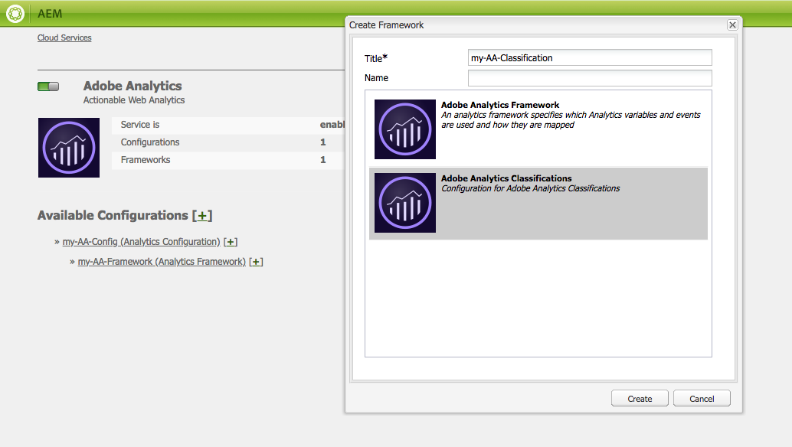

# Adobe-klassificeringar{#adobe-classifications}

Klassificeringar i Adobe exporterar klassificeringsdata till [Adobe Analytics](/help/sites-administering/adobeanalytics.md) på ett planerat sätt. Exportören är en tillämpning av **com.adobe.cq.scheduled.exporting.Exporter**.

Så här konfigurerar du:

1. Använda **Navigering**, markera **verktyg**, **Cloud Services** sedan **Äldre Cloud Services**.
1. Bläddra till **Adobe Analytics** och markera **Visa konfigurationer**.
1. Klicka på **[+]** -länk bredvid din Adobe Analytics-konfiguration.

1. I **Skapa ramverk** dialog:

   * Ange en **Titel**.
   * Du kan också ange **Namn**, för noden som lagrar ramverksinformationen i databasen.
   * Välj **Adobe Analytics Classifications**

   Och klicka **Skapa**.

   

1. The **Klassificeringsinställningar** öppnas för redigering.

   

   Egenskaperna är följande:

   | **Fält** | **Beskrivning** |
   |---|---|
   | Aktiverad | Välj **Ja** om du vill aktivera inställningarna för klassificering i Adobe. |
   | Skriv över vid konflikt | Välj **Ja** för att skriva över datakollisioner. Som standard är detta inställt på **Nej**. |
   | Ta bort bearbetade | Om inställt på **Ja**, tar bort bearbetade noder när de har exporterats. Standardvärdet är **Falskt**. |
   | Exportera jobbbeskrivning | Ange en beskrivning för jobbet Adobe Classifications. |
   | E-postmeddelande | Ange en e-postadress för Adobe Classifications-meddelanden. |
   | Report Suite | Ange den rapportsvit som du vill köra importjobbet för. |
   | Datauppsättning | Ange det datauppsättningsrelations-ID som importjobbet ska köras för. |
   | Transformator | Välj en transformatorimplementering i listrutan. |
   | Datakälla | Navigera till sökvägen för databehållaren. |
   | Exportera schema | Välj schema för exporten. Standardvärdet är var 30:e minut. |

1. Klicka **OK** för att spara inställningarna.

## Ändra sidstorlek {#modifying-page-size}

Poster behandlas på sidor. Som standard skapas sidor med sidstorleken 1 000 i Adobe Classifications.

En sida kan vara högst 25000, per definition i Adobe Classifications och kan ändras från Felix-konsolen. Vid exporten låses källnoden med Adobe-klassificeringar för att förhindra samtidiga ändringar. Noden låses upp efter export, vid fel eller när sessionen stängs.

Så här ändrar du sidstorlek:

1. Gå till OSGI-konsolen på **https://&lt;host>:&lt;port>/system/console/configMgr** och markera **Export av Adobe-AEM**.

   

1. Uppdatera **Exportera sidstorlek** efter behov, klicka sedan på **Spara**.

## SAINTDefaultTransformer {#saintdefaulttransformer}

>[!NOTE]
>
>Adobe-klassificeringar kallades tidigare för SAINT Exporter.

En exportör kan använda en transformator för att omforma exportdata till ett visst format. Ett undergränssnitt för Adobe-klassificeringar `SAINTTransformer<String[]>` implementering av Transformer-gränssnittet har angetts. Det här gränssnittet används för att begränsa datatypen till `String[]` som används av API:t för SAINT och har ett markörgränssnitt för att hitta sådana tjänster för markering.

I standardimplementeringen SAINTDefaultTransformer behandlas de underordnade resurserna för exportörkällan som poster med egenskapsnamn som nycklar och egenskapsvärden som värden. The **Nyckel** kolumnen läggs automatiskt till som första kolumn - dess värde blir nodnamnet. Namngivna egenskaper (innehåller `:`) ignoreras.

*Nodstruktur:*

* id-klassificering `nt:unstructured`

   * 1 `nt:unstructured`

      * Produkt = Mitt produktnamn (sträng)
      * Price = 120.90 (String)
      * Size = M (String)
      * Color = black (String)
      * Color^Code = 101 (String)

**SAINT Header &amp; Record:**

| **Nyckel** | **Produkt** | **Pris** | **Storlek** | **Färg** | **Color^Code** |
|---|---|---|---|---|---|
| 1 | Mitt produktnamn | 120.90 | M | svart | 101 |

Egenskaperna är följande:

<table>
 <tbody>
  <tr>
   <td><strong>Egenskapssökväg</strong></td>
   <td><strong>Beskrivning</strong></td>
  </tr>
  <tr>
   <td>transformator</td>
   <td>Ett klassnamn för en SAINTTransformer-implementering</td>
  </tr>
  <tr>
   <td>e-post</td>
   <td>E-postadress för avisering.</td>
  </tr>
  <tr>
   <td>reportsuites</td>
   <td>Rapportera Suite-ID:n som importjobbet ska köras för. </td>
  </tr>
  <tr>
   <td>datauppsättning</td>
   <td>Datauppsättningsrelations-ID som importjobbet ska köras för. </td>
  </tr>
  <tr>
   <td>description</td>
   <td>Jobbbeskrivning.   </td>
  </tr>
  <tr>
   <td>skriv över</td>
   <td>Flagga för att skriva över datakollisioner. Standard är <strong>false</strong>.</td>
  </tr>
  <tr>
   <td>indelningar</td>
   <td>Flagga för att kontrollera om rapportsviterna är kompatibla. Standard är <strong>true</strong>.</td>
  </tr>
  <tr>
   <td>borttagen</td>
   <td>Flagga för att ta bort de bearbetade noderna efter exporten. Standard är <strong>false</strong>.</td>
  </tr>
 </tbody>
</table>

## Automatisera export av Adobe-klassificeringar {#automating-adobe-classifications-export}

Du kan skapa ett eget arbetsflöde, så att alla nya importer startar arbetsflödet för att skapa rätt, och korrekt strukturerade, data i **/var/export/** så att den kan exporteras till Adobe-klassificeringar.
