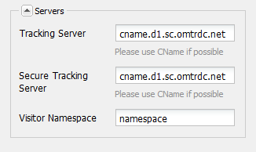

# Ansluta till Adobe Analytics och skapa ramverk {#connecting-to-adobe-analytics-and-creating-frameworks}

Om du vill spåra webbdata från dina AEM sidor i Adobe Analytics skapar du en Adobe Analytics Cloud Services-konfiguration och ett Adobe Analytics-ramverk:

* **Adobe Analytics-konfiguration:** Information om ditt Adobe Analytics-konto. Med Adobe Analytics-konfigurationen kan AEM ansluta till Adobe Analytics. Skapa en Adobe Analytics-konfiguration för varje konto som du använder.
* **Adobe Analytics Framework:** En uppsättning mappningar mellan egenskaper för Adobe Analytics rapportsserie och CQ-variabler. Använd ett ramverk för att konfigurera hur webbplatsdata fyller i dina Adobe Analytics-rapporter. Ramverk är kopplade till en Adobe Analytics-konfiguration. Du kan skapa flera ramverk för varje konfiguration.

När du associerar en webbsida med ett ramverk utför ramverket spårning för den sidan och de underordnade sidorna för den sidan. Sidvyer kan sedan hämtas från Adobe Analytics och visas i webbplatskonsolen.

## Förutsättningar {#prerequisites}

### Adobe Analytics-konto {#adobe-analytics-account}

Om du vill spåra AEM i Adobe Analytics måste du ha ett giltigt Adobe Experience Cloud Adobe Analytics-konto.

Adobe Analytics-kontot måste

* har **Administratör** behörigheter
* Blanketten tilldelas **Webbtjänståtkomst** användargrupp.

>[!CAUTION]
>
>Tillhandahållande **Administratör** behörighet (inom Adobe Analytics) inte räcker för att en användare ska kunna ansluta från AEM till Adobe Analytics. Kontot måste också ha **Webbtjänståtkomst** behörighet.

Innan du fortsätter bör du kontrollera att du kan logga in på Adobe Analytics med dina inloggningsuppgifter. Med hjälp av något av följande:

* [Adobe Experience Cloud Sign In](https://experience.adobe.com/#/@login/home)

* [Adobe Analytics Sign In](https://sc.omniture.com/login/)

### Konfigurera AEM för användning av Adobe Analytics datacenter {#configuring-aem-to-use-your-adobe-analytics-data-centers}

Adobe Analytics [datacenter](https://experienceleague.adobe.com/docs/analytics/analyze/reports-analytics/reporting-interface/overview-data-collection.html?lang=en) samla in, bearbeta och lagra data som är kopplade till Adobe Analytics rapporteringsprogram. Konfigurera AEM för att använda det datacenter som är värd för din Adobe Analytics rapportsvit. Datacentret omnämns i ditt avtal. Kontakta en administratör i organisationen om du vill ha den här informationen.

Använd vid behov följande för att slussa till rätt datacenter: `https://api.omniture.com/`.

Om din organisation kräver datainsamling eller datahämtning från ett specifikt datacenter använder du följande:

| Datacenter | URL |
|---|---|
| London | `https://api3.omniture.com/` |
| Singapore | `https://api4.omniture.com/` |
| Oregon | `https://api5.omniture.com/` |

Använd [Webbkonsol för att konfigurera OSGi-paketet](/help/sites-deploying/configuring-osgi.md#osgi-configuration-with-the-web-console) **Adobe AEM Analytics HTTP Client**. Lägg till **URL för datacenter** för det datacenter som är värd för en rapportsserie där dina AEM sidor samlar in data.

1. Öppna webbkonsolen i webbläsaren. ([https://localhost:4502/system/console/configMgr](https://localhost:4502/system/console/configMgr))
1. Ange dina inloggningsuppgifter för att komma åt konsolen.

   >[!NOTE]
   >
   >Om du vill ta reda på om du har tillgång till den här konsolen kontaktar du webbplatsadministratören.

1. Välj konfigurationsobjektet som heter **Adobe AEM Analytics HTTP Client**.
1. Om du vill lägga till URL:en för ett datacenter trycker du på +-knappen bredvid **URL för datacenter** och skriv webbadressen i rutan.

1. Om du vill ta bort en URL från listan klickar du på knappen - bredvid URL:en.
1. Klicka på Spara.

## Konfigurera anslutningen till Adobe Analytics {#configuring-the-connection-to-adobe-analytics}

>[!CAUTION]
>
>På grund av säkerhetsändringar i Adobe Analytics API är det inte längre möjligt att använda den version av Activity Map som ingår i AEM.
>
>The [ActivityMap-plugin från Adobe Analytics](https://experienceleague.adobe.com/docs/analytics/analyze/activity-map/getting-started/get-started-users/activitymap-install.html) bör nu användas.

## Konfigurera för Activity Map {#configuring-for-the-activity-map}

>[!CAUTION]
>
>På grund av säkerhetsändringar i Adobe Analytics API är det inte längre möjligt att använda den version av Activity Map som ingår i AEM.
>
>The [ActivityMap-plugin från Adobe Analytics](https://experienceleague.adobe.com/docs/analytics/analyze/activity-map/getting-started/get-started-users/activitymap-install.html) bör nu användas.

## Skapa ett Adobe Analytics Framework {#creating-a-adobe-analytics-framework}

För det Report Suite-ID (RSID) som du använder kan du styra vilka serverinstanser (författare, publicera eller båda) som ska bidra med data till Report Suite:

* **Alla**: Information från både författaren och publiceringsinstansen fyller i Report Suite.
* **Upphovsman**: Endast information från författarinstansen fyller i rapportsviten.
* **Publicera**: Rapportsviten fylls bara i med information från publiceringsinstansen.

>[!NOTE]
>
>När du väljer typ av serverinstans begränsas inte anrop till Adobe Analytics, utan bara vilka anrop som innehåller RSID.
>
>Ett ramverk är till exempel konfigurerat att använda *diiweretail* rapportsviten och författaren är den valda serverinstansen. När sidor publiceras tillsammans med ramverket anropas fortfarande Adobe Analytics, men dessa anrop innehåller inte RSID. Endast anrop från författarinstansen innehåller RSID.

1. Använda **Navigering**, markera **verktyg**, **Cloud Service** sedan **Äldre Cloud Service**.
1. Bläddra till **Adobe Analytics** och markera **Visa konfigurationer**.
1. Klicka på **[+]** -länk bredvid din Adobe Analytics-konfiguration.

1. I **Skapa ramverk** dialog:

   * Ange en **Titel**.
   * Du kan också ange **Namn**, för noden som lagrar ramverksinformationen i databasen.
   * Välj **Adobe Analytics Framework**

   Och klicka **Skapa**.

   Ramverket öppnas för redigering.

1. I **Rapportsviter** på sidopanelen (höger sida av huvudpanelen), klicka **Lägg till objekt**. Använd sedan listrutan för att välja ID för Report Suite (till exempel `geometrixxauth`) som ramverket interagerar med.

   >[!NOTE]
   >
   >Innehållssökaren till vänster fylls i med Adobe Analytics-variabler (SiteCatalyst Variables) när du väljer ett Report Suite-ID.

1. Använd kommandot **Körningsläge** nedrullningsbar meny (bredvid Report Suite-ID).

   

1. Gör ramverket tillgängligt på publiceringsinstansen av webbplatsen på **Sida** sidosparkflik, klicka **Aktivera Framework.**

### Konfigurera serverinställningar för Adobe Analytics {#configuring-server-settings-for-adobe-analytics}

Med ramverkssystemet kan du ändra serverinställningarna i varje Adobe Analytics-ramverk.

>[!CAUTION]
>
>Dessa inställningar avgör var data skickas och hur. Det är därför viktigt att du *inte manipulera dessa inställningar* och låt Adobe Analytics-representanten installera det istället.

Börja med att öppna panelen. Tryck på nedåtpilen bredvid **Servrar**:

* **Spårningsserver**

   * innehåller den URL som används för att skicka Adobe Analytics-samtal

      * `cname` - används som standard för Adobe Analytics *Företag*
      * `d1` - motsvarar det datacenter som informationen skickas till (antingen `d1`, `d2`, eller `d3`)
      * `sc.omtrdc.net` - domännamn

* **Secure Tracking Server**

   * Har samma segment som spårningsservern
   * Används för att skicka data från säkra sidor (`https://`)

* **Namnutrymme för besökare**

   * Namnutrymmet bestämmer den första delen av spårnings-URL:en.
   * Ändra namnutrymmet till **CNAME** får Adobe Analytics att se ut som **CNAME.d1.omtrdc.net** i stället för standardinställningen.

## Koppla en sida till ett Adobe Analytics Framework {#associating-a-page-with-a-adobe-analytics-framework}

När en sida är kopplad till ett Adobe Analytics-ramverk skickar sidan data till Adobe Analytics när sidan läses in. Variabler som fylls i på sidan mappas och hämtas från Adobe Analytics-variabler i ramverket. Sidvyer hämtas till exempel från Adobe Analytics.

Underordnade till sidan ärver kopplingen till ramverket. Om du till exempel associerar platsens rotsida med ett ramverk, kopplas alla sidor på webbplatsen till ramverket.

1. Från **Webbplatser** väljer du den sida som du vill konfigurera med spårning.
1. Öppna **[Sidegenskaper](/help/sites-authoring/editing-page-properties.md)**, antingen direkt från konsolen eller sidredigeraren.
1. Öppna fliken** Cloud Service**.

1. Använd **Lägg till konfiguration** nedrullningsbar meny för att välja **Adobe Analytics** bland de tillgängliga alternativen. Om arv är plats inaktiverar du det innan väljaren blir tillgänglig.

1. Den nedrullningsbara väljaren för **Adobe Analytics** läggs till i de tillgängliga alternativen. Välj nödvändig ramverkskonfiguration.

1. Välj **Spara och stäng**.
1. Om du vill aktivera sidan och alla anslutna konfigurationer/filer **[Publicera](/help/sites-authoring/publishing-pages.md)** sidan.
1. Det sista steget är att besöka sidan i publiceringsinstansen och söka efter ett nyckelord (till exempel eggplant) med hjälp av **Sök** -komponenten.
1. Du kan sedan kontrollera samtal som gjorts till Adobe Analytics med ett lämpligt verktyg, till exempel [Adobe Experience Cloud Debugger](https://experienceleague.adobe.com/docs/experience-platform/debugger/home.html).
1. I exemplet som anges ska anropet innehålla det värde som anges (dvs. eggplant) i eVar7 och händelselistan ska innehålla event3.

### Sidvyer {#page-views}

När en sida är kopplad till ett Adobe Analytics-ramverk kan antalet sidvyer visas i listvyn i webbplatskonsolen.

Se [Visa sidanalysdata](/help/sites-authoring/page-analytics-using.md) för mer information.

### Konfigurera importintervallet {#configuring-the-import-interval}

Konfigurera lämplig instans av **Sling-importeraren för Adobe AEM Analytics-rapport** tjänst:

* **Hämtningsförsök**: Antal försök att hämta en rapport i kö.
Standardvärdet är `6`.

* **Hämtningsfördröjning**: Antalet millisekunder mellan försök att hämta en rapport i kö.
Standardvärdet är `10000`. Eftersom detta är i millisekunder motsvarar det 10 sekunder.

* **Hämtningsfrekvens**: A `cron` -uttryck för att bestämma frekvensen för hämtning av Analytics-rapporten.
Standardvärdet är `0 0 0/12 * * ?`; detta motsvarar 12 tagningar varje timme.

Om du vill konfigurera OSGi-tjänsten kan du antingen använda [Webbkonsol](/help/sites-deploying/configuring-osgi.md#osgi-configuration-with-the-web-console) eller en [osgiConfig-nod i databasen](/help/sites-deploying/configuring-osgi.md#osgi-configuration-in-the-repository) (tjänstens PID är `com.day.cq.analytics.sitecatalyst.impl.importer.ReportImporterScheduler`).

## Redigera Adobe Analytics-konfigurationer och/eller ramverk {#editing-adobe-analytics-configurations-and-or-frameworks}

På samma sätt som när du skapar en Adobe Analytics-konfiguration eller ett ramverk går du till (äldre) **Cloud Service** skärm. Välj **Visa konfigurationer** klickar du sedan på länken till den specifika konfiguration som du vill uppdatera.

När du redigerar en Adobe Analytics-konfiguration trycker du på **Redigera** när du befinner dig på konfigurationssidan för att öppna **Redigera komponent** -dialogrutan.

## Ta bort Adobe Analytics-ramverk {#deleting-adobe-analytics-frameworks}

Ta bort ett Adobe Analytics-ramverk först [öppna den för redigering](#editing-adobe-analytics-configurations-and-or-frameworks).

Välj sedan **Ta bort ramverk** från **Sida** sidosparkens flik.
