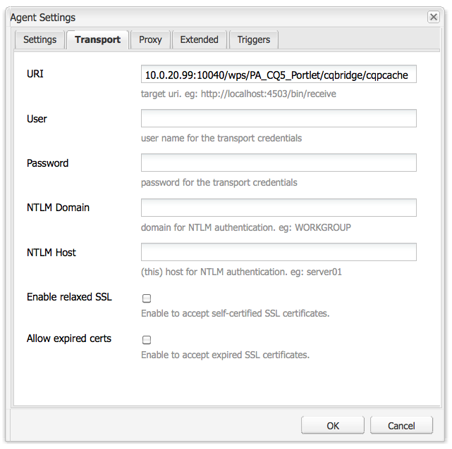

# AEM Portaler och Portlets{#aem-portals-and-portlets}

I det här dokumentet beskrivs följande:

* AEM Portal-arkitektur
* Administrera och konfigurera AEM som en portal
* Använda AEM som portal
* Installera, konfigurera och visa AEM-innehåll i en portlet (till exempel en webbserver)

## AEM Portal Architecture {#aem-portal-architecture}

AEM-portalarkitekturen innehåller definitioner av portaler och portlets.

### Vad är en portal? {#what-is-a-portal}

En portal är ett webbprogram som innehåller personalisering, samlad inloggning, innehållsintegrering från olika källor och som är värd för informationssystemens presentationsskikt.

Du kan köra JSR 286-kompatibla portlets i AEM. Med portletkomponenten kan du bädda in en portlet på sidan. Se [Administrera AEM Content Portlet](#administeringthecqcontentportlet).

### Vad är en portlet? {#what-is-a-portlet}

Portlets är webbkomponenter som distribueras inuti en behållare som genererar dynamiskt innehåll. Portletgränssnittet paketeras och distribueras som en .war-fil inuti en portletbehållare. Om du kör AEM som en portal behöver du portletens .war-fil för att köra portleten.

Information om hur du konfigurerar AEM-innehåll så att det visas på en portal finns i [Installera, konfigurera och använda AEM i en portlet](#installingconfiguringandusingcqinaportlet).

### AEM Portal Director {#aem-portal-director}

>[!CAUTION]
>
>AEM Portal Director används inte i AEM 6.4.Se [Föråldrade och Borttagna funktioner](https://helpx.adobe.com/experience-manager/6-4/release-notes/deprecated-removed-features.html).

## Administrera AEM Content Portlet {#administering-the-aem-content-portlet}

Med AEM Content Portlet kan du visa AEM-innehåll i en portal. Portleten finns på `/crx-quickstart/opt/portal`och kan anpassas på olika sätt. Du kan till exempel anpassa hanteringen av enkel inloggning/autentisering genom att distribuera din egen autentiseringstjänst och generera den autentiseringsinformation som krävs för att AEM ska skriva över standardbeteendet. Plugin-programmen använder ett definierat API som gör att du kan lägga till egna funktioner genom att skapa plugin-programmet mot API:t. Plugin-programmet kan distribueras till den portlet som körs. För att fungera på rätt sätt måste AEM-författaren ha en konfiguration och publicera instansen tillsammans med innehållssökvägen som ska visas vid start.

Vissa konfigurationer kan ändras via portletinställningar och andra genom OSGi-tjänstkonfigurationer. Du ändrar dessa konfigurationer med hjälp av **config** -filer eller OSGi-webbkonsolen.

### Portletinställningar {#portlet-preferences}

Portletinställningar kan konfigureras vid distributionen på portalservern eller genom att redigera **WEB-INF/portlet.xml** -filen innan du distribuerar portletwebbprogrammet. Filen portlet.xml ser ut så här som standard:

```xml
<?xml version="1.0" encoding="UTF-8"?>
<portlet-app xmlns="https://java.sun.com/xml/ns/portlet/portlet-app_1_0.xsd"
             xmlns:xsi="https://www.w3.org/2001/XMLSchema-instance"
             xsi:schemaLocation="https://java.sun.com/xml/ns/portlet/portlet-app_1_0.xsd /opt/SUNWps/dtd/portlet.xsd"
             version="1.0">
   <portlet>
      <portlet-name>RSSWeatherPortlet</portlet-name>
      <portlet-class>org.jboss.portlet.weather.WeatherPortlet</portlet-class>
      <init-param>
         <name>default_zipcode</name>
         <value>05673</value>
      </init-param>
      <init-param>
         <name>RSS_XSL</name>
         <value>/WEB-INF/Rss.xsl</value>
      </init-param>
      <init-param>
         <name>base_url</name>
         <value>https://xml.weather.yahoo.com/forecastrss?p=</value>
      </init-param>
      <expiration-cache>180</expiration-cache>
      <supports>
         <mime-type>text/html</mime-type>
         <portlet-mode>VIEW</portlet-mode>
         <portlet-mode>EDIT</portlet-mode>
      </supports>
      <portlet-info>
         <title>Weather Portlet</title>
      </portlet-info>
      <portlet-preferences>
         <preference>
            <name>expires</name>
            <value>180</value>
         </preference>
         <preference>
            <name>RssXml</name>
            <value>https://xml.weather.yahoo.com/forecastrss?p=33145</value>
            <read-only>false</read-only>
         </preference>
      </portlet-preferences>
   </portlet>
</portlet-app>
```

Portleten kan konfigureras med följande inställningar:

<table>
 <tbody>
  <tr>
   <td>startPath</td>
   <td><p>Detta är portletens startsökväg: definierar innehållet som visas från början.</p> <p><strong>Viktigt</strong>: Om portleten är konfigurerad för att ansluta till AEM-författaren och publicera instanser som körs på en annan kontextsökväg än<strong> /</strong>, måste du aktivera <strong>CQUrlInfo</strong> i HTML-bibliotekshanterarkonfigurationen för dessa AEM-instanser (t.ex. via Felix Webconsole), annars fungerar inte redigeringen och dialogrutan med inställningar visas inte.</p> </td>
  </tr>
  <tr>
   <td>htmlSelector</td>
   <td>Den väljare som läggs till på varje URL. Som standard är detta <strong>portlet</strong>, så alla begäranden till HTML-sidor använder URL:er som slutar i <strong>.portlet.html.</strong> Detta gör att du kan använda anpassade skript i AEM för portletrendering.</td>
  </tr>
  <tr>
   <td>addCssToPortalHeader</td>
   <td><p>Som standard inkluderas CSS-filer som finns på HTML-sidan från AEM i portleten. Om du inaktiverar det här alternativet exkluderas standardcss-filerna.</p> <p>Om det här alternativet är aktiverat läggs CSS-filerna antingen till i huvudet på HTML-sidan eller bäddas in på HTML-sidan beroende på hur portalen fungerar.</p> </td>
  </tr>
  <tr>
   <td>includeToolbar</td>
   <td>Som standard återges ett verktygsfält i innehållsportleten för hanteringsfunktioner. Om du inaktiverar det här alternativet återges inget verktygsfält.</td>
  </tr>
  <tr>
   <td>urlParameterNames</td>
   <td><p>Lista med alternativa URL-parameternamn som kan innehålla den nya innehålls-URL som ska visas för portleten. Listan bearbetas uppifrån och ned, den första parametern som innehåller ett värde används. Om ingen URL hittas används standardparametern för URL. Den angivna URL:en används, som den är, utan ytterligare ändringar.</p> <p>Den här inställningen är per distribuerad portlet - det är även att globalt konfigurera vissa URL-parametrar i OSGi-konfigurationen för "Day Portal Director Portlet Bridge".</p> </td>
  </tr>
  <tr>
   <td>preferencesDialog</td>
   <td>Sökväg till inställningsdialogrutan i AEM - om den lämnas tom används den inbyggda inställningsdialogrutan. Standardvärdet är /libs/portal/content/prefs.html.</td>
  </tr>
  <tr>
   <td>initialRedirect</td>
   <td>Portleten utför som standard en javascript-omdirigering av hela portalsidan vid första anropet. Detta är till stöd för dra och släpp-scenariot för moderna portalservrar. Denna omdirigering behövs sällan i produktionen och kan därför stängas av med inställningen <em>false</em>.</td>
  </tr>
 </tbody>
</table>

#### OSGi Web Console {#osgi-web-console}

Om portalservern körs på värddatorns lokala värd, port 8080 och webbprogrammet för AEM-portleten monteras i webbprogramskontexten *cqportlet*, blir webbadressen till webbkonsolen `https://localhost:8080/cqportlet/cqbridge/system/console`. Standardanvändaren och lösenordet är **admin**.

Öppna fliken **Konfigurationer** och välj **Portal Directory CQ Server Configuration**. Här anger du bas-URL:en till författaren och publiceringsinstansen. Den här proceduren beskrivs i [Konfigurera portleten](#configuring-the-portlet).

>[!NOTE]
>
>OSGi-webbkonsolen är endast avsedd för att ändra konfigurationer under utveckling (eller testning). Se till att blockera begäranden till konsolen för produktionssystem.

### Erbjuda konfigurationer {#providing-configurations}

För att stödja automatiserad driftsättning och konfigurationsetablering har AEM-innehållsportleten inbyggt konfigurationsstöd som försöker läsa konfigurationer från klassökvägen som tillhandahålls till portletsprogrammet.

Vid start läses systemegenskapen **com.day.cq.portet.config** för att identifiera den aktuella miljön. Vanligtvis är värdet för den här egenskapen något som **dev**, **prod**, **test** och så vidare. Om ingen miljö är inställd läses inga konfigurationer.

Om en miljö är inställd genomsöks en config-fil i klassökvägen på* ***com/day/cq/portlet/{env}.config** , där **env** ersätts med det verkliga värdet för miljön. Den här filen bör innehålla en lista över alla konfigurationsfiler för den här miljön. Dessa filer söks igenom relativt till platsen för konfigurationsfilen. Om filen till exempel innehåller en rad läses `my.service.xml,` den här filen från klassökvägen vid `com/day/cq/portlet/my.service.config.` Namnet på filen består av tjänstens beständiga ID, följt av **.config**. I föregående exempel är beständighets-ID **my.service**. Konfigurationsfilens format är det format som används av installationsprogrammet för Apache Sling OSGi.

Det innebär att en motsvarande konfigurationsfil måste läggas till för varje miljö. En konfiguration som ska användas i alla miljöer måste anges i alla dessa filer - om den bara är för en enda miljö anges den bara i den filen. Denna mekanism ger fullständig kontroll över vilken konfiguration som läses i vilken miljö.

Det går att använda en annan systemegenskap för att identifiera miljön. Ange systemegenskapen **com.day.cq.portet.configproperty** som innehåller namnet på den systemegenskap som ska användas i stället för **com.day.cq.portet.config**.

#### Invalidering av cachelagring och cachelagring {#caching-and-caching-invalidation}

Portleten, i standardkonfigurationen, cachelagrar svaren som tas emot från AEM WCM i en användarspecifik cache. Cacheminnen måste ogiltigförklaras när ändringar görs i innehållet i publiceringsinstansen. I AEM WCM måste därför en replikeringsagent konfigureras på författarinstansen. Cachen kan också tömmas manuellt. I det här avsnittet beskrivs båda dessa procedurer.

Portleten kan konfigureras med sin egen cache, så att innehållet i portleten visas utan åtkomst till AEM. Portalen finns som innehåll i /libs/portal/director. Du öppnar innehållet genom att starta en AEM-instans och hämta filen från den platsen med CRXDE Lite eller Webdav.

Du kan antingen distribuera det här paketet vid körning eller lägga till det i portletwebbprogrammet `WEB-INF/lib/resources/bundles` före distributionen.

När cacheminnet har distribuerats cachelagrar portleten innehållet från publiceringsinstansen. Portletcachen kan göras ogiltig med en dispatchertömning från AEM. Så här konfigurerar du portleten att använda sin egen cache:

1. Konfigurera en replikeringsagent i författaren som har portalservern som mål.
1. Om portalservern körs på **värddatorns lokala värd**, **port 8080 **och webbprogrammet för AEM-portleten monteras i **kontextens** cqportlet, kommer den URL som ska tömmas att vara `https://localhost:8080/cqportlet/cqbridge/cqpcache?Path=$(path)`. Använd GET som metod.
   **** Obs! I stället för att använda en request-parameter kan du skicka ett http-huvud med namnet **Path**.

#### Tömmer cachen via replikeringsagenten {#flushing-the-cache-via-replication-agent}

Precis som vid normal invalidering av dispatcher kan en replikeringsagent konfigureras för portalens AEM-portletscache. När du har konfigurerat replikeringsagenten rensas portalcachen vid varje vanlig sidaktivering.

Om du använder flera portalnoder som kör AEM-portleten måste du skapa en agent för varje nod enligt beskrivningen i den här proceduren.

Så här konfigurerar du en replikeringsagent för portalen:

1. Logga in på författarinstansen.
1. Klicka på fliken *Verktyg* på fliken Webbplatser.
1. **** Klicka på **Ny sida... i replikeringsagenterna** Nytt... -menyn.

   

1. I *Mall* väljer du *Replikeringsagent* och anger ett namn för agenten. Klicka på *Skapa*.

   

1. Dubbelklicka på den replikeringsagent som du nyss skapade. Den visas som ogiltig eftersom den ännu inte har konfigurerats.

   

1. Click **Edit.**
1. Markera kryssrutan **Aktiverad** på fliken **Inställningar** , markera **Dispatcher Flush** som serialiseringstyp och ange en timeout för nya försök (till exempel 60000).

   

1. Klicka på fliken **Transport** .
1. I fältet **URI** anger du portletens rensnings-URI (URL). URI:n har följande format:

   ```xml
   https://<wps-host>:<port>/<wps-context>/<cq5-portlet-context>/cqbridge/cqpcache
   ```

   

1. Klicka på fliken **Extended** .

   

1. I fältet **HTTP-metod** skriver du **GET**.
1. I fältet **HTTP Headers** klickar du **+** för att lägga till en ny post och skriva **Path: {path}**.
1. Om det behövs klickar du på fliken **Proxy** och anger proxyinformation för agenten.
1. Klicka på **OK** för att spara ändringarna.
1. Om du vill testa anslutningen klickar du på länken **Testa anslutning** . Ett loggmeddelande visas som anger om replikeringstestet lyckades. Exempel:

   

#### Manuell tömning av portletcachen {#manually-flushing-the-portlet-cache}

Du kan manuellt tömma portletcachen genom att gå till samma URL som konfigurerats för replikeringsagenten. Se [Tömma cachen](#flushing-the-cache-via-replication-agent) för URL-formaten. Dessutom måste URL-adressen utökas med URL-parametern Path=&lt;path> för att ange vad som ska rensas.

Exempel:

`https://10.0.20.99:10040/wps/PA_CQ5_Portlet/cqbridge/cqpcache?Path=*` tömmer hela cacheminnet. `https://10.0.20.99:10040/wps/PA_CQ5_Portlet/cqbridge/cqpcache?Path=/content/mypage/xyz` tömmer `/content/mypage/xyz` cacheminnet.

### Portal Security {#portal-security}

Portalen är den drivande autentiseringsmekanismen. Du kan logga in på AEM med en teknisk användare, portalanvändaren, en grupp och så vidare. Portleten har ingen åtkomst till lösenordet för användaren i portalen, så om portleten inte känner till alla autentiseringsuppgifter för att kunna logga in en användare måste en SSO-lösning användas. I det här fallet vidarebefordrar AEM-portleten all nödvändig information till AEM, som i sin tur vidarebefordrar informationen till den underliggande AEM-databasen. Det här beteendet är anslutningsbart och kan anpassas.

### Autentisering vid publicering {#authentication-on-publish}

I det här avsnittet beskrivs de tillgängliga autentiseringslägen som portleten kan använda för att kommunicera med underliggande AEM WCM-instanser.

Som standard skickas ingen användarinformation till publiceringsinstansen för AEM. innehållet alltid visas som anonym användare. Om användarspecifik information ska skickas från AEM eller om användarautentisering krävs för publicering måste detta vara aktiverat.

#### Åtkomst till portletens autentiseringskonfiguration {#accessing-the-portlet-s-authentication-configuration}

De alternativ för autentiseringskonfiguration som portleten använder i AEM WCM-instanser finns tillgängliga i webbkonsolen (OSGi-konfiguration).

>[!NOTE]
>
>När du arbetar med AEM finns det flera metoder för att hantera konfigurationsinställningarna för OSGi-tjänster (konsol- eller databasnoder).
>
>Mer information finns i [Konfigurera OSGi](/help/sites-deploying/configuring-osgi.md) .

Så här kommer du åt portletens autentiseringskonfiguration:

1. Gå till webbkonsolen på följande URL:

   `https://localhost:8080/cqportlet/cqbridge/system/console`

   I standardkonfigurationen:

   `https://wps-host:10040/wps/PA_CQ5_Portlet/cqbridge/system/console`

1. Logga in på webbkonsolen. Standardautentiseringsuppgifterna är `admin/admin`.
1. Välj **Konfiguration** i konsolen.
1. Välj en viss tjänst som du vill konfigurera på menyn **Konfiguration** . Tjänsterna tillhandahålls av portleten i OSGi-ramverket.

   | Tjänstnamn | Beskrivning |
   |---|---|
   | Day Portal Director Authenticator | Konfigurera vilket autentiseringsläge som används för AEM WCM-instanser. Beroende på det valda läget kan en teknisk användare eller namnet på SSO-cookien anges. Autentisering för AEM WCM-publiceringsinstanser kan också aktiveras. |
   | Dag Portal Director-filcache | Konfigurera parametrarna för hur portleten cachelagrar svar som tas emot från AEM WCM-instanser. |
   | Dag Portal Director HTTP Client Service | Konfigurera hur portleten ansluter via HTTP till underliggande AEM WCM-instanser. Du kan till exempel ange en proxyserver. |
   | Day Portal Director Locale Handler | Konfigurera vilka språk portleten stöder. Förfrågningar till AEM WCM-instanser baseras på användarens språkområde. användarspråk *German *skulle begära `/content/geometrixx/de/`... . |
   | Privilegiehanterare för dagportal | Konfigurera om portleten ska testa fliken Webbplatser baserat på den inloggade användaren. |
   | Day Portal Director Toolbar Renderer | Anpassa återgivningen av portletens verktygsfält. |

1. Dessutom kan du konfigurera webbkonsolen och loggningstjänsten. Du kan till exempel ändra administratörsautentiseringsuppgifterna för webbkonsolen genom att klicka på länken Apache Felix OSGi Management Console.

#### Tekniskt användarläge {#technical-user-mode}

I standardläge autentiseras alla begäranden som skickas av portleten för AEM WCM-författarinstansen med samma tekniska användare, oavsett vilken portalanvändare som används. Tekniskt användarläge är aktiverat som standard. Du aktiverar/inaktiverar det här läget i respektive konfigurationsskärm i OSGi-hanteringskonsolen:

Den angivna tekniska användaren måste finnas på AEM WCM-författarinstansen och på publiceringsinstansen om **Authenticate on Publish **är aktiverat. Se till att ge användaren tillräcklig behörighet för redigeringsarbetet.

#### SSO {#sso}

Portleten stöder enkel inloggning med AEM direkt. Autentiseringstjänsten kan konfigureras att använda enkel inloggning och överföra den aktuella portalanvändaren med formatet **Basic** som en cookie med namnet `cqpsso` till AEM. AEM bör konfigureras att använda autentiseringshanteraren för enkel inloggning för sökväg /. Även cookie-namnet måste konfigureras här.

AEM-databasen `crx-quickstart/repository/repository.xml` måste konfigureras i enlighet med detta:

```xml
<LoginModule class="com.day.crx.security.authentication.CRXLoginModule">
  ...
  <param name="trust_credentials_attribute" value="TrustedInfo"/>
  <param name="anonymous_principal" value="anonymous"/>
</LoginModule>
```

#### SSO-autentiseringsläge {#sso-authentication-mode}

Portleten kan autentisera för AEM WCM med SSO-schemat (Single Sign On). I det här läget vidarebefordras den användare som för närvarande är inloggad på portalen till AEM WCM i form av en SSO-cookie. Om SSO-läge används måste alla portalanvändare med tillgång till AEM-portleten vara kända för de underliggande AEM WCM-instanserna, vanligtvis i form av att AEM WCM är ansluten till LDAP, eller genom att manuellt ha skapat användarna i förväg. Innan enkel inloggning aktiveras i portleten måste den underliggande AEM WCM-författarinstansen (och publiceringsinstansen, om **autentisering vid publicering** är aktiverat) konfigureras för att acceptera SSO-baserade begäranden.

Om du vill konfigurera portleten så att SSO-autentiseringsläget används utför du följande steg (beskrivs i detalj i följande avsnitt):

* Aktivera AEM WCM:s databas för att godkänna pålitliga autentiseringsuppgifter.
* Aktivera SSO-autentisering i AEM WCM.
* Aktivera SSO-autentisering i AEM-portleten.

#### Möjliggör för AEM WCM:s databas att godkänna pålitliga inloggningsuppgifter {#enabling-aem-wcm-s-repository-to-accept-trusted-credentials}

Innan enkel inloggning kan aktiveras för AEM WCM måste den underliggande databasen konfigureras för att acceptera de pålitliga autentiseringsuppgifter som tillhandahålls av AEM WCM. För att göra detta konfigurerar du AEM:s database.xml.

1. Öppna följande fil i det filsystem där AEM WCM är installerat:

   `//crx-quickstart/repository/repository.xml`

1. I XML-filen söker du efter posten för **LoginModule** och lägger till trust_credentials_attribute i konfigurationen:

   ```xml
   <LoginModule class="com.day.crx.security.authentication.CRXLoginModule">
     ...
     <param name="trust_credentials_attribute" value="TrustedInfo"/>
     <param name="anonymous_principal" value="anonymous"/>
   </LoginModule>
   ```

1. Starta om AEM WCM för att ändringarna ska börja gälla.

#### Aktivera SSO-autentisering i AEM WCM {#enabling-sso-authentication-in-the-aem-wcm}

Om du vill aktivera enkel inloggning i AEM WCM öppnar du den relevanta konfigurationsposten i AEM WCM:s Apache Felix Web Management Console (OSGi):

1. Gå till konsolen via dess URI på https://&lt;AEM-host>:&lt;port>/system/console.
1. Välj SSO-autentiseringshanterare på menyn Konfiguration. I det här exemplet accepterar SSO-hanteraren SSO-begäranden för alla sökvägar baserat på den cookie som tillhandahålls av AEM-portleten. Konfigurationen kan variera.

   | Bana | / | Aktiverar enkel inloggning för alla begäranden |
   |---|---|---|
   | Cookie-namn | cqpsso | Namnet på den cookie som tillhandahålls av portleten enligt konfigurationen i portletens OSGi-konsol. |

1. Klicka på **Spara** för att aktivera enkel inloggning. SSO är nu det primära autentiseringsschemat.

För varje begäran som AEM WCM tar emot görs först ett försök att utföra SSO-baserad autentisering. Vid fel utförs en återställning till det vanliga grundläggande autentiseringsschemat. Därför är det fortfarande möjligt att ansluta till AEM WCM utan enkel inloggning.

#### Aktivera SSO-autentisering i en AEM-portlet {#enabling-sso-authentication-in-a-aem-portlet}

För att den underliggande AEM WCM-instansen ska kunna acceptera SSO-begäranden måste portletens autentiseringsläge växlas från **teknisk** till **enkel inloggning**.

Så här aktiverar du SSO-autentisering i en AEM-portlet:

1. Gå till konsolen via dess URI på https://&lt;aem-host>:&lt;port>/system/console.
1. Välj Day Portal Director Authenticator i listan över tillgängliga konfigurationer på menyn Konfiguration.
1. Välj SSO i läget. Lämna de andra parametrarna med sina standardvärden.

   

1. Klicka på Spara för att aktivera enkel inloggning för portleten.

   I testsyfte får du tillgång till portleten med portalens administrativa användare när du har skapat samma användare i AEM WCM med administratörsbehörighet.

När du har utfört den här proceduren autentiseras begäranden med enkel inloggning. Ett typiskt utdrag från HTTP-kommunikationen visar att det finns följande SSO- och Portlet-specifika rubriker:

```xml
C-12-#001898 -> [GET /mynet/en/_jcr_content/par/textimage/image.img.png HTTP/1.1 ]
C-12-#001963 -> [cq5:locale: en ]
C-12-#001979 -> [cq5:used-locale: en ]
C-12-#002000 -> [cq5:locales: en,en_US ]
C-12-#002023 -> [cqp:user: wpadmin ]
C-12-#002042 -> [cqp:portal: IBM WebSphere Portal/6.1 ]
C-12-#002080 -> [cqp:windowid: 7_CGAH47L000CE302V2KFNOG0084 ]
C-12-#002124 -> [cqp:windowstate: normal ]
C-12-#002149 -> [cqp:portletmode: view ]
C-12-#002172 -> [User-Agent: Jakarta Commons-HttpClient/3.1 ]
C-12-#002216 -> [Host: 10.0.0.68:4502 ]
C-12-#002238 -> [Cookie: $Version=0; cqpsso=Basic+d3BhZG1pbg%3D%3D ]
C-12-#002289 -> [ ]
```

### Aktivera PIN-autentisering {#enabling-pin-authentication}

Om du inte använder standardfunktionerna för infogad redigering i AEM-innehållsportleten, men vill att författaren och administrationen ska ingå i portleten utanför portalen direkt i AEM-författarinstansen, bör du aktivera PIN-autentisering. Du måste också ändra konfigurationen för hanteringsknapparna.

Om du vill öppna administrationssidan för webbplatsen eller redigera en sida från portleten använder AEM-innehållsportleten den nya nålautentiseringen. Som standard är PIN-autentiseringen inaktiverad, och därför måste följande konfigurationsändringar göras i AEM:

1. Aktivera betrodd autentisering i AEM genom att lägga till den betrodda informationen i filen database.xml:

   ```xml
   <LoginModule class="com.day.crx.security.authentication.CRXLoginModule">
     ...
     <param name="trust_credentials_attribute" value="TrustedInfo"/>
   </LoginModule>
   ```

1. I OSGi-konfigurationskonsolen går du som standard till https://localhost:4502/system/console/configMgr och väljer **CQ PIN Authentication Handler** i listrutan.
1. Redigera parametern **URL-rotsökväg** så att den bara innehåller det enskilda värdet **/**.

### Behörighet {#privileges}

Vissa funktioner i portleten skyddas av behörigheter. Den aktuella användaren måste ha denna behörighet för att kunna komma åt den här funktionen. Följande privilegier är fördefinierade:

* &quot;toolbar&quot; : Detta är den allmänna behörigheten att visa/använda verktygsfältet i portleten.
* &quot;prefs&quot; : Om användaren har den här behörigheten får användaren se/ändra portletens inställningar.
* &quot;cq-author:edit&quot; : Med det här privilegiet kan användaren anropa redigeringsvyn för innehållet.
* &quot;cq-author:preview&quot; : Med det här privilegiet kan användaren se förhandsgranskningen.
* &quot;cq-author:siteadmin&quot; : Med den här integriteten kan användaren öppna webbplatsadministratören i AEM.

Det bästa sättet att hantera behörigheter är att använda portalroller och tilldela roller till dessa behörigheter. Detta kan du göra med en OSGi-konfiguration. &quot;Day Portal Director Privilege Manager&quot; kan konfigureras med en uppsättning roller för varje privilegium. Om användaren har en av rollerna har användaren motsvarande behörighet.

Dessutom är det möjligt att definiera den här rollen baserat på åtkomst per portlet-instansbas. Dialogrutan med inställningar för portleten innehåller ett indatafält för var och en av ovanstående privilegier. För varje privilegium kan en kommaavgränsad lista över portletroller konfigureras. Om ett värde har konfigurerats åsidosätter detta den globala konfigurationen från tjänsten &quot;Day Portal Director Privilege Manager&quot; och det kan krävas att samma roller läggs till från den här globala inställningen eftersom rollerna inte sammanfogas! Om inget värde anges används den globala konfigurationen.

### Anpassa AEM Portlet-programmet {#customizing-the-aem-portlet-application}

Angiven AEM Portlet-applikation startar en OSGi-behållare i webbapplikationen precis som AEM gör. Med den här arkitekturen kan du utnyttja alla fördelarna med OSGi:

* Enkelt att uppdatera och utöka
* Tillhandahåller aktiva uppdateringar av portleten utan någon interaktion med portalservern
* Enkelt att anpassa portleten

### Verktygsfältsknappar {#toolbar-buttons}

Verktygsfältet och dess knappar är konfigurerbara och kan anpassas. Du kan lägga till egna knappar i verktygsfältet eller definiera vilka knappar som ska visas i vilket läge. Varje knapp är en OSGi-tjänst som kan konfigureras via en OSGi-konfiguration.

OSGi-webbkonsolen visar alla knappkonfigurationer på fliken **Konfiguration** . För varje knapp kan du definiera i vilket läge knappen ska visas. På så sätt kan du inaktivera en knapp genom att t.ex. ta bort alla lägen.

Som standard använder AEM-innehållsportleten redigeringsfunktionen. Om du däremot föredrar att växla till AEM-författarinstansen för redigering aktiverar du **SiteAdmin Button** och **ContentFinder Button**, men inaktiverar **Edit Button**. I så fall måste du se till att konfigurera PIN-autentiseringen korrekt i AEM.

Portletens verktygsfältslayout kan anpassas genom att installera ett paket via portletens Felix Web Console, som innehåller anpassad CSS/HTML på en fördefinierad plats.

#### Paketstruktur {#bundle-structure}

Följande är ett exempel på paketstruktur:

```xml
$ jar tvf target/toolbarlayout-0.0.1-SNAPSHOT.jar | awk '{print $8}'
META-INF/
META-INF/MANIFEST.MF
/com/day/cq/portlet/toolbar/layout/
/com/day/cq/portlet/toolbar/layout/author.gif
/com/day/cq/portlet/toolbar/layout/back.gif
/com/day/cq/portlet/toolbar/layout/button.html
/com/day/cq/portlet/toolbar/layout/edit.gif
/com/day/cq/portlet/toolbar/layout/manage.html
/com/day/cq/portlet/toolbar/layout/publish.html
/com/day/cq/portlet/toolbar/layout/refresh.gif
/com/day/cq/portlet/toolbar/layout/siteadmin.gif
/com/day/cq/portlet/toolbar/layout/toolbar.css
```

Mappen META-INF innehåller filen MANIFEST.MF som krävs av OSGi för att identifiera den som ett paket. Det ser ut så här:

```xml
Manifest-Version: 1.0
Built-By: djaeggi
Created-By: Apache Maven Bundle Plugin
Import-Package: com.day.cq.portlet.toolbar.layout
Bnd-LastModified: 1234178347159
Export-Package: com.day.cq.portlet.toolbar.layout
Bundle-Version: 0.0.1.SNAPSHOT
Bundle-Name: Company CQ5 Portal Director Portlet Toolbar Layout
Bundle-Description: This bundle provides a custom layout for the CQ5 P
 ortal Director Portlet Toolbar.
Build-Jdk: 1.5.0_16
Bundle-ManifestVersion: 2
Bundle-SymbolicName: com.day.cq.portlet.company.toolbarlayout
Tool: Bnd-0.0.255
```

Det faktum att HTML/CSS/images finns i mappen /com/day/cq/portlet/toolbar/layout krävs av portleten och kan inte ändras. På samma rader måste även rubrikerna Import-Package och Export-Package i MANIFEST.MF heta /com/day/cq/portlet/toolbar/layout. Bundle-SymbolicName måste vara ett unikt, fullständigt kvalificerat paketnamn.

Du kan skapa den med ett verktyg som maven eller manuellt skapa en sådan jar-fil med den relevanta rubrikuppsättningen som visas i det här avsnittet.

#### Vyer i verktygsfältet Portlet {#portlet-toolbar-views}

Portletens verktygsfält har i princip två visningslägen. Alla vyer och tillhörande knappar kan anpassas med respektive HTML-fil.

#### Publiceringsvy {#publish-view}

Publiceringsvyn har bara en knapp som växlar verktygsfältet till vyn Hantera. Publiceringsvyn representeras av filen publish.html i [föregående paket](/help/sites-deploying/configuring-osgi.md#bundles). I HTML kan du använda följande platshållare, som ersätts av portleten med respektive innehåll när de återges:

#### Platshållare för publiceringsvyn {#publish-view-placeholders}

| Platshållarsträng | Beskrivning |
|---|---|
| {buttonManage} | Platshållaren ersätts av knappen **Hantera **som växlar portletläget till hanteringsstatus. |

#### Hantera vy {#manage-view}

I vyn Hantera finns fyra knappar: Redigera, fliken Webbplatser, Uppdatera och Bakåt. Den hanterade vyn representeras av filen manage.html i det [föregående paketet](/help/sites-deploying/configuring-osgi.md#bundles). I HTML kan du använda följande platshållare, som ersätts av portleten med respektive innehåll när de återges:

#### Hantera visning av platshållare {#manage-view-placeholders}

| Platshållarsträng | Beskrivning |
|---|---|
| {buttonEdit} | Platshållaren ersätts av knappen** Redigera**, som öppnar ett nytt fönster med den aktuella sidan i AEM:s redigeringsläge. |
| {buttonWebsites tab} | Platshållare, ersatt av en knapp som öppnar fliken Webbplatser i AEM WCM. |
| {buttonRefresh} | Uppdaterar den aktuella vyn. |
| {buttonBack} | Växlar tillbaka portleten till publiceringsvyn. |

#### Knappar {#buttons}

Knappar, oavsett vilken vy de visas, använder samma vanliga HTML-kod som definieras i button.html.

I HTML kan du använda följande platshållare, som ersätts av portleten med respektive innehåll när de återges:

#### Knapparna Hantera och Publicera vy {#manage-and-publish-view-buttons}

| Platshållarsträng | Beskrivning |
|---|---|
| {name} | Namnet på knappen, till exempel** författare, bakåt, uppdatera** och så vidare. |
| {id} | CSS-id för knappen. |
| {url} | URL för knappens mål. |
| {text} | Knappens etikett. |
| {onclick} | Javascript **onclick** -funktion (innehåller {url}). |

Exempel på en button.html-fil:

```xml
<div class="cqp_button">

 <a href="#" onclick="{onclick}">

 

 </a>
</div>
```

#### Installera en anpassad layout {#installing-a-custom-layout}

Om du vill installera en anpassad layout går du till portletens OSGI-webbkonsol **Paket **och överför paketet.

#### Paket {#packages}

Om du behöver överföra, eller skapa, paket för din installation finns mer information i Pakethanteraren i AEM-dokumentationen.

### Länkhantering {#link-handling}

Alla länkar skrivs om för att fungera i portalkontexten. Som standard används länkar med renderingsparametrar. HTML-omskrivaren för Portal Director kan konfigureras att använda åtgärdslänkar i stället.

Du kan också definiera ytterligare frågeparametrar som ska efterfrågas för innehållssökvägen som ska visas. Detta är praktiskt om det till exempel finns en länk från utsidan till specifikt innehåll.

Dessutom kan HTML-omskrivaren för Portal Director konfigureras med en lista över reguljära uttryck som definierats exkluderar för omskrivning av länkar. Om du till exempel har relativa länkar till externa system bör du lägga till dem i den här exkluderingslistan.

### Lokalisering {#localization}

AEM-innehållsportleten har en inbyggd lokaliseringsfunktion som ser till att innehållet från AEM är på rätt språk.

Detta görs i två steg:

1. Språkavkännaren för portalkatalogen identifierar portalanvändarens språkområde genom att hämta språkinställningen från portalen. Den här tjänsten måste konfigureras med listan över tillgängliga språk i AEM.
1. Portal Director Locale Handler hanterar lokaliseringen av den aktuella begäran. Det tar sökvägen till det begärda innehållet, till exempel `/content/geometrixx/en/company.html`och enligt konfigurationen skrivs den om **en** med användarens faktiska språkområde.

Portal Director Locale Handler kan konfigureras med sökvägar för att kontrollera språkinformation. Detta omfattar vanligtvis allt under `/content` och med positionen för språkinformationen i sökvägen. Som standard följer språkhanteraren rekommendationen att strukturera flerspråkiga webbplatser i AEM.

Om webbplatsen inte har någon strikt regel för hantering av språkinformationen i sökvägen går det att ersätta språkhanteraren med din egen implementering.

### OSGi-tjänster som tillval {#optional-osgi-services}

OSGi-tjänster som tillval kan implementeras för att anpassa olika delar av portleten. Varje tjänst motsvarar ett Java-gränssnitt. Gränssnittet kan implementeras och distribueras via ett paket i portleten.

<table>
 <tbody>
  <tr>
   <td>RequestTracker</td>
   <td>Spåraren för förfrågningar meddelas när innehållet visas av portleten. På så sätt kan du hålla reda på portletens anrop.</td>
  </tr>
  <tr>
   <td>InvocationContextListener</td>
   <td>Lyssnare som anropas i början och slutet av varje begäran till portleten. Avlyssnaren kan användas för att ändra eller lägga till information för den aktuella begäran.<br /> </td>
  </tr>
  <tr>
   <td>ErrorHandler</td>
   <td>Anpassad felhanterare för fel under återgivningsfasen.</td>
  </tr>
  <tr>
   <td>HttpProcessor</td>
   <td>Den här tjänsten kan användas för att lägga till information i varje http-anrop till AEM.</td>
  </tr>
  <tr>
   <td>PortletAction</td>
   <td>Lägg till en egen åtgärd i portleten - den här åtgärden kan anropas via en portletåtgärdslänk.</td>
  </tr>
  <tr>
   <td>PortletDecoratorService</td>
   <td>Den här tjänsten kan användas för att dekorera innehållet i portleten.</td>
  </tr>
  <tr>
   <td>ResourceProvider</td>
   <td>Lägg till en egen resursleverantör för att leverera en resurs via en portletresurslänk till klienten.</td>
  </tr>
  <tr>
   <td>TextMapper</td>
   <td>Gör att du kan publicera HTML-, CSS- och JavaScript-filer.</td>
  </tr>
  <tr>
   <td>ToolbarButton</td>
   <td>Lägg till en egen knapp i verktygsfältet.</td>
  </tr>
  <tr>
   <td>UrlMapper</td>
   <td>Lägg till en tjänst för att använda en anpassad URL-mappning eller omskrivning.</td>
  </tr>
  <tr>
   <td>UserInfoProvider</td>
   <td>Lägg till egen information om användaren. Den här tjänsten kan användas för att hämta information från portalen till portleten.</td>
  </tr>
 </tbody>
</table>

#### Ersätter standardtjänster {#replacing-default-services}

Följande tjänster har en standardimplementering i innehållsportleten (med motsvarande Java-gränssnitt). För att kunna anpassa måste ett paket som innehåller den nya tjänstimplementeringen distribueras till portletprogrammet.

När du implementerar en sådan tjänst måste du se till att egenskapen **service.ranking** för tjänsten har ett positivt värde. Standardimplementeringen använder rangordningen** 0** och portleten använder tjänsten med högst rankning.

| **Namn** | **Beskrivning** | **Standardbeteende** |
|---|---|---|
| Autentiserare | Tillhandahåller autentiseringsinformation till AEM | Använder en konfigurerbar teknisk användare för både författare och publicering. Eller SSO kan användas. |
| HTMLRewriter | Skriver om länkar, bilder osv. | Skriver om AEM-länkar till portallänkar, kan utökas av en UrlMapper och en TextMapper |
| HttpClientService | Hanterar alla http-anslutningar | Standardimplementering |
| LocaleHandler | Hanterar språkinformationen | Skriver om en länk till innehållet med avseende på språkområdet. |
| LocaleDetector | Identifierar användarens språkområde. | Använder språkinställningen som tillhandahålls av portalen. |
| PrivilegeManager | Kontrollerar användarrättigheter | Kontrollerar åtkomst till författarinstansen om användaren har behörighet att redigera innehåll |
| ToolbarRenderer | Återger verktygsfältet | Lägger till en verktygsfältfunktion |

### Portlethändelser {#portlet-events}

Portlet API (JSR-286) anger portlethändelser. AEM-innehållsportleten har en integrerad brygga som distribuerar portlethändelser för AEM-portleten som OSGi-händelser, vilket gör att hantering av portlethändelser kan kopplas ihop.

Om du vill hantera specifika händelser deklarerar du dessa som mottagningshändelser i distributionsbeskrivningen (eller konfigurerar dem via portalservern) och implementerar en OSGi-tjänst som deklarerar EventHandler-gränssnittet (se OSGi EventAdmin-specifikationen).

När en portlethändelse inträffar skickas en specifik OSGi-händelse som anropar hanteraren. Hanteraren hämtar all kontextinformation och kan uppdatera portletens status i enlighet med detta eller skicka nya händelser. I hanteringsmetoden kan i princip alla funktioner i portlethändelsefasen användas.

## Använda AEM som portal {#using-aem-as-a-portal}

Använd Portlet-komponenten för att lägga till portletfönster på AEM-sidor. Delade bibliotek som du installerar på programservern gör att Portlet-komponenten kan identifiera distribuerade portletprogram.

Utför följande uppgifter om du vill använda AEM som portal:

1. Installera Portlet-komponenten och delade bibliotek.
1. Lägg till portletkomponenten i Sidespark.
1. Konfigurera och distribuera webbprogrammet som innehåller de portlets som du vill ska visas i portalkomponenten.
1. Lägg till portletkomponenten på en sida och markera portleten som ska visas.

>[!NOTE]
>
>Du kan bara använda portletkomponenten när AEM distribueras som ett webbprogram. ([Se Installera AEM med en programserver](/content/docs/en/aem/6-3/deploy/installing.md#installing adobe experience manager with an application server).)

### Installera portletkomponenten {#installing-the-portlet-component}

JAR-filen AEM Quickstart innehåller portletkomponentfilerna. Om du vill hämta filerna (cq-portlet-components.zip) kan du antingen köra QuickStart eller extrahera innehållet.

1. Kör eller extrahera innehållet i JAR-filen Quickstart och leta reda på filen cq-portlet-components.zip i enlighet med detta:

   * Kör snabbstart: crx-quickstart/opt/portal
   * Extract Quickstart contents: static/opt/portal

1. Öppna Package Manager för den CQ5-författarinstans som distribueras till programservern. (https://*appserverhost*:*port*/cq5author/crx/packmgr)

1. Använd Package Manager för att [överföra och installera](/help/sites-administering/package-manager.md#uploading-packages-from-your-file-system) paketet cq-portlets-components.zip.

   Paketet installerar cq-portlet-director-sharedlibs-x.x.x.jar i mappen /libs/portal/director i databasen.

1. Kopiera cq-portlet-director-sharedlibs-x.x.x.jar till hårddisken. Använd valfritt sätt för att hämta filen, till exempel FileVault eller en WebDAV-klient.
1. Flytta filen cq-portlet-director-sharedlibs.x.x.x.jar till den delade biblioteksmappen på programservern så att klasserna är tillgängliga för distribuerade portletprogram.

### Lägga till portletkomponenten i Sidekick {#adding-the-portlet-component-to-sidekick}

Lägg till portletkomponenten i styckesystemet så att den är tillgänglig för författare.

1. Klicka på linjalens ikon i Sidspark för att gå till designläge.
1. Klicka på `Design of par` Redigera **** bredvid rubriken ovanför det första stycket.

1. Markera kryssrutan bredvid portletkomponenten i kategorin **Allmänt** och klicka på OK.


### Konfigurera och distribuera portletprogram {#configuring-and-deploying-your-portlet-applications}

Distribuera portlets till programserverns webbbehållare så att de är tillgängliga för portalkomponenten. Innan du distribuerar portletprogrammet måste du konfigurera programmet så att det läser in behållarservern för AEM-portalen. Den här konfigurationen gör att Portlet-komponenten kan komma åt portlets.

1. Extrahera innehållet i portletprogrammets WAR-fil.

   **** Tips: Kommandot jar xf *nameofapp*.war extraherar filerna.

1. Öppna filen web.xml i en textredigerare.
1. Lägg till följande serverkonfiguration i elementet för webbprogram:

   ```xml
   <servlet>
           <servlet-name>slingportal</servlet-name>
           <servlet-class>org.apache.sling.portal.container.api.ContainerServlet</servlet-class>
           <load-on-startup>1</load-on-startup>
   </servlet>
   <servlet-mapping>
           <servlet-name>slingportal</servlet-name>
           <url-pattern>/SlingPortletInvoker</url-pattern>
   </servlet-mapping>
   ```

1. Spara filen web.xml och paketera om WAR-filen.

   **** Tips: Kommandot lägger till innehåll i den aktuella katalogen till filen nameofapp.war. `jar cvf nameofapp.war *`

1. Distribuera portletprogrammet till programservern. Mer information finns i dokumentationen för programservern.

### Lägga till portlets på din AEM-sida {#adding-portlets-to-your-aem-page}

Använd portalkomponenten för att lägga till ett portletfönster på webbsidan. Använd komponentegenskaperna för att ange vilken portlet som ska visas.

1. På webbsidan drar du komponenten **Portlet** från gruppen General i Sidekick till sidan.

   >[!NOTE]
   >
   >När du har dragit komponenten till sidan, läser du in sidan igen för att säkerställa att den fungerar som den ska.

1. Dubbelklicka på komponenten för att öppna Portlet-egenskaperna.
1. Välj portleten i listan i listrutan **Portletenhet** .
1. Markera eller avmarkera kryssrutan **Dölj namnlist **beroende på om du vill se portletens namnlist.
1. I fältet **Portletfönster** anger du ett unikt portletfönster-ID om du vill.

   >[!NOTE]
   >
   >Om du planerar att använda samma portlet flera gånger på samma sida ger du varje portlet ett eget fönster-ID.

1. Click **OK**. Portleten visas på din AEM-sida.

   

## Installera, konfigurera och använda AEM i en portlet {#installing-configuring-and-using-aem-in-a-portlet}

För att få tillgång till innehåll som tillhandahålls av AEM WCM måste portalservern vara utrustad med AEM Portal Director Portlet. Det gör du genom att installera, konfigurera och lägga till portleten på portalsidan med hjälp av stegen i det här avsnittet.

Portleten ansluter som standard till publiceringsinstansen vid localhost:4503 och till författarinstansen vid localhost:4502. Dessa värden kan ändras under distributionen av portleten. Portaldirektören är tillgänglig som innehåll i databasen under /libs/portal/directory. Du måste hämta programmets krigsfil innan du kan använda den.

### Laddar ned krigsfilen {#downloading-the-war-file}

1. Navigera till /libs/portal/director med hjälp av antingen Webdav eller CRXDE Lite.

1. Ladda ned *cq-portlet-webapp.war*.

>[!NOTE]
>
>I dessa förfaranden används Websphere-portalen som exempel, även om de är så allmänna som möjligt. Observera att rutinerna varierar för andra webbportaler. Stegen är i stort sett identiska för alla webbportaler, men du måste återanvända stegen för din webbportal.

#### Installera portleten {#installing-the-portlet}

Så här installerar du portleten:

1. Logga in på portalen med administratörsbehörighet.
1. Navigera till Portlet Management-delen av webbportalen.
1. Klicka på Installera och bläddra till det AEM Portlet-program (cq-portlet-webapp.war) som du hämtade och ange annan viktig information om portleten.

   För annan viktig portletinformation kan du antingen godkänna standardvärdena eller ändra värdena. Om du godkänner standardvärdena finns portleten på https://&lt;wps-host>:&lt;port>/wps/PA_CQ5_Portlet. OSGi-administrationskonsolen som tillhandahålls av portleten finns på https://&lt;wps-host>:&lt;port>/wps/ PA_CQ5_Portlet/cqbridge/system/console (standardanvändarnamn/lösenord är admin/admin).

1. Se till att portletprogrammet startar automatiskt genom att markera det alternativet eller kryssrutan och spara ändringarna. Ett meddelande visas om att installationen lyckades.

#### Konfigurera portleten {#configuring-the-portlet}

När du har installerat portleten måste du konfigurera den så att den känner till URL:erna för de underliggande AEM-instanserna (författare och publicering). Du kan också konfigurera andra alternativ.

Så här konfigurerar du portleten:

1. I portaladministrationsfönstret på programservern navigerar du till portlethantering, där alla portlets är listade och väljer portleten AEM Portal Director.
1. Konfigurera portleten efter behov. Du kan till exempel behöva ändra URL:en för författaren och publiceringsinstanserna samt URL:en för startsökvägen. Standardkonfigurationer beskrivs i [Portlet-inställningar](/help/sites-administering/aem-as-portal.md#portlet-preferences).

   >[!NOTE]
   >
   >Om portleten är konfigurerad för att ansluta till AEM-författaren och publicera instanser som körs på en annan kontextsökväg än** /** måste du aktivera **CQUrlInfo** i HTML-bibliotekshanterarkonfigurationen för dessa AEM-instanser (t.ex. via Felix Webconsole), annars fungerar inte redigeringen och dialogrutan med inställningar visas inte.

1. Spara konfigurationsändringarna i programservern.

1. Navigera till OSGI-administrationskonsolen för portleten. Standardplatsen är `https://<wps-host>:<port>/wps/PA_CQ5_Portlet/cqbridge/system/console/configMgr`. Standardanvändarnamn/lösenord är **admin/admin**.

1. Välj konfigurationen av CQ-serverkonfigurationen **för** Day Portal Director och redigera följande värden:

   * **Bas-URL** för författare: Bas-URL för AEM-författarinstansen.
   * **Publiceringsbas-URL**: Bas-URL för AEM-publiceringsinstansen.
   * **Författaren används som publicerad**: Används författarinstansen som en publiceringsinstans (för utveckling)?
   

1. Click **Save**. Nu kan du lägga till portleten på portalsidor och använda portalen.

### Innehålls-URL:er {#content-urls}

När innehåll begärs från AEM använder portleten det aktuella visningsläget (publicera eller författare) och den aktuella sökvägen för att sätta ihop en fullständig URL. Med standardvärdena är den första URL:en `https://localhost:4503/content/geometrixx/en.portlet.html`. Värdet på `htmlSelector` filen läggs automatiskt till i URL:en före tillägget.

Om portleten växlar till hjälpläget och `appendHelpViewModeAsSelector` är markerad läggs även väljaren till, till exempel, `help` `https://localhost:4503/content/geometrixx/en.portlet.html.help`. Om portletfönstret är maximerat och `appendMaxWindowStateAsSelector` markeras läggs även väljaren till, till exempel `https://localhost:4503/content/geometrixx/en.portlet.max.help`.

Väljarna kan utvärderas i AEM och en annan mall kan användas för olika väljare.

### Använda en innehålls-URL-karta i AEM {#using-a-content-url-map-in-aem}

Vanligtvis pekar startbanan direkt på innehållet i AEM. Om du vill behålla startsökvägarna i AEM i stället för i portletinställningarna kan du peka startsökvägen till en innehållskarta i AEM, som `/var/portlets`. I det här fallet kan ett skript som körs i AEM använda den inskickade informationen från portleten för att avgöra vilken URL som är start-URL:en. Den ska skicka en omdirigering till rätt URL.

#### Lägga till portleten på portalsidan {#adding-the-portlet-to-the-portal-page}

Så här lägger du till portleten på portalsidan:

1. Se till att du är i administrationsfönstret för programservern och navigerar till den plats där du hanterar sidor. (i t.ex. WebSphere 6.1 klickar du på **Hantera sidor**).
1. Markera namnet på portleten och välj sedan en befintlig sida eller skapa en ny sida.
1. Redigera sidlayouten.
1. Markera portleten och lägg till den i en behållare.
1. Spara ändringarna.

#### Använda portleten {#using-the-portlet}

Så här kommer du åt sidan som du lade till i portleten:

1. Konfigurera portleten som du konfigurerade den i portalen på portletens anpassningsmeny.
1. Öppna konfigurationen (portleten visar den publiceringsstart-URL som konfigurerats i portletens konfiguration) och gör de ändringar som behövs och spara dem sedan.

