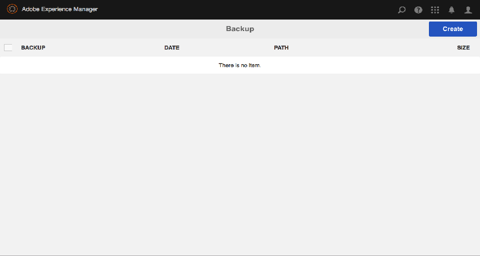
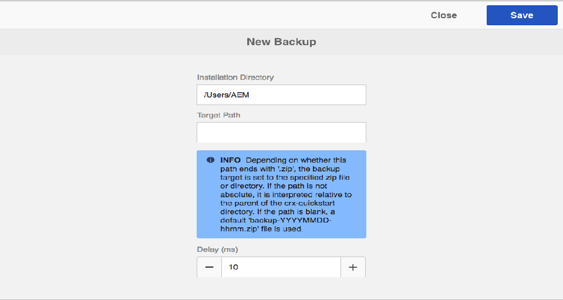

# Säkerhetskopiering och återställning{#backup-and-restore}

Det finns två sätt att säkerhetskopiera och återställa databasinnehåll i AEM:

* Du kan skapa en extern säkerhetskopia av databasen och lagra den på en säker plats. Om databasen bryts kan du återställa den till föregående läge.
* Du kan skapa interna versioner av databasinnehållet. Dessa versioner lagras i databasen tillsammans med innehållet, så att du snabbt kan återställa noder och träd som du har ändrat eller tagit bort.

## Allmänt {#general}

Den metod som beskrivs här gäller för säkerhetskopiering och återställning av system.

Om du behöver säkerhetskopiera och/eller återställa en liten mängd innehåll som går förlorat behöver du inte nödvändigtvis återställa systemet:

* Antingen kan du hämta data från ett annat system via ett paket
* Om du återställer säkerhetskopian på ett tillfälligt system skapar du ett innehållspaket och distribuerar det på systemet där det här innehållet saknas.

Mer information finns i [Säkerhetskopiera](/help/sites-administering/backup-and-restore.md#package-backup) paket nedan.

## Timing {#timing}

Kör inte säkerhetskopiering parallellt med datastorminsamlingen eftersom det kan skada resultatet av båda processerna.

## Offlinesäkerhetskopiering {#offline-backup}

Du kan alltid göra en säkerhetskopiering offline. Detta kräver ett driftstopp hos AEM, men kan vara mycket effektivt när det gäller den tid som krävs jämfört med en onlinesäkerhetskopiering.

I de flesta fall använder du en ögonblicksbild av filsystemet för att skapa en skrivskyddad kopia av lagringsutrymmet vid den tidpunkten. Så här skapar du en offlinesäkerhetskopiering:

* stoppa programmet
* skapa en säkerhetskopia av en ögonblicksbild
* starta programmet

Eftersom säkerhetskopieringen av ögonblicksbilder normalt tar några sekunder är hela driftstoppet mindre än några minuter.

## Onlinesäkerhetskopiering {#online-backup}

Denna säkerhetskopieringsmetod skapar en säkerhetskopia av hela databasen, inklusive alla program som distribueras under den, till exempel AEM. Säkerhetskopian innehåller innehåll, versionshistorik, konfiguration, programvara, snabbkorrigeringar, anpassade program, loggfiler, sökindex osv. Om du använder klustring och om den delade mappen är en underkatalog till `crx-quickstart` (antingen fysiskt eller via en programlänk), säkerhetskopieras även den delade katalogen.

Du kan återställa hela databasen (och alla program) vid ett senare tillfälle.

Den här metoden fungerar som en &quot;hot&quot;- eller &quot;online&quot;-säkerhetskopiering så att den kan utföras medan databasen körs. Därför kan databasen användas medan säkerhetskopieringen körs. Den här metoden fungerar för standardlagringsinstanserna tar-lagringsbaserade och -databaser.

När du skapar en säkerhetskopia har du följande alternativ:

* Säkerhetskopiera till en katalog med AEM:s integrerade säkerhetskopieringsverktyg.
* Säkerhetskopiera till en katalog med hjälp av en ögonblicksbild i filsystemet

Under alla omständigheter skapar säkerhetskopian en bild (eller ögonblicksbild) av databasen. Sedan bör systemsäkerhetskopieringsagenten vara försiktig så att den faktiskt överför den här avbildningen till ett dedikerat säkerhetskopieringssystem (bandenhet).

>[!NOTE]
>
>Om funktionen AEM Online Backup används på en AEM-instans som har en anpassad blobstore-konfiguration, bör du konfigurera sökvägen till datalagret så att den ligger utanför `crx-quickstart`katalogen och säkerhetskopiera datalagret separat.

>[!CAUTION]
>
>Onlinesäkerhetskopieringen säkerhetskopierar bara filsystemet. Om du lagrar databasinnehållet och/eller databasfilerna i en databas måste den databasen säkerhetskopieras separat. Om du använder AEM med MongoDB läser du dokumentationen om hur du använder de inbyggda [säkerhetskopieringsverktygen](https://docs.mongodb.org/manual/tutorial/backup-with-mongodump/)i MongoDB.

### AEM Online Backup {#aem-online-backup}

Med en onlinesäkerhetskopiering av databasen kan du skapa, hämta och ta bort säkerhetskopierade filer. Det är en &quot;hot&quot;- eller &quot;online&quot;-säkerhetskopieringsfunktion som kan köras medan databasen används normalt i läs-/skrivläge.

>[!CAUTION]
>
>Kör inte AEM Online Backup samtidigt som [Datastore-skräpinsamlingen](/help/sites-administering/data-store-garbage-collection.md) eller [Revision Cleanup](/help/sites-deploying/revision-cleanup.md#how-to-run-offline-revision-cleanup). Det påverkar systemets prestanda negativt.

När du startar en säkerhetskopiering kan du ange en **målsökväg** och/eller en **fördröjning**.

**Målsökväg** Säkerhetskopieringsfilerna sparas vanligtvis i den överordnade mappen till mappen som innehåller snabstart jar-filen (.jar). Om du till exempel har AEM jar-filen under /InstallationKits/AEM, genereras säkerhetskopian under /InstallationKits. Du kan också ange ett mål på en valfri plats.

Om **TargetPath** är en katalog skapas databasbilden i den här katalogen. Om samma katalog används flera gånger (eller alltid) för lagring av säkerhetskopior,

* Ändrade filer i databasen ändras i enlighet med detta i TargetPath
* borttagna filer i databasen tas bort i TargetPath
* skapade filer i databasen skapas i TargetPath

>[!NOTE]
>
>Om **TargetPath** är inställt på filnamn med filtillägget **.zip** säkerhetskopieras databasen till en tillfällig katalog och innehållet i den tillfälliga katalogen komprimeras och lagras i ZIP-filen.
>
>Detta tillvägagångssätt rekommenderas inte, eftersom
>
>* kräver ytterligare diskutrymme under säkerhetskopieringen (temporär katalog plus zip-filen)
>* komprimeringsprocessen utförs av databasen och kan påverka dess prestanda.
>* Det fördröjer säkerhetskopieringsprocessen.
>* Upp till Java 1.6 Java kan bara skapa ZIP-filer upp till 4 gigabyte.
>
>
Om du behöver skapa ett ZIP-format för säkerhetskopiering bör du säkerhetskopiera till en katalog och sedan använda ett komprimeringsprogram för att skapa zip-filen.

**Fördröjning** Anger en tidsfördröjning (i millisekunder) så att databasens prestanda inte påverkas. Som standard körs säkerhetskopieringen av databasen med full hastighet. Du kan göra det långsammare att skapa en onlinesäkerhetskopiering så att andra uppgifter inte går långsammare.

När en väldigt stor fördröjning används bör du se till att onlinesäkerhetskopiering inte tar mer än 24 timmar. Om så är fallet, ignorera säkerhetskopian eftersom den kanske inte innehåller alla binärfiler.
En fördröjning på 1 millisekund resulterar vanligtvis i 10 % processoranvändning, och en fördröjning på 10 millisekunder resulterar vanligtvis i mindre än 3 % processoranvändning. Den totala fördröjningen i sekunder kan uppskattas enligt följande: Databasstorlek i MB, multiplicerat med fördröjning i millisekunder, dividerat med 2 (om alternativet ZIP används) eller dividerat med 4 (vid säkerhetskopiering till en katalog). Det innebär att en säkerhetskopiering till en katalog i en 200 MB databas med 1 ms fördröjning ökar säkerhetskopieringstiden med cirka 50 sekunder.

>[!NOTE]
>
>Se [Så här fungerar](#how-aem-online-backup-works) AEM Online Backup för intern information om processen.

Så här skapar du en säkerhetskopia:

1. Logga in på AEM som administratör.

1. Gå till **Verktyg - Åtgärder - Säkerhetskopiering.**
1. Klicka på **Skapa**. Säkerhetskopieringskonsolen öppnas.

   

1. På säkerhetskopieringskonsolen anger du **[målsökväg](#aem-online-backup)**och**[ fördröjning](#aem-online-backup)**.

   

   >[!NOTE]
   >
   >Säkerhetskopieringskonsolen är också tillgänglig med:
   >
   >
   >` https://<*hostname*>:<*port-number*>/libs/granite/backup/content/admin.html`

1. Klicka på **Spara**. En förloppsindikator visar förloppet för säkerhetskopieringen.

   >[!NOTE]
   >
   >Du kan när som helst **avbryta** en säkerhetskopiering som körs.

1. När säkerhetskopieringen är klar visas ZIP-filerna i säkerhetskopieringsfönstret.

   

   >[!NOTE]
   >
   >Säkerhetskopior som inte längre behövs kan tas bort med konsolen. Markera säkerhetskopieringsfilen i den vänstra rutan och klicka sedan på **Ta bort**.

   >[!NOTE]
   >
   >Om du har säkerhetskopierat till en katalog: när säkerhetskopieringen är klar skriver inte AEM till målkatalogen.

### Automatisera AEM Online Backup {#automating-aem-online-backup}

Om det är möjligt bör säkerhetskopieringen online köras när det är lite belastning på systemet, till exempel på morgonen.

Säkerhetskopieringar kan automatiseras med hjälp av `wget` - eller `curl` HTTP-klienter. I följande exempel visas exempel på hur du automatiserar säkerhetskopiering med hjälp av vändning.

#### Säkerhetskopierar till standardmålkatalogen {#backing-up-to-the-default-target-directory}

>[!CAUTION]
>
>I följande exempel kan olika parametrar i `curl` kommandot behöva konfigureras för din instans: till exempel värdnamnet ( `localhost`), port ( `4502`), administratörslösenordet ( `xyz`) och filnamnet ( `backup.zip`).

```shell
curl -u admin:admin -X POST http://localhost:4502/system/console/jmx/com.adobe.granite:type=Repository/op/startBackup/java.lang.String?target=backup.zip
```

Säkerhetskopian av filen/katalogen skapas på servern i den överordnade mappen till mappen som innehåller `crx-quickstart` mappen (samma som om du skapade säkerhetskopian i webbläsaren). Om du till exempel har installerat AEM i katalogen `/InstallationKits/crx-quickstart/`skapas säkerhetskopian i `/InstallationKits` katalogen.

Kommandot curl returneras omedelbart, så du måste övervaka katalogen för att se när zip-filen är klar. När säkerhetskopieringen skapas kan en tillfällig katalog (med namnet som baseras på den slutliga ZIP-filen) visas, och i slutet kommer den att zippa. Exempel:

* den resulterande zip-filens namn: `backup.zip`
* namn på tillfällig katalog: `backup.f4d5.temp`

#### Säkerhetskopiera till en målkatalog som inte är standard {#backing-up-to-a-non-default-target-directory}

Vanligtvis skapas säkerhetskopian/katalogen på servern i den överordnade mappen till den mapp som innehåller `crx-quickstart` mappen.

Om du vill spara säkerhetskopian (av någon sortering) på en annan plats kan du ange en absolut sökväg till `target` parametern i `curl` kommandot.

Så här skapar du till exempel `backupJune.zip` i katalogen `/Backups/2012`:

```shell
curl -u admin:admin -X POST http://localhost:4502/system/console/jmx/com.adobe.granite:type=Repository/op/startBackup/java.lang.String?target=/Backups/2012/backupJune.zip"
```

>[!CAUTION]
>
>När du använder en annan programserver (till exempel JBoss) kanske inte onlinesäkerhetskopieringen fungerar som förväntat, eftersom målkatalogen inte är skrivbar. Kontakta i så fall supporten.

>[!NOTE]
>
>En säkerhetskopia kan också utlösas [med de MBeans som AEM](/help/sites-administering/jmx-console.md)ger.

### Säkerhetskopiering av ögonblicksbild av filsystem {#filesystem-snapshot-backup}

Den process som beskrivs här är särskilt lämplig för stora databaser.

>[!NOTE]
>
>Om du vill använda denna metod för säkerhetskopiering måste systemet ha stöd för ögonblicksbilder av filsystem. För Linux innebär detta att dina filsystem ska placeras på en logisk volym.

1. Gör en ögonblicksbild av filsystemets AEM är distribuerad på.

1. Montera ögonblicksbilden av filsystemet.
1. Utför en säkerhetskopiering och demontera ögonblicksbilden.

### Hur AEM Online Backup fungerar {#how-aem-online-backup-works}

AEM Online Backup består av en serie interna åtgärder för att säkerställa integriteten för de data som säkerhetskopieras och de säkerhetskopior som skapas. Dessa är listade nedan för de som är intresserade.

I onlinesäkerhetskopieringen används följande algoritm:

1. När du skapar en zip-fil är det första steget att skapa eller hitta målkatalogen.

   * Om du säkerhetskopierar till en ZIP-fil skapas en tillfällig katalog. Katalognamnet börjar med `backup.` och slutar med `.temp`; till exempel `backup.f4d3.temp`.
   * Om du säkerhetskopierar till en katalog används namnet som anges i målsökvägen. En befintlig katalog kan användas, annars skapas en ny katalog.

      En tom fil med namnet `backupInProgress.txt` skapas i målkatalogen när säkerhetskopieringen startar. Den här filen tas bort när säkerhetskopieringen är klar.

1. Filerna kopieras från källkatalogen till målkatalogen (eller den tillfälliga katalogen när en zip-fil skapas). Segmentlagret kopieras före datalagret för att undvika att databasen skadas. Index- och cachedata utelämnas när säkerhetskopian skapas. Detta innebär att data från `crx-quickstart/repository/cache` och `crx-quickstart/repository/index` inte inkluderas i säkerhetskopian. Förloppsindikatorn för processen ligger mellan 0 % och 70 % när en zip-fil skapas, eller 0 % - 100 % om ingen zip-fil skapas.

1. Om säkerhetskopian görs till en befintlig katalog tas&quot;gamla&quot; filer i målkatalogen bort. Gamla filer är filer som inte finns i källkatalogen.

Filerna kopieras till målkatalogen i fyra steg:

1. I det första kopieringssteget (förloppsindikator 0 % - 63 % när du skapar en zip-fil eller 0 % - 90 % om ingen zip-fil skapas) kopieras alla filer medan databasen körs normalt. Processen har två faser:

   * Fas A - allt kopieras utom för datalagret (med fördröjning).
   * Fas B - endast datalagret kopieras (med fördröjning).

1. I det andra kopieringssteget (förloppsindikator 63 % - 65,8 % när du skapar en zip-fil eller 90 % - 94 % om ingen zip-fil skapas) kopieras endast filer som har skapats eller ändrats i källkatalogen sedan det första kopieringssteget startades. Beroende på databasens aktivitet kan detta variera från inga filer alls, upp till ett stort antal filer (eftersom den första filkopieringsfasen oftast tar lång tid). Kopieringsprocessen liknar den första fasen (fas A och fas B med fördröjning).
1. I det tredje kopieringssteget (förloppsindikator 65,8 % - 68,6 % när en zip-fil skapas eller 94 % - 98 % om ingen zip-fil skapas) kopieras endast filer som har skapats eller ändrats i källkatalogen sedan det andra kopieringssteget startades. Beroende på databasens aktivitet kanske det inte finns några filer att kopiera eller ett mycket litet antal filer (eftersom den andra filkopieringsfasen vanligtvis är snabb). Kopieringsprocessen liknar den andra fasen - fas A och fas B - men utan dröjsmål.
1. Filkopieringsstegen ett till tre utförs samtidigt medan databasen körs. Endast filer som har skapats eller ändrats i källkatalogen sedan den tredje kopieringsfasen startades kopieras. Beroende på databasens aktivitet kanske det inte finns några filer att kopiera eller ett mycket litet antal filer (eftersom den andra filkopieringsfasen oftast är mycket snabb). Förloppsindikator 68,6 % - 70 % när en zip-fil skapas eller 98 % - 100 % om ingen zip-fil skapas. Kopieringsprocessen liknar den tredje fasen.
1. Beroende på målet:

   * Om en ZIP-fil har angetts skapas den nu från den tillfälliga katalogen. Förloppsindikator 70 % - 100 %. Den tillfälliga katalogen tas sedan bort.
   * Om målet var en katalog tas den tomma filen med namnet `backupInProgress.txt` bort för att ange att säkerhetskopieringen är klar.

## Återställa säkerhetskopian {#restoring-the-backup}

Du kan återställa en säkerhetskopia enligt följande:

* Om du har utfört en säkerhetskopiering av en ögonblicksbild av filsystemet kan du helt enkelt återställa en bild av systemet.
* Om du har skapat säkerhetskopian som en zip-fil behöver du bara packa upp innehållet i en ny mapp och starta AEM från den platsen.

## Säkerhetskopiera paket {#package-backup}

Om du vill säkerhetskopiera och återställa innehåll kan du använda en av pakethanterarna, som använder innehållspaketformatet för att säkerhetskopiera och återställa innehållet. Pakethanteraren ger större flexibilitet när det gäller att definiera och hantera paket.

Mer information om funktioner och kompromisser för de olika innehållspaketformaten finns i [Arbeta med paket](/help/sites-administering/package-manager.md).

### Säkerhetskopians omfattning {#scope-of-backup}

När du säkerhetskopierar noder med antingen Package Manager eller Content Zipper, sparar CRX följande information:

* Databasinnehållet nedanför det träd du har valt.
* De nodtypsdefinitioner som används för det innehåll du säkerhetskopierar.
* Namnutrymmesdefinitioner som används för det innehåll som du säkerhetskopierar.

Vid säkerhetskopiering förlorar AEM följande information:

* Versionshistoriken.

