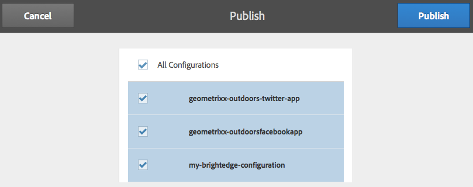

# Integrera med BrightEdge Content Optimizer{#integrating-with-brightedge-content-optimizer}

Skapa en BrightEdge-molnkonfiguration så att AEM kan ansluta med autentiseringsuppgifterna för ditt BrightEdge-konto. Du kan skapa flera konfigurationer om du använder flera konton.

När du skapar konfigurationen anger du en titel. Titeln bör vara beskrivande så att användarna kan korrelera konfigurationen med BrightEdge-kontot. När en sidförfattare eller administratör associerar en webbsida med BrightEdge-kontot visas den här titeln i en listruta.

1. Klicka på Verktyg > Åtgärder > Cloud > Cloud-tjänster.
1. Klicka på länken som visas i avsnittet BrightStor Content Optimizer. Om en BrightEdge-konfiguration har skapats avgör länktexten:

   * Konfigurera nu: Länken visas när ingen konfiguration har skapats.
   * Visa konfigurationer: Länken visas när en eller flera konfigurationer har skapats.
   

1. Om du klickade på Visa konfigurationer klickar du på länken + bredvid Tillgängliga konfigurationer.
1. Ange en rubrik för konfigurationen. Du kan också ange ett namn för noden som används för att lagra konfigurationen i databasen. Klicka på Skapa.
1. I dialogrutan Konfiguration av BrightStor Content Optimizer skriver du användarnamnet och lösenordet för BrightEdge-kontot och klickar sedan på OK.

## Redigera en BrightEdge-konfiguration {#editing-a-brightedge-configuration}

Ändra användarnamn och lösenord för en BrightEdge-konfiguration vid behov. Ändringarna påverkar alla sidor som använder konfigurationen.

1. Klicka på Verktyg > Åtgärder > Cloud > Cloud-tjänster.
1. Klicka på Visa konfigurationer i delen för BrightStor Content Optimizer.

   

1. Klicka på namnet på konfigurationen som du vill redigera.
1. Klicka på Redigera, ändra egenskapsvärdena och klicka sedan på OK.

## Associera sidor med en BrightEdge-konfiguration {#associating-pages-with-a-brightedge-configuration}

Associera sidor med en BrightEdge-konfiguration för att skicka siddata till BrightStor-tjänsten för analys. När du associerar en sida med en konfiguration ärver de underordnade sidorna associationen. Vanligtvis associerar du webbplatsens hemsida så att data från alla sidor skickas till BrightStor.

1. Öppna konsolen för klassiska webbplatser. ([http://localhost:4502/siteadmin#/content](http://localhost:4502/siteadmin#/content))
1. I trädet Webbplatser väljer du den mapp eller sida som innehåller den sida som du vill associera med BrightEdge-konfigurationen.
1. Högerklicka på sidan i listan över sidor för att konfigurera och klicka på Egenskaper.
1. Klicka på knappen Lägg till tjänst på fliken Molntjänster och välj BrightStor Content Optimizer i dialogrutan Cloud Services. Klicka sedan på OK.
1. Välj den BrightEdge-konfiguration som ska kopplas till sidan i listan BrightStor Content Optimizer och klicka sedan på OK.

   

## Aktivera en BrightEdge-konfiguration {#activating-a-brightedge-configuration}

Aktivera en BrightEdge-konfiguration för att replikera den på publiceringsinstansen och aktivera publicerade sidor för interaktion med BrightEdge-tjänsten.

1. Klicka på Webbplatser på listen och bläddra sedan till och markera sidan som du har associerat med BrightEdge-konfigurationen.
1. Klicka på eller tryck på ikonen Publicera och sedan på eller på Publicera.

   

1. Kontrollera att din BrightEdge-konfiguration är markerad i listan över konfigurationer som visas och klicka sedan på Publicera.

   

