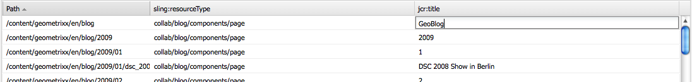

# Massredigeraren{#the-bulk-editor}

Med gruppredigeraren kan du redigera sidor mycket effektivt när den visuella sidkontexten inte behövs så som du kan:

* söka efter (och visa) innehåll från flera sidor, detta görs med GQL (Google Query Language)
* redigera det här innehållet direkt i gruppredigeraren
* spara ändringarna (på originalsidorna)
* exportera det här innehållet till en tabbavgränsad (.tsv) kalkylbladsfil

>[!NOTE]
>
>Du kan även importera innehåll till databasen, men som standard är detta inaktiverat för den gruppredigerare som är tillgänglig i **verktygskonsolen** .

I det här avsnittet beskrivs hur du arbetar med masredigeringsprogrammet i **verktygskonsolen** . Vanligtvis använder administratörer gruppredigeraren för att söka efter och redigera flera objekt. Det gör du genom att fylla i tabellen med en GQL-fråga och sedan genom att markera innehållsobjekten som du vill arbeta med. Författare använder vanligtvis massredigeringsprogrammet som en del av ett anpassat massredigeringsprogram som är tillgängligt via [produktlistkomponenten](/help/sites-authoring/default-components.md#productlist) .

>[!CAUTION]
>
>Med det klassiska användargränssnittet [i AEM 6.4](/help/release-notes/deprecated-removed-features.md) har även gruppredigeraren tagits bort och Adobe planerar därför inte att förbättra gruppredigeraren ytterligare.

## Exempel på användningsfall för den grupperade redigeraren {#example-use-case-for-the-bulk-editor}

Om du t.ex. behöver alla namn och e-postadresser för användare som fyllt i en viss enkät, kan gruppredigeraren ange den informationen och du kan exportera den till ett kalkylblad.

Ett exempel som illustrerar en sådan användning finns på webbplatsen Geometrixx:

1. Gå till **supportsidan** och sedan till enkäten **Kundtjänst** .
1. **Redigera** stycket **Början av formulär** . **Klicka på fliken** Avancerat **i dialogrutan, expandera**&#x200B;åtgärdskonfigurationen **och klicka sedan på** Visa data.. .

   

1. Massredigeraren är helt anpassningsbar. I det här exemplet kan användare inte redigera innehållet, men bara exportera informationen till ett kalkylblad.

   

## Så här använder du gruppredigeraren {#how-to-use-the-bulk-editor}

Massredigeraren gör att du kan:

* [söka efter innehåll baserat på frågeparametrar, för att visa angivna egenskaper för resultaten i kolumner, för att redigera innehållet och spara ändringarna](#searching-and-editing-content)
* [om du vill exportera det här innehållet till ett tabbseparerat kalkylblad](#exporting-content)

* [importera innehåll från ett tabbseparerat kalkylblad](#importing-content)

### Söka och redigera innehåll {#searching-and-editing-content}

Så här använder du gruppredigeraren för att redigera flera objekt samtidigt:

1. Klicka på mappen **Importers** i **** verktygskonsolen för att expandera den.
1. Dubbelklicka på **gruppredigeraren** för att öppna den.
1. Ange dina urvalskrav:

<table>
 <tbody>
  <tr>
   <td>Fält</td>
   <td>Egenskap</td>
  </tr>
  <tr>
   <td>Rotsökväg</td>
   <td>Anger rotsökvägen som massredigeraren söker efter.  Exempel, <code>/content/geometrixx/en</code>. Massredigeraren söker igenom alla underordnade noder.</td>
  </tr>
  <tr>
   <td>Frågeparametrar</td>
   <td>Använd GQL-parametrar för att ange den söksträng som du vill att massredigeraren ska söka efter i databasen; söker t.ex. efter alla sidor i rotsökvägen, söker efter alla sidor som innehåller ordet "professional" och söker efter alla sidor som har "English" som <code>type:Page</code> <code>text:professional</code> <code>"jcr:title":English</code> titel. Du kan bara söka efter strängar.</td>
  </tr>
  <tr>
   <td>Kryssrutan Innehållsläge</td>
   <td>Markera den här kryssrutan om du vill läsa egenskaper i undernoden till sökresultaten, om sådana finns. <code>jcr:content</code> Använd endast för sidor. Egenskapsnamn har prefixet <code>"jcr:content/"</code></td>
  </tr>
  <tr>
   <td>Egenskaper/kolumner</td>
   <td>Markera kryssrutorna för de egenskaper som du vill att massredigeraren ska returnera. De egenskaper du väljer är kolumnrubrikerna i resultatrutan. Som standard visas nodsökvägen i resultatet.</td>
  </tr>
  <tr>
   <td>Anpassade egenskaper/kolumner</td>
   <td>Ange eventuella andra egenskaper som inte finns med i listan i fältet <strong>Egenskaper/Kolumner</strong> . Dessa anpassade egenskaper visas i resultatrutan. Du kan lägga till flera egenskaper genom att använda kommatecken för att skilja egenskaperna åt. <i></i> Obs! Om du lägger till en anpassad egenskap som inte finns än, visar AEM WCM en tom cell. När du ändrar den tomma cellen och sparar den läggs egenskapen till i noden. Den nya egenskapen måste respektera nodtypsbegränsningar och egenskapsnamnutrymmen.</td>
  </tr>
 </tbody>
</table>

Exempel:

1. Klicka på **Sök**. Resultaten visas i gruppredigeraren.
I exemplet ovan returneras alla sidor som uppfyller dina sökvillkor och visas med de begärda kolumnerna.

   

1. Gör de ändringar du behöver genom att dubbelklicka i en cell.

   

1. Klicka på **Spara** för att spara ändringarna (knappen **Spara** aktiveras när du har redigerat en cell).

   >[!CAUTION]
   >
   >De ändringar du gör här skrivs till databasinnehållet; till exempel sidan som refereras i **Bana**.

#### Ytterligare GQL-frågeparametrar {#additional-gql-query-parameters}

* **** sökväg: bara söknoder under den här sökvägen. Om du anger mer än en term med ett sökvägsprefix beaktas bara den sista.
* **** typ: bara returnera noder av de angivna nodtyperna. Detta inkluderar både primära och blandade typer. Du kan ange flera kommaseparerade nodtyper. GQL returnerar noder som är av någon av de angivna typerna.
* **** beställning: sortera resultatet efter de angivna egenskaperna. Du kan ange flera kommaavgränsade egenskapsnamn. Om du vill ordna resultatet i fallande ordning lägger du bara till ett minustecken som prefix för egenskapsnamnet. Exempel: order:-name. Om du använder ett plustecken returneras resultatet i stigande ordning, vilket också är standard.
* **** gräns: begränsar antalet resultat med ett intervall. Exempel: limit:10..20 Observera att intervallet är nollbaserat, att början är inkluderat och att slutet är exklusivt. Du kan också ange ett öppet intervall:limit:10. eller limit:..20 Om punkterna utelämnas och endast ett värde anges kommer GQL att returnera maximalt detta antal resultat. T.ex. limit:10 (returnerar de första 10 resultaten)

### Exporterar innehåll {#exporting-content}

Du kan behöva exportera innehåll och göra ändringar i det i ett Excel-kalkylblad. Du kan till exempel vilja exportera en utskickslista och ändra riktnummer för alla telefonnummer som visas direkt i Excel, lägga till ytterligare rader och så vidare.

Så här exporterar du innehåll:

1. Sök efter innehåll enligt beskrivningen i [Söka och redigera innehåll](#searching-and-editing-content).
1. Klicka på **Exportera** för att exportera ändringarna till ett tabbseparerat Excel-kalkylblad. AEM WCM frågar var du vill ladda ned filen.

   >[!NOTE]
   >
   >Som standard kodas ändringar i [Windows-1252](https://en.wikipedia.org/wiki/Windows-1252) (kallas även CP-1252). Du kan markera UTF-8 om du vill exportera ändringarna i UTF-8.

   

1. Markera platsen och bekräfta att du vill hämta filen.
1. När du har laddat ned filen kan du öppna den från kalkylprogrammet, till exempel Microsoft Excel. Kalkylbladsprogrammet importerar filen och konverterar den till ett kalkylbladsformat.

   

### Importera innehåll {#importing-content}

Som standard är importfunktionen dold när du öppnar gruppredigeraren. Om du bara lägger till parametern `hib=false` till URL-adressen visas knappen **Importera** på sidan Gruppredigerare. Du kan importera innehåll från alla tabbseparerade ( `.tsv`) filer. För att importen ska fungera på rätt sätt måste kolumnrubrikerna (den första cellraden) matcha kolumnrubrikerna i tabellen som du importerar till.

>[!NOTE]
>
>När du återimporterar innehåll raderas allt tidigare innehåll för de noderna. Var försiktig så att du inte skriver över viktig information.

Så här importerar du innehåll:

1. Öppna gruppredigeraren.
1. Lägg `?hib=false` till URL-adressen, t.ex.:
   `https://localhost:4502/etc/importers/bulkeditor.html?hib=false`
1. Klicka på **Importera**.
1. Select the `.tsv` file. Data importeras till databasen.