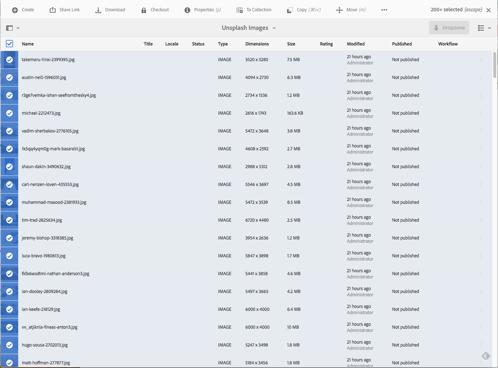

# Gruppbearbetning {#bulk-processing-operations}

## Introduktion {#introduction}

I den senaste versionen av AEM har knappen Markera alla utökats till att omfatta alla vyer: List-, kolumn- och kortvy. Knappen Markera alla markerar nu allt innehåll i en viss mapp eller samling och inte bara de resurser och sidor som är inlästa och synliga i klientens webbläsare.

Nyckelåtgärder har aktiverats för gruppåtgärden: **Flytta**, **ta bort** och **kopiera**. En ny dialogruta visar för kunderna vilka åtgärder som gruppbearbetning inte är tillgänglig för.

## Så här använder du {#how-to-use}

En ny knapp med namnet **Markera alla** har lagts till i vyerna Kort, Lista eller Kolumn. Den här knappen kan användas i alla vyer för att markera alla element i datauppsättningen.

I tidigare versioner av AEM var urvalet begränsat till vad som lästes in i klientwebbläsaren. De här nya ändringarna har införts för att undvika förvirring om hur många element en gruppåtgärd utförs på.

För närvarande har tre åtgärder lagts till i gruppbearbetning:

* Flytta
* Kopiera
* Ta bort

Stöd för fler åtgärder kommer att läggas till i framtiden.
Om du vill använda den här funktionen måste du navigera till den mapp eller samling där du vill utföra en gruppåtgärd på sidor eller på resurser.

Välj sedan en av vyerna enligt nedan:

### Kortvy {#card-view}

### Massmarkering i kortvyn {#bulk-selection-in-card-view}

Resurser eller sidor kan markeras i grupp med knappen **Markera alla** överst till höger:

 

### Listvy {#list-view}

Samma sak gäller för listvyn:

### Massmarkering i listvyn {#bulk-selection-in-list-view}

Använd knappen **Markera alla** i listvyn eller använd kryssrutan till vänster för gruppval.

 

### Kolumnvy {#column-view}

### Massmarkering i kolumnvyn {#bulk-selection-in-column-view}

## Massaktiverade åtgärder {#bulk-enabled-operations}

Efter markeringen kan en av de tre massaktiverade åtgärderna utföras: **Flytta**, **Kopiera** eller **Ta bort**.

Här **utförs åtgärden Flytta** på de resurser som markerats ovan. I alla vyer resulterar detta i att alla resurser flyttas till den valda platsen och inte bara till de som läses in på skärmen.

För andra åtgärder som inte är gruppaktiverade, **som** Hämta,visas en varning om att bara element som lästs in i webbläsaren kommer att inkluderas i åtgärden.

