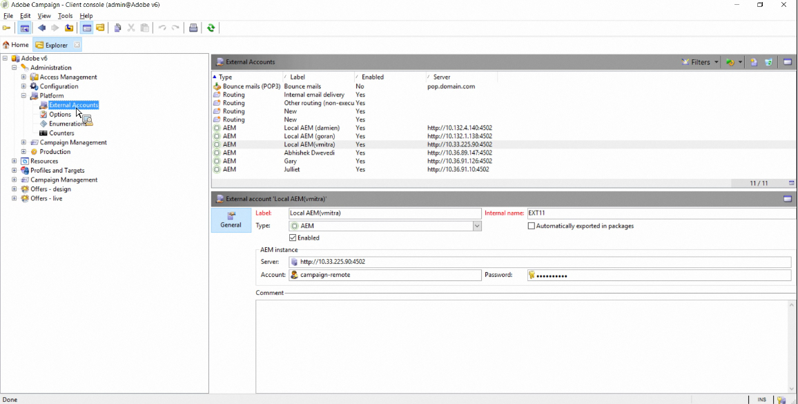
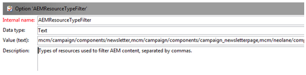
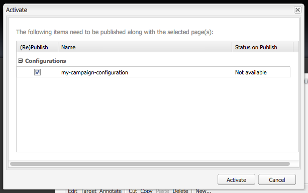

# Integrera med Adobe Campaign Classic{#integrating-with-adobe-campaign-classic}

>[!NOTE]
>
>I den här dokumentationen beskrivs hur du integrerar AEM med Adobe Campaign Classic, den lokala lösningen. Om du använder Adobe Campaign Standard finns dessa instruktioner i [Integrera med Adobe Campaign Standard](/help/sites-administering/campaignstandard.md).

Med Adobe Campaign kan ni hantera e-postinnehåll och formulär direkt i Adobe Experience Manager.

Om du vill använda båda lösningarna samtidigt måste du först konfigurera dem så att de ansluter till varandra. Detta inbegriper konfigurationssteg i både Adobe Campaign och Adobe Experience Manager. Dessa steg beskrivs i detalj i det här dokumentet.

När du arbetar med Adobe Campaign i AEM kan du skicka e-post via Adobe Campaign och beskrivs i [Arbeta med Adobe Campaign](/help/sites-authoring/campaign.md). Det innefattar även att använda formulär på AEM sidor för att hantera data.

Dessutom kan följande ämnen vara intressanta när du integrerar AEM med [Adobe Campaign](https://helpx.adobe.com/support/campaign/classic.html):

* [Metodtips för e-postmallar](/help/sites-administering/best-practices-for-email-templates.md)
* [Felsöka Adobe Campaign-integreringen](/help/sites-administering/troubleshooting-campaignintegration.md)

Om du utökar integreringen med Adobe Campaign kanske du vill se följande sidor:

* [Skapa anpassade tillägg](/help/sites-developing/extending-campaign-extensions.md)
* [Skapa anpassade formulärmappningar](/help/sites-developing/extending-campaign-form-mapping.md)

## Arbetsflöde för integrering med AEM och Adobe Campaign {#aem-and-adobe-campaign-integration-workflow}

I det här avsnittet beskrivs ett typiskt arbetsflöde mellan AEM och Adobe Campaign när du skapar kampanjer och levererar innehåll.

Det typiska arbetsflödet omfattar följande och beskrivs i detalj:

1. Börja bygga en kampanj (både i Adobe Campaign och AEM).
1. Innan du länkar innehållet och leveransen kan du anpassa innehållet i AEM och skapa en leverans i Adobe Campaign.
1. Länka innehåll och leverans i Adobe Campaign.

### Börja bygga din kampanj {#start-building-your-campaign}

Du börjar skapa en kampanj när som helst. Innan ni länkar innehållet är AEM och AC oberoende Det innebär att marknadsförarna kan börja skapa kampanjer och målinriktning i Adobe Campaign, medan de som skapar innehåll arbetar med designen i AEM.

### Innan innehåll och leverans länkas {#before-linking-content-and-delivery}

Innan du länkar innehållet och skapar en leveransfunktion måste du göra följande:

**I AEM**

* Anpassa med anpassningsfälten i **Text &amp; Personalization**-komponenten

**I Adobe Campaign**

* Skapa en leverans av typen **aemContent**

### Länka innehåll och ange leverans {#linking-content-and-setting-delivery}

När du har förberett innehållet för länkning och leverans bestämmer du exakt hur och var innehållet ska länkas.

Alla dessa steg utförs i Adobe Campaign.

1. Ange vilken AEM som ska användas.
1. Synkronisera innehållet genom att klicka på knappen Synkronisera.
1. Öppna innehållsväljaren för att välja innehåll.

### Om du inte har använt AEM {#if-you-are-new-to-aem}

Om du inte har använt AEM tidigare kan följande länkar vara bra att förstå AEM:

* [AEM](/help/sites-deploying/deploy.md)
* [Förstå replikeringsagenter](/help/sites-deploying/replication.md)
* [Söka efter och arbeta med loggfiler](/help/sites-deploying/monitoring-and-maintaining.md#working-with-audit-records-and-log-files)
* [Introduktion till AEM](/help/sites-deploying/platform.md)

## Konfigurerar Adobe Campaign {#configuring-adobe-campaign}

När du konfigurerar Adobe Campaign ingår följande:

1. Installera AEM integreringspaket i Adobe Campaign.
1. Konfigurera ett externt konto.
1. Verifierar att AEMResourceTypeFilter har konfigurerats korrekt.

Det finns dessutom avancerade konfigurationer som du kan göra, bland annat:

* Hantera innehållsblock
* Hantera personaliseringsfält

Se [Avancerade konfigurationer](#advanced-configurations).

>[!NOTE]
>
>För att kunna utföra dessa åtgärder måste du ha rollen **administration** i Adobe Campaign.

### Förutsättningar {#prerequisites}

Kontrollera att du har följande element i förväg:

* [En AEM](/help/sites-deploying/deploy.md#getting-started)
* [En AEM publiceringsinstans](/help/sites-deploying/deploy.md#author-and-publish-installs)
* [En Adobe Campaign Classic-instans](https://helpx.adobe.com/support/campaign/classic.html)  - inklusive en klient och en server
* Internet Explorer 11

>[!NOTE]
>
>Om du kör en version som är tidigare än Adobe Campaign Classic build 8640 finns mer information i [uppgraderingsdokumentationen](https://docs.campaign.adobe.com/doc/AC6.1/en/PRO_Updating_Adobe_Campaign_Upgrading.html). Observera att både klienten och databasen måste uppgraderas till samma bygge.

>[!CAUTION]
>
>Åtgärder som beskrivs i avsnitten [Konfigurera Adobe Campaign](#configuring-adobe-campaign) och [Konfigurera Adobe Experience Manager](#configuring-adobe-experience-manager) krävs för att integreringsfunktionerna mellan AEM och Adobe Campaign ska fungera korrekt.

### Installera AEM integreringspaket {#installing-the-aem-integration-package}

Du måste installera **AEM Integration**-paketet i Adobe Campaign. Så här gör du:

1. Gå till den Adobe Campaign-instans som du vill länka till AEM.
1. Välj *Verktyg* > *Avancerat* > *Importera paket..*.

   

1. Klicka på **Installera ett standardpaket** och välj sedan **AEM Integration**-paketet.

   

1. Klicka på **Nästa** och **Starta**.

   Det här paketet innehåller operatorn **aemserver** som ska användas för att ansluta AEM till Adobe Campaign.

   >[!CAUTION]
   >
   >Som standard är ingen säkerhetszon konfigurerad för den här operatorn. Om du vill ansluta till Adobe Campaign via AEM måste du välja en.
   >
   >I filen **serverConf.xml** måste attributet **allowUserPassword** för den valda säkerhetszonen anges till **true** för att auktorisera AEM att ansluta till Adobe Campaign via inloggning/lösenord.
   >
   >Vi rekommenderar starkt att du skapar en säkerhetszon som är dedikerad till AEM för att undvika säkerhetsproblem. Mer information finns i [Installationsguiden](https://docs.campaign.adobe.com/doc/AC/en/INS_Additional_configurations_Configuring_Campaign_server.html).

   

### Konfigurera ett AEM externt konto {#configuring-an-aem-external-account}

Du måste konfigurera ett externt konto som gör att du kan ansluta Adobe Campaign till din AEM.

>[!NOTE]
>
>* När du installerar **AEM Integration**-paketet skapas ett externt AEM. Du kan konfigurera anslutningen till AEM från den eller skapa en ny.
>* I AEM måste du ange lösenordet för kampanjens fjärranvändare. Du måste ange det här lösenordet för att kunna ansluta Adobe Campaign till AEM. Logga in som administratör och i användaradministrationskonsolen, sök efter användaren som är kampanjfjärranvändare och klicka på **Ange lösenord**.

>


Så här konfigurerar du ett externt AEM:

1. Gå till noden **Administration** > **Plattform** > **Externa konton**.
1. Skapa ett nytt externt konto och välj typen **AEM**.
1. Ange åtkomstparametrarna för AEM-utvecklingsinstansen: serveradressen samt det ID och lösenord som används för att ansluta till den här instansen. Lösenordet för användarkontot för kampanj-api är detsamma som för användaren som du angav ett lösenord för i AEM.

   >[!NOTE]
   >
   >Kontrollera att serveradressen **inte** avslutas med ett avslutande snedstreck. Ange till exempel `https://yourserver:4502` i stället för `https://yourserver:4502/`

    

1. Kontrollera att kryssrutan **Aktiverad** är markerad.

### Verifierar alternativet AEMResourceTypeFilter {#verifying-the-aemresourcetypefilter-option}

Alternativet **AEMResourceTypeFilter** används för att filtrera typer av AEM resurser som kan användas i Adobe Campaign. På så sätt kan Adobe Campaign hämta AEM som är särskilt utformade för att endast användas i Adobe Campaign.

Detta alternativ bör vara förkonfigurerat; Men om du ändrar det här alternativet kan det leda till att integreringen inte fungerar.

Så här verifierar du att alternativet **AEMResourceTypeFilter** är konfigurerat:

1. Gå till **Plattform** >**Alternativ**.
1. Kontrollera att sökvägarna är korrekta i alternativet **AEMResourceTypeFilter**. Fältet måste innehålla värdet:

   **mcm/campaign/components/newsletter,mcm/campaign/components/campaign_newsletterpage,mcm/neolane/components/newsletter**

   I vissa fall är värdet följande:

   **mcm/campaign/components/newsletter**

   

## Konfigurerar Adobe Experience Manager {#configuring-adobe-experience-manager}

För att konfigurera AEM måste du göra följande:

* Konfigurera replikering mellan instanser.
* Koppla AEM till Adobe Campaign via Cloud Services.
* Konfigurera externaliseraren.

### Konfigurera replikering mellan AEM {#configuring-replication-between-aem-instances}

Innehåll som skapas från AEM-författarinstansen skickas först till publiceringsinstansen. Du måste publicera så att bilderna i nyhetsbrevet är tillgängliga för publiceringsinstansen och för mottagarna av nyhetsbrevet. Replikeringsagenten måste därför konfigureras att replikera från AEM till den AEM publiceringsinstansen.

>[!NOTE]
>
>Om du inte vill använda replikerings-URL:en, utan i stället använda den offentliga URL:en, kan du ange **Offentlig URL** i följande konfigurationsinställning i OSGi (**AEM logo** > **Verktyg** ikon > **Åtgärder** > **Webbkonsol** > a10/>OSGi Configuration **>** AEM Campaign Integration - Configuration **):**
**Offentlig URL:** com.day.cq.mcm.campaign.impl.IntegrationConfigImpl#aem.mcm.campaign.publicUrl

Det här steget är också nödvändigt för att replikera vissa redigeringsinstanskonfigurationer till publiceringsinstansen.

Så här konfigurerar du replikering mellan AEM instanser:

1. I redigeringsinstansen väljer du **AEM logotyp** **Verktyg** ikon > **Distribution** > **Replikering** > **Agenter på författare** och klickar sedan på **Standardagent**.

   

   >[!NOTE]
   Undvik att använda localhost (d.v.s. en lokal kopia av AEM) när du konfigurerar integreringen med Adobe Campaign, såvida inte både publicerings- och författarinstansen finns på samma dator.

1. Tryck eller klicka på **Redigera** och välj sedan fliken **Transport**.
1. Konfigurera URI:n genom att ersätta **localhost** med IP-adressen eller adressen för den AEM publiceringsinstansen.

   

### Ansluta AEM till Adobe Campaign {#connecting-aem-to-adobe-campaign}

Innan ni kan använda AEM och Adobe Campaign tillsammans måste ni etablera en länk mellan båda lösningarna så att de kan kommunicera.

1. Anslut till AEM.
1. Välj **AEM logotyp** > **Verktyg** ikon > **Distribution** > **Cloud Services** och **Konfigurera nu** i Adobe Campaign-avsnittet.

   

1. Skapa en ny konfiguration genom att ange en **titel** och klicka på **Skapa**, eller välj den befintliga konfiguration som du vill länka till din Adobe Campaign-instans.
1. Redigera konfigurationen så att den matchar parametrarna för din Adobe Campaign-instans.

   * **Användarnamn**:  **aemserver**, paketoperatorn Adobe Campaign AEM Integration, som används för att upprätta länken mellan de två lösningarna.
   * **Lösenord**: Lösenord för operatorn Adobe Campaign aemserver. Du kan behöva ange lösenordet för den här operatorn igen direkt i Adobe Campaign.
   * **API-slutpunkt**: Adobe Campaign instans-URL.

1. Välj **Anslut till Adobe Campaign** och klicka på **OK**.

   

   >[!NOTE]
   När du har [skapat e-postmeddelandet och publicerat det](/help/sites-authoring/campaign.md) måste du publicera konfigurationen på nytt på din publiceringsinstans.

   

>[!NOTE]
Om anslutningen misslyckas kontrollerar du följande:
* Du kan stöta på ett certifikatproblem när du använder en säker anslutning till en Adobe Campaign-instans (https). Du måste lägga till Adobe Campaign-instanscertifikatet i **cacerts**-filen för JDK:n för din AEM.
* En säkerhetszon måste konfigureras för [aemserver-operatorn](#connecting-aem-to-adobe-campaign) i Adobe Campaign. I filen **serverConf.xml** måste dessutom attributet **allowUserPassword** för säkerhetszonen anges till **true** för att auktorisera AEM anslutning till Adobe Campaign i inloggnings-/lösenordsläge.

Se även [Felsöka din AEM/Adobe Campaign-integrering](/help/sites-administering/troubleshooting-campaignintegration.md).

### Konfigurera externaliseraren {#configuring-the-externalizer}

Du måste [konfigurera externaliseraren](/help/sites-developing/externalizer.md) i AEM på författarinstansen. Externalizer är en OSGi-tjänst som gör att du kan omvandla en resurssökväg till en extern och absolut URL. Den här tjänsten tillhandahåller en central plats för att konfigurera dessa externa URL:er och skapa dem.

Se [Konfigurera externaliseraren](/help/sites-developing/externalizer.md) för allmänna instruktioner. För Adobe Campaign-integreringen måste du konfigurera publiceringsservern på `https://<host>:<port>/system/console/configMgr/com.day.cq.commons.impl.ExternalizerImpl`så att den inte pekar på `localhost:4503`, utan på en server som kan nås av Adobe Campaign-konsolen.

Om den pekar på `localhost:4503` eller någon annan server som Adobe Campaign inte kan nå visas inte dina bilder på Adobe Campaign-konsolen.


## Avancerade konfigurationer {#advanced-configurations}

Du kan även utföra några avancerade konfigurationer, som:

* Hantera personaliseringsfält och -block.
* Inaktivera ett personaliseringsblock.
* Hantera måltilläggsdata.

### Hantera anpassningsfält och -block {#managing-personalization-fields-and-blocks}

De fält och block som är tillgängliga för att lägga till personalisering i ditt e-postinnehåll i AEM hanteras av Adobe Campaign.

En standardlista har angetts men kan ändras. Du kan också lägga till eller dölja fält och block för personalisering.

#### Lägga till ett anpassningsfält {#adding-a-personalization-field}

Om du vill lägga till ett nytt anpassningsfält till de som redan är tillgängliga måste du utöka schemat för Adobe Campaign **nms:seedMember** enligt följande:

>[!CAUTION]
Fältet som du måste lägga till måste redan ha lagts till via ett mottagarschematillägg (**nms:mottagare**). Mer information finns i guiden [Konfiguration](https://docs.campaign.adobe.com/doc/AC6.1/en/CFG_Editing_schemas_Editing_schemas.html).

1. Gå till noden **Administration** > **Konfiguration** > **Datascheman** i Adobe Campaign-navigeringen.
1. Välj **Nytt**.

   

1. I popup-fönstret väljer du **Utöka data i tabellen med ett tilläggsschema** och klickar på **Nästa**.

   

1. Ange de olika parametrarna för det utökade schemat:

   * **Schema**: välj  **nms:** seedMemberschema. De andra fälten i fönstret fylls i automatiskt.
   * **Namnutrymme**: anpassa namnområdet för det utökade schemat.

1. Redigera XML-koden för schemat för att ange fältet som du vill lägga till där. Mer information om hur du utökar scheman i Adobe Campaign finns i [konfigurationsguiden](https://docs.campaign.adobe.com/doc/AC6.1/en/CFG_Editing_schemas_Extending_a_schema.html).
1. Spara ditt schema och uppdatera sedan Adobe Campaign-databasstrukturen via menyn **Verktyg** > **Avancerat** > **Uppdatera databasstruktur** i konsolen.
1. Koppla från och återanslut sedan till Adobe Campaign-konsolen för att spara ändringarna. Det nya fältet visas nu i listan med anpassningsfält som är tillgängliga i AEM.

#### Exempel {#example}

Om du vill lägga till ett **registreringsnummer**-fält måste du ha följande element:

* Schematillägget **nms:receive** med namnet **cus:mottagare** innehåller:

```xml
<element desc="Recipient table (profiles)" img="nms:recipient.png" label="Recipients" labelSingular="Recipient" name="recipient">

  <attribute dataPolicy="smartCase" desc="Recipient registration number"
  label="Registration Number"
  length="50" name="registrationNumber" type="string"/>

</element>
```

Schematillägget **nms:seedMember** med namnet **cus:seedMember** innehåller:

```xml
<element desc="Seed to insert in the export files" img="nms:unknownad.png" label="Seed addresses" labelSingular="Seed" name="seedMember">

  <element name="custom_nms_recipient">
    <attribute name="registrationNumber"
    template="cus:recipient:recipient/@registrationNumber"/>
  </element>

</element>
```

Fältet **Registreringsnummer** är nu en del av de tillgängliga anpassningsfälten:


#### Dölja ett anpassningsfält {#hiding-a-personalization-field}

Om du vill dölja ett anpassningsfält bland dem som redan är tillgängliga, måste du utöka schemat för Adobe Campaign **nms:seedMember** enligt beskrivningen i [Adding a personalization field](#adding-a-personalization-field) -avsnittet. Använd följande steg:

1. Kopiera fältet som du vill ta från schemat **nms:seedMember** i det utökade schemat (**cus:seedMember** till exempel).
1. Lägg till XML-attributet **advanced=&quot;true&quot;** i fältet. Det visas inte längre i listan med anpassningsfält som är tillgängliga i AEM.

   Om du till exempel vill dölja fältet **Mellannamn** måste schemat **cud:seedMember** innehålla följande element:

   ```xml
   <element desc="Seed to insert in the export files" img="nms:unknownad.png" label="Seed addresses" labelSingular="Seed" name="seedMember">
   
     <element name="custom_nms_recipient">
       <attribute advanced="true" name="middleName"/>
     </element>
   
   </element>
   ```

### Inaktivera ett anpassningsblock {#deactivating-a-personalization-block}

Så här inaktiverar du ett personaliseringsblock bland de tillgängliga:

1. Gå till **Resources** > **Campaign Management** > **Personalization blocks**-noden i Adobe Campaign navigering.
1. Markera det anpassningsblock som du vill inaktivera i AEM.
1. Avmarkera kryssrutan **Synlig i anpassningsmenyerna** och spara ändringarna. Blocket visas inte längre i listan med anpassningsblock som är tillgängliga i Adobe Campaign.

   

### Hantera måltilläggsdata {#managing-target-extension-data}

Du kan också infoga måltilläggsdata för personalisering. Måltilläggsdata (kallas även&quot;måldata&quot;) kommer från att till exempel ha berikat eller lagt till data i en fråga i ett kampanjarbetsflöde. Mer information finns i avsnitten [Skapa frågor](https://docs.campaign.adobe.com/doc/AC/en/PTF_Creating_queries_About_queries_in_Campaign.html) och [Förbättra data](https://docs.campaign.adobe.com/doc/AC/en/WKF_Use_cases_Enriching_data.html).

>[!NOTE]
Data i målet är bara tillgängliga om det AEM innehållet synkroniseras med en Adobe Campaign-leverans. Se [Synkronisera innehåll som skapats i AEM med en leverans från Adobe Campaign](/help/sites-authoring/campaign.md#synchronizing-content-created-in-aem-with-a-delivery-from-adobe-campaign-classic).


