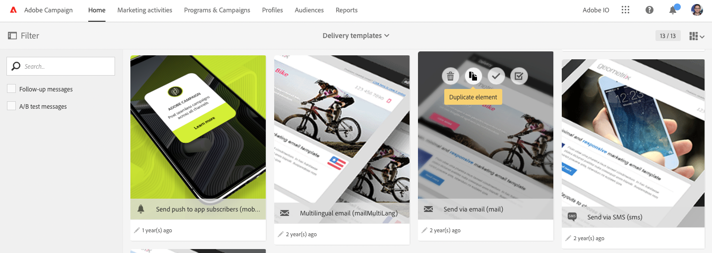
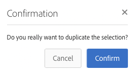
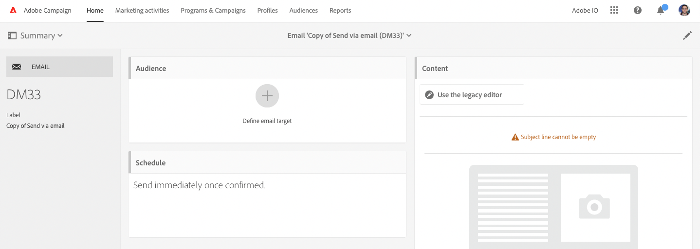

# Integrera AEM 6.5 med Adobe Campaign Standard {#integrating-with-adobe-campaign-standard}

Genom att integrera AEM 6.5 med Adobe Campaign Standard (ACS) kan ni hantera e-postleveranser, innehåll och formulär direkt i AEM. Konfigurationssteg i både Adobe Campaign Standard och AEM behövs för att möjliggöra dubbelriktad kommunikation mellan lösningar.

Tack vare den här integreringen kan AEM och Adobe Campaign Standard användas oberoende av varandra. Marknadsförare kan skapa kampanjer och använda målinriktning i Adobe Campaign, medan innehållsskapare kan arbeta parallellt med innehållsdesign i AEM. Tack vare integreringen kan innehållet i och utformningen av kampanjen som skapats i AEM målinrikta och levereras av Adobe Campaign.

>[!INFO]
>
>I det här dokumentet beskrivs hur du integrerar Adobe Campaign Standard med AEM 6.5. Andra Campaign-integreringar finns i dokumentet [Integrera AEM 6.5 med Adobe Campaign.](campaign.md)

## Integreringssteg {#integration-steps}

Konfigurationen av integreringen mellan AEM och Adobe Campaign Standard kräver flera steg i båda lösningarna.

1. [Konfigurera ](#aemserver-user)
1. [Verifiera ](#resource-type-filter)
1. [Skapa en AEM-specifik e-postleveransmall i Campaign](#aem-email-delivery-template)
1. [Konfigurera Campaign-integrering i AEM](#campaign-integration)
1. [Konfigurera replikering till AEM Publish-instans](#replication)
1. [Konfigurera AEM](#externalizer)
1. [Konfigurera ](#campaign-remote-user)
1. [Konfigurera det AEM externa kontot i kampanj](#acc-external-user)

Det här dokumentet leder dig igenom dessa steg i detalj.

## Förutsättningar {#prerequisites}

* Administratörsåtkomst till Adobe Campaign Standard
   * Om du behöver mer information om hur du konfigurerar och konfigurerar Adobe Campaign Standard läser du [Adobe Campaign Standard-dokumentationen.](https://experienceleague.adobe.com/docs/campaign-standard/using/campaign-standard-home.html?lang=sv-SE)
* Administratörsåtkomst till AEM

## Konfigurera eServer-användaren i Campaign {#aemserver-user}

Adobe Campaign Standard har som standard en `aemserver`-användare som AEM använder för att ansluta till Adobe Campaign. Tilldela en lämplig säkerhetsgrupp för den här användaren och ange dess lösenord.

1. Logga in i Adobe Campaign som administratör.

1. Klicka på Adobe Campaign-logotypen längst upp till vänster på menyraden för att öppna den globala navigeringen och välj sedan **Administration** > **Användare och säkerhet** > **Användare** på navigeringsmenyn.

1. Klicka på användaren `aemserver` i användarkonsolen.

1. Kontrollera att användaren `aemserver` har tilldelats minst en säkerhetsgrupp som har rollen `deliveryPrepare` tilldelad. Som standard har gruppen `Standard Users` den här rollen.

   

1. Klicka på **Spara** för att spara ändringarna.

Din `aemserver`-användare har nu nödvändiga rättigheter så att AEM kan använda den för att kommunicera med Adobe Campaign.

Innan AEM kan använda användaren `aemserver` måste dess lösenord anges. Detta kan inte göras via Adobe Campaign. Den ska utföras av en Adobe supporttekniker. [Skicka en biljett med Adobe kundtjänst](https://experienceleague.adobe.com/sv?support-tab=home#support) för att begära att lösenordet för `aemserver` återställs. När du har fått lösenordet från Adobe kundtjänst kan du förvara det på en säker plats.

## Verifiera AEMResourceTypeFilter i Campaign {#resource-type-filter}

`AEMResourceTypeFilter` är ett alternativ i Adobe Campaign som används för att filtrera AEM resurser som kan användas i Adobe Campaign. Eftersom AEM innehåller mycket innehåll fungerar det här alternativet som ett filter som gör att Adobe Campaign bara kan hämta AEM innehåll av typer som är särskilt utformade för att användas i Adobe Campaign.

Det här alternativet levereras förkonfigurerat. Du kan dock behöva uppdatera den om du har anpassat Campaign-komponenterna i AEM. Följ de här stegen för att verifiera att alternativet `AEMResourceTypeFilter` har konfigurerats.

1. Logga in i Adobe Campaign som administratör.

1. Klicka på Adobe Campaign-logotypen längst upp till vänster på menyraden för att öppna den globala navigeringen och välj sedan **Administration** > **Programinställningar** > **Alternativ** på navigeringsmenyn.

1. Klicka på `AEMResourceTypeFilter` i alternativkonsolen.

1. Bekräfta konfigurationen av `AEMResourceTypeFilter`. Banorna avgränsas med kommatecken och innehåller som standard:

   * `mcm/campaign/components/newsletter`
   * `mcm/campaign/components/campaign_newsletterpage`
   * `mcm/neolane/components/newsletter`

   

1. Klicka på **Spara** för att spara ändringarna.

`AEMResourceTypeFilter` har nu konfigurerats för att hämta rätt innehåll från AEM.

## Skapa en AEM-specifik e-postleveransmall i Campaign {#aem-email-delivery-template}

Som standard är AEM inte aktiverat i Adobe Campaign e-postmallar. Konfigurera en ny mall för e-postleverans som kan användas för att skapa e-postmeddelanden med AEM innehåll. Följ de här stegen för att skapa en AEM specifik mall för e-postleverans.

1. Logga in i Adobe Campaign som administratör.

1. Klicka på Adobe Campaign-logotypen längst upp till vänster på menyraden för att öppna den globala navigeringen och välj sedan **Resurser** > **Mallar** > **Leveransmallar** på navigeringsmenyn.

1. Leta reda på standardmallen **Skicka via e-post (post)** i konsolen för leveransmallar och håll muspekaren över kortet (eller raden) som representerar den för att visa alternativen. Klicka på **Duplicera element**.

   

1. Klicka på **Bekräfta** i dialogrutan **Bekräfta** för att duplicera mallen.

   

1. Mallredigeraren öppnas med din kopia av mallen **Skicka via e-post (e-post)**. Klicka på ikonen **Redigera egenskaper** längst upp till höger i fönstret.

   

1. I egenskapsfönstret ändrar du fältet **Label** så att det beskriver den nya AEM.

1. Klicka på rubriken **Innehåll** för att expandera den och välj **Adobe Experience Manager** i listrutan **Innehållskälla**.

1. Detta visar fältet **Adobe Experience Manager-konto**. Använd listrutan för att välja **Adobe Experience Manager-instansanvändare (aemInstance)**. Det här är den externa standardanvändaren för AEM.

1. Klicka på **Bekräfta** för att spara ändringarna i egenskaperna.

1. Klicka på **Spara** i mallredigeraren för att spara den ändrade kopian av e-postmallen för användning med AEM.

Nu har du en e-postmall som kan använda AEM innehåll.

## Konfigurera Campaign-integrering i AEM {#campaign-integration}

AEM kommunicerar med Adobe Campaign med hjälp av en inbyggd integrering och med `aemserver`-användaren som du konfigurerade i Adobe Campaign. Följ de här stegen för att konfigurera integreringen.

1. Logga in som administratör i AEM redigeringsinstans.

1. På den globala navigeringssidan väljer du **Verktyg** > **Cloud Service** > **Äldre Cloud Service** > **Adobe Campaign** och klickar sedan på **Konfigurera nu**.

   

1. I dialogrutan skapar du en konfiguration för Campaign-tjänsten genom att ange en **titel** och klicka på **Skapa**.

   

1. Ett nytt fönster och en ny dialogruta öppnas där du kan redigera konfigurationen. Tillhandahåll nödvändig information.

   * **Användarnamn** - Detta är [den `aemserver` användaren i Adobe Campaign som du konfigurerade i ett tidigare steg.](#aemserver-user) Som standard är det `aemserver`.
   * **Lösenord** - Det här är lösenordet för [den `aemserver`-användare i Adobe Campaign som du begärde från Adobe kundtjänst i ett tidigare steg.](#aemserver-user)
   * **API-slutpunkt** - Detta är Adobe Campaign-instans-URL:en.

   

1. Välj **Anslut till Adobe Campaign** för att verifiera anslutningen och klicka sedan på **OK**.

AEM kan nu kommunicera med Adobe Campaign.

>[!NOTE]
>
>Se till att din Adobe Campaign-server är tillgänglig via Internet. AEM har inte åtkomst till privata nätverk.

## Konfigurera replikering till AEM Publish-instans {#replication}

Kampanjinnehåll skapas av innehållsförfattare i AEM. Den här instansen är vanligtvis endast tillgänglig internt i din organisation. För att innehåll som bilder och resurser ska vara tillgängliga för mottagarna av kampanjen måste ni publicera det innehållet.

Replikeringsagenten ansvarar för att publicera ditt innehåll från AEM författarinstans till publiceringsinstansen och måste konfigureras för att integreringen ska fungera korrekt. Det här steget är också nödvändigt för att replikera vissa redigeringsinstanskonfigurationer till publiceringsinstansen.

Så här konfigurerar du replikering från AEM författarinstans till publiceringsinstansen:

1. Logga in som administratör i AEM redigeringsinstans.

1. På den globala navigeringssidan väljer du **Verktyg** > **Distribution** > **Replikering** > **Agenter på författare** och klickar sedan på **Standardagent (publicering)**.

   

1. Klicka på **Redigera** och välj sedan fliken **Transport**.

1. Konfigurera fältet **URI** genom att ersätta standardvärdet `localhost` med IP-adressen för den AEM publiceringsinstansen.

   

1. Klicka på **OK** om du vill spara ändringarna i agentinställningarna.

Du har konfigurerat replikering till AEM publiceringsinstans så att kampanjmottagarna kan komma åt ditt innehåll.

>[!NOTE]
>
>Om du inte vill använda replikerings-URL:en utan i stället använder den offentliga URL:en kan du ange den offentliga URL:en i följande konfigurationsinställning via OSGi
>
>På den globala navigeringssidan väljer du **Verktyg** > **Åtgärder** > **Webbkonsol** > **OSGi-konfiguration** och söker efter **AEM Campaign Integration - Configuration**. Redigera konfigurationen och ändra fältet **Offentlig URL** (`com.day.cq.mcm.campaign.impl.IntegrationConfigImpl#aem.mcm.campaign.publicUrl`).

## Konfigurera AEM {#externalizer}

[Externalizer](/help/sites-developing/externalizer.md) är en OSGi-tjänst i AEM som omvandlar en resurssökväg till en extern och absolut URL, vilket är nödvändigt för att AEM ska kunna hantera innehåll som Campaign kan använda. Konfigurera så att Campaign-integreringen fungerar.

1. Logga in som administratör i AEM.
1. Välj **Verktyg** > **Åtgärder** > **Webbkonsol** > **OSGi-konfiguration** i den globala navigeringssidlisten och sök efter **Day CQ-länkens externaliserare**.
1. Som standard är den sista posten i fältet **Domäner** avsedd för publiceringsinstansen. Ändra URL:en från standardvärdet `http://localhost:4503` till den offentliga publiceringsinstansen.

   

1. Klicka på **Spara**.

Du har konfigurerat Externalizer och Adobe Campaign kan nu komma åt ditt innehåll.

>[!NOTE]
>
>Publiceringsinstansen måste kunna nås från Adobe Campaign-servern. Om den pekar på `localhost:4503` eller en annan server som Adobe Campaign inte kan nå visas inte bilder från AEM i Adobe Campaign-konsolen.

## Konfigurera användaren på AEM {#campaign-remote-user}

Precis som du behöver en användare i Adobe Campaign som AEM kan använda för att kommunicera med Adobe Campaign behöver Adobe Campaign också en användare i AEM för att kommunicera med AEM. Som standard skapas användaren `campaign-remote` i AEM av Campaign-integreringen. Följ de här stegen för att konfigurera den här användaren.

1. Logga in AEM som administratör.
1. På huvudnavigeringskonsolen klickar du på **Verktyg** i den vänstra listen.
1. Klicka sedan på **Säkerhet** > **Användare** för att öppna användaradministrationskonsolen.
1. Leta reda på användaren `campaign-remote`.
1. Markera användaren `campaign-remote` och klicka på **Egenskaper** för att redigera användaren.
1. Klicka på **Ändra lösenord** i fönstret **Redigera användarinställningar**.
1. Ange ett nytt lösenord för användaren och notera lösenordet på en säker plats för framtida bruk.
1. Klicka på **Spara** för att spara lösenordsändringen.
1. Klicka på **Spara och stäng** för att spara ändringarna för användaren `campaign-remote`.

## Konfigurera det AEM externa kontot i kampanj {#acc-external-user}

När du [skapade en AEM e-postspecifik leveransmall ](#aem-email-delivery-template) angav du att mallen ska använda det externa `aemInstance`-kontot för att kommunicera med AEM. Om du vill aktivera dubbelriktad kommunikation mellan båda lösningarna måste du konfigurera det här kontot i Adobe Campaign.

1. Logga in i Adobe Campaign som administratör.

1. Klicka på Adobe Campaign-logotypen längst upp till vänster på menyraden för att öppna den globala navigeringen och välj sedan **Administration** > **Programinställningar** > **Externa konton** på navigeringsmenyn.

1. Klicka på **Adobe Experience Manager-instansen (aemInstance)** i användarkonsolen.

1. Kontrollera att användaren har **Adobe Experience Manager** som **typ**.

1. Definiera följande fält i avsnittet **Anslutning**:

   1. Server: Det här är URL:en till AEM. Detta får inte sluta med ett snedstreck.
   1. Konto: Det här är den `campaign-remote`-användare som du [tidigare konfigurerade i AEM.](#campaign-remote-user)
   1. Lösenord: Det här är lösenordet för den `campaign-remote`användare som du [tidigare konfigurerade i AEM.](#campaign-remote-user)

   

1. Kontrollera att kryssrutan **Aktiverad** är markerad och klicka sedan på **Spara** för att spara ändringarna.

Grattis! Du är klar med integreringen mellan AEM och Adobe Campaign Standard!

## Nästa steg {#next-steps}

När både Adobe Campaign Classic och AEM är konfigurerade är integreringen nu klar.

Nu kan du lära dig hur du skapar ett nyhetsbrev i Adobe Experience Manager genom att fortsätta med [det här dokumentet.](/help/sites-authoring/campaign.md)
