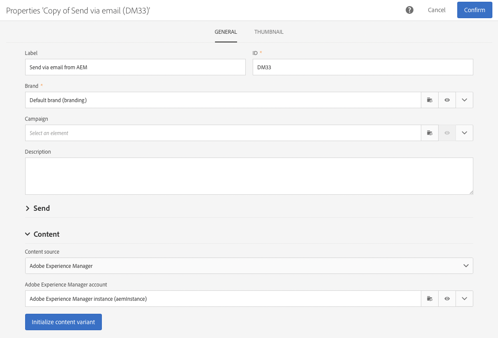

# Integrera AEM 6.5 med Adobe Campaign Standard {#integrating-with-adobe-campaign-standard}

Genom att integrera AEM 6.5 med Adobe Campaign Standard (ACS) kan ni hantera e-postleveranser, innehåll och formulär direkt i AEM. Konfigurationssteg i både Adobe Campaign Standard och AEM behövs för att möjliggöra dubbelriktad kommunikation mellan lösningar.

Tack vare den här integreringen kan AEM och Adobe Campaign Standard användas oberoende av varandra. Marknadsförare kan skapa kampanjer och använda målinriktning i Adobe Campaign, medan innehållsskapare kan arbeta parallellt med innehållsdesign i AEM. Tack vare integreringen kan innehållet i och utformningen av kampanjen som skapats i AEM målinrikta och levereras av Adobe Campaign.

>[!INFO]
>
>I det här dokumentet beskrivs hur du integrerar Adobe Campaign Standard med AEM 6.5. Andra Campaign-integreringar finns i dokumentet [Integrera AEM 6.5 med Adobe Campaign.](campaign.md)

## Integreringssteg {#integration-steps}

Konfigurationen av integrationen mellan AEM och Adobe Campaign Standard kräver ett antal steg i båda lösningarna.

1. [Konfigurera ](#aemserver-user)
1. [Verifiera ](#resource-type-filter)
1. [Skapa en AEM-specifik e-postleveransmall i Campaign](#aem-email-delivery-template)
1. [Konfigurera Campaign-integrering i AEM](#campaign-integration)
1. [Konfigurera replikering till AEM Publish Instance](#replication)
1. [Konfigurera AEM](#externalizer)
1. [Konfigurera ](#campaign-remote-user)
1. [Konfigurera det AEM externa kontot i Campaign](#acc-external-user)

Det här dokumentet leder dig igenom dessa steg i detalj.

## Förutsättningar {#prerequisites}

* Administratörsåtkomst till Adobe Campaign Standard
   * Om du vill ha mer information om hur du konfigurerar och konfigurerar Adobe Campaign Standard kan du läsa [Adobe Campaign Standard dokumentation.](https://experienceleague.adobe.com/docs/campaign-standard/using/campaign-standard-home.html)
* Administratörsåtkomst till AEM

## Konfigurera eServer-användaren i Campaign {#aemserver-user}

Adobe Campaign Standard har som standard en `aemserver` användare som AEM använder för att ansluta till Adobe Campaign. Du måste tilldela en lämplig säkerhetsgrupp för den här användaren och ange dess lösenord.

1. Logga in i Adobe Campaign som administratör.

1. Tryck eller klicka på Adobe Campaign-logotypen längst upp till vänster på menyraden för att öppna den globala navigeringen och välj sedan **Administration** > **Användare och säkerhet** > **Användare** på navigeringsmenyn.

1. Tryck eller klicka på `aemserver` användare i användarkonsolen.

1. Se till att `aemserver` användaren är tilldelad minst en säkerhetsgrupp som har rollen `deliveryPrepare` som tilldelats den. Som standard används gruppen `Standard Users` har den här rollen.

   

1. Tryck eller klicka **Spara** för att spara ändringarna.

Dina `aemserver` har nu den behörighet som krävs för att AEM ska kunna använda den för att kommunicera med Adobe Campaign.

Innan AEM kan använda `aemserver` -användare måste dess lösenord anges. Detta kan inte göras via Adobe Campaign. Den ska utföras av en Adobe supporttekniker. [Boka en biljett till Adobe kundtjänst](https://experienceleague.adobe.com/?support-tab=home#support) för att begära återställning av `aemserver` lösenord. När du har fått lösenordet från Adobe kundtjänst, spara det på en säker plats.

## Verifiera AEMResourceTypeFilter i Campaign {#resource-type-filter}

The `AEMResourceTypeFilter` är ett alternativ i Adobe Campaign som används för att filtrera AEM resurser som kan användas i Adobe Campaign. Eftersom AEM innehåller mycket innehåll fungerar det här alternativet som ett filter som gör att Adobe Campaign bara kan hämta AEM innehåll av typer som är särskilt utformade för att användas i Adobe Campaign.

Det här alternativet levereras förkonfigurerat. Du kan dock behöva uppdatera den om du har anpassat Campaign-komponenterna i AEM. Verifiera att `AEMResourceTypeFilter` om du har konfigurerat det här alternativet gör du så här.

1. Logga in i Adobe Campaign som administratör.

1. Tryck eller klicka på Adobe Campaign-logotypen längst upp till vänster på menyraden för att öppna den globala navigeringen och välj sedan **Administration** > **Programinställningar** > **Alternativ** på navigeringsmenyn.

1. Tryck eller klicka på `AEMResourceTypeFilter` i alternativkonsolen.

1. Bekräfta konfigurationen av `AEMResourceTypeFilter`. Banorna avgränsas med kommatecken och innehåller som standard:

   * `mcm/campaign/components/newsletter`
   * `mcm/campaign/components/campaign_newsletterpage`
   * `mcm/neolane/components/newsletter`

   

1. Tryck eller klicka **Spara** för att spara ändringarna.

Dina `AEMResourceTypeFilter` har nu konfigurerats för att hämta rätt innehåll från AEM.

## Skapa en AEM-specifik e-postleveransmall i Campaign {#aem-email-delivery-template}

Som standard är AEM inte aktiverat i Adobe Campaign e-postmallar. Du måste konfigurera en ny mall för e-postleverans som kan användas för att skapa e-postmeddelanden med AEM innehåll. Följ de här stegen för att skapa en AEM specifik mall för e-postleverans.

1. Logga in i Adobe Campaign som administratör.

1. Tryck eller klicka på Adobe Campaign-logotypen längst upp till vänster på menyraden för att öppna den globala navigeringen och välj sedan **Resurser** > **Mallar** > **Leveransmallar** på navigeringsmenyn.

1. Leta reda på standardmallen för e-post i leveransmallkonsolen **Skicka via e-post (e-post)** och för musen över kortet (eller linjen) som representerar det för att visa alternativen. Klicka **Duplicera element**.

   

1. I **Bekräftelse** dialogruta, klicka **Bekräfta** om du vill duplicera mallen.

   

1. Mallredigeraren öppnas med din kopia av **Skicka via e-post (e-post)** mall. Klicka på **Redigera egenskaper** ikonen längst upp till höger i fönstret.

   

1. I egenskapsfönstret ändrar du **Etikett** fält som ska vara beskrivande för den nya AEM.

1. Klicka på **Innehåll** för att expandera den och markera **Adobe Experience Manager** i **Innehållskälla** nedrullningsbar meny.

1. Det här visar **Adobe Experience Manager** fält. Använd listrutan för att välja **Adobe Experience Manager-instans (aemInstance)** användare. Det här är den externa standardanvändaren för AEM.

1. Klicka **Bekräfta** för att spara ändringarna i egenskaperna.

1. Klicka på **Spara** om du vill spara den ändrade kopian av e-postmallen för användning med AEM.

Nu har du en e-postmall som kan använda AEM innehåll.

## Konfigurera Campaign-integrering i AEM {#campaign-integration}

AEM kommunicerar med Adobe Campaign via en inbyggd integrering och `aemserver` användare som du konfigurerat i Adobe Campaign. Följ de här stegen för att konfigurera integreringen.

1. Logga in som administratör i din AEM.

1. Välj **verktyg** > **Cloud Services** > **Äldre Cloud Services** > **Adobe Campaign** och sedan klicka **Konfigurera nu**.

   

1. I dialogrutan skapar du en konfiguration för Campaign-tjänsten genom att ange en **Titel** och klicka **Skapa**.

   

1. Ett nytt fönster och en ny dialogruta öppnas där du kan redigera konfigurationen. Tillhandahåll nödvändig information.

   * **Användarnamn** - Det här är [den `aemserver` användare i Adobe Campaign som du konfigurerade i ett tidigare steg.](#aemserver-user) Som standard är det `aemserver`.
   * **Lösenord** - Det här är lösenordet för [den `aemserver` användare i Adobe Campaign som du har begärt från Adobe kundtjänst i ett tidigare steg.](#aemserver-user)
   * **API-slutpunkt** - Detta är Adobe Campaign instans-URL:en.

   

1. Välj **Anslut till Adobe Campaign** för att bekräfta anslutningen och sedan klicka på **OK**.

AEM kan nu kommunicera med Adobe Campaign.

>[!NOTE]
>
>Se till att din Adobe Campaign-server är tillgänglig via Internet. AEM har inte åtkomst till privata nätverk.

## Konfigurera replikering till AEM Publish Instance {#replication}

Kampanjinnehåll skapas av innehållsförfattare i AEM. Den här instansen är vanligtvis endast tillgänglig internt i din organisation. För att innehåll som bilder och resurser ska vara tillgängliga för mottagarna av kampanjen måste ni publicera det innehållet.

Replikeringsagenten ansvarar för att publicera ditt innehåll från AEM författarinstans till publiceringsinstansen och måste konfigureras för att integreringen ska fungera korrekt. Det här steget är också nödvändigt för att replikera vissa redigeringsinstanskonfigurationer till publiceringsinstansen.

Så här konfigurerar du replikering från AEM författarinstans till publiceringsinstansen:

1. Logga in som administratör i din AEM.

1. Välj **verktyg** > **Distribution** > **Replikering** > **Agenter på författare** och sedan trycka eller klicka **Standardagent (publicera)**.

   

1. Tryck eller klicka **Redigera** väljer du **Transport** -fliken.

1. Konfigurera **URI** fält genom att ersätta standardvärdet `localhost` värde med IP-adressen för den AEM publiceringsinstansen.

   

1. Tryck eller klicka **OK** för att spara ändringarna i agentinställningarna.

Du har konfigurerat replikering till AEM publiceringsinstans så att kampanjmottagarna kan komma åt ditt innehåll.

>[!NOTE]
>
>Om du inte vill använda replikerings-URL:en utan i stället använder den offentliga URL:en kan du ange den offentliga URL:en i följande konfigurationsinställning via OSGi
>
>Välj **verktyg** > **Operationer** > **Webbkonsol** > **OSGi-konfiguration** och söka efter **AEM Campaign Integration - Configuration**. Redigera konfigurationen och ändra fältet **Offentlig URL** (`com.day.cq.mcm.campaign.impl.IntegrationConfigImpl#aem.mcm.campaign.publicUrl`).

## Konfigurera AEM {#externalizer}

[Externalizer](/help/sites-developing/externalizer.md) är en OSGi-tjänst i AEM som omvandlar en resurssökväg till en extern och absolut URL-adress, vilket krävs för att AEM ska kunna hantera innehåll som Campaign kan använda. Du måste konfigurera det för att Campaign-integreringen ska fungera.

1. Logga in som administratör i AEM.
1. Välj **verktyg** > **Operationer** > **Webbkonsol** > **OSGi-konfiguration** och söka efter **Day CQ link Externalizer**.
1. Som standard är den sista posten i **Domäner** -fältet är avsett för publiceringsinstansen. Ändra URL:en från standardvärdet `http://localhost:4503` till den offentliga publiceringsinstansen.

   

1. Tryck eller klicka **Spara**.

Du har konfigurerat Externalizer och Adobe Campaign kan nu komma åt ditt innehåll.

>[!NOTE]
>
Publiceringsinstansen måste kunna nås från Adobe Campaign-servern. Om den pekar på `localhost:4503` eller en annan server som Adobe Campaign inte kan nå visas inte bilder från AEM i Adobe Campaign-konsolen.

## Konfigurera användaren som är fjärransluten till kampanjen i AEM {#campaign-remote-user}

Precis som du behöver en användare i Adobe Campaign som AEM kan använda för att kommunicera med Adobe Campaign behöver Adobe Campaign också en användare i AEM för att kommunicera med AEM. Som standard skapar Campaign-integreringen `campaign-remote` användare i AEM. Följ de här stegen för att konfigurera den här användaren.

1. Logga in AEM som administratör.
1. På huvudnavigeringskonsolen klickar du på **verktyg** till vänster.
1. Klicka sedan på **Säkerhet** > **Användare** för att öppna användaradministrationskonsolen.
1. Leta reda på `campaign-remote` användare.
1. Välj `campaign-remote` användare och klicka **Egenskaper** för att redigera användaren.
1. I **Redigera användarinställningar** fönster, klicka **Ändra lösenord**.
1. Ange ett nytt lösenord för användaren och notera lösenordet på en säker plats för framtida bruk.
1. Klicka **Spara** för att spara lösenordsändringen.
1. Klicka **Spara och stäng** för att spara ändringarna i `campaign-remote` användare.

## Konfigurera det AEM externa kontot i Campaign {#acc-external-user}

När du [skapade en AEM-specifik mall för e-postleverans,](#aem-email-delivery-template) du angav att mallen skulle använda `aemInstance` externt konto att kommunicera med AEM. För att möjliggöra tvåvägskommunikation mellan båda lösningarna måste du konfigurera det här kontot i Adobe Campaign.

1. Logga in i Adobe Campaign som administratör.

1. Tryck eller klicka på Adobe Campaign-logotypen längst upp till vänster på menyraden för att öppna den globala navigeringen och välj sedan **Administration** > **Programinställningar** > **Externa konton** på navigeringsmenyn.

1. Tryck eller klicka på **Adobe Experience Manager-instans (aemInstance)** användare i användarkonsolen.

1. Kontrollera att användaren har **Adobe Experience Manager** som **Typ**.

1. I **Anslutning** definierar du följande fält:

   1. Server: Det här är URL:en till AEM. Detta får inte sluta med ett snedstreck.
   1. Konto: Det här är `campaign-remote` användare du [tidigare konfigurerad i AEM.](#campaign-remote-user)
   1. Lösenord: Det här är lösenordet för `campaign-remote`användare du [tidigare konfigurerad i AEM.](#campaign-remote-user)

   

1. Se till att **Aktiverad** kryssrutan är markerad och klicka sedan **Spara** för att spara ändringarna.

Grattis! Du är klar med integreringen mellan AEM och Adobe Campaign Standard!

## Nästa steg {#next-steps}

När både Adobe Campaign Classic och AEM är konfigurerade är integreringen klar.

Nu kan du lära dig skapa nyhetsbrev i Adobe Experience Manager genom att fortsätta med [det här dokumentet.](/help/sites-authoring/campaign.md)
