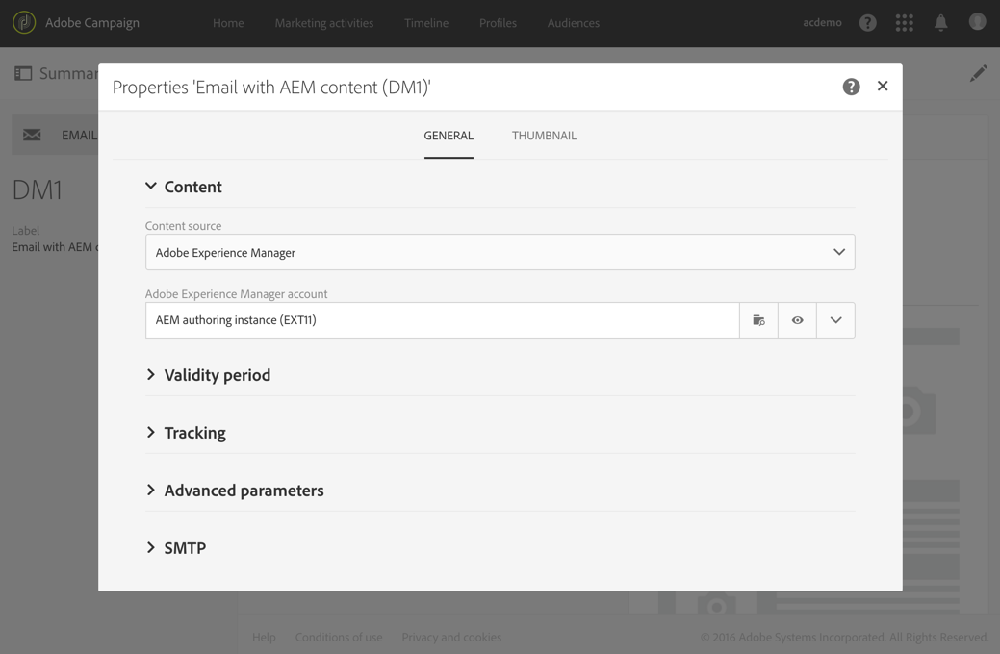

# Integrera med Adobe Campaign Standard{#integrating-with-adobe-campaign-standard}

>[!NOTE]
>
>I den här dokumentationen beskrivs hur du integrerar AEM med Adobe Campaign Standard, den prenumerationsbaserade lösningen. Om du använder Adobe Campaign 6.1 hittar du dessa anvisningar i [Integrera med Adobe Campaign 6.1](/help/sites-administering/campaignonpremise.md) .

Med Adobe Campaign kan ni hantera e-postinnehåll och formulär direkt i Adobe Experience Manager.

Om du vill använda båda lösningarna samtidigt måste du först konfigurera dem så att de ansluter till varandra. Detta inbegriper konfigurationssteg i både Adobe Campaign och Adobe Experience Manager. Dessa steg beskrivs i detalj i det här dokumentet.

Att arbeta med Adobe Campaign i AEM innefattar möjligheten att skicka e-post och formulär via Adobe Campaign och beskrivs i [Arbeta med Adobe Campaign](/help/sites-authoring/campaign.md).

Dessutom kan följande ämnen vara intressanta när man integrerar AEM med [Adobe Campaign](https://docs.campaign.adobe.com/doc/standard/en/home.html):

* [Bästa tillvägagångssätt för e-postmallar](/help/sites-administering/best-practices-for-email-templates.md)
* [Felsöka er integrering med Adobe Campaign](/help/sites-administering/troubleshooting-campaignintegration.md)

Om du utökar integreringen med Adobe Campaign kanske du vill se följande sidor:

* [Skapa anpassade tillägg](/help/sites-developing/extending-campaign-extensions.md)
* [Skapa anpassade formulärmappningar](/help/sites-developing/extending-campaign-form-mapping.md)

## Konfigurera Adobe Campaign {#configuring-adobe-campaign}

När du konfigurerar Adobe Campaign ingår följande:

1. Konfigurerar **amserver** -användaren.
1. Skapa ett dedikerat externt konto.
1. Verifierar alternativet AEMResourceTypeFilter.
1. Skapa en dedikerad leveransmall.

>[!NOTE]
>
>För att kunna utföra dessa åtgärder måste du ha **administratörsrollen** i Adobe Campaign.

### Förutsättningar {#prerequisites}

Kontrollera att du har följande element i förväg:

* [En AEM-redigeringsinstans](/help/sites-deploying/deploy.md#getting-started)
* [En AEM-publiceringsinstans](/help/sites-deploying/deploy.md#author-and-publish-installs)
* [En Adobe Campaign-instans](https://docs.adobe.com/content/docs/en/campaign/ACS.html)

>[!CAUTION]
>
>Åtgärder som beskrivs i avsnitten [Konfigurera Adobe Campaign](#configuring-adobe-campaign) och [Konfigurera Adobe Experience Manager](#configuring-adobe-experience-manager) är nödvändiga för att integreringsfunktionerna mellan AEM och Adobe Campaign ska fungera korrekt.

### Konfigurera eServer-användaren {#configuring-the-aemserver-user}

Användaren **aemserver** måste konfigureras i Adobe Campaign. AEM- **servern** är en teknisk användare som kommer att användas för att ansluta AEM-servern till Adobe Campaign.

Gå till **Administration** > **Användare och säkerhet** > **Användare** och välj **serveranvändaren** . Klicka på den för att öppna användarinställningarna.

* Du måste ange ett lösenord för den här användaren. Detta kan inte göras via användargränssnittet. Den här konfigurationen måste utföras i REST av en teknisk administratör.
* Du kan tilldela specifika roller till den här användaren, till exempel **deliveryPrepare**, som gör att användaren kan skapa och redigera leveranser.

### Konfigurera ett externt Adobe Experience Manager-konto {#configuring-an-adobe-experience-manager-external-account}

Du måste konfigurera ett externt konto som gör att du kan ansluta Adobe Campaign till din AEM-instans.

>[!NOTE]
>
>I AEM måste du ange lösenordet för kampanjens fjärranvändare. Du måste ange det här lösenordet för att kunna ansluta Adobe Campaign till AEM. Logga in som administratör och i användaradministrationskonsolen, sök efter användaren som är fjärransluten till kampanjen och klicka på **Ange lösenord**.

Så här konfigurerar du ett externt AEM-konto:

1. Gå till **Administration** > **Programinställningar** > **Externa konton**.

   

1. Välj det **externa standardkontot aemInstance** eller skapa ett nytt genom att klicka på knappen **Skapa** .
1. Välj **Adobe Experience** Manager i fältet **Typ** och ange de åtkomstparametrar som används för AEM-utvecklingsinstansen: serveradress, kontonamn och lösenord.

   >[!NOTE]
   >
   >Se till att du inte lägger till ett avslutande **/** snedstreck i slutet av URL:en, annars fungerar inte anslutningen.

1. Kontrollera att kryssrutan **Aktiverad** är markerad och klicka sedan på **Spara** för att spara ändringarna.

### Verifiera alternativet AEMResourceTypeFilter {#verifying-the-aemresourcetypefilter-option}

Alternativet **AEMResourceTypeFilter** används för att filtrera typer av AEM-resurser som kan användas i Adobe Campaign. På så sätt kan Adobe Campaign hämta AEM-innehåll som är specifikt utformat för att endast användas i Adobe Campaign.

Det här alternativet är förkonfigurerat; Men om du ändrar det här alternativet kan det leda till att integreringen inte fungerar.

Så här kontrollerar du att alternativet **AEMResourceTypeFilter** är konfigurerat:

1. Gå till **Administration** > **Programinställningar** > **Alternativ**.
1. I listan kan du se till att alternativet **AEMResourceTypeFilter** visas och att sökvägarna är korrekta.

### Skapa en AEM-specifik mall för e-postleverans {#creating-an-aem-specific-email-delivery-template}

Som standard är AEM-funktionen inte aktiverad i e-postmallar för Adobe Campaign. Du kan konfigurera en ny mall för e-postleverans som ska användas för att skapa e-postmeddelanden med AEM-innehåll.

Så här skapar du en AEM-specifik mall för e-postleverans:

1. Gå till **Resources** > **Templates** > **Delivery templates**.
1. **Aktivera markeringen** genom att klicka på bockmarkeringen i åtgärdsfältet och välja den befintliga **standardmallen för e-post (post)** . Duplicera den sedan genom att klicka på ikonen **Kopiera** och klicka på **Bekräfta**.
1. Inaktivera markeringsläget genom att klicka på **x** och öppna den nyligen skapade e-postmallen **Copy of Standard (mail)** . Välj sedan **Redigera egenskaper** i åtgärdsfältet på mallkontrollpanelen.

   Du kan ändra mallens **etikett**.

1. I egenskapsavsnittet **Innehåll** ändrar du **innehållskällan** till **Adobe Experience Manager**. Välj sedan det externa konto som skapades tidigare och klicka på **Bekräfta**.

   Spara ändringarna genom att klicka på **Bekräfta** och sedan på **Spara.**

   E-postleveranser som skapas från den här mallen kommer att ha AEM-innehållsfunktionen aktiverad.

   

## Konfigurera Adobe Experience Manager {#configuring-adobe-experience-manager}

För att konfigurera AEM måste du göra följande:

* Konfigurera replikering mellan instanser.
* Anslut AEM till Adobe Campaign.
* Konfigurera externaliseraren.

### Konfigurera replikering mellan AEM-instanser {#configuring-replication-between-aem-instances}

Innehåll som skapas från AEM-redigeringsinstansen skickas först till publiceringsinstansen. Den här publiceringsinstansen överför sedan innehållet till Adobe Campaign. Replikeringsagenten måste därför konfigureras att replikera från AEM-redigeringsinstansen till AEM-publiceringsinstansen.

>[!NOTE]
>
>Om du inte vill använda replikerings-URL:en utan i stället använda den offentliga URL:en kan du ange den **offentliga URL:en** i följande konfigurationsinställning i OSGi (**Verktyg** > **Webbkonsol** > **OSGi-konfiguration > AEM Campaign Integration - Configuration**):
**** Offentlig URL: com.day.cq.mcm.campaign.impl.IntegrationConfigImpl#aem.mcm.campaign.publicUrl

Det här steget är också nödvändigt för att replikera vissa redigeringsinstanskonfigurationer till publiceringsinstansen.

Så här konfigurerar du replikering mellan AEM-instanser:

1. I utvecklingsinstansen väljer du **AEM-logotyp**> **Verktyg **ikon > **Distribution** > **Replikering** > **Agenter på författare** och klickar sedan på **Standardagent**.

   

   >[!NOTE]
   Undvik att använda localhost (d.v.s. en lokal kopia av AEM) när du konfigurerar integreringen med Adobe Campaign, såvida inte både publicerings- och författarinstansen finns på samma dator.

1. Klicka på **Redigera** och välj fliken **Transport** .
1. Konfigurera URI:n genom att ersätta **localhost** med IP-adressen eller adressen för AEM-publiceringsinstansen.

   

### Ansluta AEM till Adobe Campaign {#connecting-aem-to-adobe-campaign}

Innan ni kan använda AEM och Adobe Campaign tillsammans måste ni etablera länken mellan båda lösningarna så att de kan kommunicera.

1. Anslut till din AEM-redigeringsinstans.
1. Välj **Verktyg** > **Åtgärder** > **Moln** > **Molntjänster** och **konfigurera nu** i Adobe Campaign-sektionen.

   

1. Skapa en ny konfiguration genom att ange en **titel** och klicka på **Skapa**, eller välj den befintliga konfiguration som du vill länka till Adobe Campaign-instansen.
1. Redigera konfigurationen så att den matchar parametrarna för Adobe Campaign-instansen.

   * **Användarnamn**: Adobe Campaign AEM Integration- **paketoperatören** aemserver skapade länken mellan de två lösningarna.
   * **Lösenord**: Lösenord för Adobe Campaign-serveroperatorn. Du kan behöva ange lösenordet för den här operatorn igen direkt i Adobe Campaign.
   * **API-slutpunkt**: Instans-URL för Adobe Campaign.

1. Välj **Anslut till Adobe Campaign** och klicka på **OK**.

   

   >[!NOTE]
   När du har [skapat e-postmeddelandet och publicerat det](/help/sites-authoring/campaign.md)måste du publicera konfigurationen på nytt i din publiceringsinstans.

   

>[!NOTE]
Om anslutningen misslyckas kontrollerar du följande:
* Du kan stöta på ett certifikatproblem när du använder en säker anslutning till en Adobe Campaign-instans (https). Du måste lägga till Adobe Campaign-instanscertifikatet i **cacerts **filen i JDK:n.
* Se även [Felsöka integreringen](/help/sites-administering/troubleshooting-campaignintegration.md)med AEM/Adobe Campaign.

### Konfigurera externaliseraren {#configuring-the-externalizer}

Du måste [konfigurera externaliseraren](/help/sites-developing/externalizer.md) i AEM på författarinstansen. Externalizer är en OSGi-tjänst som gör att du kan omvandla en resurssökväg till en extern och absolut URL. Den här tjänsten tillhandahåller en central plats för att konfigurera dessa externa URL:er och skapa dem.

Se [Konfigurera externaliseraren](/help/sites-developing/externalizer.md) för allmänna instruktioner. För Adobe Campaign-integreringen måste du se till att du konfigurerar publiceringsservern `https://<host>:<port>/system/console/configMgr/com.day.cq.commons.impl.ExternalizerImpl` `localhost:4503` inte vid någon punkt utan vid en server som kan nås av Adobe Campaign-konsolen.

Om den pekar på `localhost:4503` eller någon annan server som Adobe Campaign inte kan nå visas inte dina bilder på Adobe Campaign-konsolen.

