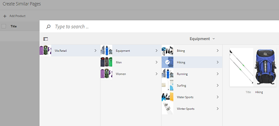

# Katalogproducent{#catalog-producer}

Lär dig hur du använder Catalog Producer i AEM Assets för att generera produktkataloger med dina digitala resurser.

Med Adobe Experience Manager (AEM) Assets Catalog Producer kan du skapa kataloger för dina varumärkesprodukter med hjälp av InDesign-mallar som importeras från ett InDesign-program. Om du vill importera InDesign-mallar måste du först integrera AEM Assets med en InDesign-server.

## Integrera med InDesign-server {#integrating-with-indesign-server}

Som en del av integrationsprocessen konfigurerar du arbetsflödet **DAM Update Asset**, som är lämpligt för integrering med InDesign. Konfigurera dessutom en proxyarbetare för InDesign-servern. Mer information finns i [Integrera AEM Assets med InDesign Server](/help/assets/indesign.md).

>[!NOTE]
>
>Du kan generera mallar för InDesign från InDesign-filer innan du importerar dem till AEM Assets. Mer information finns i [Arbeta med filer och mallar](https://helpx.adobe.com/indesign/using/files-templates.html).
>
>Du kan mappa elementen i dina InDesign-mallar till XML-märkord. De mappade taggarna visas som egenskaper när du mappar produktegenskaper med mallegenskaper i Catalog Producer. Mer information om XML-taggning i InDesign-filer finns i [Tagga innehåll för XML](https://helpx.adobe.com/indesign/using/tagging-content-xml.html).

>[!NOTE]
>
>Endast InDesign-filer (.indd) används som mallar. Filer med filnamnstillägget .indt stöds inte.

## Skapa en katalog {#creating-a-catalog}

I Catalog Producer används PIM-data (Product Information Management) för att mappa produktegenskaper med de XML-egenskaper som visas i mallen. Så här skapar du en katalog:

1. I Assets-användargränssnittet: tryck/klicka på logotypen **AEM** och gå till **Resurser > Kataloger**.
1. På sidan **Kataloger** trycker/klickar du på **Skapa** i verktygsfältet och väljer sedan **Katalog** i listan.
1. På sidan **Skapa katalog** anger du ett namn och en beskrivning (valfritt) för katalogen och anger eventuella taggar. Du kan också lägga till en miniatyrbild för katalogen.

   

1. Tryck/klicka på **Spara**. En bekräftelsedialogruta meddelar att katalogen har skapats. Tryck/klicka på **Klar** för att stänga dialogrutan.
1. Om du vill öppna den katalog du skapade trycker/klickar du på den på sidan **Kataloger**.

   >[!NOTE]
   >
   >Om du vill öppna katalogen trycker du/klickar på **Öppna** i bekräftelsedialogrutan som nämns i föregående steg.

1. Om du vill lägga till sidor i katalogen trycker/klickar du på **Skapa** i verktygsfältet och väljer sedan alternativet **Ny sida**.
1. I guiden väljer du en InDesign-mall för sidan. Tryck/klicka sedan på **Nästa**.
1. Ange ett namn för sidan och en valfri beskrivning. Ange eventuella taggar.
1. Tryck/klicka på **Skapa** i verktygsfältet. Tryck/klicka sedan på **Öppna** i dialogrutan. Egenskaperna för produkten visas i den vänstra rutan. De fördefinierade egenskaperna för mallen InDesign visas i den högra rutan.
1. Dra produktegenskaperna från den vänstra rutan till mallegenskaperna för InDesign och skapa en mappning mellan dem.

   Om du vill visa hur sidan visas i realtid trycker/klickar du på fliken **Förhandsgranska** i den högra rutan.

1. Om du vill skapa fler sidor upprepar du steg 6-9. Om du vill skapa liknande sidor för andra produkter markerar du sidan och trycker/klickar på ikonen **Skapa liknande sidor** i verktygsfältet.

   

   >[!NOTE]
   >
   >Du kan bara skapa liknande sidor för produkter med liknande struktur.

   Tryck/klicka på ikonen Lägg till, välj produkter i produktväljaren och tryck/klicka sedan på **Välj** i verktygsfältet.

   

1. Klicka/tryck på **Skapa** i verktygsfältet. Tryck/klicka på **Klar** för att stänga dialogrutan. Liknande sidor tas med i katalogen.
1. Om du vill lägga till en befintlig InDesign-fil i katalogen trycker/klickar du på **Skapa** i verktygsfältet och väljer alternativet **Lägg till på befintlig**.
1. Markera filen InDesign och tryck/klicka på **Lägg till** i verktygsfältet. Tryck/klicka sedan på **OK** för att stänga dialogrutan.

   Om metadata för produkterna som du refererar till på katalogsidorna ändras, återspeglas inte ändringarna automatiskt på katalogsidorna. En banderoll med etiketten **Stale** visas på produktbilderna på de refererande katalogsidorna, vilket anger att metadata för de refererade produkterna inte är aktuella.

   

   För att produktbilderna ska återspegla de senaste metadataändringarna väljer du sidan i katalogkonsolen och klickar/trycker på ikonen **Uppdatera sida** i verktygsfältet.

   

   >[!NOTE]
   >
   >Om du vill ändra metadata för en refererad produkt går du till produktkonsolen (**AEM logotyp** > **Commerce** > **Produkter**) och väljer produkten. Klicka/tryck sedan på ikonen **Visa egenskaper** i verktygsfältet och redigera metadata på egenskapssidan för resursen.

1. Om du vill ordna om sidorna i katalogen trycker/klickar du på ikonen **Skapa** i verktygsfältet och väljer **Sammanfoga** på menyn. I guiden kan du med Carousel överst ändra ordning på sidorna genom att dra dem. Du kan också ta bort sidor.

1. Tryck/klicka på **Nästa**. Om du vill lägga till en befintlig InDesign-fil som en försättsblad trycker/klickar du på **Bläddra** bredvid rutan **Välj försättsblad** och anger sökvägen för försättssidmallen.
1. Tryck/klicka på **Spara** och tryck/klicka sedan på **Klar** för att stänga bekräftelsedialogrutan.
När du väljer alternativet **Klar** öppnas en dialogruta där du kan välja om du vill ha en PDF-återgivning.
   
pdfOm alternativet Acrobat(PDF) är markerat skapas en PDF-återgivning i   **/jcr:content/** rendering förutom i indesign-återgivning. Du kan hämta alla återgivningar genom att markera kryssrutan Återgivningar i hämtningsdialogrutan.

1. Om du vill generera en förhandsvisning för den katalog du skapade markerar du den i konsolen **Kataloger** och klickar sedan på ikonen **Förhandsgranska** i verktygsfältet.

   

   Granska sidorna i katalogen i förhandsgranskningen. Tryck/klicka på **Stäng** för att stänga förhandsgranskningen.

