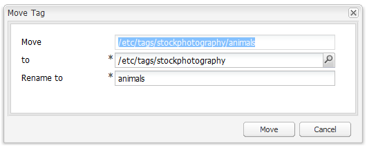
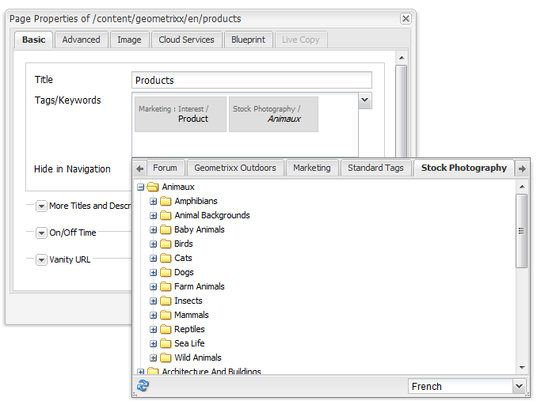

# Klassiskt gränssnitt, taggningskonsol{#classic-ui-tagging-console}

Det här avsnittet gäller för den klassiska UI-taggningskonsolen.

Den pekoptimerade UI-taggningskonsolen är [här](/help/sites-administering/tags.md#tagging-console).

Så här kommer du åt konsolen Klassisk UI-taggning:

* on author
* logga in med administratörsbehörighet
* bläddra till konsolen
till exempel [https://localhost:4502/tagging](https://localhost:4502/tagging)

## Skapar taggar och namnutrymmen {#creating-tags-and-namespaces}

1. Beroende på vilken nivå du börjar på kan du skapa en tagg eller ett namnutrymme med **New**:

   Om du väljer **Taggar** kan du skapa ett namnutrymme:

   

   Om du väljer ett namnutrymme (till exempel **Demo**) kan du skapa en tagg i det namnutrymmet:

   

1. I båda fallen anger du

   * **Titel**
(
*Obligatoriskt*) Visningsrubriken för taggen. Alla tecken kan anges
Vi rekommenderar att du inte använder dessa specialtecken:

      * `colon (:)` - namnutrymmesavgränsare
      * `forward slash (/)` - avgränsare för undertagg

      Dessa tecken visas inte om de anges.

   * **Namn**
(
*Obligatoriskt*) Nodnamnet för taggen.

   * **Beskrivning**
(
*Valfritt*) En beskrivning av taggen.

   * välj **Skapa**

## Redigera taggar {#editing-tags}

1. Markera den tagg som du vill redigera i den högra rutan.
1. Klicka på **Redigera**.
1. Du kan ändra **titeln** och **beskrivningen**.
1. Klicka på **Spara** för att stänga dialogrutan.

## Tar bort taggar {#deleting-tags}

1. Markera den tagg som du vill ta bort i den högra rutan.
1. Klicka på **Ta bort**.
1. Klicka på **Ja** för att stänga dialogrutan.

   Taggen ska inte längre listas.

## Aktivera och inaktivera taggar {#activating-and-deactivating-tags}

1. I den högra rutan markerar du namnutrymmet eller taggen som du vill aktivera (publicera) eller inaktivera (avpublicera).
1. Klicka på **Aktivera** eller **Inaktivera** efter behov.

## Lista - visar var taggar refereras {#list-showing-where-tags-are-referenced}

**** Listöppnar ett nytt fönster med sökvägarna till alla sidor som använder den markerade taggen:

## Flytta taggar {#moving-tags}

För att tagga administratörer och utvecklare så att de kan rensa taxonomin eller byta namn på ett tagg-ID kan du flytta en tagg till en ny plats:

1. Öppna konsolen **Taggning**.
1. Markera taggen och klicka på **Flytta..** i det övre verktygsfältet (eller på snabbmenyn).
1. I dialogrutan **Flytta tagg** definierar du:

   * **till** målnoden.
   * **Byt namn till**, det nya nodnamnet.

1. Klicka på **Flytta**.

Dialogrutan **Flytta tagg** ser ut så här:

>[!NOTE]
>
>Författare bör inte flytta taggar eller byta namn på ett tagg-ID. Vid behov ska författare endast [ändra taggtitlarna](#editing-tags).

## Sammanfogar taggar {#merging-tags}

Du kan använda sammanfogningstaggar när en taxonomi har dubbletter. När tagg A sammanfogas med tagg B kommer alla sidor som taggas med tagg A att taggas med tagg B och tagg A är inte längre tillgängliga för författare.

Så här sammanfogar du en tagg till en annan:

1. Öppna konsolen **Taggning**.
1. Markera taggen och klicka på **Sammanfoga..** i det övre verktygsfältet (eller på snabbmenyn).
1. I dialogrutan **Sammanfoga tagg** definierar du:

   * **till** målnoden.

1. Klicka på **Sammanfoga**.

Dialogrutan **Sammanfoga tagg** ser ut så här:

## Räknar användning av taggar {#counting-usage-of-tags}

Så här ser du hur många gånger en tagg används:

1. Öppna konsolen **Taggning**.
1. Klicka på **Räkningsanvändning** i det övre verktygsfältet: i kolumnen Antal visas resultatet.

## Hantera taggar på olika språk {#managing-tags-in-different-languages}

Den valfria egenskapen `title`för en tagg kan översättas till flera språk. Taggen `titles` kan sedan visas enligt användarspråket eller sidspråket.

### Definiera taggtitlar på flera språk {#defining-tag-titles-in-multiple-languages}

Följande procedur visar hur du översätter `title`taggen **Djur** till engelska, tyska och franska:

1. Gå till konsolen **Taggning**.
1. Redigera taggen **Djur** under **Taggar** > **Stock Photography**.
1. Lägg till översättningarna på följande språk:

   * **Engelska**: Djur
   * **Tyska**: Tiere
   * **Franska**: Animaux

1. Spara ändringarna.

Dialogrutan ser ut så här:

Taggningskonsolen använder språkinställningen för användaren, så för taggen Animal visas Animaux för en användare som anger språket som franska i användaregenskaperna.

Om du vill lägga till ett nytt språk i dialogrutan läser du avsnittet [Lägga till ett nytt språk i dialogrutan Redigera tagg](/help/sites-developing/building.md#adding-a-new-language-to-the-edit-tag-dialog) i **taggningen för utvecklare**.

### Visa taggtitlar i Sidegenskaper på det angivna språket {#displaying-tag-titles-in-page-properties-in-a-specified-language}

Som standard visas taggen `titles`i sidegenskaperna på sidspråket. I taggdialogrutan i sidegenskaperna finns ett språkfält som gör att taggen `titles`kan visas på ett annat språk. I proceduren nedan beskrivs hur du visar taggen `titles`på franska:

1. I föregående avsnitt kan du lägga till den franska översättningen till **Djur** nedanför **taggar** > **Stock Photography**.
1. Öppna sidegenskaperna för sidan **Produkter** i den engelska grenen på webbplatsen **Geometrixx**.
1. Öppna dialogrutan **Taggar/nyckelord** (genom att välja den nedrullningsbara menyn till höger om visningsområdet Taggar/nyckelord) och välj **franska** i den nedrullningsbara menyn i det nedre högra hörnet.
1. Rulla med vänster-/högerpilarna tills du kan välja fliken **Stock Photography**

   Markera taggen **Djur** (**Animaux**) och markera utanför dialogrutan för att stänga den och lägga till taggen i sidegenskaperna.

   

Som standard visas taggen `titles`enligt sidspråket i dialogrutan Sidegenskaper.

I allmänhet hämtas taggens språk från sidspråket om sidspråket är tillgängligt. När [ `tag`-widgeten](/help/sites-developing/building.md#tagging-on-the-client-side) används i andra fall (till exempel i formulär eller i dialogrutor) beror taggspråket på sammanhanget.

>[!NOTE]
>
>I taggmolnet och meta-nyckelorden i standardsidkomponenten används den lokaliserade taggen `titles`baserat på sidspråket, om tillgängligt.