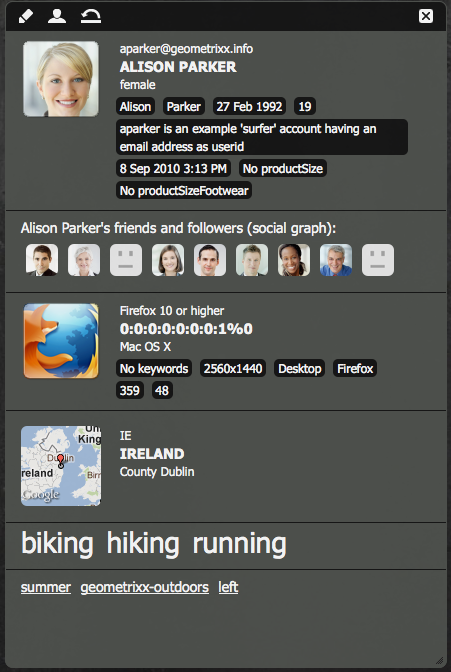
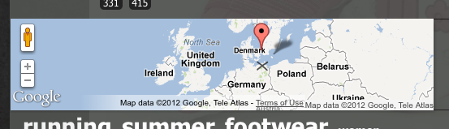

# Klientkontext{#client-context}

>[!NOTE]
>
>Klientkontext har ersatts av ContextHub. Mer information finns i relaterad [konfiguration](/help/sites-administering/contexthub-config.md) och [utvecklardokumentation](/help/sites-developing/contexthub.md) .

Klientkontexten är en mekanism som ger dig viss information om den aktuella sidan och besökaren. Den kan öppnas med **Ctrl-Alt-c** (Windows) eller **Ctrl-Option-c** (Mac):

I både [publicerings- och författarmiljön visas information](#propertiesavailableintheclientcontext) om:

* Besökaren. beroende på din instans, begärs viss information eller hämtas.
* Sida-taggar och det antal gånger som den aktuella besökaren har haft åtkomst till dessa taggar (visas när du flyttar musen över en viss tagg).
* Sidinformation.
* Information om den tekniska miljön. som IP-adressen, webbläsaren och skärmupplösningen.
* Alla segment som för närvarande är lösta.

Med ikonerna (endast tillgängliga i författarmiljön) kan du konfigurera informationen för klientkontexten:

* **Redigera** En ny sida öppnas där du kan [redigera, lägga till eller ta bort en profilegenskap](#editingprofiledetails).

* **Läs in** Du kan [välja i en lista med profiler och läsa in profilen](#loading-a-new-user-profile) som du vill testa.

* **Återställ** Du kan [återställa profilen](#resetting-the-profile-to-the-current-user) till den aktuella användarens profil.

## Tillgängliga klientkontextkomponenter {#available-client-context-components}

Klientkontexten kan visa följande egenskaper ([beroende på vad som har valts med Redigera](#adding-a-property-component)):

**Surfer Information** Visar följande klientinformation:

* IP- **adressen**
* **nyckelord** som används för sökmotorreferens
* den **webbläsare** som används
* det **operativsystem** som används
* skärmupplösningen ****
* X- **musens** position
* musens Y- **position**

**Aktivitetsström** Detta ger information om användarens sociala aktivitet på olika plattformar. till exempel AEM-forumen, bloggar, omdömen etc.

**Campaign** Tillåter författare att simulera en specifik upplevelse för en kampanj. Den här komponenten åsidosätter normal kampanjupplösning och val av upplevelse för att möjliggöra testning av olika permutationer.

Kampanjupplösning baseras vanligtvis på kampanjens prioritetsegenskap. Upplevelsen väljs vanligtvis baserat på segmentering.

**Kundvagn** Visar kundvagnsinformation inklusive produktposter (titel, kvantitet, prisFormaterat osv.), lösta kampanjer (titel, meddelande osv.) och verifikationer (kod, beskrivning osv.).

Kundsessionslagringen meddelar också servern om lösta kampanjändringar (baserat på segmenteringsändringar) med hjälp av ClientContextCartServlet.

**Allmän butik** är en allmän komponent som visar innehållet i en butik. Det är en version på lägre nivå av den allmänna lagringsegenskapskomponenten.

Det allmänna arkivet måste konfigureras med en JS-renderare som visar data på ett anpassat sätt.

**Egenskaper** för allmän lagring är en allmän komponent som visar innehållet i en butik. Det är en senare version av den allmänna lagringskomponenten.

Komponenten Egenskaper för allmän lagring innehåller en standardåtergivning som visar de konfigurerade egenskaperna (tillsammans med en miniatyrbild).

**Geolocation** Visar klientens latitud och longitud. Det använder API:t för geopositionering i HTML5 för att fråga webbläsaren om den aktuella platsen. Detta resulterar i att ett popup-fönster visas för besökaren, där webbläsaren frågar om de godkänner att dela sin plats.

När komponenten visas i Context Cloud används ett Google API för att visa en karta som miniatyrbild. Komponenten omfattas av Googles API- [användningsgränser](https://developers.google.com/maps/documentation/staticmaps/intro#Limits).

>[!NOTE]
>
>I AEM 6.1 innehåller Geolocation-butiken inte längre funktionen för omvänd geokodning. Geolocation-arkivet hämtar därför inte längre information om den aktuella platsen, till exempel ort eller landskod. Segment som använder dessa lagringsdata kommer inte att fungera korrekt. Geolocation-butiken innehåller endast latitud- och longitudvärdena för en plats.

**JSONP Store** En komponent som visar innehåll som är beroende av din installation.

JSONP-standarden är ett komplement till JSON som gör det möjligt att kringgå samma ursprungspolicy (vilket gör det omöjligt för ett webbprogram att kommunicera med servrar som finns på en annan domän). Den består av att kapsla JSON-objektet i ett funktionsanrop för att kunna läsa in det som en `<script>` från den andra domänen (vilket är ett tillåtet undantag till samma ursprungsprincip).

JSONP Store är som vilken annan butik som helst, men den läser in information som kommer från en annan domän utan att du behöver ha en proxy för den informationen på den aktuella domänen. Se exemplet i [Lagra data i klientkontext via JSONP](/help/sites-administering/client-context.md#storing-data-in-client-context-via-jsonp).

>[!NOTE]
>
>JSONP Store cachelagrar inte informationen i cookien, men hämtar informationen på varje sida som läses in.

**Profildata** Visar information som samlats in i användarprofilen. Till exempel kön, ålder, e-postadress.

**Lösta segment** Visar vilka segment som för närvarande tolkas (ofta beroende på annan information som visas i klientkontexten). Detta är intressant när man konfigurerar en kampanj.

Om musen till exempel befinner sig över den vänstra eller högra delen av fönstret. Det här segmentet används främst för testning eftersom ändringarna kan ses omedelbart.

**Social Graph** Visar det sociala diagrammet för användarens vänner och följare.

>[!NOTE]
>
>För närvarande är detta en demofunktion som bygger på förkonfigurerade data på profilnoderna för våra demonstrationsanvändare. Se till exempel:
>
>`/home/users/geometrixx/aparker@geometrixx.info/profile` Egenskapen => för vänner

**Tag Cloud** Visar taggar som är inställda på den aktuella sidan och de som samlas in när du surfar på webbplatsen. När du för musen över en tagg visas antalet gånger som den aktuella användaren har kommit åt sidor som innehåller den aktuella taggen.

>[!NOTE]
Taggar som anges för DAM-resurser som visas på de besökta sidorna räknas inte.

**Technographics Store** Den här komponenten är beroende av din installation.

**ViewedProducts** håller reda på vilka produkter kunden har tittat på. Kan frågas efter den senast visade produkten eller den senast visade produkten som inte redan finns i kundvagnen.

Det här sessionsarkivet har ingen standardklientkontextkomponent.

Mer information finns i [Klientkontext i detalj](/help/sites-developing/client-context.md).

>[!NOTE]
Siddata är inte längre en standardkomponent i klientkontexten. Om det behövs kan du lägga till detta genom att redigera klientkontexten, lägga till **den allmänna lagringsegenskapen** och sedan konfigurera den för att definiera **butiken** som `pagedata`.

## Ändra klientkontextprofilen {#changing-the-client-context-profile}

Med klientkontexten kan du interaktivt ändra information:

* Genom att ändra profilen som används i klientkontexten kan du se de olika upplevelser som olika användare ser för den aktuella sidan.
* Förutom att ändra användarprofilen kan du ändra viss profilinformation för att se hur sidupplevelsen skiljer sig under olika förhållanden.

### Läsa in en ny användarprofil {#loading-a-new-user-profile}

Du kan ändra profilen genom att antingen:

* [med ikonen för inläsning](#loading-a-new-visitor-profile-with-the-load-profile-icon)
* [med markeringsreglaget](#loadinganewvisitorprofilewiththeselectionslider)

När du är klar kan du [återställa profilen](#resetting-the-profile-to-the-current-user).

#### Läsa in en ny besökarprofil med ikonen Läs in profil {#loading-a-new-visitor-profile-with-the-load-profile-icon}

1. Klicka på ikonen Läs in profil:

   

1. Dialogrutan öppnas där du kan välja vilken profil du vill läsa in:

   

1. Klicka på **OK** för att läsa in.

#### Läsa in en ny användarprofil med markeringsreglaget {#loading-a-new-user-profile-with-the-selection-slider}

Du kan också välja en profil med markeringsreglaget:

1. Dubbelklicka på ikonen som representerar den aktuella användaren. Väljaren öppnas, använder pilarna för att navigera och ser tillgängliga profiler:

   

1. Klicka på den profil som du vill läsa in. När detaljerna har lästs in klickar du utanför väljaren för att stänga.

#### Återställa profilen till den aktuella användaren {#resetting-the-profile-to-the-current-user}

1. Använd återställningsikonen om du vill återställa profilen i klientkontexten till den aktuella användarens profil:

   

### Ändra webbläsarplattform {#changing-the-browser-platform}

1. Dubbelklicka på ikonen som representerar webbläsarplattformen. Väljaren öppnas, använder pilarna för att navigera och ser vilka plattformar/webbläsare som är tillgängliga:

   

1. Klicka på den webbläsare som du vill läsa in. När detaljerna har lästs in klickar du utanför väljaren för att stänga.

### Ändra geolokalisering {#changing-the-geolocation}

1. Dubbelklicka på geopositioneringsikonen. En expanderad karta öppnas, där du kan dra markören till en ny plats:

   

1. Klicka utanför kartan för att stänga den.

### Ändra taggmarkeringen {#changing-the-tag-selection}

1. Dubbelklicka på taggmolndelen i klientkontexten. Dialogrutan öppnas där du kan välja taggar:

   

1. Klicka på OK för att läsa in i klientkontexten.

## Redigera klientkontexten {#editing-the-client-context}

När du redigerar en klientkontext kan du ange (eller återställa) värden för vissa egenskaper, lägga till en ny egenskap eller ta bort en egenskap som inte längre behövs.

### Redigera egenskapsinformation {#editing-property-details}

När du redigerar en klientkontext kan du ange (eller återställa) värden för vissa egenskaper. På så sätt kan ni testa specifika scenarier (särskilt användbart för [segmentering](/help/sites-administering/campaign-segmentation.md) och [kampanjer](/help/sites-classic-ui-authoring/classic-personalization-campaigns.md)).

### Lägga till en egenskapskomponent {#adding-a-property-component}

När du har öppnat designsidan **för** ClientContext kan du även **lägga till** en helt ny egenskap med de tillgängliga komponenterna (komponenterna listas både i sidosparken eller i dialogrutan **Infoga ny komponent** som öppnas när du dubbelklickar på **Dra komponenter eller resurser här** ):

### Ta bort en egenskapskomponent {#removing-a-property-component}

När du har öppnat designsidan **för** ClientContext kan du även **ta bort** en egenskap om det inte längre behövs. Detta omfattar egendomar som levereras färdiga för leverans. Om du **återställer** återskapas dessa om de har tagits bort.

## Lagra data i klientkontext via JSONP {#storing-data-in-client-context-via-jsonp}

Följ det här exemplet om du vill använda kontextlagringskomponenten JSONP Store för att lägga till externa data i klientkontexten. Skapa sedan ett segment baserat på informationen från dessa data. I exemplet används den JSONP-tjänst som WIPmania.com tillhandahåller. Tjänsten returnerar geopositioneringsinformation baserat på webbklientens IP-adress.

I det här exemplet används exempelwebbplatsen Geometrixx Outdoor för att få åtkomst till Client Context och för att testa det skapade segmentet. Du kan använda en annan webbplats så länge som sidan har aktiverat Klientkontext. (Se [Lägga till klientkontext på en sida](/help/sites-developing/client-context.md#adding-client-context-to-a-page).)

### Lägg till JSONP Store-komponenten {#add-the-jsonp-store-component}

Lägg till JSONP Store-komponenten i klientkontexten och använd den för att hämta och lagra geolokaliseringsinformation om webbklienten.

1. Öppna den engelska startsidan för webbplatsen Geometrixx Outdoor på AEM-författarinstansen. ([https://localhost:4502/content/geometrixx-outdoors/en.html](https://localhost:4502/content/geometrixx-outdoors/en.html)).
1. Om du vill öppna klientkontexten trycker du på Ctrl-Alt-c (Windows) eller Ctrl-Option-c (Mac).
1. Klicka på redigeringsikonen högst upp i klientkontexten för att öppna Client Context Designer.

   

1. Dra JSONP Store-komponenten till klientkontexten.

   

1. Dubbelklicka på komponenten för att öppna redigeringsdialogrutan.
1. Ange följande URL i rutan URL för JSONP-tjänsten och klicka sedan på Hämta butik:

   `https://api.wipmania.com/jsonp?callback=${callback}`

   Komponenten anropar JSONP-tjänsten och visar alla egenskaper som returnerade data innehåller. De egenskaper som finns i listan är de som kommer att vara tillgängliga i klientkontexten.

   

1. Klicka på OK.
1. Gå tillbaka till startsidan för Geometrixx Outdoor och uppdatera sidan. Klientkontexten innehåller nu information från JSONP Store-komponenten.

   

### Skapa segmentet {#create-the-segment}

Använd data från det sessionsarkiv som du skapade med JSONP-lagringskomponenten. Segmentet använder latituden från sessionsarkivet och aktuellt datum för att avgöra om det är vintertid på klientens plats.

1. Öppna verktygskonsolen i webbläsaren (`https://localhost:4502/miscadmin#/etc`).
1. Klicka på mappen Verktyg/Segmentering i mappträdet och klicka sedan på Ny > Ny mapp. Ange följande egenskapsvärden och klicka sedan på Skapa:

   * Namn: mysegment
   * Titel: Mina segment

1. Markera mappen Mina segment och klicka på Ny > Ny sida:

   1. Skriv Vinter som titel.
   1. Välj segmentmallen.
   1. Klicka på Skapa.

1. Högerklicka på vinter-segmentet och klicka på Öppna.
1. Dra den allmänna lagringsegenskapen till standardbehållaren OCH.

   

1. Dubbelklicka på komponenten för att öppna redigeringsdialogrutan, ange följande egenskapsvärden och klicka sedan på OK:

   * Butik: wipmania
   * Egenskapsnamn: latitud
   * Operatör: är större än
   * Egenskapsvärde: 30

1. Dra skriptkomponenten till samma AND-behållare och öppna redigeringsdialogrutan. Lägg till följande skript och klicka sedan på OK:

   `3 < new Date().getMonth() < 12`

