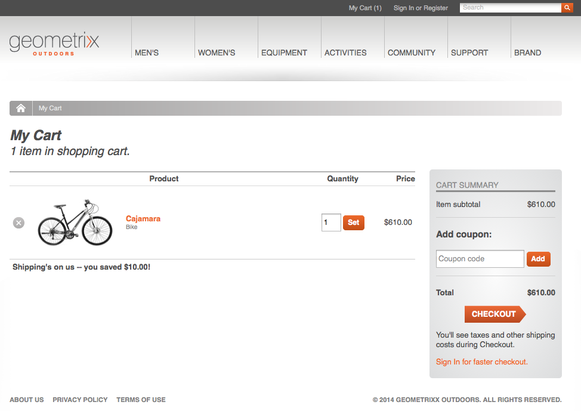
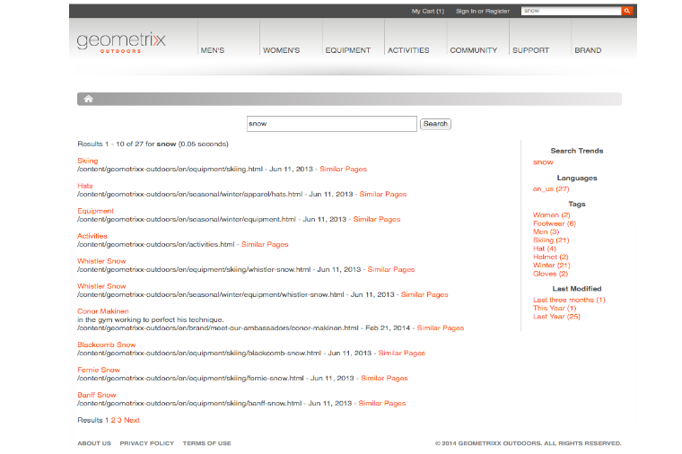

#  Concepts{#concepts}

Integreringsramverket innehåller mekanismer och komponenter för att

* anslutning till en e-handelsmotor
* hämta in data i AEM
* visa dessa data och samla in kundens svar,
* returnera transaktionsinformation
* söka efter data från båda systemen

Detta innebär att

* Köpare kan registrera sig och handla utan att vänta.
* Prisförändringarna kommer att ses av kunderna utan dröjsmål.
* Produkter kan läggas till efter behov.

>[!NOTE]
>
>e-handelsramverket kan användas med:
>
>* [Magento](https://www.adobe.io/apis/experiencecloud/commerce-integration-framework/integrations.html#!AdobeDocs/commerce-cif-documentation/master/integrations/02-AEM-Magento.md)
>* [SAP Commerce Cloud](/help/sites-administering/sap-commerce-cloud.md)
>* [Salesforce Commerce Cloud](https://github.com/adobe/commerce-salesforce)
>

>[!CAUTION]
>
>Integreringsramverket för [eCommerce](https://www.adobe.com/solutions/web-experience-management/commerce.html) är en AEM Add-On.
>
>Säljaren kan ge fullständig information enligt lämplig motor.

>[!CAUTION]
>
>Ramverket innehåller de grundläggande kraven för ditt eget projekt.
>
>En viss del av utvecklingsarbetet behövs alltid för att anpassa ramverket till dina specifikationer.

>[!CAUTION]
>
>Standardinstallationen av AEM innehåller den generiska implementeringen av AEM (JCR) för e-handel.
>
>Detta är för närvarande avsett för demonstrationssyften, eller som en grundläggande grund för en anpassad implementering enligt dina krav.

För att optimera driften koncentrerar sig både AEM och e-handelsmotorn på sin egen expertis. Information överförs mellan de två parterna i realtid. till exempel:

* AEM kan:

   * Begäran:

      * Produktinformation från e-handelsmotorn.
   * Ange:

      * Användarvyer för produktinformation, kundvagn och utcheckning.
      * Information om varukorgar och utcheckning till e-handelsmotorn.
      * Sökmotoroptimering (SEO).
      * Community-funktioner.
      * Ostrukturerade marknadsföringsinteraktioner.

* eCommerce-motorn kan:

   * Ange:

      * Produktinformation från databasen.
      * Hantering av produktvarianter.
      * Orderhantering.
      * ERP (Enterprise Resource Planning).
      * Sök i produktinformationen.
   * Process:

      * Kundvagnen.
      * Utcheckningen.
      * Beställningsvillkoren.

>[!NOTE]
>
>Den exakta detaljerna beror på e-handelsmotorn och projektets implementering.

Ett antal färdiga AEM-komponenter finns för att använda integreringslagret. Dessa omfattar för närvarande:

* Produktinformation
* Kundvagn
* Checka ut
* Mitt konto

Det finns även olika sökalternativ.

## Arkitektur {#architecture}

Integreringsramverket innehåller API:t, en rad komponenter som illustrerar funktioner och flera tillägg som ger exempel på anslutningsmetoder:

Ramverket ger dig tillgång till funktioner som:

### Implementeringar {#implementations}

AEM eCommerce genomförs med en e-handelsmotor:

* Integreringsramverket för eCommerce har byggts för att du enkelt ska kunna integrera en e-handelsmotor med AEM. Den specialbyggda e-handelsmotorn styr produktdata, varukorgar, utcheckning och orderhantering, medan AEM styr visningen av data och marknadsföringskampanjer.

>[!NOTE]
>
>Standardinstallationen av AEM innehåller den generiska implementeringen av AEM (JCR) för e-handel.
>
>Detta är för närvarande avsett för demonstrationssyften, eller som en grundläggande grund för en anpassad implementering enligt dina krav.
>
>AEM eCommerce som implementeras i AEM med allmän utveckling baserad på JCR är:
>
>* Ett fristående, AEM-inbyggt e-handelsexempel som illustrerar användningen av API:t. Detta kan användas för att kontrollera produktdata, varukorgar och utcheckning i samband med befintliga dataspresentations- och marknadsföringskampanjer. I det här fallet lagras produktdatabasen i den databas som är inbyggd i AEM (Adobes implementering av [JCR](https://docs.adobe.com/content/docs/en/spec/jcr/2.0/index.html)).
   >  Standardinstallationen av AEM innehåller grunderna i den [allmänna implementeringen](/help/sites-administering/generic.md)av e-handel.
>

### Leverantörer av handel {#commerce-providers}

När du importerar data från en e-handelsmotor till din AEM-e-handelsplats används en e-handelsleverantör för att förse importörerna med data. En e-handelsleverantör kan stödja flera importörer.

En e-handelsleverantör är en AEM-kod som är anpassad till antingen:

* gränssnitt till en back-end-e-handelsmotor
* implementera ett handelssystem ovanpå JCR-databasen

Två exempel på e-handelsleverantörer är för närvarande tillgängliga för AEM:

* en för geometrixx-hybris
* en annan för geometrixx-generisk (JCR)

Vanligtvis måste ett projekt utveckla en egen, anpassad e-handelsleverantör som är specifik för PIM och produktdataschemat.

>[!NOTE]
>
>Geometriximportörerna använder CSV-filer. det finns en beskrivning av det godkända schemat (med anpassade egenskaper tillåtna) i kommentarerna ovanför implementeringen.

I [ProductServicesManager](https://helpx.adobe.com/experience-manager/6-5/sites/developing/using/reference-materials/javadoc/com/adobe/cq/commerce/pim/api/ProductServicesManager.html) (via [OSGi](/help/sites-deploying/configuring.md#osgi-configuration-settings)) finns en lista med implementeringar av gränssnitten [ProductImporter](https://helpx.adobe.com/experience-manager/6-5/sites/developing/using/reference-materials/javadoc/com/adobe/cq/commerce/pim/api/ProductImporter.html) och [CatalogBlueImporter](https://helpx.adobe.com/experience-manager/6-5/sites/developing/using/reference-materials/javadoc/com/adobe/cq/commerce/pim/api/CatalogBlueprintImporter.html) . De listas i listrutan **för import-/handelsleverantör** i importguiden (med `commerceProvider` egenskapen som namn).

När en viss importör/e-handelsleverantör är tillgänglig från listrutan måste alla kompletterande uppgifter som den behöver definieras (beroende på importörens typ) i antingen

* `/apps/commerce/gui/content/catalogs/importblueprintswizard/importers`
* `/apps/commerce/gui/content/products/importproductswizard/importers`

Mappen under lämplig `importers` mapp måste matcha importörens namn; till exempel:

* `.../importproductswizard/importers/geometrixx/.content.xml`

Formatet på källimportfilen definieras av importeraren. Eller så kan importören upprätta en anslutning (t.ex. WebDAV eller http) till handelsmotorn.

## Roller {#roles}

Det integrerade systemet fångar upp följande roller för att underhålla data:

* PIM-användare (Product Information Management) som underhåller:

   * Produktinformation.
   * Taxonomi, kategorisering, godkännande.
   * Samverkar med digital resurshantering.
   * Priser - gäller ofta från ett ERP-system och upprätthålls inte uttryckligen i handelssystemet.

* Författare/Marknadsförare som underhåller:

   * Marknadsföringsmaterial för alla kanaler.
   * Kampanjer.
   * Vouchers.
   * Kampanjer.

* Surfer/köpare som:

   * Visar din produktinformation.
   * Placerar artiklar i kundvagnen.
   * Kolla in deras order.
   * Förväntade orderuppfyllelse.

Även om den faktiska platsen kan vara beroende av din implementering, till exempel generisk eller med en e-handelsmotor:

## Produkter {#products}

### Produktdata kontra marknadsföringsdata {#product-data-versus-marketing-data}

#### Strukturella kontra marknadsföringskategorier {#structural-versus-marketing-categories}

Om följande två kategorier kan särskiljas kan du på så sätt skapa tydliga URL:er med en meningsfull struktur (träd med `cq:Page` noder) och därför mycket nära klassisk AEM-innehållshantering):

* *Strukturella *kategorier

   Kategoriträdet som definierar *vad som är en produkt*. till exempel:

   `/products/mens/shoes/sneakers`

* *Marknadsföringskategorier*

   Alla andra kategorier som en *produkt kan tillhöra*. till exempel:

   `/special-offers/christmas/shoes`)

### Produktdata {#product-data}

Om du vill visa och hantera en produkt måste du lagra information om den.

Produktdata kan vara:

* underhålls direkt i AEM (allmän).
* i eCommerce Engine och i AEM.

   Beroende på datatypen är den [synkroniserad](#catalog-maintenance-data-synchronization) vid behov eller direkt åtkomlig. mycket volatila och kritiska data som t.ex. produktpriser hämtas från e-handelsmotorn på varje sidbegäran för att säkerställa att de alltid är aktuella.

När produktdata har matats in/importerats till AEM kan de i båda fallen ses från **produktkonsolen** . Här visas kort- och listvyerna för en produkt, t.ex.:

* bilden
* SKU-koden
* när den senast ändrades

### Produktvarianter {#product-variants}

Lämplig produktinformation om varianter kan också lämnas. För klädesplagg hålls till exempel de olika tillgängliga färgerna som varianter:

### Produktattribut {#product-attributes}

De enskilda attributen för respektive produkt kan vara beroende av vilken e-handelsmotor som används och hur AEM implementeras. Dessa är tillgängliga (om det är lämpligt) vid visning av produktsidor och/eller redigering av produktinformation och kan omfatta:

* **Bild**

   En bild av produkten.

* **Titel**

   Produktnamnet.

* **Beskrivning**

   En textbeskrivning av produkten.

* **Taggar**

   Taggar som används för att gruppera relaterade produkter.

* **Standardtillgångskategori**

   En standardkategori för resurser.

* **ERP-data**

   ERP-information (Enterprise resource planning).

   * **SKU**

      Information om lagerställeenhet (SKU).

   * **Färg**
   * **Storlek**
   * **Pris**

      Enhetspriset för produkten.

* **Sammanfattning**

   En sammanfattning av produktfunktionerna.

* **Funktioner**

   Mer information om funktionerna.

### Produktresurser {#product-assets}

Ett urval av mediefiler kan sparas för enskilda produkter. Vanligtvis är det bilder och videoklipp.

## Kataloger {#catalogs}

En katalog grupperar produktdata för både enkel hantering och representation för kunden. En katalog är ofta uppbyggd enligt attribut som språk, geografiskt område, varumärke, årstid, hobby, sport bland många andra.

### Katalogstruktur {#catalog-structure}

#### Kataloger på flera språk {#catalogs-in-multiple-languages}

AEM har stöd för produktinnehåll på flera språk. När integreringsramverket begär data hämtar det språket från det aktuella trädet (till exempel `en_US` för sidor under `/content/geometrixx-outdoors/en_US`).

I en flerspråkig butik kan du importera katalogen för varje språkträd separat (eller kopiera den med [MSM](/help/sites-administering/msm.md)).

#### Kataloger för flera varumärken {#catalogs-for-multiple-brands}

Liksom för språk kan stora flernationella företag behöva ta hand om flera varumärken.

#### Kataloger efter taggar {#catalogs-by-tags}

Taggar kan också användas för att gruppera produkter i en katalog. De kan användas för mer dynamiska kataloger, till exempel säsongserbjudanden.

### Kataloginställningar (inledande import) {#catalog-setup-initial-import}

Beroende på implementeringen kan du importera de produktdata som krävs för din baskatalog till AEM från:

* en CSV-fil (för allmän implementering)
* e-handelsmotorn

### Katalogunderhåll (datasynkronisering) {#catalog-maintenance-data-synchronization}

Ytterligare ändringar i produktinformationen är oundvikliga:

* för den allmänna implementeringen kan dessa hanteras med [produktredigeraren](/help/sites-administering/generic.md#editing-product-information)
* när en [e-handelsmotor används måste ändringarna synkroniseras](#data-synchronization-with-an-ecommerce-engine-ongoing)

#### Datasynkronisering med en e-handelsmotor (pågående) {#data-synchronization-with-an-ecommerce-engine-ongoing}

Efter den första importen är det oundvikligt att ändra produktinformationen.

När du använder en e-handelsmotor upprätthålls produktdata där och måste vara tillgängliga i AEM. Produktdata måste synkroniseras när uppdateringar görs.

Detta kan bero på datatypen:

* En [periodisk synkronisering används tillsammans med en datafeed med ändringar](/help/sites-developing/sap-commerce-cloud.md#product-synchronization-and-publishing).

   Förutom detta kan du välja specifika uppdateringar för en snabbuppdatering.

* Mycket volatila data, till exempel prisinformation, hämtas från e-handelsmotorn för varje sidförfrågan för att säkerställa att de alltid är aktuella.

### Kataloger - prestanda och skalning {#catalogs-performance-and-scaling}

Om du importerar en stor katalog med ett stort antal produkter (vanligtvis fler än 100 000) från en e-handelsmotor (PIM) kan det påverka systemet på grund av det stora antalet noder. Det kan också göra redigeringsinstansen långsammare om produkterna har associerade resurser (t.ex. produktbilder). Detta beror på att efterbearbetningen av dessa resurser är processor- och minneskrävande.

Det finns olika strategier du kan välja mellan för att lösa dessa problem:

* [Bucketing](#bucketing) - för det stora antalet noder
* [Avlasta efterbearbetning av resurser till en dedikerad instans](#offload-asset-post-processing-to-a-dedicated-instance)
* [Importera endast produktdata](#only-import-product-data)
* [Importera begränsning och gruppspara](#import-throttling-and-batch-saves)
* [Prestandatestning](#performance-testing)
* [Prestanda - övriga](#performance-miscellaneous)

#### Bucketing {#bucketing}

Om en JCR-nod har många direkta underordnade noder (t.ex. 1000 eller fler) krävs det bucket (phantom-mappar) för att prestandan inte ska påverkas. Dessa genereras enligt en algoritm vid import.

De här bucklarna har formen av fantommappar som introduceras i katalogstrukturen, men kan konfigureras så att de inte visas i offentliga URL:er.

#### Avlasta efterbearbetning av resurser till en dedikerad instans {#offload-asset-post-processing-to-a-dedicated-instance}

I det här scenariot ställs två författarinstanser in:

1. Författarinstans

   Importerar produktdata från PIM, där efterbearbetning för resurssökvägar är inaktiverat.

1. Dedikerad DAM-författarinstans

   Importerar och efterbearbetar produktresurser från PIM-filen och replikerar dem sedan tillbaka till masterförfattarinstansen för användning.

#### Importera endast produktdata {#only-import-product-data}

Om produkter inte innehåller resurser (bilder) som ska importeras kan du importera produktdata utan att påverkas av efterbearbetningen av resurser.

<!--delete
#### Import Throttling and Batch Saves {#import-throttling-and-batch-saves}

[Import throttling](/help/sites-deploying/scaling.md#import-throttling) and [batch saves](/help/sites-deploying/scaling.md#batch-saves) are two general [scaling](/help/sites-deploying/scaling.md) mechanisms that can help when importing large volumes of data.-->

#### Prestandatestning {#performance-testing}

Prestandatestning måste beaktas för AEM eCommerce-implementeringar:

* Författarmiljö:

   Bakgrundsaktivitet (t.ex. import) kan ske samtidigt som normal användaraktivitet (t.ex. sidredigering) och även om frontendrestanda (i allmänhet) ges högre prioritet, kan dålig prestanda som onlineförfattare ser leda till frustration som kan blockera ett beslut som går att publicera.

* Publiceringsmiljö:

   Replikering är en viktig process för att säkerställa att innehållet publiceras snabbt och tillförlitligt. Detta kan påverkas av hur författaren grupperar innehållet som ska publiceras.

* Front-end:

   Blandningen av front end- och cache-ogiltigförklaringar kan potentiellt leda till prestandaförbättringar. Testning hjälper till att undvika dessa.

Observera att denna prestandatestning kräver kunskap om och analys av ditt mål:

* Innehållsvolymer

   * Resurser
   * Lokaliserade I18end-produkter och SKU:er

* Användaraktivitet:

   * Massutgåva
   * Masspublicering
   * Intensivsökningar

* Bakgrundsprocesser

   * Importer
   * Synkroniseringsuppdateringar (t.ex. priser)

* Underhållskrav (säkerhetskopiering, optimering av Tjära PM, skräpinsamling för datastore osv.)

#### Prestanda - övriga {#performance-miscellaneous}

För alla implementeringar kan följande punkter beaktas:

* Eftersom det finns många olika produkter kan man försöka använda så få noder som möjligt för att modellera innehållet.

   Ju fler noder du har, desto flexiblare blir innehållet (t.ex. parsys). Allt är dock en kompromiss och behöver du individuell flexibilitet (som standard) när du manipulerar (till exempel) 30K-produkter?

* Undvik så mycket du kan (se lokalisering) eller när du gör det, och tänk på hur många noder dupliceringen kommer att leda till.
* Försök att tagga innehållet så mycket du kan för att förbereda frågeoptimeringen.

   Exempel:

   `/content/products/france/fr/shoe/reebok/pump/46 SKU`

   ska ha en tagg per innehållsnivå (dvs. land, språk, kategori, varumärke, produkt). Söker efter

   `//element(*,my:Sku)[@country=’france’ and @language=’fr’`

   och

   `@category=’shoe’ and @brand=’reebok’ and @product=’pump’]`

   kommer att bli mycket snabbare än att söka efter

   `/jcr:root/content/france/fr/shoe/reebok/pump/element(*,my:Sku)`

* Planera en mycket faktoriserad modell och tjänster för innehållsåtkomst i er tekniska hög. Detta är en allmän bästa praxis, men det är ännu viktigare för henne, eftersom du kan lägga till programcacher i optimeringsfaser för data som läses mycket ofta (och som du inte vill fylla i paketcachen med).

   Attributhantering är till exempel mycket ofta en bra kandidat för cachelagring eftersom den gäller data som uppdateras via produktimport.
* Överväg att använda [proxysidor](/help/sites-administering/concepts.md#proxy-pages).

### Avsnittssidor för katalog {#catalog-section-pages}

I katalogavsnitten finns exempel:

* En introduktion (bild och/eller text) till kategorin. detta kan även användas för banners och teasers för att marknadsföra specialerbjudanden
* länkar till de enskilda produkterna i den kategorin
* länkar till andra kategorier

### Produktsidor {#product-pages}

På produktsidorna finns omfattande information om enskilda produkter. Dynamiska uppdateringar från återspeglas också. till exempel prisändringar som registreras i e-handelsmotorn.

Produktsidor är AEM-sidor som använder **produktkomponenten** . i **Commerce Product** template:

Produkskomponenten innehåller:

* Allmän produktinformation. inklusive text och bilder.
* Priser. detta hämtas vanligtvis från e-handelsmotorn varje gång sidan visas/uppdateras.
* Produktvariantinformation. till exempel färg och storlek.

Med den här informationen kan kunden välja följande när en artikel läggs till i varukorgen:

* Färg- och storleksvarianter
* Kvantitet

#### Produktlandningssidor {#product-landing-pages}

Detta är AEM-sidor som i första hand tillhandahåller statisk information. till exempel en introduktion och översikt med länkar till de underliggande produktsidorna.

### Produktkomponent {#product-component}

Komponenten **Product** kan läggas till på alla sidor med en överordnad sida som innehåller de metadata som krävs (d.v.s. sökvägarna till `cartPage` och `cartObject`). I demonstrationsplatsen, Geometrixx Outdoor, tillhandahålls detta av `UserInfo.jsp`.

Komponenten **Produkt** kan också anpassas efter dina individuella behov.

### Proxysidor {#proxy-pages}

Proxysidor används för att förenkla databasens struktur och optimera lagring för stora kataloger.

När du skapar en katalog används tio noder per produkt, eftersom den innehåller enskilda komponenter för varje produkt som du kan uppdatera och anpassa i AEM. Detta stora antal noder kan bli ett problem om katalogen innehåller hundratals eller till och med tusentals produkter. Du kan undvika problem genom att skapa katalogen med hjälp av proxysidor.

Proxysidor använder en tvånodsstruktur ( `cq:Page` och `jcr:content`) som inte innehåller något av det faktiska produktinnehållet. Innehållet genereras på begäran genom att produktdata och mallsidan refereras.

Men det finns en kompromiss. Du kommer inte att kunna anpassa din produktinformation i AEM. En standardmall (definierad för din webbplats) kommer att användas.

>[!NOTE]
>
>Du kommer inte att få några problem om du importerar en stor katalog utan proxysidor.
>
>Du kan när som helst konvertera från en metod till en annan. Du kan också konvertera ett underavsnitt i katalogen.

## Kampanjer och kuponger {#promotions-and-vouchers}

### Vouchers {#vouchers}

Kuponger är en beprövad metod för att erbjuda rabatter som antingen lockar kunderna till att göra ett köp och/eller belönar kundens lojalitet.

* Kuponger:

   * En kupongkod (som anges i kundvagnen av kunden).
   * En verifikationsetikett (visas när kunden har skrivit in den i kundvagnen).
   * En kampanjsökväg (som definierar den åtgärd som vouchern tillämpar).

* Externa handelsmotorer kan också tillhandahålla vouchers.

I AEM:

* En voucher är en sidbaserad komponent som skapas/redigeras med webbplatskonsolen.
* Komponenten **Voucher** innehåller:

   * En renderare för kupongadministration. visar eventuella verifikationer som finns i kundvagnen.
   * Redigeringsdialogrutorna (formuläret) för att administrera (lägga till/ta bort) verifikationerna.
   * De åtgärder som krävs för att lägga till/ta bort verifikationer i/från kundvagnen.

* Vouchers har inte sina egna datum- och datumtider, utan använder dem från sina överordnade kampanjer.

>[!NOTE]
>
>AEM använder termen **Voucher**, vilket är synonymt med termen **Kupong**.

### Erbjudanden {#promotions}

Kampanjer, tillsammans med kuponger, gör att du kan förverkliga scenarier som:

* Ett företag tillhandahåller anpassade priser för anställda, vilket är en handgjord lista över användare.
* Långfristiga kunder får rabatter på alla order.
* Ett försäljningspris som erbjuds under en väldefinierad tidsperiod.
* En kund får en verifikation när den föregående ordern överstiger ett visst belopp.
* En kund som köper *product-X* erbjuds rabatt på *product-Y* (två produkter).

Kampanjer underhålls vanligtvis inte av produktinformationsansvariga, utan av marknadschefer:

* En kampanj är en sidbaserad komponent som skapas/redigeras med webbplatskonsolen. ``
* Erbjudanden:

   * En prioritet
   * En sökväg till en erbjudandehanterare

* Du kan koppla kampanjer till en kampanj för att definiera datum/tid för på/av-kampanjer.
* Du kan koppla kampanjer till en upplevelse för att definiera deras segment.
* Kampanjer som inte är kopplade till en upplevelse kommer inte att utlösas fristående, men de kan fortfarande utlösas av en Voucher.
* Komponenten Promotion innehåller:

   * renderare och dialogrutor för kampanjadministration
   * underkomponenter för återgivning och redigering av konfigurationsparametrar som är specifika för kampanjhanterarna

I AEM är kampanjerna också integrerade i [Campaign Management](/help/sites-authoring/personalization.md):

* en [kampanj](/help/sites-authoring/personalization.md) anger på-/avaktiveringstiderna
* [upplevelser](/help/sites-authoring/personalization.md) *inom* kampanjen används för att gruppera resurser (teaserpages, promotions, etc.) beroende på vilket målgruppssegment de motsvarar

En kampanj kan hållas antingen som en upplevelse eller direkt i kampanjen:

* Om en kampanj används i en upplevelse kan den automatiskt tillämpas på ett målgruppssegment.

   I exempelvis den externa geometrixx-exempelwebbplatsen är kampanjen:

   `/content/campaigns/geometrixx-outdoors/big-spender/ordervalueover100/free-shipping`

   är i en upplevelse och aktiveras automatiskt när segmentet ( `ordervalueover100`) löses.

* Om en kampanj inte visas i en upplevelse (endast i kampanjen) kan den inte tillämpas automatiskt på en målgrupp. Den kan dock fortfarande utlösas om kunden anger en voucher i kundvagnen och vouchern refererar till kampanjen.

   Kampanjen:

   `/content/campaigns/geometrixx-outdoors/article/10-bucks-off`

   finns utanför en upplevelse och aktiveras därför aldrig automatiskt (dvs.: baserat på segmentering). Den refereras emellertid till av vouchers som finns i flera av upplevelserna i artikelkampanjen. Om du anger kupongkoderna i kundvagnen aktiveras kampanjen.

>[!NOTE]
>
>[hybris-kampanjer](https://www.hybris.com/modules/promotion) och [hybris-vouchers](https://www.hybris.com/en/modules/voucher) täcker allt som påverkar kundvagnen och är kopplat till prissättningen. Marknadsföringsspecifikt innehåll (t.ex. banners) ingår inte i hybris-kampanjen.

## Personalisering {#personalization}

### Kundregistrering och konton {#customer-registration-and-accounts}

När en kund registrerar sig måste kontoinformationen synkroniseras mellan AEM och e-handelsmotorn. Känsliga data lagras oberoende av varandra, men profiler delas:

Den exakta mekanismen kan bero på scenariot:

1. Användarkonton finns i båda systemen:

   1. Ingen åtgärd krävs.

1. Användarkontot finns bara i AEM:

   1. Användaren skapas i e-handelsmotorn med samma konto-ID och ett slumpmässigt lösenord som lagras i AEM.
   1. Det slumpmässiga lösenordet är nödvändigt eftersom AEM försöker logga in i e-handelsmotorn vid första anropet (t.ex. när en produktsida begärs och e-handelsmotorn refereras till priset). Eftersom detta händer efter AEM-inloggningen är lösenordet inte tillgängligt.

1. Användarkontot finns bara i e-handelsmotorn:

   1. Kontot skapas i AEM med samma konto-ID och lösenord.

När du använder en e-handelsmotor lagrar AEM bara konto-ID och lösenord (eventuellt en användargrupp). All annan information lagras i e-handelsmotorn.

>[!NOTE]
>
>När du använder en e-handelsmotor måste du se till att konton som skapats för användare som loggar in i en AEM-instans replikeras (t.ex. via arbetsflöden) till andra AEM-instanser som kommunicerar med den motorn.
>
>I annat fall kommer dessa andra AEM-instanser också att försöka skapa konton för samma användare i motorn. Dessa åtgärder kommer att misslyckas med en `DuplicateUidException` åtgärd från motorn.

### Kundregistrering {#customer-sign-up}

Det krävs ofta att kunden måste registrera sig för att få tillgång till kundvagnen. Detta kräver registrering (Skapa konto) så att ett kundspecifikt konto kan skapas.

>[!NOTE]
>
>En anonym kundvagn och utcheckning stöds också.

### Kundinloggning {#customer-sign-in}

Efter registreringen kan kunden logga in med sitt konto så att deras handlingar kan spåras och deras order uppfylls.

### Enkel inloggning {#single-sign-on}

enkel inloggning (SSO) tillhandahålls så att författare är kända i både AEM och e-handelssystemet utan att behöva logga in två gånger.

### myAccount {#myaccount}

Transaktionsdata från e-handelsmotorn kombineras med personuppgifter om kunden. AEM använder en del av dessa data som profildata. Ett formulärs åtgärd i AEM skriver tillbaka information till e-handelsmotorn.

Det finns en sida där du enkelt kan hantera din kontoinformation. Du kommer åt den genom att klicka på **Mitt konto** högst upp på en geometrixsida eller genom att navigera till `/content/geometrixx-outdoors/en/user/account.html`.

### Adressbok {#address-book}

Webbplatsen måste lagra ett urval adresser; inklusive leverans, fakturering och alternativa adresser. Detta kan implementeras med formulär som baseras på ditt standardadressformat eller så kan du använda adressbokskomponenten från AEM.

Med den här adressbokskomponenten kan du:

* redigera adresser i boken
* välj en adress från boken för leveransadressen
* välj en adress från boken för faktureringsadressen

Du kan välja vilken adress du vill använda som standard.

Adressbokskomponenten kan nås från sidan **Mitt konto** genom att klicka på **Adressbok** eller genom att navigera till `/content/geometrixx-outdoors/en/user/account/address-book.html`.

**Du kan klicka på** Lägg till ny adress.. om du vill lägga till en ny adress i adressboken. Det öppnar ett formulär som du kan fylla i och sedan klicka på **Lägg till adress**.

>[!NOTE]
>
>Du kan ange flera adresser i adressboken.

Adressboken används när du checkar ut vagnen:

Adresserna sparas nedan `user_home/profile/addresses`.
För Alison Parker skulle det till exempel vara under /home/users/geometrixx/aparker@geometrixx.info/profile/address

Du kan välja vilken adress du vill använda som standard. Informationen sparas i kundprofilen i stället för med adressen. Egenskapen profile `address.default` anges med sökvägen till den valda adressen för värdet.

### Kundspecifikt pris {#customer-specific-pricing}

E-handelsmotorn använder kontexten (i huvudsak kundinformationen) för att fastställa vilket pris den har, och skickar sedan rätt information tillbaka till AEM.

## Kundvagn och beställningar {#shopping-cart-and-orders}

När kunden handlar hittar han/hon produktsidorna och väljer artiklar som ska placeras i kundvagnen. När de går vidare till kassan kan en beställning placeras.

### Anonyma köpare {#anonymous-shoppers}

En anonym kund kan

* Visa produkter
* Lägg produkter i kundvagnen
* Utför utcheckning för att placera beställningen

>[!NOTE]
>
>Beroende på konfigurationen av din instansadressinformation, eller kundregistrering, kan behövas före utcheckning.

### Registrerade köpare {#registered-shoppers}

En registrerad kund kan

* Logga in på deras konto
* Visa produkter
* Lägg produkter i kundvagnen
* Utför utcheckning för att placera beställningen
* Visa och spåra tidigare order

### Översikt över kundvagnsinnehåll {#shopping-cart-content-overview}

Kundvagnen innehåller följande:

* en översikt över markerade objekt
* länkar till produktsidorna för de valda objekten
* möjlighet att

   * uppdatera antalet/kvantiteten för de enskilda artiklarna
   * ta bort enskilda objekt

Kundvagnen sparas enligt den motor som används:

* AEM generic lagrar vagnen i en cookie.
* Vissa e-handelsmotorer kan lagra vagnen i en session.

I båda fallen behålls objekten i vagnen (och kan återställas) mellan inloggning/utloggning (men endast på samma dator/webbläsare). Exempel:

* bläddra efter `anonymous` och lägg till produkter i kundvagnen
* logga in som `Allison Parker` - hennes kundvagn är tom
* lägg till produkter i kundvagnen
* logga ut - vagnen visar produkterna för `anonymous`

* logga in igen som `Allison Parker` - hennes produkter återställs

>[!NOTE]
>
>En anonym vagn kan bara återställas på samma dator/webbläsare.

>[!NOTE]
>
>Vi rekommenderar inte att du testar att kundvagnens innehåll återställs med `admin` kontot eftersom detta kan stå i konflikt med eCommerce-motorns `admin` konto (t.ex. hybris).

>[!NOTE]
>
>hybris kan konfigureras för att ta bort väntande varukorgar efter en angiven tidsperiod.

Före utcheckningen återspeglas prisförändringarna (i båda systemen) när de inträffar.

### Beställningsinformation {#order-information}

Beroende på din implementeringsinformation om en beställning finns antingen i eCommerce-motorn eller AEM återges den här informationen av AEM.

En mängd olika information lagras, som kan omfatta:

* **Order-ID**

   Orderns referensnummer.

* **Placerad**

   Datumet då ordern lades.

* **Status**

   Orderns status. till exempel Skickat.

* **Valuta**

   Orderns valuta.

* **Innehållsobjekt**

   En lista med artiklar ordnade.

* **Delsumma**

   Den totala kostnaden för beställda artiklar.

* **Moms**

   Beloppet för eventuella skatter som ska betalas på ordern.

* **Leverans**

   Fraktkostnader.

* **Totalt**

   Orderns totala värde. beställda artiklar, skatter och frakt.

* **Faktureringsadress**

   Den adress som fakturan ska skickas till.

* **Betalningstoken**

   Betalningsmetoden.

* **Betalningsstatus**

   Status för betalningen.

* **Leveransadress**

   Den adress dit varorna ska skickas.

* **Leveranssätt**

   Leveranssätt. till exempel land, hav eller luft.

* **Spårningsnummer**

   Spårningsnummer som används av rederiet.

* **Spårningslänk**

   Länken som används för att spåra ordern medan den skickas.

>[!NOTE]
>
>Fälten som används i guiden Skapa order är beroende av att det finns en beröringsoptimerad ställningar för platsen. I det generiska exemplet finns det här:
>`/etc/scaffolding/geometrixx-outdoors/order/jcr:content/cq:dialog`

När beställningen görs i AEM visar orderkonsolen följande för varje beställning:

* antalet artiklar i kundvagnen
* orderns totala värde
* när ordern lades
* status

### Orderspårning {#order-tracking}

Efter att ha gjort en beställning kommer kunderna ofta tillbaka till:

* Kontrollera orderstatus
* Ta bort produkter från beställningen
* Lägg till produkter i ordern

Efter att ha tagit emot beställningsleveransen kanske kunderna också vill se historiken över beställningar som gjorts under en viss tidsperiod.

Beställningsleveranser och -spårning hanteras vanligtvis av e-handelsmotorn. Information kan visas av AEM med komponenten Orderhistorik, som visar all relevant information, inklusive kuponger och erbjudanden som används. Exempel:

## Utcheckning {#checkout}

Utcheckning implementeras med vanliga AEM-formulär. På så sätt kan marknadschefen anpassa upplevelsen av marknadsföringsmaterialet.

E-handeln hanterar sedan utcheckningsprocessen med indata från AEM-formulären.

### Betalningssäkerhet {#payment-security}

Betalningsinformation, inklusive kreditkortsinformation, hanteras ofta av e-handelsmotorn. AEM vidarebefordrar sådan transaktionsinformation till motorn (varifrån den sedan vidarebefordras till en betalningstjänst).

Kompatibilitet med betalkortsbranschen (PCI) kan uppnås.

### Bekräftelse av beställning {#confirmation-of-order}

Ordningen bekräftas på skärmen och kan spåras med [orderspårning](#order-tracking).

## Sök {#search-features}

Eftersom AEM använder standardsidor för produkter kan du använda standardsökkomponenten för att skapa en söksida.

Om du behöver en mer detaljerad implementering kan du antingen:

* Utöka standardsökkomponenten med de funktioner du behöver.
* Implementera sökmetoden i `CommerceService` och använd sedan sökkomponenten för eCommerce på söksidan.

När du använder en eCommerce-motor kan e-handelssöknings-API:t implementeras helt i eCommerce-motorlösningen, så att du kan använda eCommerce-sökkomponenten som medföljer direkt. Med den fasetterade sökningen kan du söka i antingen JCR och/eller motorn:

