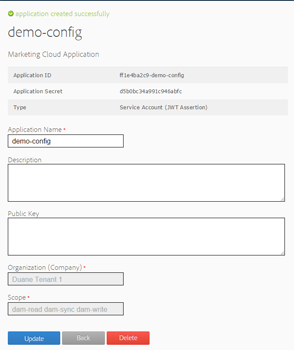

# Konfigurera AEM Assets-integrering med Experience Cloud och Creative Cloud {#configure-aem-assets-integration-with-experience-cloud-and-creative-cloud}

Om du är Adobe Experience Cloud-kund kan du synkronisera dina resurser i Adobe Experience Manager (AEM) Assets med Adobe Creative Cloud, och vice versa. Ni kan också synkronisera era resurser med Experience Cloud och vice versa. Du kan konfigurera synkroniseringen med hjälp av Adobe I/O.

Det arbetsflöde som ska användas för att konfigurera den här integreringen är:

1. Skapa en autentisering i Adobe I/O med en offentlig gateway och få ett program-ID.
1. Skapa en profil på din AEM Resurser-instans med program-ID:t.
1. Använd den här konfigurationen för att synkronisera dina resurser i AEM Resurser med Creative Cloud.

I bakgrunden autentiserar AEM-servern din profil med gatewayen och synkroniserar sedan data mellan AEM Assets och Experience Cloud.

>[!CAUTION]
>
>Funktionen AEM i Creative Cloud Mappdelning är föråldrad i AEM Resurser. Läs mer och hitta ersättningar i [AEM och Bästa praxis](/help/assets/aem-cc-integration-best-practices.md)för integrering med Creative Cloud.

Dataflöde när AEM Assets och Creative Cloud är integrerade

>[!NOTE]
>
>Att dela resurser mellan Adobe Experience Cloud och Adobe Creative Cloud kräver administratörsbehörighet för AEM-instansen.

>[!CAUTION]
>
>Adobe Marketing Cloud har omklassificerats som Adobe Experience Cloud. Processerna nedan talar fortfarande om Marketing Cloud för att återspegla det aktuella gränssnittet. Dessa omnämnanden kommer att ändras vid ett senare datum.

## Skapa ett program {#create-an-application}

1. Logga in på [https://legacy-oauth.cloud.adobe.io](https://legacy-oauth.cloud.adobe.io/).

   >[!NOTE]
   >
   >Du måste ha administratörsbehörighet för att skapa ett program-ID.

1. I den vänstra rutan navigerar du till **[!UICONTROL Utvecklingsverktyg]** > **[!UICONTROL Program]** för att visa en lista med program.
1. Klicka på **[!UICONTROL Lägg till]**  för att skapa ett program.
1. I listan **[!UICONTROL Klientautentiseringsuppgifter]** väljer du **[!UICONTROL Tjänstkonto (JWT Assertion)]**, som är en server-till-server-kommunikationstjänst för serverautentisering.

   

1. Ange ett namn för programmet och en valfri beskrivning.
1. I listan **[!UICONTROL Organisation]** väljer du den organisation som du vill synkronisera resurser för.
1. Välj **[!UICONTROL dam-read]** , **[!UICONTROL dam-sync]**, **[!UICONTROL dam-write]** och **[!UICONTROL cc-share]** i listan **[!UICONTROL Scope]**.
1. Klicka på **[!UICONTROL Skapa]**. Ett meddelande meddelar att programmet har skapats.

   

1. Kopiera det **[!UICONTROL program-ID]** som genereras för det nya programmet.

   >[!CAUTION]
   >
   >Se till att du inte oavsiktligt kopierar **[!UICONTROL programhemligheten]** i stället för **[!UICONTROL program-ID]**.

## Lägg till en ny konfiguration i Marketing Cloud {#add-a-new-configuration-to-marketing-cloud}

1. Klicka på AEM-logotypen i användargränssnittet för den lokala AEM Resurser-instansen och navigera till **[!UICONTROL Verktyg]** > **[!UICONTROL Molntjänster]** > **[!UICONTROL Äldre molntjänster]**.

1. Hitta **[!UICONTROL Adobe Marketing Cloud]** -tjänsten. Om det inte finns några konfigurationer klickar du på **[!UICONTROL Konfigurera nu]**. Om det finns konfigurationer klickar du på **[!UICONTROL Visa konfigurationer]** och sedan på **[!UICONTROL [+]]** för att lägga till en ny konfiguration.

   >[!NOTE]
   >
   >Använd ett Adobe ID-konto som har administratörsbehörighet för organisationen.

1. I dialogrutan **[!UICONTROL Skapa konfiguration]** anger du en rubrik och ett namn för den nya konfigurationen och klickar på **[!UICONTROL Skapa]**.

   

1. Ange URL:en för AEM Resurser i fältet **[!UICONTROL Klient-URL]** .

   >[!CAUTION]
   >
   >Om du angav klientens URL när `https://<tenant_id>.marketing.adobe.com` du måste ändra den till `https://<tenant_id>.experiencecloud.adobe.com.` För att kunna göra det följer du stegen nedan:
   >
   >1. Navigera till **Verktyg > Molntjänster > Äldre molntjänster**.
   1. Klicka på **Visa konfigurationer** under Adobe Marketing Cloud.
   1. Välj den konfiguration som skapades när AEM-MAC-CC-synkroniseringen konfigurerades.
   1. Redigera molntjänstkonfigurationen och ersätt **marketing.adobe.com** i fältet Klientadress till **experienceCloud.adobe.com**.
   1. Spara konfigurationen.
   1. Testa replikeringsagenterna för mac-sync.

1. I fältet **[!UICONTROL Klient-ID]** klistrar du in det program-ID som du kopierade i slutet av proceduren [Skapa ett program](/help/sites-administering/configure-assets-cc-integration.md#create-an-application).

   

1. Under **[!UICONTROL Synkronisering]** väljer du **[!UICONTROL Aktiverad]** för att aktivera synkronisering och klickar på **[!UICONTROL OK]**.

   >[!NOTE]
   Om du väljer **inaktiverad** fungerar synkroniseringen i en riktning.

1. På konfigurationssidan klickar du på **[!UICONTROL Visa offentlig nyckel]** för att visa den offentliga nyckeln som genererats för din instans. Du kan också klicka på **[!UICONTROL Hämta offentlig nyckel för OAuth Gateway]** för att hämta filen som innehåller den offentliga nyckeln. Öppna sedan filen för att visa den offentliga nyckeln.

## Aktivera synkronisering {#enable-synchronization}

1. Visa den offentliga nyckeln med någon av följande metoder som nämns i det sista steget i proceduren [Lägg till en ny konfiguration i Marketing Cloud](/help/sites-administering/configure-assets-cc-integration.md#add-a-new-configuration-to-marketing-cloud). Klicka på **[!UICONTROL Visa offentlig nyckel]**.

   

1. Kopiera den offentliga nyckeln och klistra in den i fältet **[!UICONTROL Offentlig nyckel]** i konfigurationsgränssnittet för det program du skapade i [Skapa ett program](/help/sites-administering/configure-assets-cc-integration.md#create-an-application).

   

1. Klicka på **[!UICONTROL Uppdatera]**. Synkronisera dina resurser med AEM Resurser-instansen nu.

## Testa synkroniseringen {#test-the-synchronization}

1. Klicka på AEM-logotypen i användargränssnittet för den lokala AEM Resurser-instansen och navigera till **[!UICONTROL Verktyg]**> **[!UICONTROL Distribution]**> **[!UICONTROL Replikering]**för att hitta de replikeringsprofiler som har skapats för synkronisering.
1. På sidan **[!UICONTROL Replikering]** klickar du på **[!UICONTROL Agenter på författaren]**.
1. I listan med profiler klickar du på standardreplikeringsprofilen för din organisation för att öppna den.
1. Klicka på **[!UICONTROL Testa anslutning]** i dialogrutan.

   

1. När replikeringen är klar kontrollerar du om det finns ett meddelande om att åtgärden lyckades i slutet av testresultaten.

## Lägg till användare i Marketing Cloud {#add-users-to-marketing-cloud}

1. Logga in på Marketing Cloud med administratörsautentiseringsuppgifter.
1. Gå till **[!UICONTROL Administration]** i detaljerna och klicka/tryck sedan på **[!UICONTROL Starta Enterprise Dashboard]**.
1. Klicka på **[!UICONTROL Användare]** i fältet för att öppna sidan **[!UICONTROL Användarhantering]** .
1. Klicka/tryck på **Lägg till** i verktygsfältet.
1. Lägg till en eller flera användare som du vill ska kunna dela resurser med Creative Cloud.

   >[!NOTE]
   Endast de användare som du lägger till i Marketing Cloud kan dela resurser från AEM Assets till Creative Cloud.

## Utbyt resurser mellan AEM Assets och Marketing Cloud {#exchange-assets-between-aem-assets-and-marketing-cloud}

1. Logga in på AEM Assets.
1. Skapa en mapp i resurskonsolen och överför några resurser till den. Du kan till exempel skapa en mapp **mc-demo** och överföra en resurs till den.
1. Markera mappen och klicka på **Dela** .
1. Välj **[!UICONTROL Adobe Marketing Cloud]** på menyn och klicka på **[!UICONTROL Dela]**. Ett meddelande meddelar att mappen delas med Marketing Cloud.

   

   >[!NOTE]
   Delning av en resursmapp av den typen `sling:OrderedFolder`stöds inte i samband med delning i Adobe Marketing Cloud. Om du vill dela en mapp ska du inte markera alternativet **[!UICONTROL Ordnad]** när du skapar den i AEM Resurser.

1. Uppdatera användargränssnittet för AEM Resurser. Mappen som du skapade i resurskonsolen för din lokala AEM Resurser-instans kopieras till Marketing Cloud-gränssnittet. Resursen som du överför till mappen i AEM Resurser visas i kopian av mappen i Marketing Cloud efter att den har bearbetats av AEM-servern.
1. Du kan också överföra en resurs i den replikerade kopian av mappen i Marketing Cloud. När resursen har bearbetats visas den i den delade mappen i AEM Resurser.

## Utbyt resurser mellan AEM Assets och Creative Cloud {#exchange-assets-between-aem-assets-and-creative-cloud}

>[!CAUTION]
Funktionen för mappdelning från AEM till Creative Cloud är föråldrad. Kunderna rekommenderas att använda nyare funktioner, som [Adobe Asset Link](https://helpx.adobe.com/enterprise/using/adobe-asset-link.html) eller [AEM-datorprogrammet](https://helpx.adobe.com/experience-manager/desktop-app/aem-desktop-app.html). Läs mer om [AEM och bästa praxis](/help/assets/aem-cc-integration-best-practices.md)för integrering med Creative Cloud.

Med AEM Resurser kan du dela mappar med resurser med Adobe Creative Cloud-användare.

1. I resurskonsolen väljer du den mapp som ska delas med Creative Cloud.
1. Klicka på **[!UICONTROL Dela]** i verktygsfältet.
1. Välj alternativet **[!UICONTROL Adobe Creative Cloud]** i listan.

   >[!NOTE]
   Alternativen är tillgängliga för användare med läsbehörighet för roten. Användarna måste ha den behörighet som krävs för att komma åt replikeringsagentinformationen i Marketing Cloud.

1. Lägg till användaren som ska dela mappen med på sidan **[!UICONTROL Creative Cloud-delning]** och välj en roll för användaren. Klicka på **[!UICONTROL Spara]** och sedan på **[!UICONTROL OK]**.

1. Logga in på Creative Cloud med inloggningsuppgifterna för den användare du delade mappen med. Den delade mappen är tillgänglig i Creative Cloud.

Synkroniseringen av AEM Assets-Marketing Cloud är utformad på ett sätt som användardatorinstansen som resursen överförs från behåller rätten att ändra resursen. Endast dessa ändringar sprids till den andra instansen.

Om en resurs till exempel överförs från en AEM Resurser-instans (lokalt), sprids ändringarna av resursen från den här instansen till Marketing Cloud-instansen. Ändringarna som görs från Marketing Cloud-instansen till samma resurs sprids dock inte till AEM-instansen och vice versa för resurser som överförs från Marketing Cloud.

>[!MORELIKETHIS]
* [Bästa praxis för integrering av AEM och Creative Cloud](/help/assets/aem-cc-integration-best-practices.md)
* [Metodtips för AEM-mappdelning i Creative Cloud](/help/assets/aem-cc-folder-sharing-best-practices.md)

