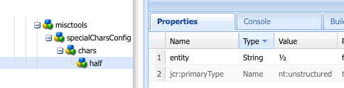

# Konfigurera plugin-programmen för RTF-redigeraren {#configure-the-rich-text-editor-plug-ins}

RTE-funktioner är tillgängliga via en serie plugin-program, var och en med features-egenskaper. Du kan konfigurera egenskapen features för att aktivera eller inaktivera en eller flera RTE-funktioner. I den här artikeln beskrivs hur du specifikt konfigurerar RTE-plugin-program.

Mer information om de andra RTE-konfigurationerna finns i [Konfigurera RTF-redigerare](/help/sites-administering/rich-text-editor.md).

>[!NOTE]
>
>När du arbetar med CRXDE Lite bör du spara ändringarna regelbundet med [!UICONTROL Save All] alternativ.

## Aktivera ett plugin-program och konfigurera egenskapen features {#activateplugin}

Följ de här stegen för att aktivera ett plugin-program. Vissa steg behövs bara när du konfigurerar ett plugin-program för första gången, eftersom motsvarande noder inte finns.

Som standard `format`, `link`, `list`, `justify`och `control` plugin-program och alla deras funktioner är aktiverade i RTE.

>[!NOTE]
>
>Motsvarande `rtePlugins` noden kallas `<rtePlugins-node>` för att undvika dubbletter i den här artikeln.

1. Leta reda på textkomponenten för ditt projekt med CRXDE Lite.
1. Skapa den överordnade noden för `<rtePlugins-node>` om den inte finns, innan du konfigurerar några RTE-plugin-program:

   * Beroende på vilken komponent du har är de överordnade noderna:

      * `config: .../text/cq:editConfig/cq:inplaceEditing/config`
      * en alternativ konfigurationsnod: `.../text/cq:editConfig/cq:inplaceEditing/inplaceEditingTextConfig`
      * `text: .../text/dialog/items/tab1/items/text`

   * Är av typen: **jcr:primärType** `cq:Widget`
   * Båda har följande egenskaper:

      * **Namn** `name`
      * **Typ** `String`
      * **Värde** `./text`

1. Skapa en nod beroende på vilket gränssnitt du konfigurerar för `<rtePlugins-node>`, om den inte finns:

   * **Namn** `rtePlugins`
   * **Typ** `nt:unstructured`

1. Under detta skapar du en nod för varje plugin-program som du vill aktivera:

   * **Typ** `nt:unstructured`
   * **Namn** plug-in-id:t för plug-in-programmet krävs

När du har aktiverat ett plugin-program följer du de här riktlinjerna för att konfigurera `features` -egenskap.

| | Aktivera alla funktioner | Aktivera några specifika funktioner | Inaktivera alla funktioner |
|---|---|---|---|
| Namn | funktioner | funktioner | funktioner |
| Typ | Sträng | Sträng[] (multi-string; ange Type till String och klicka på Multi i CRXDE Lite) | Sträng |
| Värde | `*` (en asterisk) | anges till ett eller flera funktionsvärden | - |

## Förstå plugin-programmet findreplace {#findreplace}

The `findreplace` plug-in-programmet behöver ingen konfiguration. Det går som det ska.

När du använder ersättningsfunktionen bör du ange ersättningssträngen samtidigt som söksträngen. Du kan dock fortfarande klicka på Sök för att söka efter strängen innan du ersätter den. Om ersättningssträngen anges efter att du klickat på Sök återställs sökningen till början av texten.

Dialogrutan Sök och ersätt blir genomskinlig när du klickar på Sök och blir ogenomskinlig när du klickar på Ersätt. Detta gör att författaren kan granska texten som författaren ersätter. Om användare klickar på Ersätt alla stängs dialogrutan och visar antalet ersättningar som gjorts.

## Konfigurera inklistringslägena {#paste-modes}

När du använder RTE kan författare klistra in innehåll i något av följande tre lägen:

* **Webbläsarläge**: Klistra in text med webbläsarens standardimplementering för inklistring. Det är inte en rekommenderad metod eftersom den kan medföra oönskad markering.

* **Oformaterad text, läge**: Klistra in urklippsinnehållet som ren text. Alla formatelement och formateringselement i det kopierade innehållet tas bort innan de infogas i [!DNL Experience Manager] -komponenten.

* **MS® Word-läge**: Klistra in texten, inklusive tabeller, med formatering när du kopierar från MS® Word. Det går inte att kopiera och klistra in text från en annan källa, t.ex. en webbsida eller MS® Excel, utan endast delvis formatering.

### Konfigurera de inklistringsalternativ som finns i verktygsfältet RTE  {#configure-paste-options-available-on-the-rte-toolbar}

Du kan ange några, alla eller inga av dessa tre ikoner till författarna i verktygsfältet för textredigering:

* **[!UICONTROL Paste (Ctrl+V)]**: Kan förkonfigureras så att det motsvarar något av de tre inklistringslägena ovan.

* **[!UICONTROL Paste as Text]**: Innehåller funktioner för normalt textläge.

* **[!UICONTROL Paste from Word]**: Tillhandahåller MS® Word-funktionalitet.

Följ de här stegen för att konfigurera RTE så att nödvändiga ikoner visas.

1. Navigera till komponenten, till exempel `/apps/<myProject>/components/text`.
1. Navigera till noden `rtePlugins/edit`. Se [aktivera ett plugin-program](#activateplugin) om noden inte finns.
1. Skapa `features` -egenskapen på `edit` och lägga till en eller flera funktioner. Spara alla ändringar.

### Konfigurera beteendet för ikonen Klistra in (Ctrl+V) och genvägen {#configure-the-behavior-of-the-paste-ctrl-v-icon-and-shortcut}

Du kan förkonfigurera beteendet för **[!UICONTROL Paste (Ctrl+V)]** -ikonen med följande steg. Den här konfigurationen definierar också beteendet för kortkommandot Ctrl+V som författare använder för att klistra in innehåll.

Konfigurationen tillåter följande tre typer av användningsfall:

* Klistra in text med webbläsarens standardimplementering för inklistring. Det är inte en rekommenderad metod eftersom den kan medföra oönskad markering. Konfigurerad med `browser` nedan.

* Klistra in urklippsinnehållet som ren text. Alla formatelement och formateringselement i det kopierade innehållet tas bort innan de infogas i AEM. Konfigurerad med `plaintext` nedan.

* Klistra in text, inklusive tabeller, med formatering när du kopierar från MS® Word. Det går inte att kopiera och klistra in text från en annan källa, t.ex. en webbsida eller MS® Excel, utan endast delvis formatering. Konfigurerad med `wordhtml` nedan.

1. Navigera till `<rtePlugins-node>/edit` nod. Skapa noderna om de inte finns. Mer information finns i [aktivera ett plugin-program](#activateplugin).
1. I `edit` -nod skapar du en egenskap med följande information:

   * **Namn** `defaultPasteMode`
   * **Typ** `String`
   * **Värde** Ett av de obligatoriska inklistringslägena `browser`, `plaintext`, eller `wordhtml`.

### Konfigurera de format som tillåts när innehåll klistras in {#pasteformats}

Klistra in som Microsoft-ord (`paste-wordhtml`) kan konfigureras ytterligare så att du uttryckligen kan definiera vilka format som tillåts när du klistrar in i AEM från ett annat program, till exempel Microsoft® Word.

Om t.ex. endast fetstilta format och listor ska tillåtas när du klistrar in i AEM kan du filtrera bort de andra formaten. Detta kallas konfigurerbar inklistringsfiltrering, vilket kan göras för båda:

* [Text](#paste-modes)
* [Länkar](#linkstyles)

För länkar kan du också definiera de protokoll som automatiskt godkänns.

Så här konfigurerar du vilka format som tillåts när du klistrar in text i AEM från ett annat program:

1. Navigera till noden i komponenten `<rtePlugins-node>/edit`. Skapa noderna om de inte finns. Mer information finns i [aktivera ett plugin-program](#activateplugin).
1. Skapa en nod under `edit` så att du kan behålla inklistringsreglerna i HTML:

   * **Namn** `htmlPasteRules`
   * **Typ** `nt:unstructured`

1. Skapa en nod under `htmlPasteRules`så att du kan hålla reda på mer om de grundläggande formaten:

   * **Namn** `allowBasics`
   * **Typ** `nt:unstructured`

1. Om du vill styra de enskilda formaten som godkänns skapar du en eller flera av följande egenskaper på `allowBasics` nod:

   * **Namn** `bold`
   * **Namn** `italic`
   * **Namn** `underline`
   * **Namn** `anchor` (för både länkar och namngivna ankare)
   * **Namn** `image`

   Alla egenskaper är **Typ** `Boolean`, så att **Värde** Du kan antingen markera eller ta bort markeringen för att aktivera eller inaktivera funktionen.

   >[!NOTE]
   >
   >Om det inte uttryckligen definieras används standardvärdet true och formatet accepteras.

1. Andra format kan också definieras med hjälp av en rad andra egenskaper eller noder, som även kan användas på `htmlPasteRules` nod. Spara alla ändringar.

Du kan använda följande egenskaper för `htmlPasteRules`.

| Egenskap | Typ | Beskrivning |
|---|---|---|
| `allowBlockTags` | Sträng | Definierar listan med blocktaggar som tillåts. Några möjliga blocktaggar är: <ul> <li>rubriker (h1, h2, h3)</li> <li>stycken p</li> <li>listor (ol, ul)</li> <li>tabeller (tabell)</li> </ul> |
| `fallbackBlockTag` | Sträng | Definierar den blocktagg som används för alla block som har en blocktagg som inte ingår i `allowBlockTags`. `p` brukar räcka. |
| table | nt:ostrukturerad | Definierar beteendet när tabeller klistras in. Den här noden måste ha egenskapen `allow` (boolesk) för att definiera om inklistring av tabeller tillåts. Om tillåt är inställt på `false`måste du ange egenskapen `ignoreMode` (skriv String) för att definiera hur inklistrat tabellinnehåll hanteras. Giltiga värden för `ignoreMode` är: <ul> <li>`remove`: Tar bort tabellinnehåll.</li> <li>`paragraph`: Ändrar tabellceller till stycken.</li> </ul> |
| list | nt:ostrukturerad | Definierar beteendet när listor klistras in. Måste ha egenskapen `allow` (boolesk) för att ange om inklistring av listor är tillåten. If `allow` är inställd på `false`måste du ange egenskapen `ignoreMode` (skriv String) för att definiera hur listinnehåll som klistras in ska hanteras. Giltiga värden för `ignoreMode` är: <ul><li> `remove`: Tar bort listinnehåll.</li> <li>`paragraph`: Omvandlar listobjekt till stycken.</li> </ul> |

Ett exempel på en giltig `htmlPasteRules` strukturen är nedan.

```xml
"htmlPasteRules": {
    "allowBasics": {
        "italic": true,
        "link": true
    },
    "allowBlockTags": [
        "p", "h1", "h2", "h3"
    ],
    "list": {
        "allow": false,
        "ignoreMode": "paragraph"
    },
    "table": {
        "allow": true,
        "ignoreMode": "paragraph"
    }
}
```

## Konfigurera textformat {#textstyles}

Författare kan använda format för att ändra utseendet på en del av texten. Formaten baseras på CSS-klasser som du fördefinierar i din CSS-formatmall. Stiliserat innehåll omsluts av `span` taggar med `class` -attribut som refererar till CSS-klassen. Till exempel: `<span class=monospaced>Monospaced Text Here</span>`.

När plugin-programmet Styles är aktiverat för första gången finns det inga standardformat. Popup-listan är tom. Så här ger du författarna formatmallar:

* Aktivera den nedrullningsbara listrutan Format.
* Ange formatmallarnas platser.
* Ange de enskilda format som du kan välja i listrutan Format.

Om du vill lägga till fler format vid ett senare tillfälle följer du bara instruktionerna för att referera till en ny formatmall och ange de ytterligare formaten.

>[!NOTE]
>
>Du kan definiera format för [tabeller eller tabellceller](/help/sites-administering/configure-rich-text-editor-plug-ins.md#tablestyles). Dessa konfigurationer kräver separata procedurer.

### Aktivera den nedrullningsbara listan Format för väljare {#styleselectorlist}

Detta gör du genom att aktivera stilplugin-programmet.

1. Navigera till noden i komponenten `<rtePlugins-node>/styles`. Skapa noderna om de inte finns. Mer information finns i [aktivera ett plugin-program](#activateplugin).
1. Skapa `features` -egenskapen på `styles` nod:

   * **Namn** `features`
   * **Typ** `String`
   * **Värde** `*` (asterisk)

1. Spara alla ändringar.

>[!NOTE]
>
>När plugin-programmet Format är aktiverat visas listrutan Format i redigeringsdialogrutan. Listan är dock tom eftersom inga format har konfigurerats.

### Ange formatmallens plats {#locationofstylesheet}

Ange sedan platserna för de formatmallar som du vill referera till:

1. Navigera till rotnoden för textkomponenten, till exempel `/apps/<myProject>/components/text`.
1. Lägg till egenskapen `externalStyleSheets` till den överordnade noden för `<rtePlugins-node>`:

   * **Namn** `externalStyleSheets`
   * **Typ** `String[]` (flersträng; klicka **Flera** i CRXDE)
   * **Värden** Sökvägen och filnamnet för alla formatmallar som du vill ta med. Använd databassökvägar.

   >[!NOTE]
   >
   >Du kan när som helst lägga till referenser till ytterligare formatmallar.

1. Spara alla ändringar.

>[!NOTE]
>
>När du använder textredigering i en dialogruta (Classic UI) kanske du vill ange formatmallar som är optimerade för textredigering. På grund av tekniska begränsningar förloras CSS-kontexten i redigeraren, så du kanske vill emulera den här kontexten för att förbättra WYSIWYG-upplevelsen.
>
>RTF-redigeraren använder ett behållar-DOM-element med ID:t `CQrte` som kan användas för att skapa olika format för visning och redigering:
>
>`#CQ td {`
>` // defines the style for viewing }`
>
>`#CQrte td {`
>` // defines the style for editing }`

### Ange tillgängliga format i popup-listan {#stylesindropdown}

1. Navigera till noden i komponentdefinitionen `<rtePlugins-node>/styles`, som i [Aktivera den nedrullningsbara formatväljaren](#styleselectorlist).
1. Under noden `styles`, skapa en nod (kallas även `styles`) för att hålla listan tillgänglig:

   * **Namn** `styles`
   * **Typ** `cq:WidgetCollection`

1. Skapa en nod under `styles` så att du kan representera ett enskilt format:

   * **Namn** kan du ange namnet, men det bör vara lämpligt för formatet
   * **Typ** `nt:unstructured`

1. Lägg till egenskapen `cssName` till den här noden så att du kan referera till CSS-klassen:

   * **Namn** `cssName`
   * **Typ** `String`
   * **Värde** Namnet på CSS-klassen (utan föregående &#39;.&#39;); till exempel `cssClass` i stället för `.cssClass`)

1. Lägg till egenskapen `text` till samma nod. Detta definierar texten som visas i markeringsrutan:

   * **Namn** `text`
   * **Typ** `String`
   * **Värde** En beskrivning av formatet visas i den nedrullningsbara listrutan Format.

1. Spara ändringarna.

   Upprepa stegen ovan för alla obligatoriska format.

### Konfigurera RTE för optimala ordbrytningar på japanska {#jpwordwrap}

Författare som använder AEM för att skapa japanskt innehåll kan använda ett format på tecken för att undvika radbrytningar där ingen radbrytning behövs. Detta gör att författare kan låta meningarna brytas vid den önskade positionen. Formatet för den här funktionen baseras på CSS-klassen som är fördefinierad i CSS-formatmallen.

>[!NOTE]
>
>Den här funktionen kräver minst AEM 6.5 Service Pack 1.

Så här skapar du det format som författare kan använda på japansk text:

1. Skapa en nod under noden Styles. Se [ange ett nytt format](#stylesindropdown).
   * Namn: `jpn-word-wrap`
   * Typ: `nt:unstructure`

1. Lägg till egenskapen `cssName` till noden så att du kan referera till CSS-klassen. Klassnamnet är ett reserverat namn för japansk radbrytning.
   * Namn: `cssName`
   * Typ: `String`
   * Värde: `jpn-word-wrap` (utan föregående `.`)

1. Lägg till egenskapstexten i samma nod. Värdet är namnet på formatet som författaren ser när han eller hon väljer formatet.
   * Namn: `text`
*Typ: `String`
   * Värde: `Japanese word-wrap`

1. Skapa en formatmall och ange dess sökväg. Se [ange plats för formatmall](#locationofstylesheet). Lägg till följande innehåll i formatmallen. Ändra bakgrundsfärgen efter behov.

   ```css
   .text span.jpn-word-wrap {
       display:inline-block;
   }
   .is-edited span.jpn-word-wrap {
       background-color: #ffddff;
   }
   ```

   

## Konfigurera styckeformat {#paraformats}

All text som skapas i textredigeraren placeras i en blocktagg med standardvärdet `<p>`. Genom att aktivera `paraformat` plugin-programmet anger du ytterligare blocktaggar som kan tilldelas stycken med hjälp av en nedrullningsbar markeringslista. Styckeformat bestämmer stycketypen genom att tilldela rätt blocktagg. Författaren kan markera och tilldela dem med formatväljaren. Exempelblocktaggarna innehåller bland annat standardstycket &lt;p> och rubriker &lt;h1>, &lt;h2>och så vidare.

>[!CAUTION]
>
>Det här plugin-programmet passar inte för innehåll med komplexa strukturer som listor och tabeller.

>[!NOTE]
>
>Om en blocktagg exempelvis &lt;hr> -tagg, kan inte tilldelas till ett stycke, det är inte ett giltigt användningsfall för ett plugin-program för paraformat.

När plugin-programmet Styckeformat är aktiverat för första gången är inga standardstyckeformat tillgängliga. Popup-listan är tom. Så här förser du författarna med styckeformat:

* Aktivera listrutan Format för väljare.
* Ange de blocktaggar som kan markeras som styckeformat i listrutan.

För senare konfigurationer eller omkonfigurationer, till exempel för att lägga till fler format, följ bara relevanta delar av instruktionerna.

### Aktivera den nedrullningsbara formatväljaren {#formatselectorlist}

Aktivera först plugin-programmet för paraformat:

1. Navigera till noden i komponenten `<rtePlugins-node>/paraformat`. Skapa noderna om de inte finns. Mer information finns i [aktivera ett plugin-program](#activateplugin).
1. Skapa `features` -egenskapen på `paraformat` nod:

   * **Namn** `features`
   * **Typ** `String`
   * **Värde** `*` (asterisk)

>[!NOTE]
>
Om plugin-programmet inte konfigureras ytterligare aktiveras följande standardformat:
>
* Stycke ( `<p>`)
* Rubrik 1 ( `<h1>`)
* Rubrik 2 ( `<h2>`)
* Rubrik 3 ( `<h3>`)
>

>[!CAUTION]
>
Ta inte bort stycketaggen när du konfigurerar styckeformatet för textredigeraren &lt;p> som ett formateringsalternativ. Om `<p>` -taggen tas bort och innehållsförfattaren kan inte markera **Styckeformat** även om ytterligare format har konfigurerats.

### Ange tillgängliga styckeformat {#paraformatsindropdown}

Styckeformat kan göras tillgängliga för markering genom att:

1. Navigera till noden i komponentdefinitionen `<rtePlugins-node>/paraformat`, som i [Aktivera den nedrullningsbara formatväljaren](#styleselectorlist).
1. Under `paraformat` skapar du en nod som innehåller listan med format:

   * **Namn** `formats`
   * **Typ** `cq:WidgetCollection`

1. Skapa en nod under `formats` nod, här finns information om ett enskilt format:

   * **Namn** kan du ange namnet, men det ska vara lämpligt för formatet (till exempel minstycke, minrubrik1).
   * **Typ** `nt:unstructured`

1. I den här noden lägger du till egenskapen för att definiera den blocktagg som används:

   * **Namn** `tag`
   * **Typ** `String`
   * **Värde** Blocktaggen för formatet, t.ex. p, h1, h2.

     Du behöver inte ange vinkelavgränsare.

1. Om du vill lägga till en annan egenskap för samma nod visas beskrivande text i listrutan:

   * **Namn** `description`
   * **Typ** `String`
   * **Värde** Den beskrivande texten för det här formatet, till exempel Stycke, Rubrik 1, Rubrik 2. Den här texten visas i listan Format.

1. Spara ändringarna.

   Upprepa stegen för alla obligatoriska format.

>[!CAUTION]
>
Om du definierar anpassade format används standardformaten (`<p>`, `<h1>`, `<h2>`och `<h3>`) tas bort. Återskapa `<p>` som det är standardformatet.

## Konfigurera specialtecken {#spchar}

I en standardinstallation AEM `misctools` plugin-programmet är aktiverat för specialtecken (`specialchars`) är en standardmarkering omedelbart tillgänglig för användning, till exempel copyright- och varumärkessymboler.

Du kan konfigurera textredigeraren så att den gör ditt eget val av tecken tillgängligt, antingen genom att definiera distinkta tecken eller genom att definiera en hel sekvens.

>[!CAUTION]
>
Om du lägger till egna specialtecken åsidosätts standardinställningen. Definiera eller definiera om dessa tecken i din egen markering om det behövs.

### Definiera ett enskilt tecken {#definesinglechar}

1. Navigera till noden i komponenten `<rtePlugins-node>/misctools`. Skapa noderna om de inte finns. Mer information finns i [aktivera ett plugin-program](#activateplugin).
1. Skapa `features` -egenskapen på `misctools` nod:

   * **Namn** `features`
   * **Typ** `String[]`
   * **Värde** `specialchars`

         (eller `String / *` om du använder alla funktioner för detta plugin-program)

1. Under `misctools`skapar du en nod för specialteckenkonfigurationer:

   * **Namn** `specialCharsConfig`
   * **Typ** `nt:unstructured`

1. Under `specialCharsConfig`skapar du en annan nod som innehåller listan med tecken:

   * **Namn** `chars`
   * **Typ** `nt:unstructured`

1. Under `chars`, lägger du till en nod för en enskild teckendefinition:

   * **Namn** Du kan ange namnet, men det ska återspegla tecknet, till exempel hälften.
   * **Typ** `nt:unstructured`

1. Lägg till följande egenskap i den här noden:

   * **Namn** `entity`
   * **Typ** `String`
   * **Värde** representationen av det önskade tecknet i HTML, till exempel `&189;` för bråket ena halvan.

1. Spara ändringarna.

I CRXDE visas det representerade tecknet när egenskapen har sparats. Se exemplet nedan. Upprepa stegen ovan så att du kan göra fler specialtecken tillgängliga för författare.



### Definiera ett teckenintervall {#definerangechar}

1. Använd steg 1-3 från [Definiera ett enskilt tecken](#definesinglechar).
1. Under `chars`, lägger du till en nod som innehåller definitionen av teckenintervallet:

   * **Namn** Du kan ange namnet, men det bör återspegla teckenintervallet, till exempel pennor.
   * **Typ** `nt:unstructured`

1. Lägg till följande två egenskaper under den här noden (namngivna enligt ditt teckenintervall):

   * **Namn** `rangeStart`
     **Typ** `Long`
     **Värde** den [Unicode](https://unicode.org/) representation (decimal) av det första tecknet i intervallet

   * **Namn** `rangeEnd`
     **Typ** `Long`
     **Värde** den [Unicode](https://unicode.org/) representation (decimal) av det sista tecknet i intervallet

1. Spara ändringarna.

   Om du till exempel definierar ett intervall på 9998 - 10000 får du följande tecken.

   

   *Bild: I CRXDE definierar du ett intervall med tecken som ska vara tillgängliga i textredigeraren*

   

## Konfigurera tabellformat {#tablestyles}

Format används vanligtvis på text, men du kan också använda separata formatmallar i en tabell eller i ett fåtal tabellceller. Sådana format är tillgängliga för författare i rutan Formatväljare i antingen dialogrutan Cellegenskaper eller Tabellegenskaper. Stilarna är tillgängliga när du redigerar en tabell i en Text-komponent (eller en variabel) och inte i standardkomponenten för tabeller.

>[!NOTE]
>
Du kan endast definiera format för tabeller och celler för det klassiska användargränssnittet.

>[!NOTE]
>
Kopiering och inklistring av tabeller i eller från RTE-komponenten är webbläsarberoende. Det stöds inte i alla webbläsare. Du kan få olika resultat beroende på tabellstruktur och webbläsare. Om du till exempel kopierar och klistrar in en tabell i en RTE-komponent i Mozilla Firefox i Classic UI och Touch UI, bevaras inte tabellens layout.

1. Navigera till noden i komponenten `<rtePlugins-node>/table`. Skapa noderna om de inte finns. Mer information finns i [aktivera ett plugin-program](#activateplugin).
1. Skapa `features` -egenskapen på `table` nod:

   * **Namn** `features`
   * **Typ** `String`
   * **Värde** `*` (asterisk)

   >[!NOTE]
   >
   Om du inte vill aktivera alla tabellfunktioner kan du skapa `features` egenskap som:
   >
   * **Typ** `String[]`
   >
   * **Värde** en eller båda av följande, beroende på vad som krävs:
   * `table` så att tabellegenskaper, inklusive format, kan redigeras.
   * `cellprops` för att tillåta redigering av cellegenskaper, inklusive format.

1. Definiera platsen för CSS-formatmallar så att du kan referera till dem. Se [Ange platsen för formatmallen](#locationofstylesheet) eftersom det är samma sak som när du definierar [format för text](#textstyles). Platsen kan definieras om du har definierat andra format.
1. Under `table` skapar du följande nya noder (efter behov):

   * Definiera format för hela tabellen (finns under **Tabellegenskaper**):

      * **Namn** `tableStyles`
      * **Typ** `cq:WidgetCollection`

   * Definiera format för de enskilda cellerna (finns under **Cellegenskaper**):

      * **Namn** `cellStyles`
      * **Typ** `cq:WidgetCollection`

1. Skapa en nod (under `tableStyles` eller `cellStyles` nod) så att du kan representera ett enskilt format:

   * **Namn** Du kan ange namnet, men det ska återspegla formatet.
   * **Typ** `nt:unstructured`

1. Skapa egenskaperna på den här noden:

   * Definiera det CSS-format som ska refereras

      * **Namn** `cssName`
      * **Typ** `String`
      * **Värde** namnet på CSS-klassen (utan föregående `.`, till exempel `cssClass` i stället för `.cssClass`)

   * Definiera en beskrivande text som ska visas i den nedrullningsbara väljaren

      * **Namn** `text`
      * **Typ** `String`
      * **Värde** texten som ska visas i urvalslistan

1. Spara alla ändringar.

Upprepa stegen ovan för alla obligatoriska format.

### Konfigurera dolda rubriker i tabeller för tillgänglighet {#hiddenheader}

Ibland kan du skapa datatabeller utan visuell text i en kolumnrubrik om rubrikens syfte beror på kolumnens visuella förhållande till andra kolumner. I det här fallet är det nödvändigt att ange dold inre text i cellen i rubrikcellen. På så sätt kan skärmläsare och andra hjälpmedelstekniker hjälpa läsare med olika behov att förstå vad kolumnen ska användas till.

RTE har stöd för dolda rubrikceller för att förbättra tillgängligheten i sådana scenarier. Dessutom innehåller den konfigurationsinställningar för dolda rubriker i tabeller. Med de här inställningarna kan du använda CSS-format på dolda rubriker i redigerings- och förhandsgranskningslägena. Om du vill hjälpa författare att identifiera dolda rubriker i redigeringsläget kan du inkludera följande parametrar i koden:

* `hiddenHeaderEditingCSS`: Anger namnet på CSS-klassen som används i den dolda rubrikcellen när RTE redigeras.
* `hiddenHeaderEditingStyle`: Anger en formatsträng som används i den dolda rubrikcellen när textredigeringsredigering används.

Om du anger både CSS och formatsträngen i koden har CSS-klassen företräde framför formatsträngen och kan skriva över alla konfigurationsändringar som formatsträngen gör.

För att hjälpa författare att använda CSS på dolda rubriker i förhandsgranskningsläget kan du inkludera följande parametrar i koden:

* `hiddenHeaderClassName`: Anger namnet på CSS-klassen som används i den dolda rubrikcellen i förhandsgranskningsläge.
* `hiddenHeaderStyle`: Anger en formatsträng som används i den dolda rubrikcellen i förhandsvisningsläget.

Om du anger både CSS och formatsträngen i koden har CSS-klassen företräde framför formatsträngen och kan skriva över alla konfigurationsändringar som formatsträngen gör.

## Lägg till ordlistor för stavningskontrollen {#adddict}

När plugin-programmet för stavningskontroll är aktiverat används lexikon för respektive språk. Dessa väljs sedan enligt webbplatsens språk genom att antingen använda underträdets language-egenskap eller genom att extrahera språket från URL:en. Till exempel `/en/` grenen kontrolleras som engelsk, `/de/` som tysk.

>[!NOTE]
>
Meddelandet `Spell checking failed` visas om en kontroll görs för ett språk som inte är installerat. Standardordlistorna finns på `/libs/cq/spellchecker/dictionaries`, tillsammans med lämpliga Viktigt-filer. Ändra inte filerna.

En standardinstallation AEM innehåller ordlistorna för amerikansk engelska (`en_us`) och engelska (`en_gb`). Följ de här stegen om du vill lägga till fler ordlistor.

1. Navigera till sidan [https://extensions.openoffice.org/](https://extensions.openoffice.org/).

1. Gör något av följande om du vill hitta en ordlista på något av följande språk:

   * Sök efter den ordlista du vill använda. Leta reda på länken till den ursprungliga källans eller författarens webbsida på ordlistesidan. Leta reda på ordlistefilerna för v2.x på en sådan sida.
   * Sök efter v2.x-ordlistefiler på [https://wiki.openoffice.org/wiki/User:Khirano/Dictionaries](https://wiki.openoffice.org/wiki/User:Khirano/Dictionaries).

1. Hämta arkivet med stavningsdefinitionerna. Extrahera innehållet i arkivet i filsystemet.

   >[!CAUTION]
   >
   Endast ordlistor i `MySpell` format för OpenOffice.org v2.0.1 eller tidigare stöds. Eftersom ordlistorna nu är arkivfiler rekommenderar vi att du kontrollerar arkivet efter nedladdningen.

1. Leta reda på `.aff` och `.dic` filer. Behåll filnamnet med gemener. Till exempel: `de_de.aff` och `de_de.dic`.
1. Läs in `.aff` och `.dic` filer i databasen på `/apps/cq/spellchecker/dictionaries`.

>[!NOTE]
>
Stavningskontrollen för textredigering är tillgänglig på begäran. Den körs inte automatiskt när du börjar skriva text. Om du vill stavningskontrollera klickar du [!UICONTROL Spellchecker] i verktygsfältet. RTE kontrollerar stavningen av ord och markerar de felstavade orden.
>
Om du infogar någon ändring som stavningskontrollen föreslår markeras inte längre textens status och felstavade ord. Om du vill stavningskontrollera klickar du på stavningskontrollknappen igen.

## Konfigurera historikstorlek för ångra- och gör om-åtgärder {#undohistory}

Med RTE kan författare ångra eller göra om några sista redigeringar. Som standard lagras 50 redigeringar i historiken. Du kan konfigurera det här värdet efter behov.

1. Navigera till noden i komponenten `<rtePlugins-node>/undo`. Skapa de här noderna om de inte finns. Mer information finns i [aktivera ett plugin-program](#activateplugin).
1. På `undo` -nod, skapa egenskapen:

   * **Namn** `maxUndoSteps`
   * **Typ** `Long`
   * **Värde** antalet ångra-steg som du vill spara i historiken. Standardvärdet är 50. Använd `0` för att helt inaktivera ångra/gör om.

1. Spara ändringarna.

## Konfigurera flikstorleken {#tabsize}

När tabbtecknet trycks ned i en text infogas ett fördefinierat antal mellanslag. Som standard är detta tre fasta mellanslag och ett mellanslag.

Så här definierar du tabbstorleken:

1. Navigera till noden i komponenten `<rtePlugins-node>/keys`. Skapa noderna om de inte finns. Mer information finns i [aktivera ett plugin-program](#activateplugin).
1. På `keys` -nod, skapa egenskapen:

   * **Namn** `tabSize`
   * **Typ** `String`
   * **Värde** antalet blankstegstecken som ska användas för tabulatorn

1. Spara ändringarna.

## Ange indragsmarginal {#indentmargin}

När indrag är aktiverat (standard) kan du ange storleken på indraget:

>[!NOTE]
>
Den här indragsstorleken används bara för stycken (block) i text. Den påverkar inte indraget för verkliga listor.

1. Navigera till noden i komponenten `<rtePlugins-node>/lists`. Skapa de här noderna om de inte finns. Mer information finns i [aktivera ett plugin-program](#activateplugin).
1. På `lists` nod, skapa `indentSize` parameter:

   * **Namn**: `indentSize`
   * **Typ**: `Long`
   * **Värde**: antal pixlar som krävs för indragsmarginalen.

## Konfigurera höjden på det redigerbara utrymmet {#editablespace}

>[!NOTE]
>
Detta gäller endast när du använder textredigeraren i en dialogruta (inte redigering på plats i klassiskt gränssnitt).

Du kan ange höjden på det redigerbara området som visas i komponentdialogrutan:

1. På `../items/text` i dialogrutedefinitionen för komponenten skapar du en egenskap:

   * **Namn** `height`
   * **Typ** `Long`
   * **Värde** redigeringsytans höjd i pixlar.

   >[!NOTE]
   >
   Detta ändrar inte höjden på dialogrutans fönster.

1. Spara ändringarna.

## Konfigurera format och protokoll för länkar {#linkstyles}

När du lägger till länkar i AEM kan du definiera:

* De CSS-format som ska användas
* Protokollen accepteras automatiskt

Om du vill konfigurera hur länkar läggs till i AEM från ett annat program definierar du reglerna för HTML.

1. Leta reda på textkomponenten för ditt projekt med CRXDE Lite.
1. Skapa en nod på samma nivå som `<rtePlugins-node>`, d.v.s. skapa noden under den överordnade noden för `<rtePlugins-node>`:

   * **Namn** `htmlRules`
   * **Typ** `nt:unstructured`

   >[!NOTE]
   >
   The `../items/text` -noden har egenskapen:
   >
   * **Namn** `xtype`
   * **Typ** `String`
   * **Värde** `richtext`
   >
   Platsen för `../items/text` noden kan variera beroende på dialogstrukturen; två exempel är `/apps/myProject>/components/text/dialog/items/text` och `/apps/<myProject>/components/text/dialog/items/panel/items/text`.

1. Under `htmlRules`skapar du en nod.

   * **Namn** `links`
   * **Typ** `nt:unstructured`

1. Under `links` -nod definierar du egenskaperna efter behov:

   * CSS-format för interna länkar:

      * **Namn** `cssInternal`
      * **Typ** `String`
      * **Värde** namnet på CSS-klassen (utan föregående &#39;.&#39;); till exempel `cssClass` i stället för `.cssClass`)

   * CSS-format för externa länkar

      * **Namn** `cssExternal`
      * **Typ** `String`
      * **Värde** namnet på CSS-klassen (utan föregående &#39;.&#39;); till exempel `cssClass` i stället för `.cssClass`)

   * Giltig matris **protokoll**. Protokollen som stöds är `http://`, `https://`, `file://`och `mailto:`.

      * **Namn** `protocols`
      * **Typ** `String[]`
      * **Värde** ett eller flera protokoll

   * **defaultProtocol** (egenskap av typ **Sträng**): Protokoll som ska användas om användaren inte uttryckligen angav ett.

      * **Namn** `defaultProtocol`
      * **Typ** `String`
      * **Värde** ett eller flera standardprotokoll

   * Definition av hur målattributet för en länk ska hanteras. Skapa en nod:

      * **Namn** `targetConfig`
      * **Typ** `nt:unstructured`

     På noden `targetConfig`definierar du de egenskaper som krävs:

      * Ange målläge:

         * **Namn** `mode`
         * **Typ** `String`)
         * **Värde**

            * `auto`: betyder att ett automatiskt mål har valts

              (anges av `targetExternal` egenskap för externa länkar eller `targetInternal` för interna länkar).

            * `manual`: inte tillämpligt i detta sammanhang
            * `blank`: inte tillämpligt i detta sammanhang

      * Målet för interna länkar:

         * **Namn** `targetInternal`
         * **Typ** `String`
         * **Värde** målet för interna länkar (används endast när läget är `auto`)

      * Målet för externa länkar:

         * **Namn** `targetExternal`
         * **Typ** `String`
         * **Värde** målet för externa länkar (används endast när läget är `auto`).

1. Spara alla ändringar.
