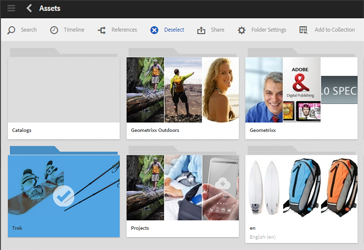

# Mappdelning med Adobe Creative Cloud {#folder-sharing-with-adobe-creative-cloud}

>[!CAUTION]
>
>Funktionen för mappdelning från AEM till Creative Cloud är föråldrad. Kunderna rekommenderas att använda nyare funktioner, som [Adobe Asset Link](https://helpx.adobe.com/enterprise/using/adobe-asset-link.html) eller [AEM-datorprogrammet](https://helpx.adobe.com/experience-manager/desktop-app/aem-desktop-app.html). Läs mer om [AEM och bästa praxis](/help/assets/aem-cc-integration-best-practices.md)för integrering med Creative Cloud.

Med Adobe Experience Manager Assets (AEM) kan du dela mappar med resurser med Adobe Creative Cloud-användare. Mer information om hur du konfigurerar Adobe Marketing Cloud så att du kan dela resurser med Adobe Creative Cloud finns i [Konfigurera Assets-Creative Cloud-integrering](/help/sites-administering/configure-assets-cc-integration.md).

1. I resurskonsolen väljer du en mapp att dela med Creative Cloud.

   

1. Klicka på **Dela** i verktygsfältet.

   

1. Välj alternativet **Adobe Creative Cloud** i listan.

   

1. Lägg till användaren som ska dela mappen på sidan **Creative Cloud-delning** med och klicka sedan på **Spara**.

   

1. Klicka på **OK** för att stänga bekräftelsemeddelandet.
1. Logga in på Creative Cloud med inloggningsuppgifterna för den användare du delade mappen med. Den delade mappen är tillgänglig i Creative Cloud.