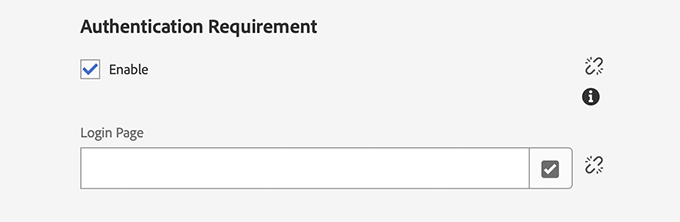
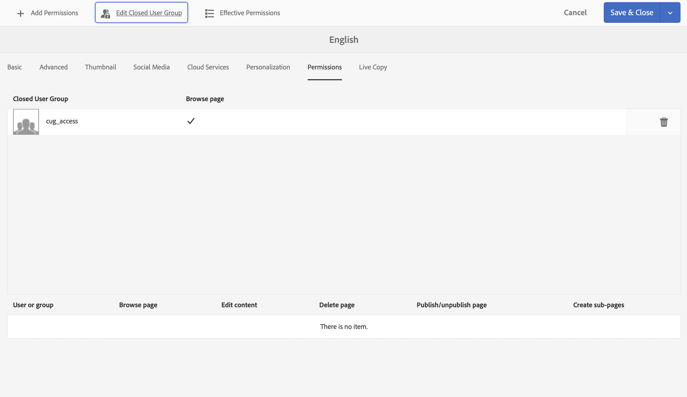

# Skapa en stängd användargrupp{#creating-a-closed-user-group}

Stängda användargrupper (CUG) används för att begränsa åtkomst till specifika sidor som finns på en publicerad webbplats. Sådana sidor kräver att de tilldelade medlemmarna loggar in och anger säkerhetsuppgifter.

Om du vill konfigurera ett sådant område på din webbplats:

* [skapa den faktiska stängda användargruppen och tilldela medlemmar](#creating-the-user-group-to-be-used).

* [använd den här gruppen på de obligatoriska sidorna](#applying-your-closed-user-group-to-content-pages) och välj (eller skapa) inloggningssidan som ska användas av medlemmarna i CUG; anges också när en CUG används på en innehållssida.

* [skapa en länk, av någon form, till minst en sida inom det skyddade området](#linking-to-the-cug-pages), annars visas den inte.

* [konfigurera Dispatcher](#configure-dispatcher-for-cugs) om den används.

>[!CAUTION]
>
>Stängda användargrupper (CUG) bör alltid skapas med prestandahänsyn i åtanke.
>
>Även om antalet användare och grupper i en CUG inte är begränsat, kan ett stort antal CUG-filer på en sida försämra återgivningsprestanda.
>
>Effekten av användargränssnitten bör alltid beaktas vid prestandatestning.

## Skapa användargruppen som ska användas {#creating-the-user-group-to-be-used}

Så här skapar du en sluten användargrupp:

1. Gå till **Verktyg - Dokumentskydd** från AEM hemskärm.

   >[!NOTE]
   >
   >Mer information om hur du skapar och konfigurerar användare och grupper finns i [Hantera användare och grupper](/help/sites-administering/security.md#managing-users-and-groups).

1. Välj kortet **Grupper** på nästa skärm.

   

1. Tryck på knappen **Skapa** i det övre högra hörnet för att skapa en grupp.
1. Ge den nya gruppen ett namn, till exempel `cug_access`.

   

1. Gå till fliken **Medlemmar** och tilldela de användare som krävs till den här gruppen.

   

1. Aktivera alla användare som du har tilldelat din CUG, i det här fallet alla medlemmar i `cug_access`.
1. Aktivera den stängda användargruppen så att den är tillgänglig i publiceringsmiljön, i det här exemplet `cug_access`.

## Använda din stängda användargrupp på innehållssidor {#applying-your-closed-user-group-to-content-pages}

Så här använder du CUG-filen på en sida eller sidor:

1. Navigera till rotsidan för det begränsade avsnitt som du vill tilldela din CUG.
1. Markera sidan genom att klicka på dess miniatyrbild och sedan välja **Egenskaper** i det övre verktygsfältet.

   

1. Öppna fliken **Avancerat** i följande fönster.

1. Bläddra ned till avsnittet **Autentiseringskrav**.

   1. Aktivera kryssrutan **Aktivera**.

   1. Lägg till sökvägen till din **inloggningssida**.
Detta är valfritt, om det lämnas tomt används standardinloggningssidan.

   

1. Gå sedan till fliken **Behörigheter** och välj **Redigera stängd användargrupp**.

   

   >[!NOTE]
   >
   >CUG-filer på fliken Behörigheter kan inte rullas ut till Live-kopior från utkast. Planera runt detta när du konfigurerar Live Copy.
   >
   >Mer information finns i [Stängda användargrupper i AEM - LiveCycle](closed-user-groups.md#aem-livecopy).

1. Dialogrutan **Redigera stängd användargrupp** öppnas. Här kan du söka efter och markera din CUG och sedan bekräfta gruppmarkeringen med **Spara**.

   Gruppen läggs till i listan, till exempel gruppen **cug_access**.

   

1. Bekräfta ändringarna med **Spara och stäng**.

>[!NOTE]
>
>Information om profiler i publiceringsmiljön och formulär för inloggning och utloggning finns i [Identity Management](/help/sites-administering/identity-management.md).

## Länka till CUG-sidor {#linking-to-the-cug-pages}

Eftersom målet för länkarna till CUG-sidorna inte är synligt för den anonyma användaren kommer länkkontrollen att ta bort sådana länkar.

För att undvika detta bör du skapa oskyddade omdirigeringssidor som pekar mot sidor i CUG-området. Navigeringsposterna återges sedan utan att länkkontrollen orsakar några problem. Det är bara när användaren faktiskt kommer åt omdirigeringssidan som omdirigeras inuti CUG-området, efter att inloggningsuppgifterna har angetts.

## Konfigurera Dispatcher för CUG {#configure-dispatcher-for-cugs}

Om du använder Dispatcher måste du definiera en Dispatcher-servergrupp med följande egenskaper:

* [virtualhosts](https://experienceleague.adobe.com/docs/experience-manager-dispatcher/using/configuring/dispatcher-configuration.html?lang=sv-SE#identifying-virtual-hosts-virtualhosts): Matchar sökvägen till sidorna som CUG gäller för.
* \sessionshantering: se nedan.
* [cache](https://experienceleague.adobe.com/docs/experience-manager-dispatcher/using/configuring/dispatcher-configuration.html?lang=sv-SE#configuring-the-dispatcher-cache-cache): En cachekatalog som är dedikerad till de filer som CUG gäller för.

### Konfigurera Dispatcher sessionshantering för CUG:er {#configuring-dispatcher-session-management-for-cugs}

Konfigurera [sessionshantering i dispatcher.alla filer](https://experienceleague.adobe.com/docs/experience-manager-dispatcher/using/configuring/dispatcher-configuration.html?lang=sv-SE#enabling-secure-sessions-sessionmanagement) för CUG-filen. Den autentiseringshanterare som används när åtkomst begärs för CUG-sidor avgör hur du konfigurerar sessionshanteringen.

```xml
/sessionmanagement
    ...
    /header "Cookie:login-token"
    ...
```

>[!NOTE]
>
>När en Dispatcher-servergrupp har sessionshantering aktiverat cachelagras inte alla sidor som servergruppen hanterar. Om du vill cachelagra sidor som ligger utanför CUG skapar du en andra grupp i dispatcher.any
>som hanterar icke-CUG-sidor.

1. Konfigurera [/sessionmanagement](https://experienceleague.adobe.com/docs/experience-manager-dispatcher/using/configuring/dispatcher-configuration.html?lang=sv-SE#enabling-secure-sessions-sessionmanagement) genom att definiera `/directory`, till exempel:

   ```xml
   /sessionmanagement
     {
     /directory "/usr/local/apache/.sessions"
     ...
     }
   ```

1. Ange [/allowAuthorized](https://experienceleague.adobe.com/docs/experience-manager-dispatcher/using/configuring/dispatcher-configuration.html?lang=sv-SE#caching-when-authentication-is-used) till `0`.
