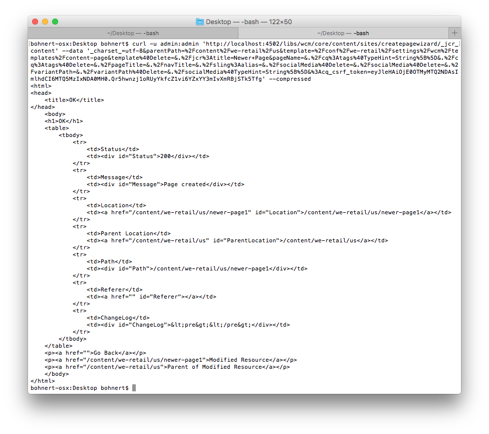

# Använda cURL med AEM{#using-curl-with-aem}

Administratörer behöver ofta automatisera eller förenkla vanliga uppgifter inom alla system. I AEM är till exempel hantering av användare, installation av paket och hantering av OSGi-paket uppgifter som måste utföras ofta.

På grund av Sling-ramverkets RESTful-karaktär, som AEM bygger på, kan de flesta åtgärder minskas till ett URL-anrop. cURL kan användas för att köra sådana URL-anrop och kan vara ett användbart verktyg för AEM-administratörer.

## Vad är cURL? {#what-is-curl}

cURL är ett kommandoradsverktyg med öppen källkod som används för att utföra URL-ändringar. Den stöder ett brett spektrum av Internetprotokoll, inklusive HTTP, HTTPS, FTP, FTPS, SCP, SFTP, TFTP, LDAP, DAP, DICT, TELNET, FILE, IMAP, POP3, SMTP och RTSP.

cURL är ett väletablerat och allmänt använt verktyg för att hämta och skicka data med URL-syntaxen och släpptes ursprungligen 1997. Namnet cURL innebar ursprungligen &quot;se URL&quot;.

På grund av Sling-ramverkets RESTful-karaktär, som AEM bygger på, kan de flesta åtgärder minskas till ett URL-anrop, som kan köras med cURL. [Innehållsändringsuppgifter](/help/sites-administering/curl.md#common-content-manipulation-aem-curl-commands) som att aktivera sidor och starta arbetsflöden samt [operativa uppgifter](/help/sites-administering/curl.md#common-operational-aem-curl-commands) som pakethantering och hantering av användare kan automatiseras med cURL. Dessutom kan du [skapa egna cURL](/help/sites-administering/curl.md#building-a-curl-ready-aem-command) -kommandon för de flesta åtgärder i AEM.

>[!NOTE]
>
>Alla AEM-kommandon som utförs via cURL måste auktoriseras precis som alla användare till AEM. Alla åtkomstkontrollistor och åtkomsträttigheter respekteras när cURL används för att köra ett AEM-kommando.

## Hämtar cURL {#downloading-curl}

cURL är en standarddel i macOS och vissa Linux-miljöer. Det finns dock för de flesta operativsystem. De senaste nedladdningarna finns på [https://curl.haxx.se/download.html](https://curl.haxx.se/download.html).

Källdatabasen för cURL finns även på GitHub.

## Skapa ett cURL-klart AEM-kommando {#building-a-curl-ready-aem-command}

cURL-kommandon kan byggas för de flesta åtgärder i AEM, till exempel för att utlösa arbetsflöden, kontrollera OSGi-konfigurationer, utlösa JMX-kommandon, skapa replikeringsagenter och mycket annat.

Om du vill hitta exakt det kommando som du behöver för en viss åtgärd måste du använda utvecklarverktygen i webbläsaren för att hämta POST-anropet till servern när du kör AEM-kommandot.

I följande steg beskrivs hur du gör detta genom att skapa en ny sida i webbläsaren Chrome.

1. Förbered den åtgärd du vill anropa i AEM. I det här fallet har vi gått till slutet av guiden **Skapa sida** , men ännu inte klickat på **Skapa**.

   

1. Starta utvecklingsverktygen och välj fliken **Nätverk** . Klicka på alternativet **Bevara logg** innan du rensar konsolen.

   

1. Klicka på **Skapa** i guiden **Skapa sida** för att skapa arbetsflödet.
1. Högerklicka på den resulterande POST-åtgärden och välj **Kopiera** -> **Kopiera som cURL**.

   

1. Kopiera kommandot cURL till ett textredigeringsprogram och ta bort alla rubriker från kommandot, som börjar med `-H` (markeras med blå i bilden nedan) och lägger till rätt autentiseringsparameter, till exempel `-u admin:admin`.

   

1. Kör kommandot cURL via kommandoraden och visa svaret.

   

## Vanliga AEM cURL-kommandon {#common-operational-aem-curl-commands}

Här är en lista med AEM cURL-kommandon för vanliga administrativa och operativa uppgifter.

>[!NOTE]
>
>I följande exempel antas att AEM körs på `localhost` en port `4502` och att användaren `admin` använder lösenordet `admin`. Ytterligare kommandoplatshållare anges inom vinkelparenteser.

### Pakethantering {#package-management}

#### Skapa ett paket {#create-a-package}

```shell
curl -u admin:admin -X POST http://localhost:4502/crx/packmgr/service/.json/etc/packages/mycontent.zip?cmd=create -d packageName=<name> -d groupName=<name>
```

#### Förhandsgranska ett paket {#preview-a-package}

```shell
curl -u admin:admin -X POST http://localhost:4502/crx/packmgr/service/.json/etc/packages/mycontent.zip?cmd=preview
```

#### Innehåll i listpaket {#list-package-content}

```shell
curl -u admin:admin -X POST http://localhost:4502/crx/packmgr/service/console.html/etc/packages/mycontent.zip?cmd=contents
```

#### Skapa ett paket {#build-a-package}

```shell
curl -X POST http://localhost:4502/crx/packmgr/service/.json/etc/packages/mycontent.zip?cmd=build
```

#### Radbryt ett paket {#rewrap-a-package}

```shell
curl -u admin:admin -X POST http://localhost:4502/crx/packmgr/service/.json/etc/packages/mycontent.zip?cmd=rewrap
```

#### Byta namn på ett paket {#rename-a-package}

```shell
curl -u admin:admin -X POST -Fname=<New Name> http://localhost:4502/etc/packages/<Group Name>/<Package Name>.zip/jcr:content/vlt:definition
```

#### Överföra ett paket {#upload-a-package}

```shell
curl -u admin:admin -F cmd=upload -F force=true -F package=@test.zip http://localhost:4502/crx/packmgr/service/.json
```

#### Installera ett paket {#install-a-package}

```shell
curl -u admin:admin -F cmd=install http://localhost:4502/crx/packmgr/service/.json/etc/packages/my_packages/test.zip
```

#### Avinstallera ett paket {#uninstall-a-package}

```shell
curl -u admin:admin -F cmd=uninstall http://localhost:4502/crx/packmgr/service/.json/etc/packages/my_packages/test.zip
```

#### Ta bort ett paket {#delete-a-package}

```shell
curl -u admin:admin -F cmd=delete http://localhost:4502/crx/packmgr/service/.json/etc/packages/my_packages/test.zip
```

#### Hämta ett paket {#download-a-package}

```shell
curl -u admin:admin http://localhost:4502/etc/packages/my_packages/test.zip
```

### Användarhantering {#user-management}

#### Skapa en ny användare {#create-a-new-user}

```shell
curl -u admin:admin -FcreateUser= -FauthorizableId=hashim -Frep:password=hashim http://localhost:4502/libs/granite/security/post/authorizables
```

#### Skapa en ny grupp {#create-a-new-group}

```shell
curl -u admin:admin -FcreateGroup=group1 -FauthorizableId=testGroup1 http://localhost:4502/libs/granite/security/post/authorizables
```

#### Lägg till en egenskap för en befintlig användare {#add-a-property-to-an-existing-user}

```shell
curl -u admin:admin -Fprofile/age=25 http://localhost:4502/home/users/h/hashim.rw.html
```

#### Skapa en användare med en profil {#create-a-user-with-a-profile}

```shell
curl -u admin:admin -FcreateUser=testuser -FauthorizableId=hashimkhan -Frep:password=hashimkhan -Fprofile/gender=male http://localhost:4502/libs/granite/security/post/authorizables
```

#### Skapa en ny användare som medlem i en grupp {#create-a-new-user-as-a-member-of-a-group}

```shell
curl -u admin:admin -FcreateUser=testuser -FauthorizableId=testuser -Frep:password=abc123 -Fmembership=contributor http://localhost:4502/libs/granite/security/post/authorizables
```

#### Lägga till en användare i en grupp {#add-a-user-to-a-group}

```shell
curl -u admin:admin -FaddMembers=testuser1 http://localhost:4502/home/groups/t/testGroup.rw.html
```

#### Ta bort en användare från en grupp {#remove-a-user-from-a-group}

```shell
curl -u admin:admin -FremoveMembers=testuser1 http://localhost:4502/home/groups/t/testGroup.rw.html
```

#### Ange användarens gruppmedlemskap {#set-a-user-s-group-membership}

```shell
curl -u admin:admin -Fmembership=contributor -Fmembership=testgroup http://localhost:4502/home/users/t/testuser.rw.html
```

#### Ta bort en användare {#delete-a-user}

```shell
curl -u admin:admin -FdeleteAuthorizable= http://localhost:4502/home/users/t/testuser

```

#### Ta bort en grupp {#delete-a-group}

```shell
curl -u admin:admin -FdeleteAuthorizable= http://localhost:4502/home/groups/t/testGroup
```

### Säkerhetskopiering {#backup}

Mer information finns i [Säkerhetskopiera och återställ](/help/sites-administering/backup-and-restore.md#automating-aem-online-backup) .

### OSGi {#osgi}

#### Starta ett paket {#starting-a-bundle}

```shell
curl -u admin:admin -Faction=start http://localhost:4502/system/console/bundles/<bundle-name>
```

#### Stoppa ett paket {#stopping-a-bundle}

```shell
curl -u admin:admin -Faction=stop http://localhost:4502/system/console/bundles/<bundle-name>
```

### Dispatcher {#dispatcher}

#### Förvräng cachen {#invalidate-the-cache}

```shell
curl -H "CQ-Action: Activate" -H "CQ-Handle: /content/test-site/" -H "CQ-Path: /content/test-site/" -H "Content-Length: 0" -H "Content-Type: application/octet-stream" http://localhost:4502/dispatcher/invalidate.cache
```

#### Evict the Cache {#evict-the-cache}

```shell
curl -H "CQ-Action: Deactivate" -H "CQ-Handle: /content/test-site/" -H "CQ-Path: /content/test-site/" -H "Content-Length: 0" -H "Content-Type: application/octet-stream" http://localhost:4502/dispatcher/invalidate.cache
```

### Replikeringsagent {#replication-agent}

#### Kontrollera status för en agent {#check-the-status-of-an-agent}

```shell
curl -u admin:admin "http://localhost:4502/etc/replication/agents.author/publish/jcr:conten t.queue.json?agent=publish"
http://localhost:4502/etc/replication/agents.author/publish/jcr:content.queue.js on?agent=publish
```

#### Ta bort en agent {#delete-an-agent}

```shell
curl -X DELETE http://localhost:4502/etc/replication/agents.author/replication99 -u admin:admin
```

#### Skapa en agent {#create-an-agent}

```shell
curl -u admin:admin -F "jcr:primaryType=cq:Page" -F "jcr:content/jcr:title=new-replication" -F "jcr:content/sling:resourceType=/libs/cq/replication/components/agent" -F "jcr:content/template=/libs/cq/replication/templates/agent" -F "jcr:content/transportUri=http://localhost:4503/bin/receive?sling:authRequestLogin=1" -F "jcr:content/transportUser=admin" -F "jcr:content/transportPassword={DES}8aadb625ced91ac483390ebc10640cdf"http://localhost:4502/etc/replication/agents.author/replication99
```

#### Pausa en agent {#pause-an-agent}

```shell
curl -u admin:admin -F "cmd=pause" -F "name=publish"  http://localhost:4502/etc/replication/agents.author/publish/jcr:content.queue.js on
```

#### Rensa en agentkö {#clear-an-agent-queue}

```shell
curl -u admin:admin -F "cmd=clear" -F "name=publish"  http://localhost:4502/etc/replication/agents.author/publish/jcr:content.queue.js on
```

### Communities {#communities}

#### Tilldela och återkalla märken {#assign-and-revoke-badges}

Mer information finns i [Webbgruppsbedömning och emblem](/help/communities/implementing-scoring.md#assign-and-revoke-badges) .

Mer information finns i [Grundläggande om poäng och emblem](/help/communities/configure-scoring.md#example-setup) .

#### MSRP-omindexering {#msrp-reindexing}

Mer information finns i [MSRP - MongoDB-lagringsresursprovidern](/help/communities/msrp.md#running-msrp-reindex-tool-using-curl-command) .

### Dokumentskydd {#security}

#### Aktivera och inaktivera CRX DE Lite {#enabling-and-disabling-crx-de-lite}

Mer information finns i [Aktivera CRXDE Lite i AEM](/help/sites-administering/enabling-crxde-lite.md) .

### Skräpinsamling för datalager {#data-store-garbage-collection}

Mer information finns i [Data Store-skräpinsamlingen](/help/sites-administering/data-store-garbage-collection.md#automating-data-store-garbage-collection) .

### Analys och målintegrering {#analytics-and-target-integration}

Mer information finns [i avsnittet om att välja till Adobe Analytics och Adobe Target](/help/sites-administering/opt-in.md#configuring-the-setup-and-provisioning-via-script) .

### Enkel inloggning {#single-sign-on}

#### Skicka testhuvud {#send-test-header}

Mer information finns i [Enkel inloggning](/help/sites-deploying/single-sign-on.md) .

## AEM cURL-kommandon för Common Content Manipulation {#common-content-manipulation-aem-curl-commands}

Här är en lista med AEM cURL-kommandon för innehållsändring.

>[!NOTE]
>
>I följande exempel antas att AEM körs på `localhost` en port `4502` och att användaren `admin` använder lösenordet `admin`. Ytterligare kommandoplatshållare anges inom vinkelparenteser.

### Sidhantering {#page-management}

#### Sidaktivering {#page-activation}

```shell
curl -u admin:admin -X POST -F path="/content/path/to/page" -F cmd="activate" http://localhost:4502/bin/replicate.json
```

#### Inaktivering av sida {#page-deactivation}

```shell
curl -u admin:admin -X POST -F path="/content/path/to/page" -F cmd="deactivate" http://localhost:4502/bin/replicate.json
```

#### Aktivering av träd {#tree-activation}

```shell
curl -u admin:admin -F cmd=activate -F ignoredeactivated=true -F onlymodified=true -F path=/content/geometrixx http://localhost:4502/etc/replication/treeactivation.html
```

#### Lås sida {#lock-page}

```shell
curl -u admin:admin -X POST -F cmd="lockPage" -F path="/content/path/to/page" -F "_charset_"="utf-8" http://localhost:4502/bin/wcmcommand
```

#### Lås upp sida {#unlock-page}

```shell
curl -u admin:admin -X POST -F cmd="unlockPage" -F path="/content/path/to/page" -F "_charset_"="utf-8" http://localhost:4502/bin/wcmcommand
```

#### Kopiera sida {#copy-page}

```shell
curl -u admin:admin -F cmd=copyPage -F destParentPath=/path/to/destination/parent -F srcPath=/path/to/source/location http://localhost:4502/bin/wcmcommand
```

### Arbetsflöden {#workflows}

Mer information finns i [Interagera med arbetsflöden programmatiskt](/help/sites-developing/workflows-program-interaction.md) .

### Sling Content {#sling-content}

#### Skapa en mapp {#create-a-folder}

```shell
curl -u admin:admin -F jcr:primaryType=sling:Folder http://localhost:4502/etc/test
```

#### Ta bort en nod {#delete-a-node}

```shell
curl -u admin:admin -F :operation=delete http://localhost:4502/etc/test/test.properties
```

#### Flytta en nod {#move-a-node}

```shell
curl -u admin:admin -F":operation=move" -F":applyTo=/sourceurl"  -F":dest=/target/parenturl/" https://localhost:4502/content
```

#### Kopiera en nod {#copy-a-node}

```shell
curl -u admin:admin -F":operation=copy" -F":applyTo=/sourceurl"  -F":dest=/target/parenturl/" https://localhost:4502/content
```

#### Överför filer med Sling PostServlet {#upload-files-using-sling-postservlet}

```shell
curl -u admin:admin -F"*=@test.properties"  http://localhost:4502/etc/test
```

#### Överför filer med Sling PostServlet och ange nodnamn {#upload-files-using-sling-postservlet-and-specifying-node-name}

```shell
curl -u admin:admin -F"test2.properties=@test.properties"  http://localhost:4502/etc/test
```

#### Överför filer som anger en innehållstyp {#upload-files-specifying-a-content-type}

```shell
curl -u admin:admin -F "*=@test.properties;type=text/plain" http://localhost:4502/etc/test
```

### Tillgångshantering {#asset-manipulation}

Mer information finns i [Assets HTTP API](/help/assets/mac-api-assets.md) .
