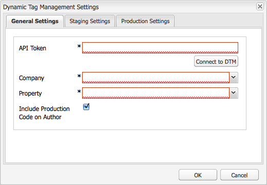

# Integrera med Adobe Dynamic Tag Management {#integrating-with-adobe-dynamic-tag-management}

Integrera [Adobe Dynamic Tag Management](https://www.adobe.com/solutions/digital-marketing/dynamic-tag-management.html) med AEM så att du kan använda dina dynamiska tagghanteringsegenskaper för att spåra AEM-webbplatser. Med Dynamic Tag Management kan marknadsförarna hantera taggar för datainsamling och distribuera data över digitala marknadsföringssystem. Använd till exempel Dynamic Tag Management för att samla in användningsdata för din AEM-webbplats och distribuera data för analys i Adobe Analytics eller Adobe Target.

Innan du kan integrera måste du skapa [webbegenskapen](https://microsite.omniture.com/t2/help/en_US/dtm/#Web_Properties) Dynamic Tag Management som spårar domänen för din AEM-webbplats. Webbegenskapens [värdalternativ](https://microsite.omniture.com/t2/help/en_US/dtm/#Hosting__Embed_Tab) måste konfigureras så att du kan konfigurera AEM så att du får tillgång till bibliotek för dynamisk tagghantering.

När du har konfigurerat integreringen behöver du inte ändra konfigurationen för dynamisk tagghantering i AEM om du ändrar distributionsverktygen och reglerna för dynamisk tagghantering. Ändringarna är automatiskt tillgängliga för AEM.

>[!NOTE]
>
>Om du använder DTM med en anpassad proxykonfiguration måste du konfigurera båda HTTP-klientproxykonfigurationerna eftersom vissa funktioner i AEM använder 3.x-API:erna och andra 4.x-API:er:
>
>* 3.x är konfigurerat med [http://localhost:4502/system/console/configMgr/com.day.commons.httpclient](http://localhost:4502/system/console/configMgr/com.day.commons.httpclient)
>* 4.x är konfigurerat med [http://localhost:4502/system/console/configMgr/org.apache.http.proxyconfigurator](http://localhost:4502/system/console/configMgr/org.apache.http.proxyconfigurator)
>

## Distributionsalternativ {#deployment-options}

Följande distributionsalternativ påverkar konfigurationen av integreringen med dynamisk tagghantering.

### Dynamisk tagghantering som värd {#dynamic-tag-management-hosting}

AEM har stöd för dynamisk tagghantering som lagras i molnet eller som lagras på AEM.

* Molnbaserad: JavaScript-biblioteken för dynamisk tagghantering lagras i molnet och dina AEM-sidor refererar direkt till dem.
* AEM-värd: Dynamic Tag Management genererar javascript-bibliotek. AEM använder en arbetsflödesmodell för att hämta och installera biblioteken.

Vilken typ av värdtjänst implementeringen använder avgör vilka konfigurations- och implementeringsuppgifter du utför. Mer information om värdalternativ finns i [Hosting - Embed Tab](https://microsite.omniture.com/t2/help/en_US/dtm/#Hosting__Embed_Tab) (Hosting - Bädda in flik) i hjälpen för dynamisk tagghantering.

### Mellanlagrings- och produktionsbibliotek {#staging-and-production-library}

Bestäm om AEM-författarinstansen använder staging- eller produktionskoden för Dynamic Tag Management.

Vanligtvis använder din författarinstans mellanlagringsbiblioteken för dynamisk tagghantering, och produktionsinstansen använder produktionsbiblioteken. Med det här scenariot kan du använda författarinstansen för att testa konfigurationer för dynamisk tagghantering som inte är godkända.

Om du vill kan du använda produktionsbiblioteken i din författarinstans. Webbläsarplugin-program är tillgängliga som gör att du kan växla mellan att använda mellanlagringsbibliotek i testsyfte när biblioteken är molnbaserade.

### Använda driftsättningsfunktionen för dynamisk tagghantering {#using-the-dynamic-tag-management-deployment-hook}

När AEM är värd för biblioteken för dynamisk tagghantering kan du använda Dynamic Tag Management-distributionsguiden för att automatiskt skicka biblioteksuppdateringar till AEM. Biblioteksuppdateringar överförs när ändringar görs i biblioteken, till exempel när webbegenskaperna för dynamisk tagghantering redigeras.

Om du vill använda distributionslösningen måste Dynamic Tag Management kunna ansluta till den AEM-instans som är värd för biblioteken. Du måste [aktivera åtkomst till AEM](/help/sites-administering/dtm.md#enabling-access-for-the-deployment-hook-service) för de dynamiska tagghanteringsservrarna.

I vissa fall kan AEM vara ouppnåeligt, till exempel när AEM ligger bakom en brandvägg. I dessa fall kan du använda alternativet AEM-avsökningsimporterare för att regelbundet hämta biblioteken. Ett cron-jobbuttryck bestämmer schemat för bibliotekshämtning.

## Aktivera åtkomst för distributionsnätverkstjänsten {#enabling-access-for-the-deployment-hook-service}

Aktivera Dynamic Tag Management-distributionkroktjänsten för åtkomst till AEM så att tjänsten kan uppdatera AEM-värdbiblioteken. Ange IP-adressen till de Dynamic Tag Management-servrar som uppdaterar mellanlagrings- och produktionsbiblioteken efter behov:

* Mellanlagring: `107.21.99.31`
* Produktion: `23.23.225.112` och `204.236.240.48`

Utför konfigurationen med [webbkonsolen](/help/sites-deploying/configuring-osgi.md#osgi-configuration-with-the-web-console) eller en [`sling:OsgiConfig`](/help/sites-deploying/configuring-osgi.md#osgi-configuration-in-the-repository) nod:

* I webbkonsolen använder du objektet Adobe DTM Deploy Hook Configuration på konfigurationssidan.
* Tjänstens-PID är för en OSGi-konfiguration `com.adobe.cq.dtm.impl.servlets.DTMDeployHookServlet`.

I följande tabell beskrivs de egenskaper som ska konfigureras.

| Egenskapen Web Console | OSGi, egenskap | Beskrivning |
|---|---|---|
| Mellanlagring DTM IP - vit lista | `dtm.staging.ip.whitelist` | IP-adressen till den Dynamic Tag Management-server som uppdaterar mellanlagringsbiblioteken. |
| Vit lista för produktionsDTM IP | `dtm.production.ip.whitelist` | IP-adressen till den Dynamic Tag Management-server som uppdaterar produktionsbiblioteken. |

## Skapa konfigurationen för dynamisk tagghantering {#creating-the-dynamic-tag-management-configuration}

Skapa en molnkonfiguration så att AEM-instansen kan autentisera med dynamisk tagghantering och interagera med din webbegenskap.

>[!NOTE]
>
>Undvik att använda två spårningskoder för Adobe Analytics på era sidor när era DTM-webbegenskaper innehåller Adobe Analytics-verktyget och ni också använder [Content Insight](/help/sites-authoring/content-insights.md). I [Adobe Analytics-molnkonfigurationen](/help/sites-administering/adobeanalytics-connect.md#configuring-the-connection-to-adobe-analytics)väljer du alternativet Inkludera inte spårningskod.

### Allmänna inställningar {#general-settings}

<table>
 <tbody>
  <tr>
   <th>Egenskap</th>
   <th>Beskrivning</th>
  </tr>
  <tr>
   <td>API-token</td>
   <td>Värdet på API-tokenegenskapen för ditt användarkonto för dynamisk tagghantering. AEM använder den här egenskapen för att autentisera med dynamisk tagghantering.</td>
  </tr>
  <tr>
   <td>Företag</td>
   <td>Det företag som ditt inloggnings-ID är kopplat till.</td>
  </tr>
  <tr>
   <td>Egenskap</td>
   <td>Namnet på webbegenskapen som du skapade för att hantera taggarna för din AEM-webbplats.</td>
  </tr>
  <tr>
   <td>Inkludera produktionskod på författare</td>
   <td>
Välj det här alternativet om du vill att AEM-författaren och de publicerade instanserna ska använda produktionsversionen av Dynamic Tag Management-biblioteken. 
 
När det här alternativet inte är markerat används mellanlagringsinställningarna för författarinstansen och produktionsinställningarna gäller för publiceringsinstansen.
 </td>
  </tr>
 </tbody>
</table>

### Egenskaper för värdtjänster - förproduktion och produktion {#self-hosting-properties-staging-and-production}

Följande egenskaper i konfigurationen för dynamisk tagghantering gör att AEM kan vara värd för biblioteken för dynamisk tagghantering. Med egenskaperna kan AEM hämta och installera biblioteken. Om du vill kan du automatiskt uppdatera biblioteken så att de återspeglar ändringar som gjorts i hanteringsprogrammet för dynamiska taggar.

Vissa egenskaper använder värden som du får från avsnittet Bibliotekshämtning på fliken Bädda in för din dynamiska tagghanteringsegenskap. Mer information finns i [Bibliotekshämtning](https://microsite.omniture.com/t2/help/en_US/dtm/#Library_Download) i hjälpen för dynamisk tagghantering.

>[!NOTE]
>
>När du är värd för paketet för dynamisk tagghantering på AEM måste bibliotekshämtning vara aktiverat i Dynamic Tag Management innan du skapar konfigurationen. Akamai måste också vara aktiverat eftersom Akamai innehåller bibliotek för hämtning.

När AEM är värd för bibliotek för dynamisk tagghantering på AEM konfigurerar AEM automatiskt vissa egenskaper av webbegenskapen enligt din konfiguration. Se beskrivningarna i följande tabell.

<table>
 <tbody>
  <tr>
   <th>Egenskap</th>
   <th>Beskrivning</th>
  </tr>
  <tr>
   <td>Använd värdtjänst</td>
   <td>Välj när du är värd för biblioteksfilen för dynamisk tagghantering på AEM. Om du väljer det här alternativet visas de andra egenskaperna i tabellen.</td>
  </tr>
  <tr>
   <td>DTM-paket-URL</td>
   <td>Den URL som ska användas för att hämta biblioteket för dynamisk tagghantering. Hämta det här värdet från avsnittet Hämta URL:er på sidan Bibliotekshämtning i Dynamic Tag Management. Av säkerhetsskäl måste det här värdet konfigureras manuellt.</td>
  </tr>
  <tr>
   <td>Hämta arbetsflöde</td>
   <td>
Arbetsflödesmodellen som ska användas för att hämta och installera biblioteket för dynamisk tagghantering. Standardmodellen är DTM Bundle Download. Använd den här modellen om du inte har skapat en anpassad modell.
 
Observera att standardarbetsflödet för hämtning automatiskt aktiverar biblioteken när de hämtas.
 </td>
  </tr>
  <tr>
   <td>Domäntips</td>
   <td>
(Valfritt) Domänen för den AEM-server som är värd för biblioteket för dynamisk tagghantering. Ange ett värde som åsidosätter standarddomänen som är konfigurerad för tjänsten <a href="/help/sites-developing/externalizer.md">CQ Link Externalizer för</a>dagen.
 
När AEM är anslutet till Dynamic Tag Management används det här värdet för att konfigurera mellanlagrings-HTTP-sökvägen eller Production HTTP-sökvägen för bibliotekets hämtningsegenskaper för webbegenskapen Dynamic Tag Management.
 </td>
  </tr>
  <tr>
   <td>Tips för säker domän</td>
   <td>
(Valfritt) Domänen för den AEM-server som är värd för biblioteket för dynamisk tagghantering via HTTPS. Ange ett värde som åsidosätter standarddomänen som är konfigurerad för tjänsten <a href="/help/sites-developing/externalizer.md">CQ Link Externalizer för</a>dagen.
 
När AEM är anslutet till dynamisk tagghantering används det här värdet för att konfigurera HTTPS-sökvägen för mellanlagring eller HTTPS-sökvägen för hämtningsegenskaperna för bibliotek för webbegenskapen Dynamic Tag Management.
 </td>
  </tr>
  <tr>
   <td>Delad hemlighet</td>
   <td>
(Valfritt) Den delade hemlighet som ska användas för dekryptering av nedladdningen. Hämta det här värdet från fältet Delad hemlighet på sidan Bibliotekshämtning i Dynamic Tag Management.
 
<strong></strong> Obs! Du måste ha <a href="https://www.openssl.org/docs/apps/openssl.html">OpenSSL</a> -biblioteken installerade på datorn där AEM är installerat så att AEM kan dekryptera de hämtade biblioteken.
 </td>
  </tr>
  <tr>
   <td>Aktivera avsökningsimporteraren</td>
   <td>
(Valfritt) Välj att regelbundet hämta och installera biblioteket för dynamisk tagghantering för att vara säker på att du använder en uppdaterad version. När det här alternativet är markerat skickar inte Dynamic Tag Management HTTP POST-begäranden till Deploy Hook-URL:en.
 
AEM konfigurerar automatiskt URL-egenskapen Deploy Hook för egenskaperna Library Download för webbegenskapen Dynamic Tag Management. När du väljer det här alternativet konfigureras egenskapen utan värde. Om du inte väljer det här alternativet konfigureras egenskapen med URL:en för din konfiguration för dynamisk tagghantering.
 
Aktivera avsökningsimporteraren när den dynamiska tagghanteringsfunktionen inte kan ansluta till AEM, till exempel när AEM ligger bakom en brandvägg.
 </td>
  </tr>
  <tr>
   <td>Schemauttryck</td>
   <td>(Visas och krävs när Aktivera avsökningsimporterare är markerat.) Ett cron-uttryck som styr när de dynamiska tagghanteringsbiblioteken hämtas.</td>
  </tr>
 </tbody>
</table>

### Egenskaper för molntjänster - förproduktion och produktion {#cloud-hosting-properties-staging-and-production}

Du konfigurerar följande egenskaper för din konfiguration för dynamisk tagghantering när dynamisk tagkonfiguration är molnbaserad.

<table>
 <tbody>
  <tr>
   <th>Egenskap</th>
   <th>Beskrivning</th>
  </tr>
  <tr>
   <td>Använd värdtjänst</td>
   <td>Avmarkera det här alternativet när biblioteksfilen för dynamisk tagghantering finns i molnet.</td>
  </tr>
  <tr>
   <td>Huvudkod</td>
   <td>
Huvudkoden för mellanlagring som hämtas från Dynamic Tag Management för värden. Det här värdet fylls i automatiskt när du ansluter till dynamisk tagghantering.
 
 Om du vill visa koden i Dynamic Tag Management klickar du på fliken Bädda in och sedan på värdnamnet. Expandera sektionen Huvudkod och klicka på Kopiera inbäddningskod för mellanlagringsinbäddningskod eller området Produktionsinbäddningskod efter behov.
 </td>
  </tr>
  <tr>
   <td>Sidfotskod</td>
   <td>
Sidfotskoden för mellanlagring som hämtas från Dynamic Tag Management för värden. Det här värdet fylls i automatiskt när du ansluter till dynamisk tagghantering.
 
Om du vill visa koden i Dynamic Tag Management klickar du på fliken Bädda in och sedan på värdnamnet. Expandera sidfotskoden och klicka på Kopiera inbäddningskod för mellanlagringsinbäddningskod eller området Produktionsinbäddningskod efter behov.
 </td>
  </tr>
 </tbody>
</table>

I följande procedur används det pekoptimerade användargränssnittet för att konfigurera integreringen med dynamisk tagghantering.

1. Klicka på Verktyg > Åtgärder > Cloud > Cloud-tjänster.
1. I området för dynamisk tagghantering visas en av följande länkar för att lägga till en konfiguration:

   * Klicka på Konfigurera nu om det här är den första konfigurationen som du lägger till.
   * Klicka på Visa konfigurationer och klicka sedan på länken + bredvid Tillgängliga konfigurationer om en eller flera konfigurationer har skapats.
   

1. Ange en rubrik för konfigurationen och klicka sedan på Skapa.
1. I fältet API-token anger du värdet för API-tokenegenskapen för ditt Dynamic Tag Management-användarkonto.

   Kontakta DTM Client Care för att få API-tokenvärdet.

   >[!NOTE]
   >
   >API-token upphör inte att gälla förrän den dynamiska tagghanteringsanvändaren uttryckligen begär det.

   

1. Klicka på Anslut till DTM. AEM autentiserar med Dynamic Tag Management och hämtar listan över företag som ditt konto är kopplat till.
1. Markera företaget och välj sedan den egenskap som du använder för att spåra din AEM-webbplats.
1. Om du använder mellanlagringskod på författarinstansen avmarkerar du Inkludera produktionskod på författare.
1. Ange värden för egenskaperna på fliken Mellanlagringsinställningar och på fliken Produktionsinställningar om det behövs. Klicka sedan på OK.

## Hämta det dynamiska tagghanteringsbiblioteket manuellt {#manually-downloading-the-dynamic-tag-management-library}

Hämta bibliotek för dynamisk tagghantering manuellt för att omedelbart uppdatera dem på AEM. Du kan till exempel hämta manuellt när du vill testa ett uppdaterat bibliotek innan avsökningsimporteraren är schemalagd att hämta biblioteket automatiskt.

1. Klicka på Verktyg > Åtgärder > Cloud > Cloud-tjänster.
1. Klicka på Visa konfigurationer i området Dynamisk tagghantering och klicka sedan på konfigurationen.
1. Klicka på knappen Trigger Download Workflow (Utlös hämtning av arbetsflöde) i området för mellanlagringsinställningar eller i området för produktionsinställningar för att hämta och distribuera bibliotekspaketet.

   

>[!NOTE]
>
>De hämtade filerna lagras under `/etc/clientlibs/dtm/my config/companyID/propertyID/servertype`.
>
>Följande hämtas direkt från din [DTM-konfiguration](#creating-the-dynamic-tag-management-configuration).
>
>* `myconfig`
>* `companyID`
>* `propertyID`
>* `servertype`
>

## Koppla en dynamisk tagghanteringskonfiguration till din plats {#associating-a-dynamic-tag-management-configuration-with-your-site}

Koppla din konfiguration för dynamisk tagghantering till sidorna på din webbplats så att AEM lägger till det nödvändiga skriptet på sidorna. Associera platsens rotsida med konfigurationen. Alla underordnade till den sidan ärver kopplingen. Om det behövs kan du åsidosätta associationen på en underordnad sida.

Använd följande procedur för att associera en sida och de underordnade med en dynamisk tagghanteringskonfiguration.

1. Öppna webbplatsens rotsida i det klassiska användargränssnittet.
1. Använd Sidekick för att öppna sidegenskaperna.
1. Klicka på Lägg till tjänst på fliken Molntjänster, välj Dynamisk tagghantering och klicka sedan på OK.

   

1. Använd listrutan Dynamisk tagghantering för att välja konfigurationen och klicka sedan på OK.

Använd följande procedur för att åsidosätta den ärvda konfigurationsassociationen för en sida. Åsidosättningen påverkar sidan och alla underordnade sidor.

1. Öppna sidan i det klassiska användargränssnittet.
1. Använd Sidekick för att öppna sidegenskaperna.
1. På fliken Molntjänster klickar du på hänglåsikonen bredvid egenskapen Ärvd från och sedan på Ja i bekräftelsedialogrutan.

   

1. Ta bort eller välj en annan dynamisk tagghanteringskonfiguration och klicka sedan på OK.

