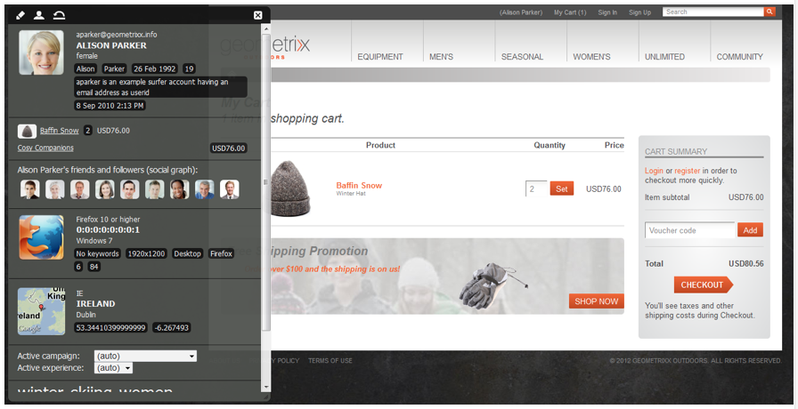

# eCommerce{#ecommerce}

* [Concepts](/help/sites-administering/concepts.md)
* [Administrering (allmän)](/help/sites-administering/generic.md)

Adobe tillhandahåller två versioner av Commerce Integration Framework:

<table>
 <tbody>
  <tr>
   <th>
 
 </th>
   <th>
CIF lokal
 </th>
   <th>
CIF Cloud
 </th>
  </tr>
  <tr>
   <td>
AEM-versioner som stöds
 </td>
   <td>
AEM on-prem eller AMS 6.x
 </td>
   <td>AEM AMS 6.4 och 6.5</td>
  </tr>
  <tr>
   <td>
Back-end
 </td>
   <td>
    <ul>
     <li>AEM, Java</li>
     <li>Monolitisk integrering, mappning före bygge (mall)</li>
     <li>JCR-databas</li>
    </ul> </td>
   <td>
    <ul>
     <li>Magento</li>
     <li>Java &amp; Javascript</li>
     <li>Inga e-handelsdata lagras i JCR-databasen</li>
    </ul> </td>
  </tr>
  <tr>
   <td>
Front-end
 </td>
   <td>
Återgivna sidor på AEM-serversidan
 </td>
   <td>Blandat sidprogram (hybridåtergivning)</td>
  </tr>
  <tr>
   <td>
Produktkatalog
 </td>
   <td>
    <ul>
     <li>Produktimporterare, redigerare, cachelagring i AEM</li>
     <li>Vanliga kataloger med AEM- eller proxysidor</li>
    </ul> </td>
   <td>
    <ul>
     <li>Ingen produktimport</li>
     <li>Allmänna mallar</li>
     <li>On demand-data via anslutning</li>
    </ul> </td>
  </tr>
  <tr>
   <td>
Skalbarhet
 </td>
   <td>
    <ul>
     <li>Kan stödja upp till ett fåtal miljoner produkter (beroende på användningsfall)</li>
     <li>Cachelagring av Dispatcher</li>
    </ul> </td>
   <td>
    <ul>
     <li>Ingen volymbegränsning</li>
     <li>Cachelagring av Dispatcher eller CDN</li>
    </ul> </td>
  </tr>
  <tr>
   <td>Standardiserad datamodell</td>
   <td>Nej</td>
   <td>Ja, Magento GraphQL schema</td>
  </tr>
  <tr>
   <td>Tillgänglighet</td>
   <td>
Ja. SAP Commerce Cloud (tillägget har uppdaterats med stöd för AEM 6.4 och Hybris 5 (standard) och bibehåller kompatibiliteten med Hybris 4
 
Salesforce Commerce Cloud (Connector öppen källkod för stöd av AEM 6.4)
 </td>
   <td>Ja via öppen källkod via GitHub. Magento Commerce (stöder Magento 2.3.2 (standard) och är kompatibel med Magento 2.3.1).</td>
  </tr>
  <tr>
   <td>När ska användas</td>
   <td>Begränsad användning: Exempel: där små, statiska kataloger kan behöva importeras</td>
   <td>Rekommenderad lösning i de flesta fall</td>
  </tr>
 </tbody>
</table>

eCommerce hanterar tillsammans med Product Information Management (PIM) verksamheten på en webbplats som är inriktad på att sälja produkter via en webbutik:

* En produkts generering, livstid och föråldring
* Prishantering
* Transaktionshantering
* Hantering av hela kataloger
* Live och centraliserad lagringspost
* Webbgränssnitt

AEM eCommerce hjälper marknadsförare att leverera varumärkesanpassade, personaliserade shoppingupplevelser över webben, mobiler och sociala kontaktytor. I AEM-redigeringsmiljön kan du anpassa sidor och komponenter baserat på målgruppskontext och försäljningsstrategier. till exempel:

* Produktsidor
* Kundvagnskomponenter
* Utcheckningskomponenter

Implementeringen ger åtkomst i realtid till produktinformation. Detta kan användas för att framtvinga:

* Produktinformationsintegritet
* Priser
* Lager
* Variationer i kundvagnens status

>[!NOTE]
>
>Om du vill använda integreringsramverket med externa e-handelsleverantörer måste du först installera de paket som krävs. Mer information finns i [Distribuera e-handel](/help/sites-deploying/ecommerce.md).
>
>Mer information om hur du utökar e-handelsfunktionerna finns i [Utveckla e-handel](/help/sites-developing/ecommerce.md).

## Huvudfunktioner {#main-features}

AEM eCommerce erbjuder:

* Ett antal färdiga AEM- **komponenter** som visar vad du kan göra med ditt projekt:

   * Produktvisning
   * Kundvagn
   * Checka ut
   * Nyligen visade produkter
   * Vouchers
   * och andra
   

   >[!NOTE]
   >
   >Integreringsramverket som tillhandahålls av AEM gör det även möjligt att bygga ytterligare AEM-komponenter för handelsfunktioner oberoende av din specifika e-handelsmotor.

* **Sök** - med antingen:

   * AEM-sökningen
   * sökningen i e-handelssystemet
   * en tredje parts sökning (t.ex. Sök&amp;Befordra)
   * eller en kombination av dessa.
   

* Använder AEM-möjligheten för att **presentera ditt innehåll i flera kanaler**, oavsett om det är hela webbläsarfönstret eller en mobil enhet. Detta levererar innehållet i det format som besökarna behöver.

   

* Möjlighet att **utveckla er egen integreringsimplementering baserat på[AEM eCommerce-ramverket](#the-framework)**.

   De två implementeringar som är tillgängliga för närvarande är båda byggda på samma grund - utöver det allmänna API:t (ramverket). Implementering av en ny integrering innebär bara implementering av de funktioner som din integrering behöver. Front end-komponenter kan användas av alla nya implementeringar när de använder gränssnitt (så är oberoende av implementeringen).

* Möjligheten att utveckla **upplevelsestyrd e-handel baserat på kunddata och aktivitet**. På så sätt kan du förverkliga många scenarier:

   * Ett exempel kan vara minskade fraktkostnader när den totala ordern överstiger ett visst belopp.
   * Ett annat kan göra att du kan erbjuda säsongserbjudanden som använder profildata (t.ex. plats). Dessa kan sedan markeras ytterligare, beroende på andra faktorer vid behov.
   I exemplet nedan visas en teaser eftersom innehållet i vagnen är mindre än $75:

   

   Detta kan ändras när innehållet i kundvagnen överstiger $75:

   

* Och andra funktioner:

   * Kundvagnsinnehåll behålls mellan sessioner
   * Full orderhistorik
   * Express catalog update

## Ramverket {#the-framework}

Avsnittet [Concepts](/help/sites-administering/concepts.md) behandlar ramverket mer ingående, men i det följande ges en översikt över ramverket på hög nivå och med hög hastighet:

### Vad? {#what}

* Integreringsramverket innehåller API:t, en rad komponenter som illustrerar funktioner och flera tillägg som ger exempel på anslutningsmetoder.
* Ramverket innehåller den grundläggande struktur som krävs för en projektimplementering.
* Ramverket kan utökas.
* I ramverket finns ingen användbar och färdig webbplats. En viss del av utvecklingsarbetet behövs alltid för att anpassa ramverket till dina specifikationer.

### Varför? {#why}

* Att tillhandahålla de grundläggande mekanismer som behövs för att snabbt realisera en anpassad e-handelsplats.
* Tp ger den flexibilitet som krävs för att utveckla en e-handelsplats i verkligheten.
* Illustrera metodtips.