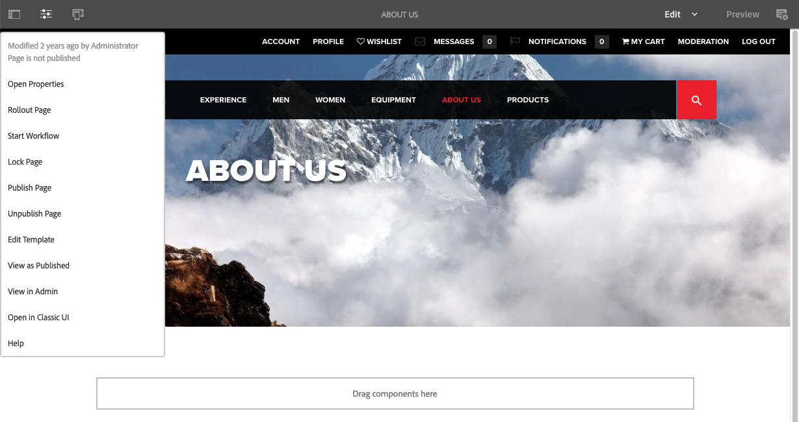

# Redigerare{#editor}

Som standard har möjligheten att växla till det klassiska användargränssnittet från redigeraren inaktiverats.

Följ de här stegen för att aktivera alternativet **Öppna i Classic-gränssnitt** på menyn **Sidinformation** igen.

1. Använd CRXDE Lite för att hitta följande nod:

   `/libs/wcm/core/content/editor/jcr:content/content/items/content/header/items/headerbar/items/pageinfopopover/items/list/items/classicui`

   Exempel

   ` [https://localhost:4502/crx/de/index.jsp#/libs/wcm/core/content/editor/jcr%3Acontent/content/items/content/header/items/headerbar/items/pageinfopopover/items/list/items/classicui](https://localhost:4502/crx/de/index.jsp#/libs/wcm/core/content/editor/jcr%3Acontent/content/items/content/header/items/headerbar/items/pageinfopopover/items/list/items/classicui)`

1. Skapa en övertäckning med alternativet **Överläggsnod** ; till exempel:

   * **Sökväg**: `/apps/wcm/core/content/editor/jcr:content/content/items/content/header/items/headerbar/items/pageinfopopover/items/list/items/classicui`
   * **Överläggsplats**: `/apps/`
   * **Matcha nodtyper**: aktiv (markera kryssrutan)

1. Lägg till följande text-egenskap med flera värden i den åsidosatta noden:

   `sling:hideProperties = ["granite:hidden"]`

1. Alternativet **Öppna i klassiskt gränssnitt** är igen tillgängligt på menyn **Sidinformation** när du redigerar sidor.

   