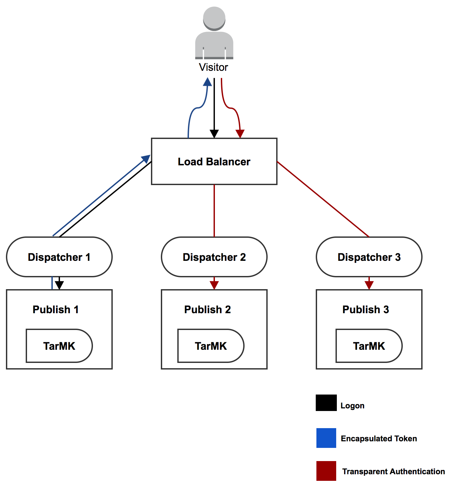

# Stöd för inkapslad token{#encapsulated-token-support}

## Introduktion {#introduction}

Som standard använder AEM hanteraren för tokenautentisering för att autentisera varje begäran. För att autentiseringsbegäranden ska kunna hanteras måste hanteraren för tokenautentisering ha åtkomst till databasen för varje begäran. Detta inträffar eftersom cookies används för att upprätthålla autentiseringstillståndet. Logiskt sett måste tillståndet sparas i databasen för att efterföljande begäranden ska kunna valideras. Detta innebär att autentiseringsmekanismen är tillståndskänslig.

Detta är särskilt viktigt för horisontell skalbarhet. I en konfiguration med flera instanser som den publiceringsgrupp som visas nedan kan belastningsutjämning inte uppnås på ett optimalt sätt. Med tillståndskänslig autentisering är det beständiga autentiseringstillståndet bara tillgängligt för den instans där användaren först autentiseras.

Ta följande scenario som exempel:

En användare kan vara autentiserad vid publiceringsinstans ett, men om en efterföljande begäran går till publiceringsinstans två, har instansen inte det beständiga autentiseringstillståndet eftersom det beständiga läget bestals i databasen för publicering en och publicering två har en egen databas.

Lösningen för detta är att konfigurera kladdiga anslutningar på belastningsutjämningsnivå. Med snäva kopplingar dirigeras användaren alltid till samma publiceringsinstans. Därför är en verkligt optimal lastbalansering inte möjlig.

Om en publiceringsinstans inte blir tillgänglig förlorar alla användare som autentiserats för den instansen sin session. Detta beror på att databasåtkomst krävs för att validera autentiseringscookien.

## Tillståndslös autentisering med den inkapslade token {#stateless-authentication-with-the-encapsulated-token}

Lösningen för horisontell skalbarhet är tillståndslös autentisering med hjälp av det nya stödet för kapslad token i AEM.

Encapsulated Token är en kryptografi som gör att AEM kan skapa och validera autentiseringsinformation offline på ett säkert sätt utan att behöva komma åt databasen. På så sätt kan en autentiseringsbegäran ske på alla publiceringsinstanser utan att några snäva anslutningar behövs. Det har också en fördel med att förbättra autentiseringsprestanda eftersom databasen inte behöver nås för varje autentiseringsbegäran.

Du kan se hur detta fungerar i en geografiskt distribuerad distribution med MongoMK-författare och StjärtMK-publiceringsinstanser nedan:

>[!NOTE]
>
>Observera att den inkapslade token handlar om autentisering. Den ser till att cookien kan valideras utan att du behöver komma åt databasen. Det är dock fortfarande nödvändigt att användaren finns i alla instanser och att informationen som lagras under den användaren kan nås av alla instanser.
>
>Om en ny användare till exempel skapas på publiceringsinstans nummer ett på grund av hur den inkapslade token fungerar, kommer den att autentiseras korrekt på publiceringsinstans nummer två. Om användaren inte finns i den andra publiceringsinstansen kommer begäran fortfarande inte att lyckas.

## Konfigurerar den inkapslade token {#configuring-the-encapsulated-token}

>[!NOTE]
>Alla autentiseringshanterare som synkroniserar användare och förlitar sig på tokenautentisering (som SAML och OAuth) fungerar bara med inkapslade tokens om:
>
>* Anteckningssessioner är aktiverade, eller
   >
   >
* Användare skapas redan i AEM när synkroniseringen startar. Detta innebär att inkapslade token inte stöds i situationer där hanterarna **skapar**-användare under synkroniseringsprocessen.

Det finns några saker du behöver tänka på när du konfigurerar den inkapslade token:

1. På grund av kryptografin måste alla instanser ha samma HMAC-nyckel. Sedan AEM 6.3 lagras nyckelmaterialet inte längre i databasen, utan i själva filsystemet. Med detta i åtanke är det bästa sättet att replikera nycklarna att kopiera dem från källinstansens filsystem till målinstansens eller målinstansens eller målinstansernas som du vill replikera nycklarna till. Mer information finns under &quot;Replicating the HMAC key&quot; nedan.
1. Den inkapslade token måste aktiveras. Detta kan du göra via webbkonsolen.

### Replikerar HMAC-nyckeln {#replicating-the-hmac-key}

HMAC-nyckeln finns som en binär egenskap på `/etc/key` i databasen. Du kan hämta den separat genom att trycka på länken **view** bredvid den:

För att replikera nyckeln mellan instanser måste du:

1. få åtkomst till AEM, vanligtvis en författarinstans, som innehåller det nyckelmaterial som ska kopieras,
1. Leta reda på `com.adobe.granite.crypto.file`-paketet i det lokala filsystemet. Under den här sökvägen:

   * &lt;author-aem-install-dir>/crx-quickstart/launchpad/felix/bundle21

   `bundle.info`-filen i varje mapp identifierar paketnamnet.

1. Navigera till datamappen. Till exempel:

   * `<author-aem-install-dir>/crx-quickstart/launchpad/felix/bundle21/data`

1. Kopiera HMAC-filer och överordnad filer.
1. Gå sedan till den målinstans som du vill duplicera HMAC-nyckeln till och navigera till datamappen. Till exempel:

   * `<publish-aem-install-dir>/crx-quickstart/launchpad/felix/bundle21/data`

1. Klistra in de två filer som du kopierade tidigare.
1. [Uppdatera Crypto ](/help/communities/deploy-communities.md#refresh-the-granite-crypto-bundle) Bundleom målinstansen redan körs.

1. Upprepa stegen ovan för alla förekomster som du vill replikera nyckeln till.

#### Aktiverar den inkapslade token {#enabling-the-encapsulated-token}

När HMAC-nyckeln har replikerats kan du aktivera den inkapslade token via webbkonsolen:

1. Peka webbläsaren på `https://serveraddress:port/system/console/configMgr`
1. Leta efter en post med namnet **Day CRX Token Authentication Handler** och klicka på den.
1. I följande fönster: markera rutan **Aktivera inkapslat tokenstöd** och tryck på **Spara**.

